#  第三章 app端用户认证

## 目标

- 能够完成网关统一鉴权的功能

- 能够完成认证用户列表查询
- 能够熟悉app端用户认证审核流程
- 能够完成app用户审核代码开发

## 1 网关校验jwt

### 1.1 微服务网关概述

不同的微服务一般会有不同的网络地址，而外部客户端可能需要调用多个服务的接口才能完成一个业务需求，如果让客户端直接与各个微服务通信，会有以下的问题：

- 客户端会多次请求不同的微服务，增加了客户端的复杂性
- 存在跨域请求，在一定场景下处理相对复杂
- 认证复杂，每个服务都需要独立认证
- 难以重构，随着项目的迭代，可能需要重新划分微服务。例如，可能将多个服务合并成一个或者将一个服务拆分成多个。如果客户端直接与微服务通信，那么重构将会很难实施
- 某些微服务可能使用了防火墙 / 浏览器不友好的协议，直接访问会有一定的困难

以上这些问题可以借助网关解决。

网关是介于客户端和服务器端之间的中间层，所有的外部请求都会先经过 网关这一层。也就是说，API 的实现方面更多的考虑业务逻辑，而安全、性能、监控可以交由 网关来做，这样既提高业务灵活性又不缺安全性，典型的架构图如图所示：


优点如下：

- 安全 ，只有网关系统对外进行暴露，微服务可以隐藏在内网，通过防火墙保护。
- 易于监控。可以在网关收集监控数据并将其推送到外部系统进行分析。
- 易于认证。可以在网关上进行认证，然后再将请求转发到后端的微服务，而无须在每个微服务中进行认证。
- 减少了客户端与各个微服务之间的交互次数
- 易于统一授权。

总结：微服务网关就是一个系统，通过暴露该微服务网关系统，方便我们进行相关的鉴权，安全控制，日志统一处理，易于监控的相关功能。

实现微服务网关的技术有很多，

- nginx  Nginx (engine x) 是一个高性能的[HTTP](https://baike.baidu.com/item/HTTP)和[反向代理](https://baike.baidu.com/item/%E5%8F%8D%E5%90%91%E4%BB%A3%E7%90%86/7793488)web服务器，同时也提供了IMAP/POP3/SMTP服务
- zuul ,Zuul 是 Netflix 出品的一个基于 JVM 路由和服务端的负载均衡器。
- spring-cloud-gateway, 是spring 出品的 基于spring 的网关项目，集成断路器，路径重写，性能比Zuul好。

我们使用gateway这个网关技术，无缝衔接到基于spring cloud的微服务开发中来。

gateway官网：

https://spring.io/projects/spring-cloud-gateway

### 1.2 搭建gatway网关微服务

（1）创建itheima-leadnews-gateway-admin微服务

```xml
<?xml version="1.0" encoding="UTF-8"?>
<project xmlns="http://maven.apache.org/POM/4.0.0"
         xmlns:xsi="http://www.w3.org/2001/XMLSchema-instance"
         xsi:schemaLocation="http://maven.apache.org/POM/4.0.0 http://maven.apache.org/xsd/maven-4.0.0.xsd">
    <parent>
        <artifactId>itheima-leadnews-gateway</artifactId>
        <groupId>com.itheima</groupId>
        <version>1.0-SNAPSHOT</version>
    </parent>
    <modelVersion>4.0.0</modelVersion>

    <artifactId>itheima-leadnews-gateway-admin</artifactId>

    <dependencies>
        <dependency>
            <groupId>org.springframework.cloud</groupId>
            <artifactId>spring-cloud-starter-gateway</artifactId>
        </dependency>
        <dependency>
            <groupId>com.alibaba.cloud</groupId>
            <artifactId>spring-cloud-starter-alibaba-nacos-discovery</artifactId>
        </dependency>
         <dependency>
            <groupId>com.itheima</groupId>
            <artifactId>itheima-leadnews-common</artifactId>
            <version>1.0-SNAPSHOT</version>
            <exclusions>
                <exclusion>
                    <groupId>org.springframework.boot</groupId>
                    <artifactId>spring-boot-starter-web</artifactId>
                </exclusion>
            </exclusions>
        </dependency>
    </dependencies>
</project>
```

 


启动类：

```java
package com.itheima;

import org.springframework.boot.SpringApplication;
import org.springframework.boot.autoconfigure.SpringBootApplication;
import org.springframework.cloud.client.discovery.EnableDiscoveryClient;

/**
 * @author ljh
 * @version 1.0
 * @date 2021/2/23 10:21
 * @description 标题
 * @package com.itheima
 */
@SpringBootApplication
@EnableDiscoveryClient
public class GatewayAdminApplication {
    public static void main(String[] args) {
        SpringApplication.run(GatewayAdminApplication.class,args);
    }
}

```

application.yml

```yaml
spring:
  profiles:
    active: dev
---
server:
  port: 6001
spring:
  application:
    name: leadnews-admin-gateway
  profiles: dev
  cloud:
    nacos:
      server-addr: 192.168.211.136:8848
      discovery:
        server-addr: ${spring.cloud.nacos.server-addr}
    gateway:
      globalcors:
        cors-configurations:
          '[/**]': # 匹配所有请求
            allowedOrigins: "*" #跨域处理 允许所有的域
            allowedHeaders: "*"
            allowedMethods: # 支持的方法
              - GET
              - POST
              - PUT
              - DELETE
      routes:
        # 平台管理
        - id: admin
          uri: lb://leadnews-admin
          predicates:
            - Path=/admin/**
          filters:
            - StripPrefix= 1
---
server:
  port: 6001
spring:
  application:
    name: leadnews-admin-gateway
  profiles: test
  cloud:
    nacos:
      server-addr: 192.168.211.136:8848
      discovery:
        server-addr: ${spring.cloud.nacos.server-addr}
    gateway:
      globalcors:
        cors-configurations:
          '[/**]': # 匹配所有请求
            allowedOrigins: "*" #跨域处理 允许所有的域
            allowedHeaders: "*"
            allowedMethods: # 支持的方法
              - GET
              - POST
              - PUT
              - DELETE
      routes:
        # 平台管理
        - id: admin
          uri: lb://leadnews-admin
          predicates:
            - Path=/admin/**
          filters:
            - StripPrefix= 1
---
server:
  port: 6001
spring:
  application:
    name: leadnews-admin-gateway
  profiles: pro
  cloud:
    nacos:
      server-addr: 192.168.211.136:8848
      discovery:
        server-addr: ${spring.cloud.nacos.server-addr}
    gateway:
      globalcors:
        cors-configurations:
          '[/**]': # 匹配所有请求
            allowedOrigins: "*" #跨域处理 允许所有的域
            allowedHeaders: "*"
            allowedMethods: # 支持的方法
              - GET
              - POST
              - PUT
              - DELETE
      routes:
        # 平台管理
        - id: admin
          uri: lb://leadnews-admin
          predicates:
            - Path=/admin/**
          filters:
            - StripPrefix= 1
```


重点解释：

```properties
- Path=/admin/**  表示以/admin开头的路径全部路由到admin微服务中
例如：http://localhost:6001/admin/xxx/yyy --->路由到http://9001/xxx/yyy
```


### 1.3 全局过滤器实现jwt校验

有了网关之后，我们应当从网关开始访问，并通过网关实现权限校验等功能，结构图和流程图如下


 


思路分析：

1. 用户进入网关开始登陆，网关过滤器进行判断，如果是登录，则路由到后台管理微服务进行登录
2. 用户登录成功，后台管理微服务签发JWT TOKEN信息返回给用户
3. 用户再次进入网关开始访问，网关过滤器接收用户携带的TOKEN 
4. 网关过滤器解析TOKEN ，判断是否有权限，如果有，则放行，如果没有则返回未认证错误

在网关微服务中新建全局过滤器：


（1）编写全局过滤器

```java
package com.itheima.gatewayadmin.filter;

import com.itheima.common.constants.SystemConstants;
import com.itheima.common.util.AppJwtUtil;
import io.jsonwebtoken.Claims;
import lombok.extern.log4j.Log4j2;
import org.springframework.cloud.gateway.filter.GatewayFilterChain;
import org.springframework.cloud.gateway.filter.GlobalFilter;
import org.springframework.core.Ordered;
import org.springframework.http.HttpHeaders;
import org.springframework.http.HttpStatus;
import org.springframework.http.server.reactive.ServerHttpRequest;
import org.springframework.http.server.reactive.ServerHttpResponse;
import org.springframework.stereotype.Component;
import org.springframework.util.StringUtils;
import org.springframework.web.server.ServerWebExchange;
import reactor.core.publisher.Mono;

@Component
public class AuthorizeFilter implements GlobalFilter, Ordered {
    @Override
    public Mono<Void> filter(ServerWebExchange exchange, GatewayFilterChain chain) {
        //1.获取请求对象和响应对象
        ServerHttpRequest request = exchange.getRequest();
        ServerHttpResponse response = exchange.getResponse();
        //2.判断当前的请求是否为登录，如果是，直接放行
        if(request.getURI().getPath().contains("/admin/login")){
            //放行
            return chain.filter(exchange);
        }

        //3.获取当前用户的请求头jwt信息
        //请求头的名称为token
        String jwtToken = request.getHeaders().getFirst("token");

        //4.判断当前令牌是否存在
        if(StringUtils.isEmpty(jwtToken)){
            //如果不存在，向客户端返回错误提示信息
            response.setStatusCode(HttpStatus.UNAUTHORIZED);
            return response.setComplete();
        }

        try {
            //5.如果令牌存在，解析jwt令牌，判断该令牌是否合法，如果不合法，则向客户端返回错误信息
            int result = AppJwtUtil.verifyToken(jwtToken);

            if(result== SystemConstants.JWT_OK){
                //解析数据
                Claims claimsBody = AppJwtUtil.getClaimsBody(jwtToken);
                //设置登录的用户的ID 头名为userId中并下发到下游微服务
                //exchange.getRequest().mutate().header("userId",claimsBody.get("id").toString());
                exchange.getRequest().mutate().header(SystemConstants.USER_HEADER_NAME,claimsBody.get("id").toString());
            }else {
                response.setStatusCode(HttpStatus.UNAUTHORIZED);
                return response.setComplete();
            }
        }catch (Exception e){
            e.printStackTrace();
            //想客户端返回错误提示信息
            response.setStatusCode(HttpStatus.UNAUTHORIZED);
            return response.setComplete();
        }


        //6.放行
        return chain.filter(exchange);
    }

    /**
     * 优先级设置
     * 值越小，优先级越高
     * @return
     */
    @Override
    public int getOrder() {
        return 0;
    }
}
```


修改SystemConstants 设置header:

 

测试：注意，从网关开始访问：


先登录：


携带token再进行访问：


## 2 APP端用户实名认流程说明

### 2.1 需求分析

APP端用户在app端进行实名认证


平台后台管理系统可以查看实名认证的信息，便于进行审核。


当用户在app前端进行了实名认证请求之后会自动往ap_user_realname表中加入数据


我们的需求是：

需要实现平台的用户实名认证的列表信息查询，如下图：


### 2.2 搭建user微服务

（1）新建微服务工程：itheima-leadnews-service-user和对应api工程

 

itheima-leadnews-service-user工程的pom.xml:

```xml
<?xml version="1.0" encoding="UTF-8"?>
<project xmlns="http://maven.apache.org/POM/4.0.0"
         xmlns:xsi="http://www.w3.org/2001/XMLSchema-instance"
         xsi:schemaLocation="http://maven.apache.org/POM/4.0.0 http://maven.apache.org/xsd/maven-4.0.0.xsd">
    <parent>
        <artifactId>itheima-leadnews-service</artifactId>
        <groupId>com.itheima</groupId>
        <version>1.0-SNAPSHOT</version>
    </parent>
    <modelVersion>4.0.0</modelVersion>

    <artifactId>itheima-leadnews-service-user</artifactId>

    <dependencies>
        <dependency>
            <groupId>com.itheima</groupId>
            <artifactId>itheima-leadnews-user-api</artifactId>
            <version>1.0-SNAPSHOT</version>
        </dependency>
        <dependency>
            <groupId>com.itheima</groupId>
            <artifactId>itheima-leadnews-common-db</artifactId>
            <version>1.0-SNAPSHOT</version>
        </dependency>
         <dependency>
            <groupId>com.itheima</groupId>
            <artifactId>itheima-leadnews-core-controller</artifactId>
            <version>1.0-SNAPSHOT</version>
        </dependency>
    </dependencies>
</project>
```

（2）创建启动类

```java
package com.itheima;

import com.baomidou.mybatisplus.extension.plugins.PaginationInterceptor;
import org.mybatis.spring.annotation.MapperScan;
import org.springframework.boot.SpringApplication;
import org.springframework.boot.autoconfigure.SpringBootApplication;
import org.springframework.cloud.client.discovery.EnableDiscoveryClient;
import org.springframework.context.annotation.Bean;

/**
 * @author ljh
 * @version 1.0
 * @date 2021/2/23 16:45
 * @description 标题
 * @package com.itheima
 */
@SpringBootApplication
@EnableDiscoveryClient
@MapperScan(basePackages = "com.itheima.user.mapper")
public class UserApplication {
    public static void main(String[] args) {
        SpringApplication.run(UserApplication.class,args);
    }
    @Bean
    public PaginationInterceptor paginationInterceptor() {
        return new PaginationInterceptor();
    }
}
```

（3）在resources下新建application.yml

```yaml
spring:
  profiles:
    active: dev
---
server:
  port: 9002
spring:
  application:
    name: leadnews-user
  profiles: dev
  datasource:
    driver-class-name: com.mysql.jdbc.Driver
    url: jdbc:mysql://192.168.211.136:3306/leadnews_user?useSSL=false&useUnicode=true&characterEncoding=UTF-8&serverTimezone=&serverTimezone=Asia/Shanghai
    username: root
    password: 123456
  cloud:
    nacos:
      server-addr: 192.168.211.136:8848
      discovery:
        server-addr: ${spring.cloud.nacos.server-addr}

# 设置Mapper接口所对应的XML文件位置，如果你在Mapper接口中有自定义方法，需要进行该配置
mybatis-plus:
  mapper-locations: classpath*:mapper/*.xml
  # 设置别名包扫描路径，通过该属性可以给包中的类注册别名
  type-aliases-package: com.itheima.user.pojo
---
server:
  port: 9002
spring:
  application:
    name: leadnews-user
  profiles: pro
  datasource:
    driver-class-name: com.mysql.jdbc.Driver
    url: jdbc:mysql://192.168.211.136:3306/leadnews_user?useSSL=false&useUnicode=true&characterEncoding=UTF-8&serverTimezone=&serverTimezone=Asia/Shanghai
    username: root
    password: 123456
  cloud:
    nacos:
      server-addr: 192.168.211.136:8848
      discovery:
        server-addr: ${spring.cloud.nacos.server-addr}
# 设置Mapper接口所对应的XML文件位置，如果你在Mapper接口中有自定义方法，需要进行该配置
mybatis-plus:
  mapper-locations: classpath*:mapper/*.xml
  # 设置别名包扫描路径，通过该属性可以给包中的类注册别名
  type-aliases-package: com.itheima.user.pojo
---
server:
  port: 9002
spring:
  application:
    name: leadnews-user
  profiles: test
  datasource:
    driver-class-name: com.mysql.jdbc.Driver
    url: jdbc:mysql://192.168.211.136:3306/leadnews_user?useSSL=false&useUnicode=true&characterEncoding=UTF-8&serverTimezone=Asia/Shanghai
    username: root
    password: 123456
  cloud:
    nacos:
      server-addr: 192.168.211.136:8848
      discovery:
        server-addr: ${spring.cloud.nacos.server-addr}
# 设置Mapper接口所对应的XML文件位置，如果你在Mapper接口中有自定义方法，需要进行该配置
mybatis-plus:
  mapper-locations: classpath*:mapper/*.xml
  # 设置别名包扫描路径，通过该属性可以给包中的类注册别名
  type-aliases-package: com.itheima.user.pojo
```


（4）使用代码生成器生成相关的controller service mapper pojo

 

执行生成动作，生成如下：

 

copy代码到对应工程中，该操作不在文档中演示了。copy之后查询的功能就已经实现了。


**此时用户实名认证列表查询功能已经完成。启动服务并测试如下**


## 3 app端用户认证后审核

### 3.1 需求分析

当用户提交了实名认证之后，认证信息便已经存储到了数据库表中。我们平台需要进行审核。

审核流程说明如下：

 


- 在app端的个人中心用户可以实名认证，需要材料为：姓名、身份证号、身份证正面照、身份证反面照、手持照片、活体照片（通过**微笑、眨眼、张嘴、摇头、点头**等组合动作，确保操作的为真实活体人脸。），当用户提交审核后就到了后端让运营管理人员进行审核
- 平台运营端查看用户认证信息，进行审核，其中审核包括了用户身份审核，需要对接公安系统校验身份证信息
- 用户通过审核后需要开通自媒体账号（该账号的用户名和密码与app一致）
- 用户通过审核后需要在article中在作者表中新建一个作者信息

如图刚才的流程对应的微服务的数据库为如下图所示：

 


### 3.2 实现思路分析

 

上图解释：

```properties
1.当平台管理审核人员进行点击审核通过的按钮之后
2.用户微服务接收到请求进行数据操作 实名认证状态
3.并同时通过Feign调用实现自媒体微服务的业务操作 创建自媒体账号
4.并同时通过Feign调用实现文章微服务创建作者信息。
```


操作步骤说明：

```properties
1.搭建 自媒体微服务 和 文章微服务

2.实现审核通过 用户微服务 修改状态

3.创建feign 分别远程调用 自媒体和文章
```


## 4 搭建微服务

### 4.1 搭建自媒体微服务

(1)创建自媒体微服务

 

pom.xml:

```xml
<?xml version="1.0" encoding="UTF-8"?>
<project xmlns="http://maven.apache.org/POM/4.0.0"
         xmlns:xsi="http://www.w3.org/2001/XMLSchema-instance"
         xsi:schemaLocation="http://maven.apache.org/POM/4.0.0 http://maven.apache.org/xsd/maven-4.0.0.xsd">
    <parent>
        <artifactId>itheima-leadnews-service</artifactId>
        <groupId>com.itheima</groupId>
        <version>1.0-SNAPSHOT</version>
    </parent>
    <modelVersion>4.0.0</modelVersion>

    <artifactId>itheima-leadnews-service-wemedia</artifactId>
    <dependencies>
        <dependency>
            <groupId>com.itheima</groupId>
            <artifactId>itheima-leadnews-common-db</artifactId>
            <version>1.0-SNAPSHOT</version>
        </dependency>
        <dependency>
            <groupId>com.itheima</groupId>
            <artifactId>itheima-leadnews-wemedia-api</artifactId>
            <version>1.0-SNAPSHOT</version>
        </dependency>
        <dependency>
            <groupId>com.itheima</groupId>
            <artifactId>itheima-leadnews-core-controller</artifactId>
            <version>1.0-SNAPSHOT</version>
        </dependency>
    </dependencies>
</project>
```


（2）创建启动类和yml及相关配置

```java
package com.itheima;

import com.baomidou.mybatisplus.extension.plugins.PaginationInterceptor;
import org.mybatis.spring.annotation.MapperScan;
import org.springframework.boot.SpringApplication;
import org.springframework.boot.autoconfigure.SpringBootApplication;
import org.springframework.cloud.client.discovery.EnableDiscoveryClient;
import org.springframework.context.annotation.Bean;

/**
 * @author ljh
 * @version 1.0
 * @date 2021/2/25 15:22
 * @description 标题
 * @package com.itheima
 */
@SpringBootApplication
@EnableDiscoveryClient
@MapperScan(basePackages = "com.itheima.media.mapper")
public class MediaApplication {
    public static void main(String[] args) {
        SpringApplication.run(MediaApplication.class, args);
    }
    @Bean
    public PaginationInterceptor paginationInterceptor() {
        return new PaginationInterceptor();
    }
}

```

application.yml

```yaml
spring:
  profiles:
    active: dev
---
server:
  port: 9004
spring:
  profiles: dev
  application:
    name: leadnews-wemedia
  cloud:
    nacos:
      discovery:
        server-addr: 192.168.211.136:8848
  datasource:
    driver-class-name: com.mysql.jdbc.Driver
    url: jdbc:mysql://192.168.211.136:3306/leadnews_wemedia?useSSL=false&useUnicode=true&characterEncoding=UTF-8&serverTimezone=&serverTimezone=Asia/Shanghai
    username: root
    password: 123456
# 设置Mapper接口所对应的XML文件位置，如果你在Mapper接口中有自定义方法，需要进行该配置
mybatis-plus:
  mapper-locations: classpath*:mapper/*.xml
  # 设置别名包扫描路径，通过该属性可以给包中的类注册别名
  type-aliases-package: com.itheima.media.pojo
---
server:
  port: 9004
spring:
  profiles: test
  application:
    name: leadnews-wemedia
  cloud:
    nacos:
      discovery:
        server-addr: 192.168.211.136:8848
  datasource:
    driver-class-name: com.mysql.jdbc.Driver
    url: jdbc:mysql://192.168.211.136:3306/leadnews_wemedia?useSSL=false&useUnicode=true&characterEncoding=UTF-8&serverTimezone=&serverTimezone=Asia/Shanghai
    username: root
    password: 123456
# 设置Mapper接口所对应的XML文件位置，如果你在Mapper接口中有自定义方法，需要进行该配置
mybatis-plus:
  mapper-locations: classpath*:mapper/*.xml
  # 设置别名包扫描路径，通过该属性可以给包中的类注册别名
  type-aliases-package: com.itheima.media.pojo
---
server:
  port: 9004
spring:
  profiles: pro
  application:
    name: leadnews-wemedia
  cloud:
    nacos:
      discovery:
        server-addr: 192.168.211.136:8848
  datasource:
    driver-class-name: com.mysql.jdbc.Driver
    url: jdbc:mysql://192.168.211.136:3306/leadnews_wemedia?useSSL=false&useUnicode=true&characterEncoding=UTF-8&serverTimezone=&serverTimezone=Asia/Shanghai
    username: root
    password: 123456
# 设置Mapper接口所对应的XML文件位置，如果你在Mapper接口中有自定义方法，需要进行该配置
mybatis-plus:
  mapper-locations: classpath*:mapper/*.xml
  # 设置别名包扫描路径，通过该属性可以给包中的类注册别名
  type-aliases-package: com.itheima.media.pojo
```


（3）使用代码生成器生成相关代码放到对应位置，copy步骤略，最终效果如下


### 4.2 搭建文章微服务

（1）创建文章微服务

 

pom.xml:

```xml
<?xml version="1.0" encoding="UTF-8"?>
<project xmlns="http://maven.apache.org/POM/4.0.0"
         xmlns:xsi="http://www.w3.org/2001/XMLSchema-instance"
         xsi:schemaLocation="http://maven.apache.org/POM/4.0.0 http://maven.apache.org/xsd/maven-4.0.0.xsd">
    <parent>
        <artifactId>itheima-leadnews-service</artifactId>
        <groupId>com.itheima</groupId>
        <version>1.0-SNAPSHOT</version>
    </parent>
    <modelVersion>4.0.0</modelVersion>

    <artifactId>itheima-leadnews-service-article</artifactId>
    <dependencies>
        <dependency>
            <groupId>com.itheima</groupId>
            <artifactId>itheima-leadnews-article-api</artifactId>
            <version>1.0-SNAPSHOT</version>
        </dependency>
        <dependency>
            <groupId>com.itheima</groupId>
            <artifactId>itheima-leadnews-common-db</artifactId>
            <version>1.0-SNAPSHOT</version>
        </dependency>
        <dependency>
            <groupId>com.itheima</groupId>
            <artifactId>itheima-leadnews-core-controller</artifactId>
            <version>1.0-SNAPSHOT</version>
        </dependency>
    </dependencies>
</project>
```

（2）新建启动类和yaml配置

```java
package com.itheima;

import com.baomidou.mybatisplus.extension.plugins.PaginationInterceptor;
import org.mybatis.spring.annotation.MapperScan;
import org.springframework.boot.SpringApplication;
import org.springframework.boot.autoconfigure.SpringBootApplication;
import org.springframework.cloud.client.discovery.EnableDiscoveryClient;
import org.springframework.context.annotation.Bean;

/**
 * @author ljh
 * @version 1.0
 * @date 2021/2/25 15:48
 * @description 标题
 * @package com.itheima
 */
@SpringBootApplication
@EnableDiscoveryClient
@MapperScan(basePackages = "com.itheima.article.mapper")
public class ArticleApplication {
    public static void main(String[] args) {
        SpringApplication.run(ArticleApplication.class, args);
    }

    @Bean
    public PaginationInterceptor paginationInterceptor() {
        return new PaginationInterceptor();
    }
}
```

```yaml
spring:
  profiles:
    active: dev
---
server:
  port: 9003
spring:
  application:
    name: leadnews-article
  profiles: dev
  datasource:
    driver-class-name: com.mysql.jdbc.Driver
    url: jdbc:mysql://192.168.211.136:3306/leadnews_article?useSSL=false&useUnicode=true&characterEncoding=UTF-8&serverTimezone=&serverTimezone=Asia/Shanghai
    username: root
    password: 123456
  cloud:
    nacos:
      server-addr: 192.168.211.136:8848
      discovery:
        server-addr: ${spring.cloud.nacos.server-addr}

# 设置Mapper接口所对应的XML文件位置，如果你在Mapper接口中有自定义方法，需要进行该配置
mybatis-plus:
  mapper-locations: classpath*:mapper/*.xml
  # 设置别名包扫描路径，通过该属性可以给包中的类注册别名
  type-aliases-package: com.itheima.article.pojo
---
server:
  port: 9003
spring:
  application:
    name: leadnews-user
  profiles: pro
  datasource:
    driver-class-name: com.mysql.jdbc.Driver
    url: jdbc:mysql://192.168.211.136:3306/leadnews_article?useSSL=false&useUnicode=true&characterEncoding=UTF-8&serverTimezone=&serverTimezone=Asia/Shanghai
    username: root
    password: 123456
  cloud:
    nacos:
      server-addr: 192.168.211.136:8848
      discovery:
        server-addr: ${spring.cloud.nacos.server-addr}
# 设置Mapper接口所对应的XML文件位置，如果你在Mapper接口中有自定义方法，需要进行该配置
mybatis-plus:
  mapper-locations: classpath*:mapper/*.xml
  # 设置别名包扫描路径，通过该属性可以给包中的类注册别名
  type-aliases-package: com.itheima.article.pojo
---
server:
  port: 9003
spring:
  application:
    name: leadnews-user
  profiles: test
  datasource:
    driver-class-name: com.mysql.jdbc.Driver
    url: jdbc:mysql://192.168.211.136:3306/leadnews_article?useSSL=false&useUnicode=true&characterEncoding=UTF-8&serverTimezone=Asia/Shanghai
    username: root
    password: 123456
  cloud:
    nacos:
      server-addr: 192.168.211.136:8848
      discovery:
        server-addr: ${spring.cloud.nacos.server-addr}
# 设置Mapper接口所对应的XML文件位置，如果你在Mapper接口中有自定义方法，需要进行该配置
mybatis-plus:
  mapper-locations: classpath*:mapper/*.xml
  # 设置别名包扫描路径，通过该属性可以给包中的类注册别名
  type-aliases-package: com.itheima.article.pojo
```

（3）代码生成器生成代码放到对应位置，copy步骤省略 ,最终效果如下

 


## 5 实现业务功能

### 5.1 实现审核用户通过和驳回

#### 5.1.1 需求分析

通过：

 

点击通过之后，直接发送请求到后台 后台接收到请求之后更新状态即可，我们可以定义一个controller 和service dao 接收该请求的处理即可。

```properties
请求：/apUserRealname/pass/{id}  PUT
参数：id 用户实名认证的记录的ID
返回值：Result 返回成功与否即可
```


驳回:


点击提交之后，直接发送请求 携带拒绝的原因信息到后台 后台接收到请求之后更新状态即可。

我们可以定义一个controller 和service dao 接收该请求的处理即可。

表结构如下：


#### 5.1.2 功能实现

（1）编写controller

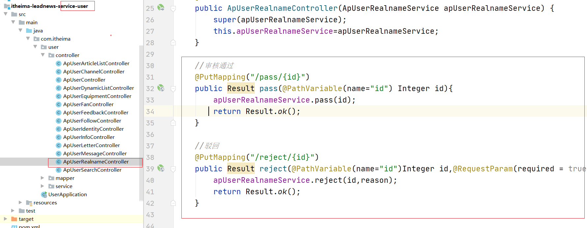


```java
//审核通过
@PutMapping("/pass/{id}")
public Result pass(@PathVariable(name="id") Integer id){
    apUserRealnameService.pass(id);
    return Result.ok();
}

//驳回
@PutMapping("/reject/{id}")
public Result reject(@PathVariable(name="id")Integer id,@RequestParam(required = true,name="reason") String reason){
    apUserRealnameService.reject(id,reason);
    return Result.ok();
}
```


（2）编写业务代码

**实现驳回功能**：

业务接口：

```java
public interface ApUserRealnameService extends IService<ApUserRealname> {

    
   

    void reject(Integer id, String reason);

}
```

实现类：


```java
@Service
public class ApUserRealnameServiceImpl extends ServiceImpl<ApUserRealnameMapper, ApUserRealname> implements ApUserRealnameService {


    @Autowired
    private ApUserRealnameMapper apUserRealnameMapper;
  

    @Override
    public void reject(Integer id, String reason) {
        ApUserRealname apUserRealname = new ApUserRealname();
        apUserRealname.setId(id);
        apUserRealname.setReason(reason);
        //更新时间
        apUserRealname.setUpdatedTime(LocalDateTime.now());
        //设置状态为审核失败
        apUserRealname.setStatus(BusinessConstants.ApUserRealnameConstants.SHENHE_FAILE);
        apUserRealnameMapper.updateById(apUserRealname);
    }
}
```

创建常量接口：

 

```java
public interface BusinessConstants {
    //实名认证相关
   public static class ApUserRealnameConstants{
        //创建中
        public static final Integer SHENHE_ING=0;
        //待审核
        public static final Integer SHENHE_WARTING=1;
        //审核失败
        public static final Integer SHENHE_FAILE=2;
        //审核通过
        public static final Integer SHENHE_SUCESS=9;
    }

}
```

常量接口 用于 做业务常量 由于有许多的业务，所以在接口中添加静态内部类进行设置。用来区分不同的业务。


**实现审核通过功能**：

业务接口：

```java
public interface ApUserRealnameService extends IService<ApUserRealname> {

    //审核通过
    void pass(Integer id);

    //略
    

}
```

实现类：

```java
@Autowired
private ApUserRealnameMapper apUserRealnameMapper;

@Override
public void pass(Integer id) {
    ApUserRealname entity = new ApUserRealname();
    entity.setId(id);
    //审核通过
    entity.setStatus(BusinessConstants.ApUserRealnameConstants.SHENHE_SUCESS);
    apUserRealnameMapper.updateById(entity);

    //todo feign远程调用 自媒体服务 创建自媒体账号

    //todo feign远程调用 文章微服务 创建作者账号

}
```

 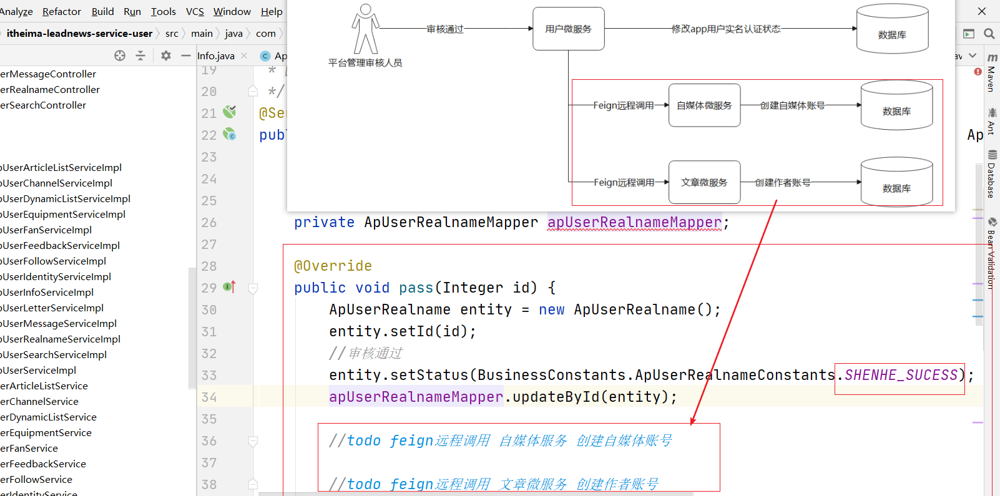


### 5.2 实现Feign远程调用

 

相关表如下：

自媒体表：


作者表：


#### 5.2.1 实现自媒体远程调用

操作步骤如下：

```properties
(1) 添加依赖

(2) 创建feign接口

(3) 实现feign接口（业务实现）

(4) 调用Feign接口实现创建自媒体账号
```

(1) 添加依赖

由于feign 每一个都要用到，以及还需要用到common中的result类，所以在itheima-leadnews-api下添加依赖如下：

 

```xml
<?xml version="1.0" encoding="UTF-8"?>
<project xmlns="http://maven.apache.org/POM/4.0.0"
         xmlns:xsi="http://www.w3.org/2001/XMLSchema-instance"
         xsi:schemaLocation="http://maven.apache.org/POM/4.0.0 http://maven.apache.org/xsd/maven-4.0.0.xsd">
    <parent>
        <artifactId>itheima-leadnews</artifactId>
        <groupId>com.itheima</groupId>
        <version>1.0-SNAPSHOT</version>
    </parent>
    <modelVersion>4.0.0</modelVersion>

    <artifactId>itheima-leadnews-api</artifactId>
    <packaging>pom</packaging>
    <description>所有feign pojo所在父工程</description>
    <modules>
        <module>itheima-leadnews-admin-api</module>
        <module>itheima-leadnews-user-api</module>
        <module>itheima-leadnews-wemedia-api</module>
        <module>itheima-leadnews-article-api</module>
    </modules>
    <dependencies>
        <dependency>
            <groupId>com.baomidou</groupId>
            <artifactId>mybatis-plus-boot-starter</artifactId>
        </dependency>

        <dependency>
            <groupId>org.springframework.cloud</groupId>
            <artifactId>spring-cloud-starter-openfeign</artifactId>
        </dependency>

        <dependency>
            <groupId>com.itheima</groupId>
            <artifactId>itheima-leadnews-common</artifactId>
            <version>1.0-SNAPSHOT</version>
        </dependency>
    </dependencies>

</project>
```

(2) 创建feign接口（位置如图）


```java
@FeignClient(name="leadnews-wemedia",path = "/wmUser")
public interface WmUserFeign {
    //创建自媒体账户信息
    @PostMapping
    public Result save(@RequestBody WmUser wmUser);

    /**
     * 根据apUserId获取
     * @param apUserId
     * @return
     */
    @GetMapping("/one/{apUserId}")
    public WmUser getByApUserId(@PathVariable(name="apUserId") Integer apUserId);
}
```


(3) 实现feign接口（业务实现）在controller中


```java
@GetMapping("/one/{apUserId}")
public WmUser getByApUserId(@PathVariable(name="apUserId") Integer apUserId){
    QueryWrapper<WmUser> queryWrapper = new QueryWrapper<WmUser>();
    queryWrapper.eq("ap_user_id",apUserId);
    WmUser wmUser = wmUserService.getOne(queryWrapper);
    return wmUser;
}
```

还有一个接口不需要实现：因为抽象类中早已实现了：


(4)调用Feign接口实现创建自媒体账号

itheima-leadnews-service-user微服中添加使用到的依赖并Feign开启接口扫描：

```xml
<dependency>
    <groupId>com.itheima</groupId>
    <artifactId>itheima-leadnews-wemedia-api</artifactId>
    <version>1.0-SNAPSHOT</version>
</dependency>
```

XML如下图：


开启扫描如下图：*** 号代表占位符，表示任意的包名**


通过审核业务实现类中实现远程调用：

```java
private static final Logger logger = LoggerFactory.getLogger(ApUserRealnameServiceImpl.class);

@Autowired
private ApUserRealnameMapper apUserRealnameMapper;

@Autowired
private WmUserFeign wmUserFeign;

@Autowired
private ApUserMapper apUserMapper;
@Override
public void pass(Integer id) {
    ApUserRealname entity = new ApUserRealname();
    entity.setId(id);
    //审核通过
    entity.setStatus(BusinessConstants.ApUserRealnameConstants.SHENHE_SUCESS);
    apUserRealnameMapper.updateById(entity);

    //todo feign远程调用 自媒体服务 创建自媒体账号
    ApUserRealname apUserRealname = apUserRealnameMapper.selectById(id);
    if (apUserRealname != null) {
        ApUser apUser = apUserMapper.selectById(apUserRealname.getUserId());
        //判断是否已经存在
        WmUser wmUser = wmUserFeign.getByApUserId(apUser.getId());
        if (wmUser == null) {
             wmUser = new WmUser();
            //copy数据到wmUser中
            BeanUtils.copyProperties(apUser, wmUser);
            //设置状态
            wmUser.setStatus(BusinessConstants.WmUserConstants.WM_USER_OK);
            //设置APP用户的ID
            wmUser.setApUserId(apUser.getId());
            //设置创建时间
            wmUser.setCreatedTime(LocalDateTime.now());
            Result result = wmUserFeign.save(wmUser);
            if (result.isSuccess()) {
                logger.info("自媒体账号创建成功");
            }
        }
        //todo feign远程调用 文章微服务 创建作者账号
    }

}
```

在业务接口常量接口中 创建静态内部常量类：

```java
public static class WmUserConstants{
       //有效
       public static final Integer WM_USER_OK= 9;
       //冻结
       public static final Integer WM_USER_LOCKED= 0;
       //永久失效
       public static final Integer WM_USER_INVALID= 1;
 }
```


#### 5.2.2 实现文章远程调用

操作步骤如下：

```properties
(1) 添加依赖

(2) 创建feign接口

(3) 实现feign接口（业务实现）

(4)调用Feign接口实现创建作者账号
```


(1) 添加依赖

忽略，上一个步骤已经做了。就是添加openfeign

(2) 创建feign接口


```java
@FeignClient(name="leadnews-article",path = "/apAuthor")
public interface ApAuthorFeign {
    //保存作者账号
    @PostMapping
    public Result save(@RequestBody ApAuthor apAuthor);

    /**
     * 根据APP用户的ID 获取 作者信息
     * @param apUserId
     * @return
     */
    @GetMapping("/one/{apUserId}")
    public ApAuthor getByApUserId(@PathVariable(name="apUserId")Integer apUserId);
}
```

(3) 实现feign接口（业务实现）


```java
   /**
     * 根据app用户的ID 获取作者信息
     * @param apUserId
     * @return
     */
    @GetMapping("/one/{apUserId}")
    public ApAuthor getByApUserId(@PathVariable(name="apUserId")Integer apUserId){
        QueryWrapper<ApAuthor> queryWrapper = new QueryWrapper<ApAuthor>();
        queryWrapper.eq("user_id",apUserId);
        ApAuthor apAuthor = apAuthorService.getOne(queryWrapper);
        return apAuthor;
    }
```


还有一个保存作者 不需要实现了，因为咱们抽象类中已经完成，你只需要进行声明即可。


(4)添加依赖并调用Feign接口实现创建作者账号


```xml
<dependency>
    <groupId>com.itheima</groupId>
    <artifactId>itheima-leadnews-wemedia-api</artifactId>
    <version>1.0-SNAPSHOT</version>
</dependency>
```

在通过审核的业务代码的实现类中进行远程调用：

```java
private static final Logger logger = LoggerFactory.getLogger(ApUserRealnameServiceImpl.class);

@Autowired
private ApUserRealnameMapper apUserRealnameMapper;

@Autowired
private WmUserFeign wmUserFeign;


@Autowired
private ApAuthorFeign apAuthorFeign;

@Autowired
private ApUserMapper apUserMapper;

@Override
public void pass(Integer id) {
    ApUserRealname entity = new ApUserRealname();
    entity.setId(id);
    //审核通过
    entity.setStatus(BusinessConstants.ApUserRealnameConstants.SHENHE_SUCESS);
    apUserRealnameMapper.updateById(entity);

    //todo feign远程调用 自媒体服务 创建自媒体账号
    ApUserRealname apUserRealname = apUserRealnameMapper.selectById(id);
    if (apUserRealname != null) {
        ApUser apUser = apUserMapper.selectById(apUserRealname.getUserId());
        //判断是否已经存在
        WmUser wmUser = wmUserFeign.getByApUserId(apUser.getId());
        if (wmUser == null) {
            //copy数据到wmUser中
            wmUser = new WmUser();
            BeanUtils.copyProperties(apUser, wmUser);
            //设置状态
            wmUser.setStatus(BusinessConstants.WmUserConstants.WM_USER_OK);
            //设置APP用户的ID
            wmUser.setApUserId(apUser.getId());
            //设置创建时间
            wmUser.setCreatedTime(LocalDateTime.now());
             Result<WmUser> result = wmUserFeign.save(wmUser);
            if (result.isSuccess()) {
                logger.info("自媒体账号创建成功");
                wmUser = result.getData();
            }
        }
        //todo feign远程调用 文章微服务 创建作者账号
        ApAuthor apAuthor = apAuthorFeign.getByApUserId(apUser.getId());
        if(apAuthor==null){
            apAuthor = new ApAuthor();
            //作者名称就是登录名
            apAuthor.setName(apUser.getName());
            apAuthor.setType(BusinessConstants.ApAuthorConstants.A_MEDIA_USER);
            apAuthor.setCreatedTime(LocalDateTime.now());
            apAuthor.setUserId(apUser.getId());
            apAuthor.setWmUserId(wmUser.getId());
            apAuthorFeign.save(apAuthor);
        }
    }

}
```

创建常量类：


```java
public static class ApAuthorConstants{
    /**
         * 平台自媒体人
         */
    public static final Integer A_MEDIA_USER= 2;
    //合作商
    public static final Integer A_MEDIA_SELLER= 1;
    //普通作者
    public static final Integer A_MEDIA_ZERO= 0;
}
```


#### 5.2.3 网关对接user微服务

在admin网关的yml文件中进行配置如下：

 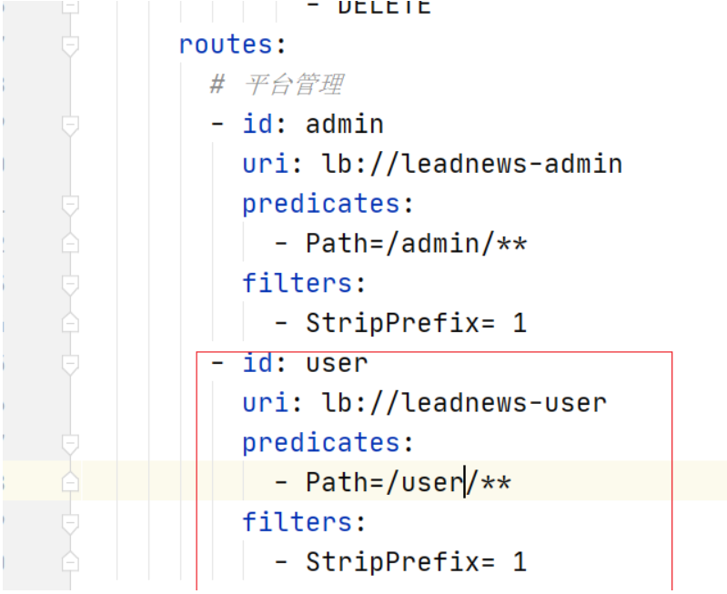


```yaml
        - id: user
          uri: lb://leadnews-user
          predicates:
            - Path=/user/**
          filters:
            - StripPrefix= 1
```

------

<!--要注意编写yaml的格式-->


### 5.3 测试

通过网关登录，登录之后再进行测试校验。

## 6 feign抽取 

###  6.1 分析

我们发现，如果每一个feign都有相关的针对单表的操作，那么每一个都写一个样的代码是不合理的而且是麻烦的，那么我们可以参考抽取controller一样的方式去抽取feign ,我们不搞那么复杂，因为feign只是接口声明，

子类继承接口即可。

 

```properties
如图，就是 每一个业务接口 继承 定义了抽取了通用的方法的接口 ，然后每一个业务接口如果是基本的CRUD，都不用进行声明了。直接调用即可。
```


### 6.2 代码实现抽取

创建核心feign接口

 

代码如下：

```java
package com.itheima.core.feign;

import com.itheima.common.pojo.PageInfo;
import com.itheima.common.pojo.PageRequestDto;
import com.itheima.common.pojo.Result;
import org.springframework.web.bind.annotation.*;

import java.io.Serializable;
import java.util.List;

/**
 * @author ljh
 * @version 1.0
 * @date 2021/2/26 09:06
 * @description 标题
 * @package com.itheima.core.feign
 */
public interface CoreFeign<T> {

    @DeleteMapping("/{id}")
    public Result deleteById(@PathVariable(name = "id") Serializable id) ;
    /**
     * 添加记录
     *
     * @param record
     * @return
     */
    @PostMapping
    public Result<T> save(@RequestBody T record) ;

    //更新数据
    @PutMapping
    public Result updateByPrimaryKey(@RequestBody T record) ;


    @GetMapping("/{id}")
    public Result<T> findById(@PathVariable(name = "id") Serializable id) ;

    @GetMapping
    public Result<List<T>> findAll() ;


    /**
     * 通用条件分页查询
     *
     * @param pageRequestDto
     * @return
     */
    @PostMapping(value = "/search")
    public Result<PageInfo<T>> findByPage(@RequestBody PageRequestDto<T> pageRequestDto) ;


}

```

添加依赖：


修改Feign接口：


再测试也是一样的效果，这样就不用重复编写了，

**但是要注意的是：请求路径不能和父接口（coreFeign）中的一样。**

## 7 使用okhttp(可选项)

​	在使用默认的feign的时候，feign底层实际上是使用restTemplete 而restTemplate底层又使用到了httpclient，默认使用java自带的**httpUrlConnection**。我们是可以使用okhttp ，默认的feign调用httpUrlConnection每次都会创建一个链接对象。效率较低。所以使用okhttp来替换，它可以使用连接池。调用效率较高。

在itheima-leadnews-core-feign微服务中的pom.xml中添加依赖

```xml
<dependency>
    <groupId>io.github.openfeign</groupId>
    <artifactId>feign-okhttp</artifactId>
</dependency>
```


在需要用到feign的**微服务**中配置如下即可

```yaml
feign:
  client:
    config:
      default: # default指定的是所有的 被调用方  都设置为该配置超时时间，可以设置为某一个微服务对应的服务名
        connectTimeout: 5000 # 链接超时时间
        readTimeout: 5000 # 读取的超时时间
  okhttp:
    enabled: true
  httpclient:
    enabled: false
```


## 8 网关整合knife4j

每次我们测试都需要通过POSTMAN 结合网关来测试，这样麻烦，我们可以集成到knife4j上去进行测试。如下：

（1）创建三个类在网关中

 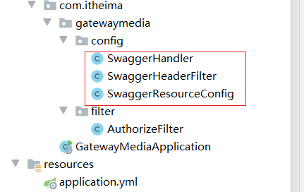


从此处copy

 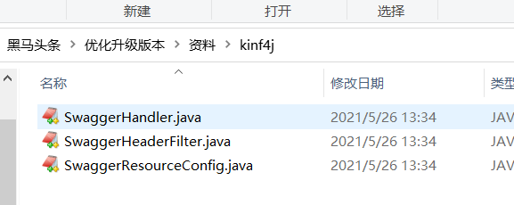


(2)admin微服务中创建配置类：如果有则不用创建了。

```java
package com.itheima.admin.config;

import com.github.xiaoymin.knife4j.spring.annotations.EnableKnife4j;
import org.springframework.context.annotation.Bean;
import org.springframework.context.annotation.Configuration;
import org.springframework.context.annotation.Import;
import springfox.bean.validators.configuration.BeanValidatorPluginsConfiguration;
import springfox.documentation.builders.ApiInfoBuilder;
import springfox.documentation.builders.PathSelectors;
import springfox.documentation.builders.RequestHandlerSelectors;
import springfox.documentation.service.ApiInfo;
import springfox.documentation.service.Contact;
import springfox.documentation.spi.DocumentationType;
import springfox.documentation.spring.web.plugins.Docket;
import springfox.documentation.swagger2.annotations.EnableSwagger2;

import java.util.HashSet;

@Configuration
@EnableSwagger2//启用swagger
@EnableKnife4j//启用Knife4j
@Import(BeanValidatorPluginsConfiguration.class)
public class SwaggerConfiguration {

   /*@Bean
   public Docket buildDocket() {
      HashSet<String> strings = new HashSet<>();
      strings.add("application/json");

      return new Docket(DocumentationType.SWAGGER_2)
              .apiInfo(buildApiInfo())
              //设置返回值数据类型为json
              .produces(strings)//设置响应的结果的数据类型 变成JSON
              .select()
              // 要扫描的API(Controller)基础包
              .apis(RequestHandlerSelectors.basePackage("com.itheima.admin.controller"))
              //针对那些路径生成API文档 /**
              .paths(PathSelectors.any())
              .build();
   }

   private ApiInfo buildApiInfo() {
      Contact contact = new Contact("黑马程序员","","");
      return new ApiInfoBuilder()
              .title("黑马头条-平台管理API文档")
              .description("平台管理服务api")
              .contact(contact)
              .version("1.0.0").build();
   }*/
   @Bean
   public Docket buildDocket() {
      HashSet<String> strings = new HashSet<>();
      strings.add("application/json");
      Docket docket=new Docket(DocumentationType.SWAGGER_2)
              .apiInfo(buildApiInfo())
              //设置返回数据类型
              .produces(strings)
              //分组名称
              //.groupName("1.0")
              .select()
              //这里指定Controller扫描包路径
              .apis(RequestHandlerSelectors.basePackage("com.itheima.admin.controller"))
              //**
              .paths(PathSelectors.any())
              .build();
      return docket;
   }
   private ApiInfo buildApiInfo() {
      Contact contact = new Contact("黑马程序员","","");
      return new ApiInfoBuilder()
              .title("黑马头条-平台管理API文档")
              .description("平台管理服务api")
              .contact(contact)
              .version("1.0.0").build();
   }
}
```

(3)过滤器中添加如下代码


（4）启动网关 和微服务测试：通过网关地址进行访问

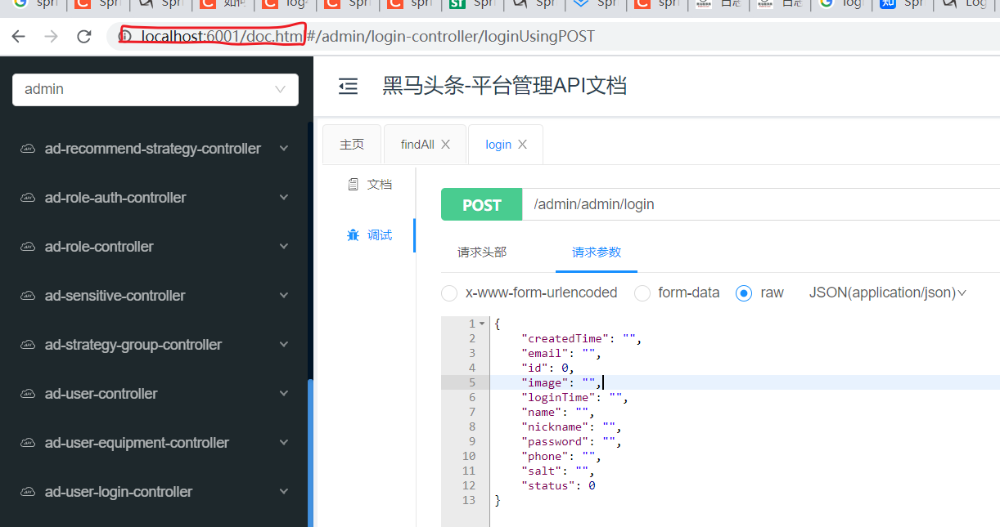


登录：

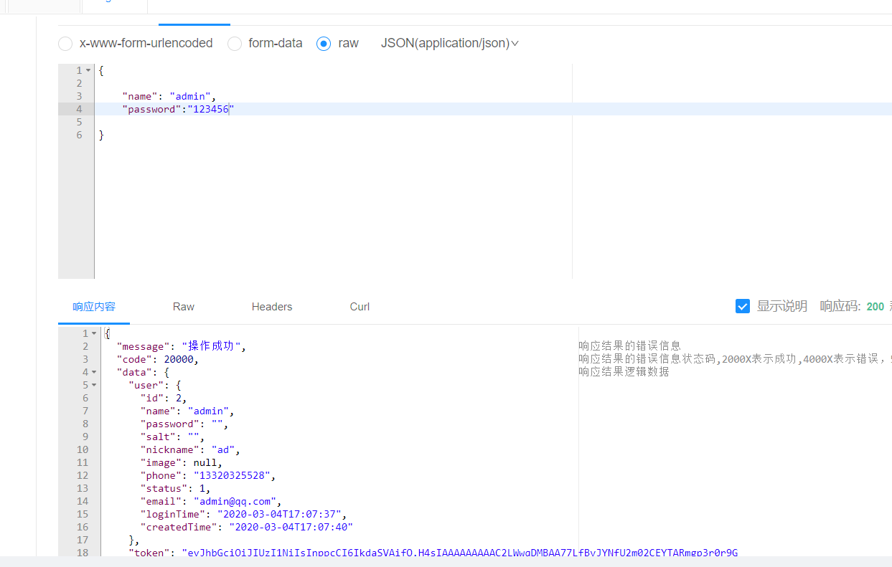


根据登录之后获取到的token 在全局参数中添加之后，就可以直接测试了：

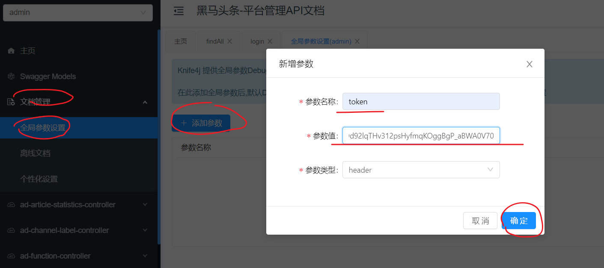

测试访问：

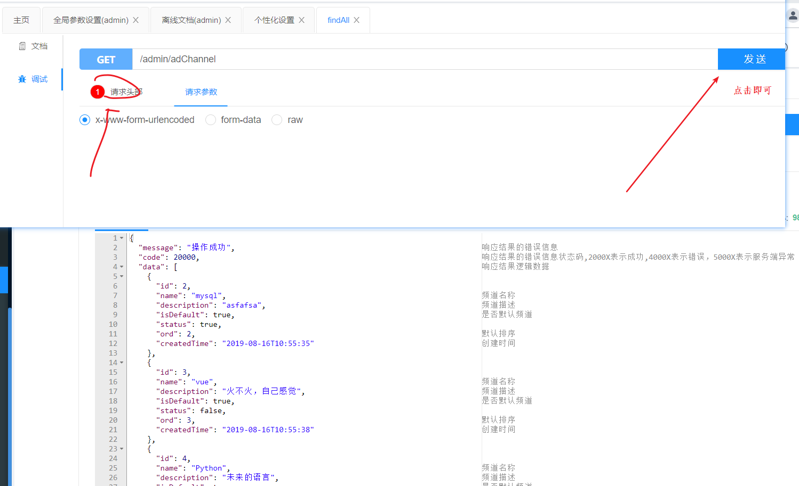


## 9自定义knife4j起步依赖

因为上边都是微服务，都要用knif4j,所以我们自定义一个起步依赖，微服务依赖此起步依赖即可，不再配置。

如下工程添加到core工程目录下：

 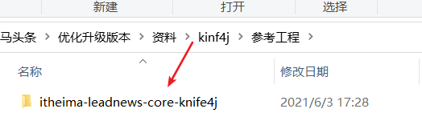

配置类详情如下：

```
package com.itheima.core.knif4j;

import com.github.xiaoymin.knife4j.spring.annotations.EnableKnife4j;
import org.springframework.beans.factory.annotation.Autowired;
import org.springframework.boot.autoconfigure.condition.ConditionalOnClass;
import org.springframework.boot.autoconfigure.condition.ConditionalOnMissingBean;
import org.springframework.boot.context.properties.EnableConfigurationProperties;
import org.springframework.context.annotation.Bean;
import org.springframework.context.annotation.Configuration;
import org.springframework.context.annotation.Import;
import springfox.bean.validators.configuration.BeanValidatorPluginsConfiguration;
import springfox.documentation.builders.ApiInfoBuilder;
import springfox.documentation.builders.PathSelectors;
import springfox.documentation.builders.RequestHandlerSelectors;
import springfox.documentation.spi.DocumentationType;
import springfox.documentation.spring.web.plugins.Docket;
import springfox.documentation.swagger2.annotations.EnableSwagger2;

import java.util.HashSet;

/**
 * @author ljh
 * @version 1.0
 * @date 2021/5/30 11:46
 * @description 标题
 * @package com.itheima.core.knif4j
 */
@Configuration
@EnableSwagger2
@EnableKnife4j
@Import(BeanValidatorPluginsConfiguration.class)
@EnableConfigurationProperties(MyKnife4jProperties.class)
public class MyKnife4jAutoConfiguration {

    @Autowired
    private MyKnife4jProperties myKnife4jProperties;

    @Bean
    @ConditionalOnMissingBean(Docket.class)//spring容器（你不配置）如果没有该类型的bean 我的方法就执行
    public Docket defaultApi2() {
        HashSet<String> strings = new HashSet<>();
        strings.add("application/json");
        Docket docket=new Docket(DocumentationType.SWAGGER_2)
                .apiInfo(new ApiInfoBuilder()
                        .title(myKnife4jProperties.getTitle())
                        .description(myKnife4jProperties.getDescription())
                        .termsOfServiceUrl(myKnife4jProperties.getServiceUrl())
                        .contact(myKnife4jProperties.getContact())
                        .version(myKnife4jProperties.getVersion())
                        .build())
                .produces(strings)
                //分组名称
                .select()

                //这里指定Controller扫描包路径
                .apis(RequestHandlerSelectors.basePackage(myKnife4jProperties.getBasePackage()))
                .paths(PathSelectors.any())
                .build();
        return docket;
    }
}

```

```
package com.itheima.core.knif4j;

import lombok.Data;
import org.springframework.boot.context.properties.ConfigurationProperties;
import org.springframework.context.annotation.Configuration;
import org.springframework.stereotype.Component;

/**
 * @author ljh
 * @version 1.0
 * @date 2021/5/30 13:32
 * @description 标题
 * @package com.itheima.core.knif4j
 */

@ConfigurationProperties("steven.knife4j")
@Data
public class MyKnife4jProperties {

    private String basePackage = "com.itheima";

    private String description = "默认描述";

    private String title = "默认标题";

    private String contact = "联系人";

    private String version = "1.0";

    private String serviceUrl = "http://www.itheima.com";


}

```

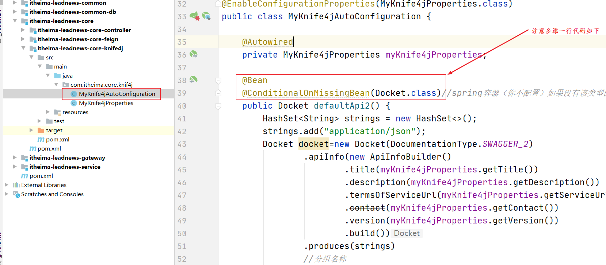


并设置module

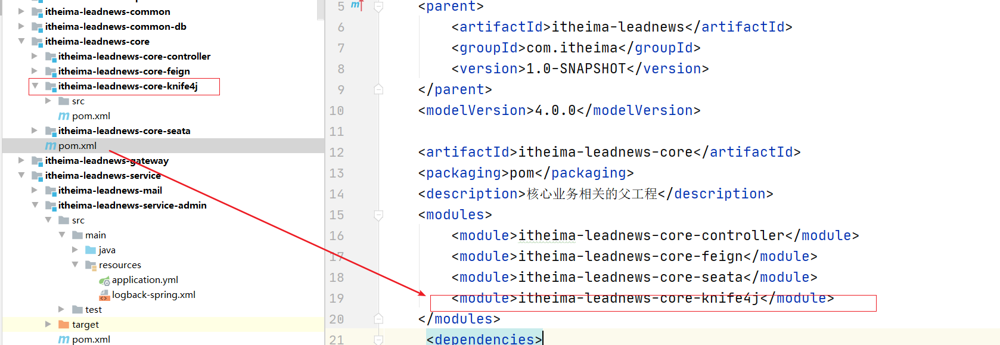


在微服务的父工程中添加如下配置：

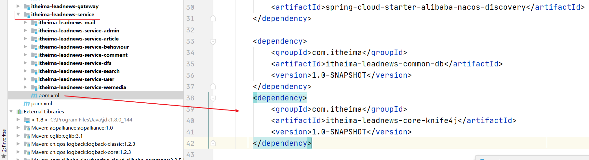


删除掉admin微服务中的config中的swaggerconfiguration的配置类即可。这样所有的微服务都有knife4j的能力了。

