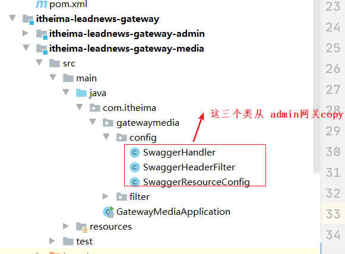
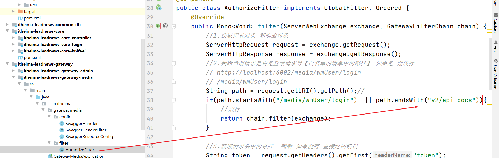

# 第四章 自媒体素材管理

## 目标

- 能掌握什么是fastdfs
- 能掌握fastdfs的流程架构
- 能够掌握分布式文件系统fastdfs的基本使用
- 能够搭建dfs微服务实现素材管理功能
- 能够完成自媒体文章列表查询功能

## 1 admin网关对接用户微服务

上一章网关地址对接（如果已经对接配置过了则不用对接）

在admin网关的yml文件中进行配置如下：


```yaml
        - id: user
          uri: lb://leadnews-user
          predicates:
            - Path=/user/**
          filters:
            - StripPrefix= 1
```

注意**格式**配置

## 2 FastDFS

### 2.1 FastDFS介绍

FastDFS是一个开源的轻量级[分布式文件系统](https://baike.baidu.com/item/分布式文件系统/1250388)，它对文件进行管理，功能包括：文件存储、文件同步、文件访问（文件上传、文件下载）等，解决了大容量存储和负载均衡的问题。特别适合以文件为载体的在线服务，如相册网站、视频网站等等。

FastDFS为互联网量身定制，充分考虑了冗余备份、负载均衡、线性扩容等机制，并注重高可用、高性能等指标，使用FastDFS很容易搭建一套高性能的文件服务器集群提供文件上传、下载等服务。

FastDFS 架构包括 Tracker server 和 Storage server。客户端请求 Tracker server 进行文件上传、下载，通过Tracker server 调度最终由 Storage server 完成文件上传和下载。

Tracker server 作用是负载均衡和调度，通过 Tracker server 在文件上传时可以根据一些策略找到Storage server 提供文件上传服务。可以将 tracker 称为追踪服务器或调度服务器。Storage server 作用是文件存储，客户端上传的文件最终存储在 Storage 服务器上，Storageserver 没有实现自己的文件系统而是利用操作系统的文件系统来管理文件。可以将storage称为存储服务器。


架构流程图如下（可参考讲义中携带的具体流程图）：


### 3.2 文件上传流程


客户端上传文件后存储服务器将文件 ID 返回给客户端，此文件 ID 用于以后访问该文件的索引信息。文件索引信息包括：组名，虚拟磁盘路径，数据两级目录，文件名。


**组名**：文件上传后所在的 storage 组名称，在文件上传成功后有storage 服务器返回，需要客户端自行保存。

**虚拟磁盘路径**：storage 配置的虚拟路径，与磁盘选项store_path*对应。如果配置了

store_path0 则是 M00，如果配置了 store_path1 则是 M01，以此类推。

**数据两级目录**：storage 服务器在每个虚拟磁盘路径下创建的两级目录，用于存储数据文件。

**文件名**：与文件上传时不同。是由存储服务器根据特定信息生成，文件名包含：源存储

服务器 IP 地址、文件创建时间戳、文件大小、随机数和文件拓展名等信息。

### 3.3 FastDFS服务端搭建

**注意**：该操作步骤已经完成，虚拟机已经搭建完成了，**不需要大家再去搭建**

(1)虚拟机中拉取镜像

```shell
docker pull morunchang/fastdfs
```

(2)运行tracker

```
docker run -d --name tracker --net=host morunchang/fastdfs sh tracker.sh
```

(3)运行storage

```
docker run -d --name storage --net=host -e TRACKER_IP=192.168.211.136:22122 -e GROUP_NAME=group1 morunchang/fastdfs sh storage.sh
```

说明：

```properties
使用的网络模式是–net=host, 192.168.211.136是宿主机的IP
group1是组名，即storage的组
如果想要增加新的storage服务器，再次运行该命令，注意更换 新组名
```

设置开启自启动(可以不做)：

```
docker update --restart=always tracker
docker update --restart=always storage
```


(4)修改nginx

Nginx在这里主要提供对FastDFS图片访问的支持，Docker容器中已经集成了Nginx，我们需要修改nginx的配置,进入storage的容器内部，修改nginx.conf

(4.1)进入容器

```
docker exec -it storage /bin/bash
```

(4.2)修改配置

```
vi /etc/nginx/conf/nginx.conf
```

修改访问端口为如下：

 


### 3.4 文件操作

#### 3.4.1 环境搭建

(1)新建项目：leadnews-fastdfs-demo 用作测试

 

(2)pom文件

```xml
<?xml version="1.0" encoding="UTF-8"?>
<project xmlns="http://maven.apache.org/POM/4.0.0"
         xmlns:xsi="http://www.w3.org/2001/XMLSchema-instance"
         xsi:schemaLocation="http://maven.apache.org/POM/4.0.0 http://maven.apache.org/xsd/maven-4.0.0.xsd">
    <modelVersion>4.0.0</modelVersion>

    <groupId>com.itheima</groupId>
    <artifactId>leadnews-fastdfs-demo</artifactId>
    <version>1.0-SNAPSHOT</version>
    <parent>
        <groupId>org.springframework.boot</groupId>
        <artifactId>spring-boot-starter-parent</artifactId>
        <version>2.3.8.RELEASE</version>
    </parent>

    <dependencies>
        <!--fastdfs-->
        <dependency>
            <groupId>com.github.tobato</groupId>
            <artifactId>fastdfs-client</artifactId>
            <version>1.26.5</version>
        </dependency>


        <dependency>
            <groupId>org.springframework.boot</groupId>
            <artifactId>spring-boot-starter-web</artifactId>
        </dependency>

        <dependency>
            <groupId>org.springframework.boot</groupId>
            <artifactId>spring-boot-starter-test</artifactId>
            <scope>test</scope>
            <exclusions>
                <exclusion>
                    <groupId>org.junit.vintage</groupId>
                    <artifactId>junit-vintage-engine</artifactId>
                </exclusion>
            </exclusions>
        </dependency>

    </dependencies>


</project>
```

(3)编写启动类

```java
package com.itheima;

import com.github.tobato.fastdfs.FdfsClientConfig;
import org.springframework.boot.SpringApplication;
import org.springframework.boot.autoconfigure.SpringBootApplication;
import org.springframework.context.annotation.Import;

/**
 * @author ljh
 * @version 1.0
 * @date 2020/11/27 15:40
 * @description 标题
 * @package com.itheima
 */
@SpringBootApplication
@Import(FdfsClientConfig.class)
public class FastdfsApplication {
    public static void main(String[] args) {
        SpringApplication.run(FastdfsApplication.class,args);
    }
}

```

(5)yml中

```yaml
fdfs:
  so-timeout: 1501
  connect-timeout: 601
  thumb-image:             #缩略图生成参数
    width: 150
    height: 150
  tracker-list:            #TrackerList参数,支持多个
    - 192.168.211.136:22122
```


#### 3.4.2 编写测试实现文件的基本操作

编写测试类test下创建如下类 com.itheima.FastadfsTest：

```java
package com.itheima;

import com.github.tobato.fastdfs.domain.fdfs.StorePath;
import com.github.tobato.fastdfs.domain.proto.storage.DownloadCallback;
import com.github.tobato.fastdfs.service.FastFileStorageClient;
import org.apache.commons.io.IOUtils;
import org.junit.jupiter.api.Test;
import org.springframework.beans.factory.annotation.Autowired;
import org.springframework.boot.test.context.SpringBootTest;
import org.springframework.util.StringUtils;

import java.io.*;

/**
 * @author ljh
 * @version 1.0
 * @date 2020/11/27 15:43
 * @description 标题
 * @package com.itheima
 */

@SpringBootTest
public class FastadfsTest {

    @Autowired
    private FastFileStorageClient storageClient;

    //上传图片
    @Test
    public void uploadFile() throws IOException {

        //创建流对象
        File file = new File("C:\\Users\\admin\\Pictures\\45.png");
        FileInputStream inputStream = new FileInputStream(file);
        long length = file.length();
        //获取文件的扩展名不带点
        String extName = StringUtils.getFilenameExtension(file.getName());
        //上传图片
        StorePath storePath = storageClient.uploadFile(
                inputStream,
                length,
                extName,
                null);

        System.out.println(storePath);
        System.out.println(storePath.getFullPath());
    }

    //删除图片
    //
    @Test
    public void deleteFile() {
        //group + path
        storageClient.deleteFile("group1/M00/00/00/wKjTiF_BIUqAMwDrAAAl8vdCW2Y127.png");
    }

    //下载图片
    @Test
    public void download() throws Exception{
        byte[] group1s = storageClient.downloadFile("group1", "M00/00/00/wKjTiF_BIrCAAn9IAAAl8vdCW2Y205.png", new DownloadCallback<byte[]>() {
            @Override
            public byte[] recv(InputStream ins) throws IOException {

                //获取字节数组
                byte[] bytes = IOUtils.toByteArray(ins);
                return bytes;
            }
        });

        //下载
        FileOutputStream fileOutputStream = new FileOutputStream(new File("e:/abc.png"));
        fileOutputStream.write(group1s);
        fileOutputStream.close();
    }


}

```

### 3.5 黑马头条的图片处理解决方案

 

```properties
由于很多个微服务都需要用到图片相关的存储 删除 获取等 所以为了方便扩展维护，利于升级，我们独立出一个独立的文件存储微服务 用于对存储的图片 文件 视频进行管理，而其他的微服务通过feign进行调用 实现相关的操作。
图片上传 则直接可以访问文件存储微服务即可。
```


### 3.6 文件微服务

#### 3.6.1 文件微服务搭建

步骤如下：

```properties
（1）创建itheima-leadnews-service-dfs工程微服务

（2）添加依赖

（3）创建启动类

（4）配置yml

（5）实现图片上传
```


（1）创建itheima-leadnews-service-dfs工程微服务

 

（2）添加依赖

```xml
<?xml version="1.0" encoding="UTF-8"?>
<project xmlns="http://maven.apache.org/POM/4.0.0"
         xmlns:xsi="http://www.w3.org/2001/XMLSchema-instance"
         xsi:schemaLocation="http://maven.apache.org/POM/4.0.0 http://maven.apache.org/xsd/maven-4.0.0.xsd">
    <parent>
        <artifactId>itheima-leadnews-service</artifactId>
        <groupId>com.itheima</groupId>
        <version>1.0-SNAPSHOT</version>
    </parent>
    <modelVersion>4.0.0</modelVersion>

    <artifactId>itheima-leadnews-service-dfs</artifactId>
    <description>文件存储微服务</description>
    <dependencies>
        <!--fastdfs-->
        <dependency>
            <groupId>com.github.tobato</groupId>
            <artifactId>fastdfs-client</artifactId>
            <version>1.26.5</version>
        </dependency>
        <dependency>
            <groupId>com.itheima</groupId>
            <artifactId>itheima-leadnews-common</artifactId>
            <version>1.0-SNAPSHOT</version>
        </dependency>
    </dependencies>
</project>
```

（3）创建启动类

```java
package com.itheima;

import org.springframework.boot.SpringApplication;
import org.springframework.boot.autoconfigure.SpringBootApplication;
import org.springframework.cloud.client.discovery.EnableDiscoveryClient;

/**
 * @author ljh
 * @version 1.0
 * @date 2021/2/26 17:04
 * @description 标题
 * @package com.itheima
 */
@SpringBootApplication
@EnableDiscoveryClient
public class DfsApplication {
    public static void main(String[] args) {
        SpringApplication.run(DfsApplication.class, args);
    }
}

```

（4）配置yml

```yaml
spring:
  profiles:
    active: dev
---
server:
  port: 9005
spring:
  application:
    name: leadnews-dfs
  profiles: dev
  cloud:
    nacos:
      server-addr: 192.168.211.136:8848
      discovery:
        server-addr: ${spring.cloud.nacos.server-addr}
  servlet:
    multipart:
      max-file-size: 10MB
      max-request-size: 10MB
# fastdfs的配置
fdfs:
  so-timeout: 1501
  connect-timeout: 601
  thumb-image:             #缩略图生成参数
    width: 150
    height: 150
  tracker-list:
    - 192.168.211.136:22122 #TrackerList参数,支持多个
  web-server-url: http://192.168.211.136/  # 设置前缀路径
logging:
  level.com: debug
---
server:
  port: 9005
spring:
  application:
    name: leadnews-dfs
  profiles: pro
  cloud:
    nacos:
      server-addr: 192.168.211.136:8848
      discovery:
        server-addr: ${spring.cloud.nacos.server-addr}
  servlet:
    multipart:
      max-file-size: 10MB
      max-request-size: 10MB
# fastdfs的配置
fdfs:
  so-timeout: 1501
  connect-timeout: 601
  thumb-image:             #缩略图生成参数
    width: 150
    height: 150
  tracker-list:
    - 192.168.211.136:22122 #TrackerList参数,支持多个
  web-server-url: http://192.168.211.136/  # 设置前缀路径
---
server:
  port: 9005
spring:
  application:
    name: leadnews-dfs
  profiles: test
  cloud:
    nacos:
      server-addr: 192.168.211.136:8848
      discovery:
        server-addr: ${spring.cloud.nacos.server-addr}
  servlet:
    multipart:
      max-file-size: 10MB
      max-request-size: 10MB
# fastdfs的配置
fdfs:
  so-timeout: 1501
  connect-timeout: 601
  thumb-image:             #缩略图生成参数
    width: 150
    height: 150
  tracker-list:
    - 192.168.211.136:22122 #TrackerList参数,支持多个
  web-server-url: http://192.168.211.136/  # 设置前缀路径
```

#### 3.6.2 实现图片上传功能

分析：

```properties
1 页面上，选择上传的图片，并点击上传图片按钮
2 后台文件微服务接收到请求并获取到上传文件数据 封装到MultipartFile 对象中
3 后台将文件对象获取之后 上传给fastdfs中
4 返回前端上传成功之后的路径即可
```

功能实现：

创建controller 实现功能：

```java
package com.itheima.dfs;

import com.github.tobato.fastdfs.domain.conn.FdfsWebServer;
import com.github.tobato.fastdfs.domain.fdfs.StorePath;
import com.github.tobato.fastdfs.service.FastFileStorageClient;
import com.itheima.common.pojo.Result;
import org.springframework.beans.factory.annotation.Autowired;
import org.springframework.util.StringUtils;
import org.springframework.web.bind.annotation.PostMapping;
import org.springframework.web.bind.annotation.RequestMapping;
import org.springframework.web.bind.annotation.RequestParam;
import org.springframework.web.bind.annotation.RestController;
import org.springframework.web.multipart.MultipartFile;

import java.util.HashMap;
import java.util.Map;

/**
 * @author ljh
 * @version 1.0
 * @date 2021/2/26 17:07
 * @description 标题
 * @package com.itheima.dfs
 */
@RestController
@RequestMapping("/dfs")
public class FileController {


    @Autowired
    private FastFileStorageClient fastFileStorageClient;

    @Autowired
    private FdfsWebServer fdfsWebServer;


    /**
     * 上传文件
     * @param file
     * @return
     */
    @PostMapping("/upload")
    public Result<Map<String,String>> upload(MultipartFile file) throws Exception{
        StorePath storePath = fastFileStorageClient.uploadFile(
                file.getInputStream(),
                file.getSize(),
                StringUtils.getFilenameExtension(file.getOriginalFilename()),
                null
        );
        String fullPath = storePath.getFullPath();
        String realUrl = fdfsWebServer.getWebServerUrl()+fullPath;
        Map<String,String> map = new HashMap<String,String>();
        map.put("url",realUrl);
        //设置返回图片的路径
        return Result.ok(map);
    }
}

```


测试：


## 4 素材管理

### 4.1 添加素材

#### 4.1.1 需求分析


点击如上传图片弹出如下：


提交到的数据存储到如下表中：


#### 4.1.2 实现思路分析

分析：

```properties
应该有两个大步骤：
1. 需要先上传图片成功并回显在页面上
2. 选择类型 并最终点击【提交】按钮 将上传之后的图片地址和选择的文件类型数据 传递给后台 添加数据到后台表中

1.步骤已经在上一节中实现，只需要前端发送一个请求到文件微服务上上传图片即可，前端拿到链接地址进行回显
2.我们只需要实现第二步骤就好了
```


#### 4.1.3 功能实现


（1）重写controller

```java
package com.itheima.media.controller;


import com.itheima.common.pojo.Result;
import com.itheima.core.controller.AbstractCoreController;
import com.itheima.media.pojo.WmMaterial;
import com.itheima.media.service.WmMaterialService;
import org.springframework.beans.factory.annotation.Autowired;
import org.springframework.web.bind.annotation.PostMapping;
import org.springframework.web.bind.annotation.RequestBody;
import org.springframework.web.bind.annotation.RequestMapping;
import org.springframework.web.bind.annotation.RestController;

import java.time.LocalDateTime;

/**
* <p>
* 自媒体图文素材信息表 控制器</p>
* @author ljh
* @since 2021-02-25
*/
@RestController
@RequestMapping("/wmMaterial")
public class WmMaterialController extends AbstractCoreController<WmMaterial> {

    private WmMaterialService wmMaterialService;

    //注入
    @Autowired
    public WmMaterialController(WmMaterialService wmMaterialService) {
        super(wmMaterialService);
        this.wmMaterialService=wmMaterialService;
    }

    /**
     * 重写父类方法 实现添加素材
     * @param record
     * @return
     */
    @PostMapping
    @Override
    public Result insert(@RequestBody WmMaterial record) {
        //1.设置补充属性
        //todo 先硬编码 设置为该素材所属的自媒体账号ID
        record.setUserId(1000);
        //未收藏
        record.setIsCollection(0);
        //图片
        record.setType(0);
        //创建时间
        record.setCreatedTime(LocalDateTime.now());
        //2.保存到数据库中
        wmMaterialService.save(record);
        return Result.ok(record);
    }
}

```


测试注意：这userId的数据需要更改


### 4.2 自媒体端网关

#### 4.2.1 自媒体网关说明

上一次创建的admin平台管理的网关，自媒体端也有自己的网关，后边还需要创建app端的网关，自媒体网关与admin端网关几乎是一样的，可以参考admin端网关。


访问可以按照如图的方式进行 先经过网关再路由到不同的微服务 以实现相关的权限的控制。

#### 4.2.2 搭建自媒体网关

自媒体网关可以参考admin网关进行搭建。

（1）创建工程

 


（2）pom.xml

```xml
<?xml version="1.0" encoding="UTF-8"?>
<project xmlns="http://maven.apache.org/POM/4.0.0"
         xmlns:xsi="http://www.w3.org/2001/XMLSchema-instance"
         xsi:schemaLocation="http://maven.apache.org/POM/4.0.0 http://maven.apache.org/xsd/maven-4.0.0.xsd">
    <parent>
        <artifactId>itheima-leadnews-gateway</artifactId>
        <groupId>com.itheima</groupId>
        <version>1.0-SNAPSHOT</version>
    </parent>
    <modelVersion>4.0.0</modelVersion>

    <artifactId>itheima-leadnews-gateway-media</artifactId>

    <dependencies>
        <dependency>
            <groupId>org.springframework.cloud</groupId>
            <artifactId>spring-cloud-starter-gateway</artifactId>
        </dependency>
        <dependency>
            <groupId>com.alibaba.cloud</groupId>
            <artifactId>spring-cloud-starter-alibaba-nacos-discovery</artifactId>
        </dependency>
        <dependency>
            <groupId>com.itheima</groupId>
            <artifactId>itheima-leadnews-common</artifactId>
            <version>1.0-SNAPSHOT</version>
            <exclusions>
                <exclusion>
                    <groupId>org.springframework.boot</groupId>
                    <artifactId>spring-boot-starter-web</artifactId>
                </exclusion>
            </exclusions>
        </dependency>
    </dependencies>
</project>
```

(3)创建启动类

```java
package com.itheima;

import org.springframework.boot.SpringApplication;
import org.springframework.boot.autoconfigure.SpringBootApplication;
import org.springframework.cloud.client.discovery.EnableDiscoveryClient;

/**
 * @author ljh
 * @version 1.0
 * @date 2021/2/26 19:44
 * @description 标题
 * @package com.itheima
 */
@SpringBootApplication
@EnableDiscoveryClient
public class GatewayMediaApplication {
    public static void main(String[] args) {
        SpringApplication.run(GatewayMediaApplication.class,args);
    }
}

```

（4）yaml

```yaml
spring:
  profiles:
    active: dev
---
server:
  port: 6002
spring:
  application:
    name: leadnews-media-gateway
  profiles: dev
  cloud:
    nacos:
      server-addr: 192.168.211.136:8848
      discovery:
        server-addr: ${spring.cloud.nacos.server-addr}
    gateway:
      globalcors:
        cors-configurations:
          '[/**]': # 匹配所有请求
            allowedOrigins: "*" #跨域处理 允许所有的域
            allowedHeaders: "*"
            allowedMethods: # 支持的方法
              - GET
              - POST
              - PUT
              - DELETE
      routes:
        # 平台管理
        - id: media
          uri: lb://leadnews-wemedia
          predicates:
            - Path=/media/**
          filters:
            - StripPrefix= 1
        - id: dfs
          uri: lb://leadnews-dfs
          predicates:
            - Path=/dfs/**
          filters:
            - StripPrefix= 1
---
server:
  port: 6002
spring:
  application:
    name: leadnews-media-gateway
  profiles: test
  cloud:
    nacos:
      server-addr: 192.168.211.136:8848
      discovery:
        server-addr: ${spring.cloud.nacos.server-addr}
    gateway:
      globalcors:
        cors-configurations:
          '[/**]': # 匹配所有请求
            allowedOrigins: "*" #跨域处理 允许所有的域
            allowedHeaders: "*"
            allowedMethods: # 支持的方法
              - GET
              - POST
              - PUT
              - DELETE
      routes:
        # 平台管理
        - id: media
          uri: lb://leadnews-wemedia
          predicates:
            - Path=/media/**
          filters:
            - StripPrefix= 1
        - id: dfs
          uri: lb://leadnews-dfs
          predicates:
            - Path=/dfs/**
          filters:
            - StripPrefix= 1
---
server:
  port: 6002
spring:
  application:
    name: leadnews-media-gateway
  profiles: pro
  cloud:
    nacos:
      server-addr: 192.168.211.136:8848
      discovery:
        server-addr: ${spring.cloud.nacos.server-addr}
    gateway:
      globalcors:
        cors-configurations:
          '[/**]': # 匹配所有请求
            allowedOrigins: "*" #跨域处理 允许所有的域
            allowedHeaders: "*"
            allowedMethods: # 支持的方法
              - GET
              - POST
              - PUT
              - DELETE
      routes:
        # 平台管理
        - id: media
          uri: lb://leadnews-wemedia
          predicates:
            - Path=/media/**
          filters:
            - StripPrefix= 1
        - id: dfs
          uri: lb://leadnews-dfs
          predicates:
            - Path=/dfs/**
          filters:
            - StripPrefix= 1
```


#### 4.2.3 实现自媒体用户登录功能

（1）controller

```java
//自媒体登录
@PostMapping("/login")
public Result login(@RequestBody WmUser wmUser) {
    if (StringUtils.isEmpty(wmUser)) {
        return Result.errorMessage("用户名和密码不能为空");
    }
    if (StringUtils.isEmpty(wmUser.getName())) {
        return Result.errorMessage("用户名和密码不能为空");
    }
    if (StringUtils.isEmpty(wmUser.getPassword())) {
        return Result.errorMessage("用户名和密码不能为空");
    }
    Map<String, Object> info = wmUserService.login(wmUser);
    if (info == null) {
        return Result.errorMessage("登录失败");
    }
    return Result.ok(info);
}
```


（2）service

```java
@Autowired
    private WmUserMapper wmUserMapper;

    @Override
    public Map<String, Object> login(WmUser wmUser) {
        //根据用户名获取到用户信息
        QueryWrapper<WmUser> querywrapper = new QueryWrapper<WmUser>();
        querywrapper.eq("name", wmUser.getName());
        WmUser user = wmUserMapper.selectOne(querywrapper);
        //再获取用户表中的盐值
        if (user == null) {
            return null;
        }
        String salt = user.getSalt();
        String password = DigestUtils.md5DigestAsHex((wmUser.getPassword() + salt).getBytes());
        if (!password.equals(user.getPassword())) {
            return null;
        }
        //登录成功
        Map<String, Object> info = new HashMap<>();
        //自媒体账号的ID
        String token = AppJwtUtil.createToken(user.getId().longValue());
        info.put("token", token);
        //密码不要设置
        user.setPassword("");
        info.put("user", user);
        return info;
    }
```


#### 4.2.4 实现自媒体网关校验解析token

这个完全可以参考admin端网关。

```java
package com.itheima.gatewaymedia.filter;

import com.itheima.common.constants.SystemConstants;
import com.itheima.common.util.AppJwtUtil;
import io.jsonwebtoken.Claims;
import org.springframework.cloud.gateway.filter.GatewayFilterChain;
import org.springframework.cloud.gateway.filter.GlobalFilter;
import org.springframework.core.Ordered;
import org.springframework.http.HttpStatus;
import org.springframework.http.server.reactive.ServerHttpRequest;
import org.springframework.http.server.reactive.ServerHttpResponse;
import org.springframework.stereotype.Component;
import org.springframework.util.StringUtils;
import org.springframework.web.server.ServerWebExchange;
import reactor.core.publisher.Mono;

@Component
public class MeidaAuthorizeFilter implements GlobalFilter, Ordered {
    @Override
    public Mono<Void> filter(ServerWebExchange exchange, GatewayFilterChain chain) {
        //1.获取请求对象和响应对象
        ServerHttpRequest request = exchange.getRequest();
        ServerHttpResponse response = exchange.getResponse();
        //2.判断当前的请求是否为登录，如果是，直接放行 当然也可以使用另外一种方式来判断
        if(request.getURI().getPath().contains("/wmUser/login")){
            //放行
            return chain.filter(exchange);
        }

        //3.获取当前用户的请求头jwt信息
        //请求头的名称为token
        String jwtToken = request.getHeaders().getFirst("token");

        //4.判断当前令牌是否存在
        if(StringUtils.isEmpty(jwtToken)){
            //如果不存在，向客户端返回错误提示信息
            response.setStatusCode(HttpStatus.UNAUTHORIZED);
            return response.setComplete();
        }

        try {
            //5.如果令牌存在，解析jwt令牌，判断该令牌是否合法，如果不合法，则向客户端返回错误信息
            int result = AppJwtUtil.verifyToken(jwtToken);

            if(result== SystemConstants.JWT_OK){
                //解析数据
                Claims claimsBody = AppJwtUtil.getClaimsBody(jwtToken);
                //设置登录的用户的ID 头名为userId中并下发到下游微服务
                //exchange.getRequest().mutate().header("userId",claimsBody.get("id").toString());
                exchange.getRequest().mutate().header(SystemConstants.USER_HEADER_NAME,claimsBody.get("id").toString());
            }else {
                response.setStatusCode(HttpStatus.UNAUTHORIZED);
                return response.setComplete();
            }
        }catch (Exception e){
            e.printStackTrace();
            //想客户端返回错误提示信息
            response.setStatusCode(HttpStatus.UNAUTHORIZED);
            return response.setComplete();
        }


        //6.放行
        return chain.filter(exchange);
    }

    /**
     * 优先级设置
     * 值越小，优先级越高
     * @return
     */
    @Override
    public int getOrder() {
        return 0;
    }
}
```

思考一个问题？

为什么要向下游微服务传递头信息？目的是什么？

#### 4.2.5 实现微服务获取登录用户信息

##### 4.2.5.1 需求

自媒体添加素材的时候 用户的ID 设置为了硬编码如下所示，这个是需要修改的


如何获取呢？

##### 4.2.5.2 实现思路


```properties
网关解析到了token之后，向下游传递用户信息,有很多种方式：常用2种
1.下游微服务通过拦截器 可以获取到请求头中的用户的ID 值，并返回给controller中进行使用即可。
2.编写一个工具类 直接使用springmvc为我们提供的请求的线程副本 RequestContextHolder中的方法获取（本质使用ThreadLocal来实现）
```

第一种方式相对麻烦一些，还需要进行拦截器创建和配置，并进行绑定(大家有兴趣可以自己实现下)。这里我采用第二种。

##### 4.2.5.3 实现功能

```java
public class RequestContextUtil {
    /**
     * 获取登录的用户的ID 可以是自媒体账号 也可以是 平台账号 也可以是app账号
     * @return
     */
    public static String getUserInfo(){
        ServletRequestAttributes requestAttributes = (ServletRequestAttributes) RequestContextHolder.currentRequestAttributes();
        HttpServletRequest request = requestAttributes.getRequest();
        //获取路由转发的头信息
        String headerValue = request.getHeader(SystemConstants.USER_HEADER_NAME);
        return headerValue;
    }
}
```


(2)修改素材添加功能

```java
@PostMapping
@Override
public Result insert(@RequestBody WmMaterial record) {
    //1.设置补充属性
    //todo 先硬编码 设置为该素材所属的自媒体账号ID
    String userId = RequestContextUtil.getUserInfo();

    record.setUserId(Integer.valueOf(userId));
    //未收藏
    record.setIsCollection(0);
    //图片
    record.setType(0);
    //创建时间
    record.setCreatedTime(LocalDateTime.now());
    //2.保存到数据库中
    wmMaterialService.save(record);
    return Result.ok(record);
}
```


### 4.3 网关整合knif4j

(1)添加依赖，如果有则不用添加

 


（2）在自媒体网关中进行创建3个类

 

（3）修改全局过滤器并修改如下：




### 4.4 修改素材（作业）


### 4.5 删除素材和收藏素材（作业）


### 4.6 素材列表查询（作业）

