# 第6章 kafka&第三方接口对接

## 目标

- 能够了解kafka基本信息
- 能够运用kafka进行消息的收发
- 能能理解kafka生产者的原理和机制
- 能能理解kafka消费者的原理和机制
- 能够完成阿里云安全第三方接口文档的使用
- 能够把阿里云安全对接到项目中
- 能够理解敏感词过滤算法dfa

## 1 kafka

### 1.1 kafka介绍

各MQ对比：

```
https://blog.csdn.net/belvine/article/details/80842240
```

Kafka 是一个分布式流媒体平台

kafka官网：http://kafka.apache.org/

（1）流媒体平台有三个关键功能：

-  **发布和订阅记录流**，类似于消息队列或企业消息传递系统。
-  以**容错的持久方式存储记录流**。
-  记录发生时处理流。

（2）Kafka通常用于两大类应用：

-  构建可在**系统或应用程序之间**可靠获取数据的实时流数据管道
-  构建转换或响应数据流的实时流应用程序


（3）kafka名词解释

- topic：Kafka将消息分门别类，每一类的消息称之为一个主题（Topic）
- producer：发布消息的对象称之为主题生产者（Kafka topic producer）
- consumer：订阅消息并处理发布的消息的对象称之为主题消费者（consumers）
- broker：已发布的消息保存在一组服务器中，称之为Kafka集群。集群中的每一个服务器都是一个代理（Broker）。 消费者可以订阅一个或多个主题（topic），并从Broker拉数据，从而消费这些已发布的消息。

### 1.2 kafka安装和配置

#### 1.2.1 jdk环境

首先需要安装Java环境，同时配置环境变量

#### 1.2.2 zookeeper安装

(1)下载安装包

```shell
wget http://mirrors.hust.edu.cn/apache/zookeeper/zookeeper-3.5.8/apache-zookeeper-3.5.8-bin.tar.gz
```

(2)解压

```shell
tar -xvf apache-zookeeper-3.5.8-bin.tar.gz  -C /usr/local/server/
```

(3)创建data 目录

```shell
 cd /usr/local/server/apache-zookeeper-3.5.8-bin/
 mkdir data 
```

(4)配置cfg

```shell
cd /usr/local/server/apache-zookeeper-3.5.8-bin/conf
mv zoo_sample.cfg zoo.cfg
```

修改配置zoo.cfg:

 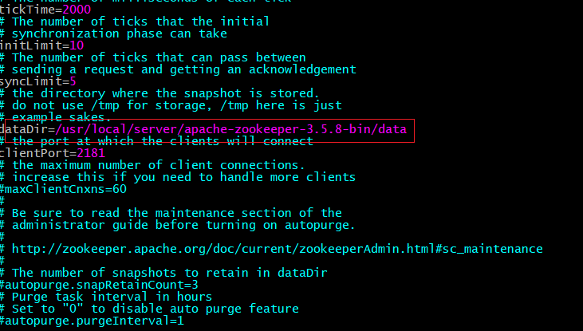

（5）启动

```shell
cd /usr/local/server/apache-zookeeper-3.5.8-bin/bin
./zkServer.sh start
```

#### 1.2.3 kafka安装

（1）下载

 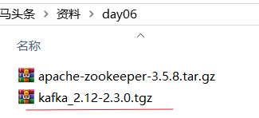

（2）上传到虚拟机服务器并进行解压,解压到/usr/local/server下

```shell
tar -xvf kafka_2.12-2.3.0.tgz -C /usr/local/server/
```

（3）修改配置文件：/usr/local/server/kafka_2.12-2.3.0/config/server.properties

 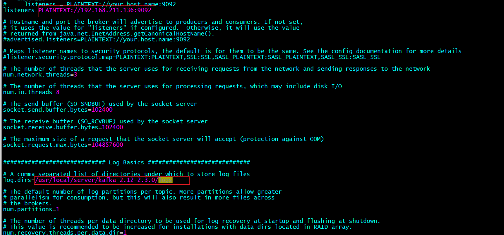 

（4）创建如上图所示的log目录

```shell
mkdir -p /usr/local/server/kafka_2.12-2.3.0/logs
```

（5）启动zookeeper 和 kafka

启动zookeeper

```shell
cd /usr/local/server/apache-zookeeper-3.5.8-bin/bin

./zkServer.sh start
```

启动kafka

```shell
cd /usr/local/server/kafka_2.12-2.3.0/

bin/kafka-server-start.sh config/server.properties
```

### 1.3 kafka整合springboot入门案例

#### 1.3.1 创建工程toutiao-kafka-test

(1)创建kafka-demo工程，引入依赖信息

```xml
<?xml version="1.0" encoding="UTF-8"?>
<project xmlns="http://maven.apache.org/POM/4.0.0"
         xmlns:xsi="http://www.w3.org/2001/XMLSchema-instance"
         xsi:schemaLocation="http://maven.apache.org/POM/4.0.0 http://maven.apache.org/xsd/maven-4.0.0.xsd">
    <modelVersion>4.0.0</modelVersion>

    <groupId>com.itheima</groupId>
    <artifactId>toutiao-kafka-test</artifactId>
    <version>1.0-SNAPSHOT</version>

    <parent>
        <groupId>org.springframework.boot</groupId>
        <artifactId>spring-boot-starter-parent</artifactId>
        <version>2.3.8.RELEASE</version>
    </parent>

    <dependencies>
        <!-- kafka依赖 begin -->
        <dependency>
            <groupId>org.springframework.kafka</groupId>
            <artifactId>spring-kafka</artifactId>
        </dependency>
        <dependency>
            <groupId>org.springframework.kafka</groupId>
            <artifactId>spring-kafka-test</artifactId>
            <scope>test</scope>
        </dependency>
        <dependency>
            <groupId>org.springframework.boot</groupId>
            <artifactId>spring-boot-starter-web</artifactId>
        </dependency>
    </dependencies>
</project>
```

(2)配置 application.yml

```yaml
spring:
  kafka:
    # 配置连接到服务端集群的配置项 ip:port,ip:port
    bootstrap-servers: 192.168.211.136:9092
    consumer:
#      auto-commit-interval: 100
      auto-offset-reset: earliest
#      enable-auto-commit: true
      group-id: test-consumer-group
      # 默认值即为字符串
      key-deserializer: org.apache.kafka.common.serialization.StringDeserializer
      # 默认值即为字符串
      value-deserializer: org.apache.kafka.common.serialization.StringDeserializer
    producer:
      batch-size: 16384
      buffer-memory: 33554432
      key-serializer: org.apache.kafka.common.serialization.StringSerializer
      retries: 0
      value-serializer: org.apache.kafka.common.serialization.StringSerializer
```

官方的配置解释如下：

```
https://kafka.apachecn.org/documentation.html#producerconfigs
```


#### 1.3.2 消息生产者

创建类：com.itheima.producer.Producer

```java
package com.itheima.producer;

import com.fasterxml.jackson.databind.ObjectMapper;
import com.itheima.pojo.Message;
import org.springframework.beans.factory.annotation.Autowired;
import org.springframework.kafka.core.KafkaTemplate;
import org.springframework.stereotype.Component;

import java.util.UUID;

/**
 * @author ljh
 * @version 1.0
 * @date 2020/12/27 21:30
 * @description 标题
 * @package com.itheima.producer
 */
@Component
public class Producer {
    @Autowired
    private KafkaTemplate kafkaTemplate;
  

    public void send() throws Exception {
        
        //设置主题
        //设置消息内容
        kafkaTemplate.send("heima", "hello");
    }
}

```

#### 1.3.3 消息消费者

创建消费者类：com.itheima.consumer.KafkaConsumer

```java
package com.itheima.consumer;

import com.fasterxml.jackson.databind.ObjectMapper;
import com.itheima.pojo.Message;
import org.apache.kafka.clients.consumer.ConsumerRecord;
import org.springframework.beans.factory.annotation.Autowired;
import org.springframework.kafka.annotation.KafkaListener;
import org.springframework.stereotype.Component;

import java.io.IOException;

@Component
public class KafkaConsumer {
 
    @KafkaListener(topics = {"heima"})
    public void listen(ConsumerRecord<String, String> record) throws IOException {
        String value = record.value();
        System.out.println("接收到的消息："+value);
    }
}
```


启动类：

```java
package com.itheima;

import com.itheima.producer.Producer;
import org.springframework.beans.factory.annotation.Autowired;
import org.springframework.boot.SpringApplication;
import org.springframework.boot.autoconfigure.SpringBootApplication;
import org.springframework.web.bind.annotation.GetMapping;
import org.springframework.web.bind.annotation.RestController;

/**
 * http://www.justdojava.com/2019/07/29/kafka-springboot/
 *
 * @author ljh
 * @version 1.0
 * @date 2020/12/27 17:15
 * @description 标题
 * @package com.itheima
 */
@SpringBootApplication
public class KafkaClientApplicaton {
    public static void main(String[] args) {
        SpringApplication.run(KafkaClientApplicaton.class, args);
    }

    @RestController
    class TestController {
        @Autowired
        private Producer producer;

        /**
         * @return
         * @throws Exception
         */
        @GetMapping("/send")
        public String sendM1() throws Exception {
            producer.send();
            return "ok";
        }
    }
}
```

 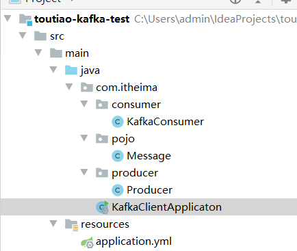


#### 1.3.4 测试及结论

- 生产者发送消息，同一个组中的多个消费者只能有一个消费者接收消息
- 生产者发送消息，如果有多个组，每个组中只能有一个消费者接收消息,如果想要实现广播的效果，可以让每个消费者单独有一个组即可，这样每个消费者都可以接收到消息


以上结论我们可以通过测试来校验下：

再搭建一个工程，并设置相同组名，并监听同一主题：


（1）创建工程kafkatest2并添加依赖

```xml
<?xml version="1.0" encoding="UTF-8"?>
<project xmlns="http://maven.apache.org/POM/4.0.0"
         xmlns:xsi="http://www.w3.org/2001/XMLSchema-instance"
         xsi:schemaLocation="http://maven.apache.org/POM/4.0.0 http://maven.apache.org/xsd/maven-4.0.0.xsd">
    <modelVersion>4.0.0</modelVersion>

    <groupId>com.itheima</groupId>
    <artifactId>kafkatest2</artifactId>
    <version>1.0-SNAPSHOT</version>

    <parent>
        <groupId>org.springframework.boot</groupId>
        <artifactId>spring-boot-starter-parent</artifactId>
        <version>2.3.8.RELEASE</version>
    </parent>

    <dependencies>
        <!-- kafka依赖 begin -->
        <dependency>
            <groupId>org.springframework.kafka</groupId>
            <artifactId>spring-kafka</artifactId>
        </dependency>


        <dependency>
            <groupId>org.springframework.kafka</groupId>
            <artifactId>spring-kafka-test</artifactId>
            <scope>test</scope>
        </dependency>
        <dependency>
            <groupId>org.springframework.boot</groupId>
            <artifactId>spring-boot-starter-web</artifactId>
        </dependency>


        <dependency>
            <groupId>org.apache.kafka</groupId>
            <artifactId>kafka-streams</artifactId>
            <version>2.5.1</version>
        </dependency>

        <dependency>
            <groupId>com.aliyun</groupId>
            <artifactId>aliyun-java-sdk-core</artifactId>
            <version>4.1.1</version>
        </dependency>
        <dependency>
            <groupId>com.aliyun</groupId>
            <artifactId>aliyun-java-sdk-green</artifactId>
            <version>3.4.1</version>
        </dependency>


    </dependencies>
</project>
```


(3)创建启动类

```
@SpringBootApplication
public class KafkaClient2Applicaton {
    public static void main(String[] args) {
        SpringApplication.run(KafkaClient2Applicaton.class, args);
    }
}

```

（4）创建监听类：

```java
@Component
public class KafkaConumser2 {
    @Autowired
    private ObjectMapper objectMapper;

    @KafkaListener(topics = {"heima"})
    public void listen(ConsumerRecord<String, String> record) throws IOException {
        String value = (String) record.value();
        System.out.println("========================22222222222========");
        System.out.println("接收到的消息：" + value);
    }
}
```

(5)yaml:

```yaml
spring:
  application:
    name: demo-test22
  kafka:
    # 配置连接到服务端集群的配置项 ip:port,ip:port
    bootstrap-servers: 192.168.211.136:9092
    consumer:
#      auto-commit-interval: 100
      auto-offset-reset: earliest
#      enable-auto-commit: true
      group-id: test-consumer-group
      # 默认值即为字符串
      key-deserializer: org.apache.kafka.common.serialization.StringDeserializer
      # 默认值即为字符串
      value-deserializer: org.apache.kafka.common.serialization.StringDeserializer
server:
  port: 9000
```

 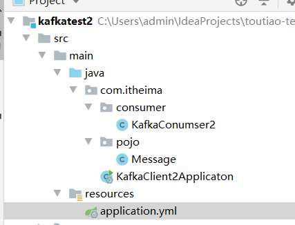


改造 test工程的消费者如下：

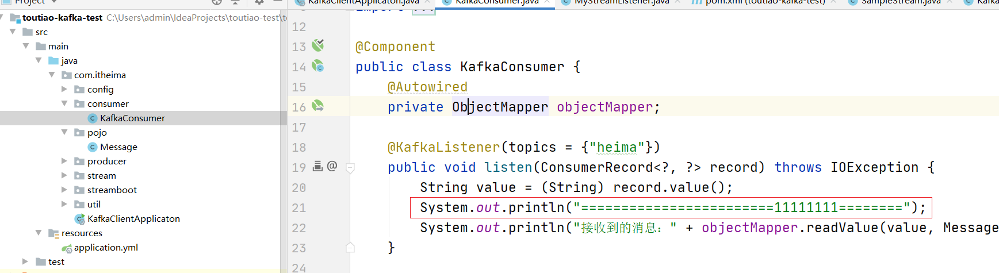


启动两个微服务，并发送请求：http://localhost:8080/send

发现只有一个打印：

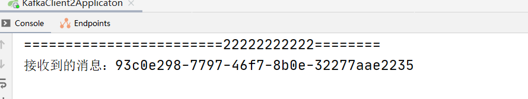


将 test2的消费者组改另外一个名字：

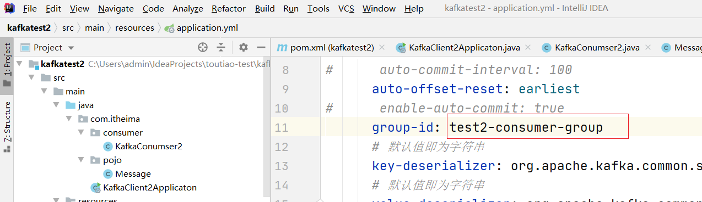

再重启 测试一遍,则变成如下效果：

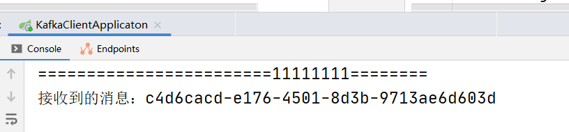

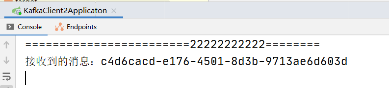


#### 1.3.5 相关概念再介绍


在kafka概述里介绍了概念包括：topic、producer、consumer、broker，这些是最基本的一些概念，想要更深入理解kafka还要知道它的一些其他概念定义：

- 消息Message

  Kafka 中的数据单元被称为消息message，也被称为记录，可以把它看作数据库表中某一行的记录。

- topic

  Kafka将消息分门别类，每一类的消息称之为一个主题（Topic）

- 批次

  为了提高效率， 消息会分批次写入 Kafka，批次就代指的是一组消息。

- 分区Partition

  主题可以被分为若干个分区（partition），同一个主题中的分区可以不在一个机器上，有可能会部署在多个机器上，由此来实现 kafka 的伸缩性。topic中的数据分割为一个或多个partition。每个topic至少有一个partition。每个partition中的数据使用多个文件进行存储。partition中的数据是有序的，partition之间的数据是没有顺序的。如果topic有多个partition，消费数据时就不能保证数据的顺序。在需要严格保证消息的消费顺序的场景下，需要将partition数目设为1。

- broker

  一个独立的 Kafka 服务器就被称为 broker，broker 接收来自生产者的消息，为消息设置偏移量，并提交消息到磁盘保存。

- Broker 集群

  broker 是集群 的组成部分，broker 集群由一个或多个 broker 组成，每个集群都有一个 broker同时充当了集群控制器的角色（自动从集群的活跃成员中选举出来）。

- 副本Replica

  Kafka 中消息的备份又叫做 副本（Replica），副本的数量是可以配置的，Kafka 定义了两类副本：领导者副本（Leader Replica） 和 追随者副本（Follower Replica）；所有写请求都通过Leader路由，数据变更会广播给所有Follower，Follower与Leader保持数据同步。如果Leader失效，则从Follower中选举出一个新的Leader。当Follower与Leader挂掉、卡住或者同步太慢，leader会把这个follower从ISR列表（保持同步的副本列表）中删除，重新创建一个Follower。

- Zookeeper

  kafka对与zookeeper是强依赖的，是以zookeeper作为基础的，即使不做集群，也需要zk的支持。Kafka通过Zookeeper管理集群配置，选举leader，以及在Consumer Group发生变化时进行重平衡。

- 消费者群组Consumer Group

  生产者与消费者的关系就如同餐厅中的厨师和顾客之间的关系一样，一个厨师对应多个顾客，也就是一个生产者对应多个消费者，消费者群组（Consumer Group）指的就是由一个或多个消费者组成的群体。

- 偏移量Consumer Offset

  偏移量（Consumer Offset）是一种元数据，它是一个不断递增的整数值，用来记录消费者发生重平衡时的位置，以便用来恢复数据。

如下代码可以查看到偏移量的值

```java
System.out.println("偏移量："+record.offset());
```

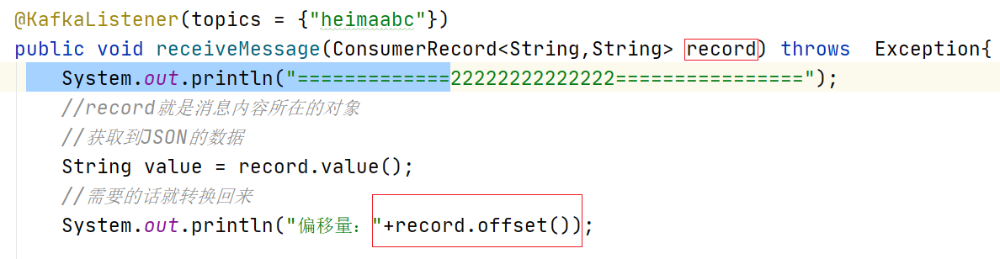


- 重平衡Rebalance

  消费者组内某个消费者实例挂掉后，其他消费者实例自动重新分配订阅主题分区的过程。Rebalance 是 Kafka 消费者端实现高可用的重要手段。

#### 1.3.5 生产者详解

（1）发送消息的工作原理


（2）发送类型

- 发送并忘记（fire-and-forget）

  把消息发送给服务器，并不关心它是否正常到达，大多数情况下，消息会正常到达，因为kafka是高可用的，而且生产者会自动尝试重发，使用这种方式有时候会丢失一些信息

- 同步发送

  使用send()方法发送，它会返回一个Future对象，调用get()方法进行等待，就可以知道消息是否发送成功

  ```java
  //发送消息
  try {
      RecordMetadata recordMetadata = producer.send(record).get();
      System.out.println(recordMetadata.offset());//获取偏移量
  }catch (Exception e){
      e.printStackTrace();
  }
  ```

  如果服务器返回错误，get()方法会抛出异常，如果没有发生错误，我们就会得到一个RecordMetadata对象，可以用它来获取消息的偏移量

- 异步发送

  调用send()方法，并指定一个回调函数，服务器在返回响应时调用函数。如下代码

  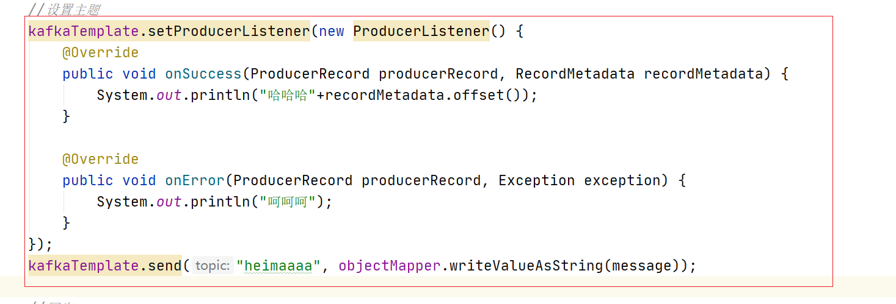

  如果错误则在OnError中执行，如果成功 则在onSuccess中执行。

代码如下：

```java

//设置主题
kafkaTemplate.setProducerListener(new ProducerListener() {
    @Override
    public void onSuccess(ProducerRecord producerRecord, RecordMetadata recordMetadata) {
        System.out.println("哈哈哈"+recordMetadata.offset());
    }

    @Override
    public void onError(ProducerRecord producerRecord, Exception exception) {
        System.out.println("呵呵呵");
    }
});
kafkaTemplate.send("heimaaaa", objectMapper.writeValueAsString(message));
```

（3）参数详解

到目前为止，我们只介绍了生产者的几个必要参数（bootstrap.servers、序列化器等）

生产者还有很多可配置的参数，在kafka官方文档中都有说明，大部分都有合理的默认值，所以没有必要去修改它们，不过有几个参数在内存使用，性能和可靠性方法对生产者有影响

- acks 

  指的是producer的消息发送确认机制

  - acks=0

    生产者在成功写入消息之前不会等待任何来自服务器的响应，也就是说，如果当中出现了问题，导致服务器没有收到消息，那么生产者就无从得知，消息也就丢失了。不过，因为生产者不需要等待服务器的响应，所以它可以以网络能够支持的最大速度发送消息，从而达到很高的吞吐量。

  - acks=1

    只要集群首领节点收到消息，生产者就会收到一个来自服务器的成功响应，如果消息无法到达首领节点，生产者会收到一个错误响应，为了避免数据丢失，生产者会重发消息。

  - acks=all

    只有当所有参与赋值的节点全部收到消息时，生产者才会收到一个来自服务器的成功响应，这种模式是最安全的，它可以保证不止一个服务器收到消息，就算有服务器发生崩溃，整个集群仍然可以运行。不过他的延迟比acks=1时更高。

- retries

  生产者从服务器收到的错误有可能是临时性错误，在这种情况下，retries参数的值决定了生产者可以重发消息的次数，如果达到这个次数，生产者会放弃重试返回错误，默认情况下，生产者会在每次重试之间等待100ms


#### 1.3.6 消费者详解

（1）消费者工作原理


（2）其他参数详解

- enable.auto.commit

  该属性指定了消费者是否自动提交偏移量，默认值是true。为了尽量避免出现重复数据和数据丢失，可以把它设置为false，由自己控制何时提交偏移量。如果把它设置为true,还可以通过配置`auto.commit.interval.ms`属性来控制提交的频率。																																			

- auto.offset.reset

  - earliest

    当各分区下有已提交的offset时，从提交的offset开始消费；无提交的offset时，从头开始消费

  - latest

    当各分区下有已提交的offset时，从提交的offset开始消费；无提交的offset时，消费新产生的该分区下的数据

  - none

    topic各分区都存在已提交的offset时，从offset后开始消费；只要有一个分区不存在已提交的offset，则抛出异常

  - anything  else

    向consumer抛出异常

（3）提交和偏移量

每次调用poll()方法，它会返回由生产者写入kafka但还没有被消费者读取过来的记录，我们由此可以追踪到哪些记录是被群组里的哪个消费者读取的，kafka不会像其他JMS队列那样需要得到消费者的确认，这是kafka的一个独特之处，相反，消费者可以使用kafka来追踪消息在分区的位置（偏移量）

消费者会往一个叫做`_consumer_offset`的特殊主题发送消息，消息里包含了每个分区的偏移量。如果消费者一直处于运行状态，那么偏移量就没有什么用处。不过，如果消费者发生崩溃或有新的消费者加入群组，就会触发再均衡，完成再均衡之后，每个消费者可能分配到新的分区，消费者需要读取每个分区最后一次提交的偏移量，然后从偏移量指定的地方继续处理。


如果提交偏移量小于客户端处理的最后一个消息的偏移量，那么处于两个偏移量之间的消息就会被重复处理。

如下图：


如果提交的偏移量大于客户端的最后一个消息的偏移量，那么处于两个偏移量之间的消息将会丢失。

如下图：


（4）自动提交偏移量

当`enable.auto.commit`被设置为true，提交方式就是让消费者自动提交偏移量，每隔5秒消费者会自动把从poll()方法接收的最大偏移量提交上去。提交时间间隔有`auto.commot.interval.ms`控制，默认值是5秒。

需要注意到，这种方式可能会导致消息重复消费。假如，某个消费者poll消息后，应用正在处理消息，在3秒后Kafka进行了重平衡，那么由于没有更新位移导致重平衡后这部分消息重复消费。


（5）手动提交当前偏移量

把`enable.auto.commit`设置为false,让应用程序决定何时提交偏移量。使用commitSync()提交偏移量，commitSync()将会提交poll返回的最新的偏移量，所以在处理完所有记录后要确保调用了commitSync()方法。否则还是会有消息丢失的风险。

只要没有发生不可恢复的错误，commitSync()方法会一直尝试直至提交成功，如果提交失败也可以记录到错误日志里。

以上为原生的API的调用，如果使用springboot则如下演示：

步骤：

```
//1,关闭自动提交，2.设置手动提交模式 3 在消费者端 进行 确认
```

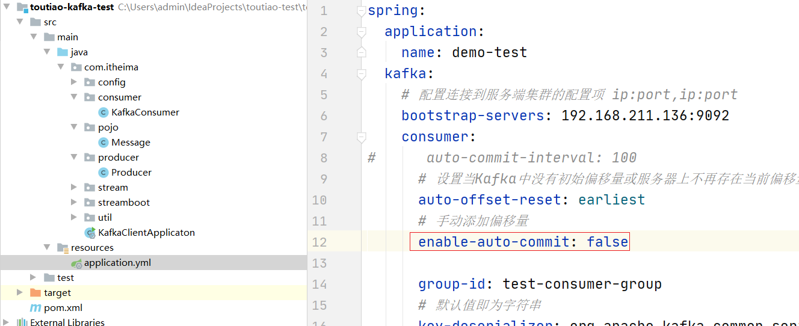


```
//1,关闭自动，2.设置手动提交模式 3 在消费者端 进行 确认
@Bean
public KafkaListenerContainerFactory<ConcurrentMessageListenerContainer<String, String>> kafkaListenerContainerFactory(ConsumerFactory<String, String> consumerFactory) {
    ConcurrentKafkaListenerContainerFactory<String, String> factory = new ConcurrentKafkaListenerContainerFactory<>();
    factory.setConsumerFactory(consumerFactory);
    //配置手动提交offset
    factory.getContainerProperties().setAckMode((ContainerProperties.AckMode.MANUAL));
    return factory;
}
```

消费者：

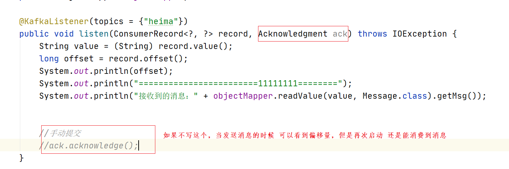


## 2 内容安全第三方接口对接

### 2.1 内容安全接口选型

内容安全是识别服务，支持对图片、视频、文本、语音等对象进行多样化场景检测，有效降低内容违规风险。

黑马头条发布文章中有内容可能违规，如何有效避免风险，可以使用第三方接口进行内容检测。

目前很多平台都支持内容检测，如阿里云、腾讯云、百度AI、网易云等国内大型互联网公司都对外提供了API。

按照性能和收费来看，黑马头条项目使用的就是阿里云的内容安全接口，使用到了图片和文本的审核。

阿里云收费标准：https://www.aliyun.com/price/product/?spm=a2c4g.11186623.2.10.4146401eg5oeu8#/lvwang/detail

### 2.2 阿里云服务介绍

#### 2.2.1 准备工作

您在使用内容检测API之前，需要先注册阿里云账号，添加Access Key并签约云盾内容安全。

**操作步骤**

1. 前往[阿里云官网](https://www.aliyun.com/)注册账号。如果已有注册账号，请跳过此步骤。

   进入阿里云首页后，如果没有阿里云的账户需要先进行注册，才可以进行登录。由于注册较为简单，课程和讲义不在进行体现（注册可以使用多种方式，如淘宝账号、支付宝账号、微博账号等...）。

   需要实名认证和活体认证。

2. 打开[云盾内容安全产品试用页面](https://promotion.aliyun.com/ntms/act/lvwangdemo.html)，单击**立即开通**，正式开通服务。

   

   内容安全控制台

   

3. 在[AccessKey管理页面](https://ak-console.aliyun.com/#/accesskey)管理您的AccessKeyID和AccessKeySecret。

   

   管理自己的AccessKey,可以新建和删除AccessKey

   

   查看自己的AccessKey，

   AccessKey默认是隐藏的，第一次申请的时候可以保存AccessKey，点击显示，通过验证手机号后也可以查看

   

#### 2.2.2 阿里云安全-文本内容垃圾检测

[文本垃圾内容检测接口说明](https://help.aliyun.com/document_detail/70439.html?spm=a2c4g.11186623.6.659.35ac3db3l0wV5k)

示例代码地址：https://help.aliyun.com/document_detail/53427.html?spm=a2c4g.11186623.6.717.466d7544QbU8Lr


下载sdk,如图所示：已经下载完成

 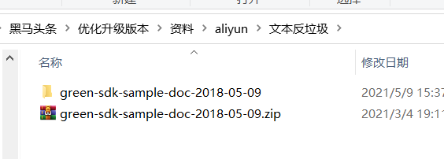

**使用idea直接打开工程**

查看如下工程代码即可测试。

 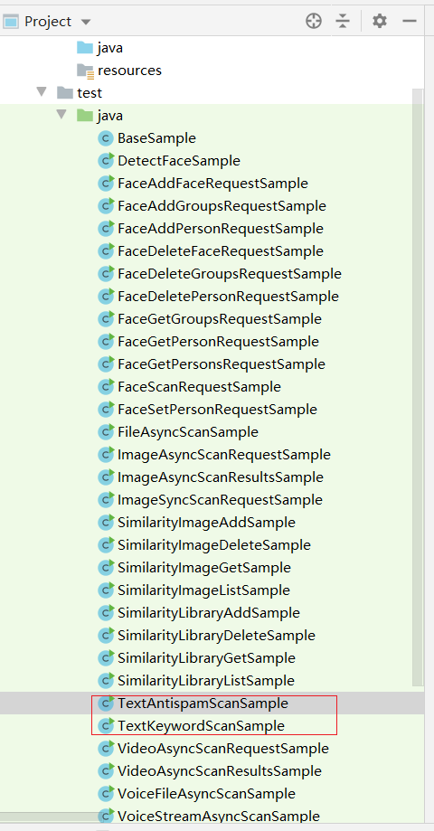


#### 2.2.3 阿里云安全-图片审核

参考阿里云提供的接口文档说明[文档地址](https://help.aliyun.com/document_detail/70292.html?spm=a2c4g.11186623.6.616.5d7d1e7f9vDRz4)

[示例代码地址](https://help.aliyun.com/document_detail/53424.html?spm=a2c4g.11186623.6.715.c8f69b12ey35j4)

注意事项：如果使用本地文件或者二进制文件检测，请下载并在项目工程中引入[Extension.Uploader工具类](https://aligreen-shanghai-share.oss-cn-shanghai.aliyuncs.com/com.aliyuncs.green.extension.uploader.zip)。

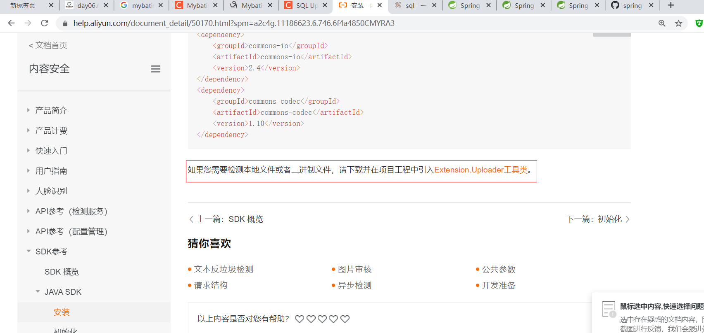


**此处就不在演示，等集成到项目中的时候演示即可。**


## 	3 阿里云安全集成到项目

### 3.1 依赖引入

在itheima-leadnews-common中引入阿里云sdk依赖

```xml
<dependency>
    <groupId>com.aliyun</groupId>
    <artifactId>aliyun-java-sdk-core</artifactId>
    <version>4.1.1</version>
</dependency>
<dependency>
    <groupId>com.aliyun</groupId>
    <artifactId>aliyun-java-sdk-green</artifactId>
    <version>3.4.1</version>
</dependency>
```

### 3.2 引入图片上传工具类

必要的工具类copy：从如下目录copy到工具包下

 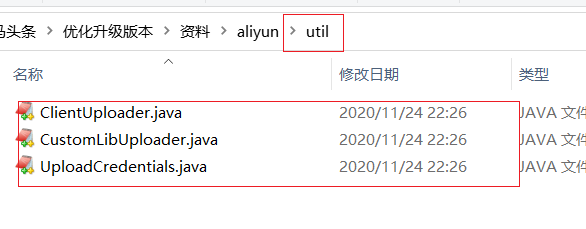

 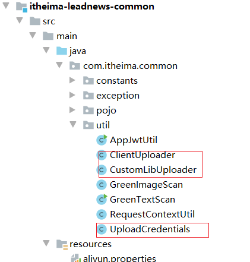


### 3.3 新建配置文件

 


```properties
aliyun.accessKeyId=你的accessKeyId
aliyun.secret=你的accessKeySecret
aliyun.scenes=porn,terrorism,ad,qrcode,live,logo
```

scenes，当前的这个场景设置，只有在图片审核的时候会用到，可以根据实际情况自由组合

### 3.4 改造后的文本内容审核

创建该类到common项目中：

```java
package com.itheima.common.util;

import com.alibaba.fastjson.JSON;
import com.alibaba.fastjson.JSONArray;
import com.alibaba.fastjson.JSONObject;
import com.aliyuncs.DefaultAcsClient;
import com.aliyuncs.IAcsClient;
import com.aliyuncs.exceptions.ClientException;
import com.aliyuncs.exceptions.ServerException;
import com.aliyuncs.green.model.v20180509.TextScanRequest;
import com.aliyuncs.http.FormatType;
import com.aliyuncs.http.HttpResponse;
import com.aliyuncs.profile.DefaultProfile;
import com.aliyuncs.profile.IClientProfile;
import lombok.Getter;
import lombok.Setter;
import org.springframework.boot.context.properties.ConfigurationProperties;
import org.springframework.context.annotation.PropertySource;
import org.springframework.stereotype.Component;

import java.util.*;

@Getter
@Setter
@Component
@PropertySource("classpath:aliyun.properties")
@ConfigurationProperties(prefix = "aliyun")
public class GreenTextScan {

    private String accessKeyId;
    private String secret;

    //可以进行优化 优化成 数组或者是List集合 因为一次性可以执行不超过100个任务
    // https://www.aliyun.com/price/product?spm=5176.55804.J_911092.btn4.3d9875daIbvZvU#/lvwang/detail

    /**
     * 基本描述：根据您调用API的文本扫描条数计费。影响扫描费用的因素如下：
     * 1. 2017年8月1日起正式商业化；
     * 2. 一次请求最多支持100个任务，一个任务就是算一条文本，每条文本限制10,000个字符，超出限制该请求所有任务全部失败，不计费。当前的计费周期为1天1次；
     * 3. 每名用户从开始调用之日起算（包含当天），31天内拥有每日3,000条免费文本扫描额度，不区分算法结果是否确定，第32天开始将不再享有免费量；
     * 4. 31天内每日超出3,000条的部分需要付费，价格按照当日总扫描量匹配阶梯价收费，每日扫描量越大，单价越低。
     * 5.计费项code :text_scan
     *
     * @param content
     * @return
     * @throws Exception
     */
    public Map greeTextScan(List<String> contents) throws Exception {
        IClientProfile profile = DefaultProfile
                .getProfile("cn-shanghai", accessKeyId, secret);
        DefaultProfile
                .addEndpoint("cn-shanghai", "cn-shanghai", "Green", "green.cn-shanghai.aliyuncs.com");
        IAcsClient client = new DefaultAcsClient(profile);
        TextScanRequest textScanRequest = new TextScanRequest();
        textScanRequest.setAcceptFormat(FormatType.JSON); // 指定api返回格式
        textScanRequest.setHttpContentType(FormatType.JSON);
        textScanRequest.setMethod(com.aliyuncs.http.MethodType.POST); // 指定请求方法
        textScanRequest.setEncoding("UTF-8");
        textScanRequest.setRegionId("cn-shanghai");
        List<Map<String, Object>> tasks = new ArrayList<Map<String, Object>>();
        for (String content : contents) {
            Map<String, Object> task1 = new LinkedHashMap<String, Object>();
            task1.put("dataId", UUID.randomUUID().toString());
            /**
             * 待检测的文本，长度不超过10000个字符
             */
            task1.put("content", content);
            tasks.add(task1);
        }

        JSONObject data = new JSONObject();

        /**
         * 检测场景，文本垃圾检测传递：antispam
         **/
        data.put("scenes", Arrays.asList("antispam"));
        data.put("tasks", tasks);
        System.out.println(JSON.toJSONString(data, true));
        textScanRequest.setHttpContent(data.toJSONString().getBytes("UTF-8"), "UTF-8", FormatType.JSON);
        // 请务必设置超时时间
        textScanRequest.setConnectTimeout(3000);
        textScanRequest.setReadTimeout(6000);

        Map<String, String> resultMap = new HashMap<>();
        try {
            HttpResponse httpResponse = client.doAction(textScanRequest);
            if (httpResponse.isSuccess()) {
                JSONObject scrResponse = JSON.parseObject(new String(httpResponse.getHttpContent(), "UTF-8"));
                System.out.println(JSON.toJSONString(scrResponse, true));
                if (200 == scrResponse.getInteger("code")) {
                    JSONArray taskResults = scrResponse.getJSONArray("data");
                    for (Object taskResult : taskResults) {
                        if (200 == ((JSONObject) taskResult).getInteger("code")) {
                            JSONArray sceneResults = ((JSONObject) taskResult).getJSONArray("results");
                            for (Object sceneResult : sceneResults) {
                                String scene = ((JSONObject) sceneResult).getString("scene");
                                String label = ((JSONObject) sceneResult).getString("label");
                                String suggestion = ((JSONObject) sceneResult).getString("suggestion");
                                System.out.println("suggestion = [" + label + "]");
                                if (!suggestion.equals("pass")) {
                                    resultMap.put("suggestion", suggestion);
                                    resultMap.put("label", label);
                                    return resultMap;
                                }

                            }
                        } else {
                            return null;
                        }
                    }
                    resultMap.put("suggestion", "pass");
                    return resultMap;
                } else {
                    return null;
                }
            } else {
                return null;
            }
        } catch (ServerException e) {
            e.printStackTrace();
        } catch (ClientException e) {
            e.printStackTrace();
        } catch (Exception e) {
            e.printStackTrace();
        }
        return null;
    }
}
```

### 3.5 改造后的图片审核

创建该类到common项目中

```java
package com.itheima.common.util;

import com.alibaba.fastjson.JSON;
import com.alibaba.fastjson.JSONArray;
import com.alibaba.fastjson.JSONObject;
import com.aliyuncs.DefaultAcsClient;
import com.aliyuncs.IAcsClient;
import com.aliyuncs.green.model.v20180509.ImageSyncScanRequest;
import com.aliyuncs.http.FormatType;
import com.aliyuncs.http.HttpResponse;
import com.aliyuncs.http.MethodType;
import com.aliyuncs.http.ProtocolType;
import com.aliyuncs.profile.DefaultProfile;
import com.aliyuncs.profile.IClientProfile;
import lombok.Getter;
import lombok.Setter;
import org.springframework.boot.context.properties.ConfigurationProperties;
import org.springframework.context.annotation.PropertySource;
import org.springframework.stereotype.Component;

import java.util.*;

@Getter
@Setter
@Component
@PropertySource("classpath:aliyun.properties")
@ConfigurationProperties(prefix = "aliyun")
public class GreenImageScan {

    private String accessKeyId;
    private String secret;
    private String scenes;

    /**
     * https://help.aliyun.com/document_detail/53424.html?spm=a2c4g.11186623.6.746.3aa35be6mIkNMX#section-mmy-m1w-fgb
     * https://help.aliyun.com/document_detail/50170.html?spm=a2c4g.11186623.6.744.12bcbb0a99YnPT
     * 参考阿里云文档进行优化改造
     * @param imageList
     * @return
     * @throws Exception
     */
    public Map imageScan(List<byte[]> imageList) throws Exception {
        IClientProfile profile = DefaultProfile
            .getProfile("cn-shanghai", accessKeyId, secret);
        DefaultProfile
            .addEndpoint("cn-shanghai", "cn-shanghai", "Green", "green.cn-shanghai.aliyuncs.com");
        IAcsClient client = new DefaultAcsClient(profile);
        ImageSyncScanRequest imageSyncScanRequest = new ImageSyncScanRequest();
        // 指定api返回格式
        imageSyncScanRequest.setAcceptFormat(FormatType.JSON);
        // 指定请求方法
        imageSyncScanRequest.setMethod(MethodType.POST);
        imageSyncScanRequest.setEncoding("utf-8");
        //支持http和https
        imageSyncScanRequest.setProtocol(ProtocolType.HTTP);
        JSONObject httpBody = new JSONObject();
        /**
         * 设置要检测的场景, 计费是按照该处传递的场景进行
         * 一次请求中可以同时检测多张图片，每张图片可以同时检测多个风险场景，计费按照场景计算
         * 例如：检测2张图片，场景传递porn、terrorism，计费会按照2张图片鉴黄，2张图片暴恐检测计算
         * porn: porn表示色情场景检测
         */
        
        httpBody.put("scenes", Arrays.asList(scenes.split(",")));

        /**
         * 如果您要检测的文件存于本地服务器上，可以通过下述代码片生成url
         * 再将返回的url作为图片地址传递到服务端进行检测
         */
        /**
         * 设置待检测图片， 一张图片一个task
         * 多张图片同时检测时，处理的时间由最后一个处理完的图片决定
         * 通常情况下批量检测的平均rt比单张检测的要长, 一次批量提交的图片数越多，rt被拉长的概率越高
         * 这里以单张图片检测作为示例, 如果是批量图片检测，请自行构建多个task
         */
        ClientUploader clientUploader = ClientUploader.getImageClientUploader(profile, false);
        String url = null;
        List<JSONObject> urlList = new ArrayList<JSONObject>();
        for (byte[] bytes : imageList) {
            url = clientUploader.uploadBytes(bytes);
            JSONObject task = new JSONObject();
            task.put("dataId", UUID.randomUUID().toString());
            //设置图片链接为上传后的url
            task.put("url", url);
            task.put("time", new Date());
            urlList.add(task);
        }
        httpBody.put("tasks", urlList);
        imageSyncScanRequest.setHttpContent(org.apache.commons.codec.binary.StringUtils.getBytesUtf8(httpBody.toJSONString()),
            "UTF-8", FormatType.JSON);
        /**
         * 请设置超时时间, 服务端全链路处理超时时间为10秒，请做相应设置
         * 如果您设置的ReadTimeout小于服务端处理的时间，程序中会获得一个read timeout异常
         */
        imageSyncScanRequest.setConnectTimeout(3000);
        imageSyncScanRequest.setReadTimeout(10000);
        HttpResponse httpResponse = null;
        try {
            httpResponse = client.doAction(imageSyncScanRequest);
        } catch (Exception e) {
            e.printStackTrace();
        }

        Map<String, String> resultMap = new HashMap<>();

        //服务端接收到请求，并完成处理返回的结果
        if (httpResponse != null && httpResponse.isSuccess()) {
            JSONObject scrResponse = JSON.parseObject(org.apache.commons.codec.binary.StringUtils.newStringUtf8(httpResponse.getHttpContent()));
            System.out.println(JSON.toJSONString(scrResponse, true));
            int requestCode = scrResponse.getIntValue("code");
            //每一张图片的检测结果
            JSONArray taskResults = scrResponse.getJSONArray("data");
            if (200 == requestCode) {
                for (Object taskResult : taskResults) {
                    //单张图片的处理结果
                    int taskCode = ((JSONObject) taskResult).getIntValue("code");
                    //图片要检测的场景的处理结果, 如果是多个场景，则会有每个场景的结果
                    JSONArray sceneResults = ((JSONObject) taskResult).getJSONArray("results");
                    if (200 == taskCode) {
                        for (Object sceneResult : sceneResults) {
                            String scene = ((JSONObject) sceneResult).getString("scene");
                            String label = ((JSONObject) sceneResult).getString("label");
                            String suggestion = ((JSONObject) sceneResult).getString("suggestion");
                            //根据scene和suggetion做相关处理
                            //do something
                            System.out.println("scene = [" + scene + "]");
                            System.out.println("suggestion = [" + suggestion + "]");
                            System.out.println("suggestion = [" + label + "]");
                            if (!suggestion.equals("pass")) {
                                resultMap.put("suggestion", suggestion);
                                resultMap.put("label", label);
                                return resultMap;
                            }
                        }

                    } else {
                        //单张图片处理失败, 原因视具体的情况详细分析
                        System.out.println("task process fail. task response:" + JSON.toJSONString(taskResult));
                        return null;
                    }
                }
                resultMap.put("suggestion","pass");
                return resultMap;
            } else {
                /**
                 * 表明请求整体处理失败，原因视具体的情况详细分析
                 */
                System.out.println("the whole image scan request failed. response:" + JSON.toJSONString(scrResponse));
                return null;
            }
        }
        return null;
    }


}
```

### 3.6 测试

在图片上传微服务的图片上传接口那里进行测试，测试完成之后删除掉测试的代码即可。

```java
 @Autowired
    private GreenImageScan greenImageScan;

    @Autowired
    private GreenTextScan greenTextScan;

    /**
     * 上传文件
     *
     * @param file
     * @return
     */
    @PostMapping("/upload")
    public Result<Map<String, String>> upload(MultipartFile file) throws Exception {
        StorePath storePath = fastFileStorageClient.uploadFile(
                file.getInputStream(),
                file.getSize(),
                StringUtils.getFilenameExtension(file.getOriginalFilename()),
                null
        );
        String fullPath = storePath.getFullPath();
        String realUrl = fdfsWebServer.getWebServerUrl() + fullPath;
        Map<String, String> map = new HashMap<String, String>();
        //注意该代码用于测试使用，测试完成请删除掉
        //=======================测试开始=========================
        //检查图片是否正常
        List<byte[]> images = new ArrayList<>();
        //获取文件的字节数组 交给阿里云自己自动进行存储
        images.add(file.getBytes());
        Map map1 = greenImageScan.imageScan(images);
        System.out.println(map1);
        List<String> contents  = new ArrayList<>();
        contents.add("卖冰毒了,5块钱一斤买不了吃亏买不了上当");
        Map map2 = greenTextScan.greeTextScan(contents);
        System.out.println(map2);
        //=====================测试结束===========================

        map.put("url", realUrl);
        //设置返回图片的路径
        return Result.ok(map);
    }
```

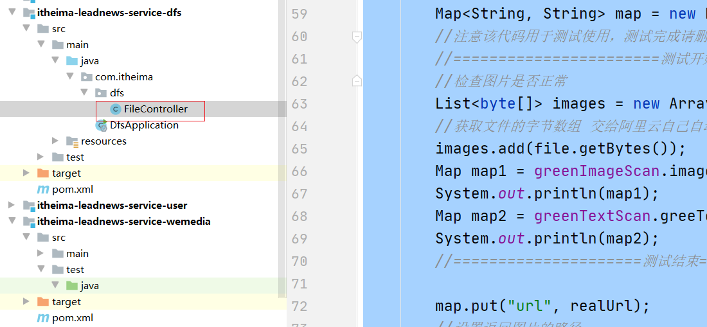


postman进行测试

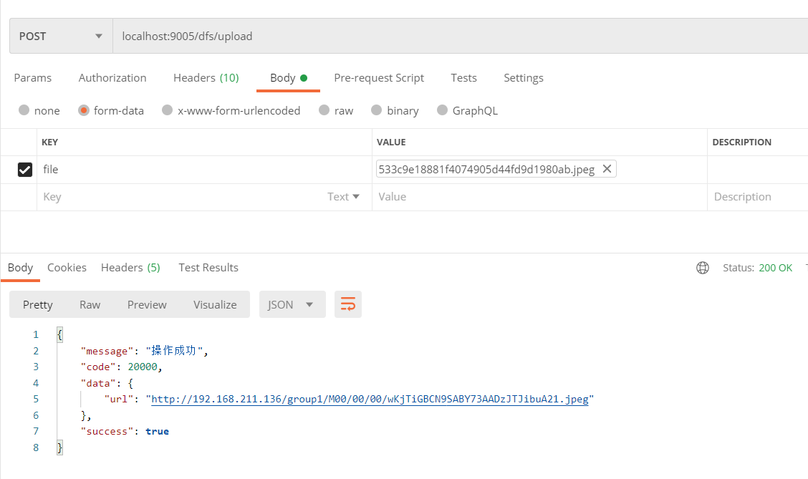


## 4 敏感词过滤算法DFA

敏感词过滤方案

> 1 使用数据库模糊查询，效率太低
>
> 2 使用String.indexOf("")查找，数据库量大的话也是比较慢
>
> 3 把敏感词和内容使用全文检索（solr,ElasticSearche）技术进行分词再匹配，也是可以的，但是这种方案比较麻烦。
>
> 4 DFA算法，确定有穷自动机。本项目采用这种方案

DFA全称为：Deterministic Finite Automaton,即确定有穷自动机。其特征为：有一个有限状态集合和一些从一个状态通向另一个状态的边，每条边上标记有一个符号，其中一个状态是初态，某些状态是终态。但不同于不确定的有限自动机，DFA中不会有从同一状态出发的两条边标志有相同的符号。

- 一次性的把所有的敏感词存储到了多个map中，就是下图表示这种结构

敏感词：冰毒、大麻、大坏蛋

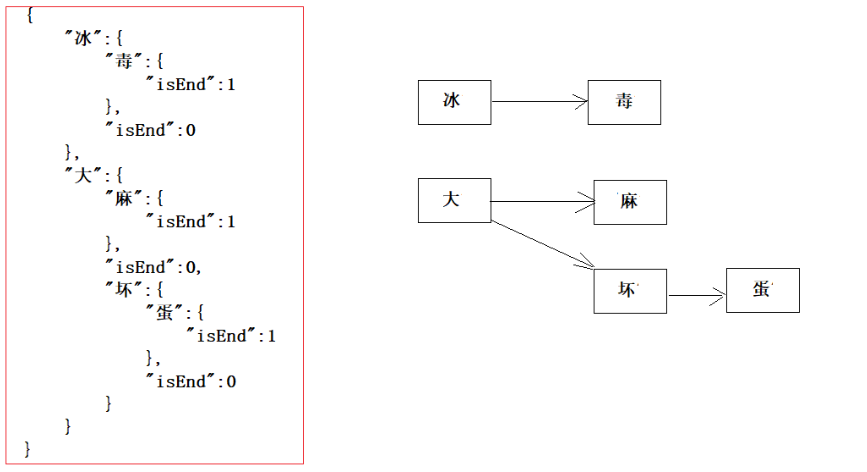

- 检索的过程，就是hashMap的get实现

> 1、第一个字“冰”，我们在hashMap中可以找到。得到一个新的map = hashMap.get("")。
>
> 2、如果map == null，则不是敏感词。否则跳至3
>
> 3、获取map中的isEnd，通过isEnd是否等于1来判断该词是否为最后一个。如果isEnd == 1表示该词为敏感词，否则跳至1。
>
> 通过这个步骤我们可以判断“冰毒”为敏感词，但是如果我们输入“冰箱”则不是敏感词了。

创建工具类：

 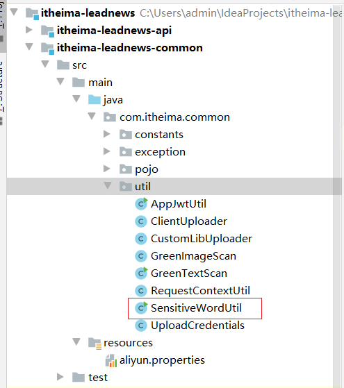

```java
package com.itheima.common.util;

import java.util.*;

public class SensitiveWordUtil {

    public static Map<String, Object> dictionaryMap = new HashMap<>();


    /**
     * 生成关键词字典库
     * @param words
     * @return
     */
    public static void initMap(Collection<String> words) {
        if (words == null) {
            System.out.println("敏感词列表不能为空");
            return ;
        }

        // map初始长度words.size()，整个字典库的入口字数(小于words.size()，因为不同的词可能会有相同的首字)
        Map<String, Object> map = new HashMap<>(words.size());
        // 遍历过程中当前层次的数据
        Map<String, Object> curMap = null;
        Iterator<String> iterator = words.iterator();

        while (iterator.hasNext()) {
            String word = iterator.next();
            curMap = map;
            int len = word.length();
            for (int i =0; i < len; i++) {
                // 遍历每个词的字
                String key = String.valueOf(word.charAt(i));
                // 当前字在当前层是否存在, 不存在则新建, 当前层数据指向下一个节点, 继续判断是否存在数据
                Map<String, Object> wordMap = (Map<String, Object>) curMap.get(key);
                if (wordMap == null) {
                    // 每个节点存在两个数据: 下一个节点和isEnd(是否结束标志)
                    wordMap = new HashMap<>(2);
                    wordMap.put("isEnd", "0");
                    curMap.put(key, wordMap);
                }
                curMap = wordMap;
                // 如果当前字是词的最后一个字，则将isEnd标志置1
                if (i == len -1) {
                    curMap.put("isEnd", "1");
                }
            }
        }

        dictionaryMap = map;
    }

    /**
     * 搜索文本中某个文字是否匹配关键词
     * @param text
     * @param beginIndex
     * @return
     */
    private static int checkWord(String text, int beginIndex) {
        if (dictionaryMap == null) {
            throw new RuntimeException("字典不能为空");
        }
        boolean isEnd = false;
        int wordLength = 0;
        Map<String, Object> curMap = dictionaryMap;
        int len = text.length();
        // 从文本的第beginIndex开始匹配
        for (int i = beginIndex; i < len; i++) {
            String key = String.valueOf(text.charAt(i));
            // 获取当前key的下一个节点
            curMap = (Map<String, Object>) curMap.get(key);
            if (curMap == null) {
                break;
            } else {
                wordLength ++;
                if ("1".equals(curMap.get("isEnd"))) {
                    isEnd = true;
                }
            }
        }
        if (!isEnd) {
            wordLength = 0;
        }
        return wordLength;
    }

    /**
     * 获取匹配的关键词和命中次数
     * @param text
     * @return
     */
    public static Map<String, Integer> matchWords(String text) {
        Map<String, Integer> wordMap = new HashMap<>();
        int len = text.length();
        for (int i = 0; i < len; i++) {
            int wordLength = checkWord(text, i);
            if (wordLength > 0) {
                String word = text.substring(i, i + wordLength);
                // 添加关键词匹配次数
                if (wordMap.containsKey(word)) {
                    wordMap.put(word, wordMap.get(word) + 1);
                } else {
                    wordMap.put(word, 1);
                }

                i += wordLength - 1;
            }
        }
        return wordMap;
    }

    public static void main(String[] args) {
        List<String> list = new ArrayList<>();
        list.add("冰毒");
        initMap(list);
        String content="我是一个好人，买卖冰毒是违法的";
        Map<String, Integer> map = matchWords(content);
        System.out.println(map);
    }
}
```


当然如上的工具类由自己编写，也可以使用已经开源的高性能的库：，大家有兴趣可以自己看下如何使用

```properties
https://github.com/toolgood/ToolGood.Words
```

