# 第七章 自媒体文章审核

## 目标

- 能够掌握自媒体文章审核的流程
- 能够使用阿里云安全服务检测文章内容
- 能够完成自媒体文章审核的功能
- 能够完成自媒体发布文章与审核对接

## 1 自媒体文章自动审核需求说明

### 1.1 自媒体文章自动审核流程

做为内容类产品，内容安全非常重要，所以需要进行对自媒体用户发布的文章进行审核以后才能到app端展示给用户。

审核的流程如下：也可以查看当前讲义文件夹下：day07-文章审核时序图.pdf

 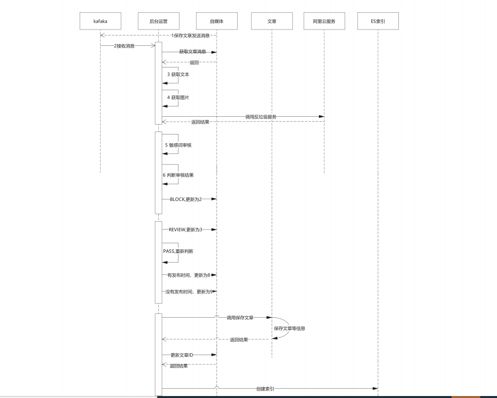

解释：

```properties
1.当发生自媒体文章保存之后 发送消息给kafka
2.运营管理平台接收到消息之后 进行查询自媒体文章信息
3.查询到图片和文本内容
4.调用反垃圾阿里云服务 并获取结果
5.再调用自定义的敏感词进行审核
6.获取审核结果 分为3个情况
	6.1 如果是block 则为拒绝 更新自媒体文章状态2
	6.2 如果是review 则为人工审核 更新自媒体文章状态为3
	6.3 如果是PASS 则更新状态为 8 或者9 
		6.3.1 有发布时间 则 更新为8
		6.3.2 没有发布时间 则 更新为9
7.生成索引		
```


### 1.2 表结构

涉及到的表如下

 (1)

(2)文章表 文章配置表 文章内容表 作者表

 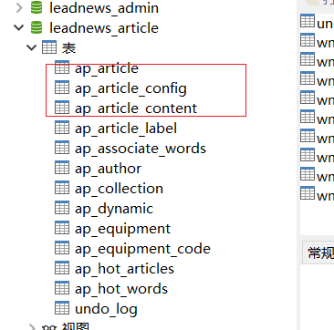

(3)敏感词表

 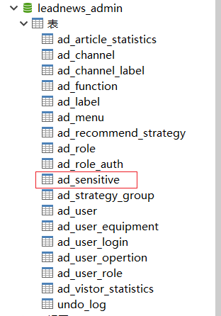


## 2 文章审核功能实现

### 2.1 实现思路分析

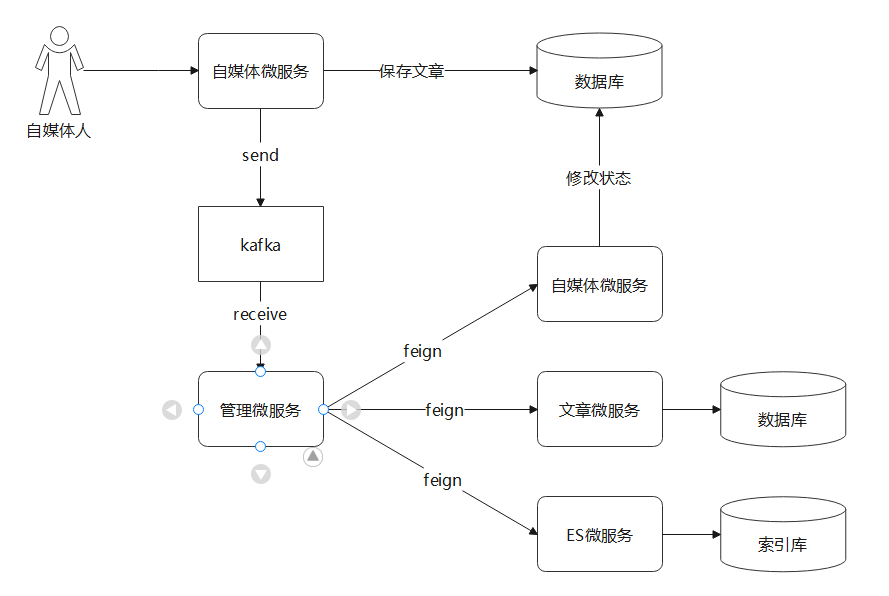

```properties
1.自媒体保存文章 发送消息给kafka 
2.管理微服务进行接收消息获取相关的信息 进行 审核
3.通过feign调用进行处理即可。具体的流程参考时序图
```


具体的步骤如下：

```properties
1 自媒体发送消息
2 管理微服务接收消息
	2.1 获取到消息内容 通过Feign调用获取自媒体文章信息
	2.2 获取文章的标题 和 内容中解析出来的文本 
	2.3 获取到文章的封面图片和内容中解析出来的图片
	2.4 调用获取阿里云反垃圾服务进行审核文本 和 审核图片 以及调用管理微服务本身的敏感词审核
	2.5 判断审核的结果
		2.5.1 如果是Block  则 通过feign调用更新自媒体文章的状态为2
		2.5.2 如果是review 则 通过feign调用更新自媒体文章的状态为3
		2.5.3 如果是pass  
			2.5.3.1 判断发布时间是否有值 如果有  则通过feign调用更新自媒体文章的状态为8
			2.5.3.2 判断发布时间是否有值 如果无  则通过feign调用更新自媒体文章的状态为9
	2.6 保存文章信息到 article库中
    2.7 调用feign更新文章的ID 到自媒体文章表中
```


### 2.2 功能实现

步骤：

1 先实现消息的发送和接收

2 监听端-获取文章的信息

3 获取需要审核的文本和图片

4 进行自动审核

5 判断审核的状态 

​	        5.1 如果是Block  则 通过feign调用更新自媒体文章的状态为2
​		5.2 如果是review 则 通过feign调用更新自媒体文章的状态为3
​		5.3 如果是pass  
​			5.3.1 判断发布时间是否有值 如果有  则通过feign调用更新自媒体文章的状态为8
​			5.3.2 判断发布时间是否有值 如果无  则通过feign调用更新自媒体文章的状态为9	

​	

#### 2.2.1 实现消息发送和接收

步骤：

```properties
生产者端：
（1）添加kafka依赖
（2）修改yml 配置kafak生成者配置
（3）修改保存文章的方法 添加发送消息
消费者端：
（1）添加kafak依赖
（2）修改yml 配置消费者配置
（3）添加监听类 进行获取
```

##### 2.2.1.1 生产者端

（1）添加依赖：在自媒体微服务中添加

```xml
<!-- kafka依赖 begin -->
<dependency>
    <groupId>org.springframework.kafka</groupId>
    <artifactId>spring-kafka</artifactId>
</dependency>
<dependency>
    <groupId>org.springframework.kafka</groupId>
    <artifactId>spring-kafka-test</artifactId>
    <scope>test</scope>
</dependency>
```


（2）修改配置

```yaml
  kafka:
    # 配置连接到服务端集群的配置项 ip:port,ip:port
    bootstrap-servers: 192.168.211.136:9092
    producer:
      batch-size: 16384
      buffer-memory: 33554432
      key-serializer: org.apache.kafka.common.serialization.StringSerializer
      retries: 10
      value-serializer: org.apache.kafka.common.serialization.StringSerializer
```

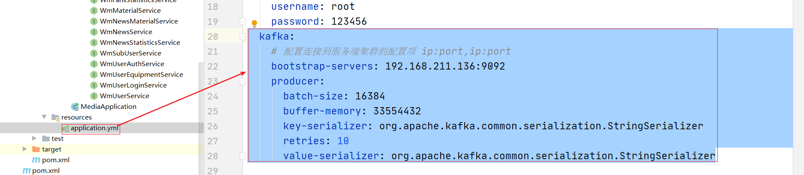


（3）修改方法 添加发送消息

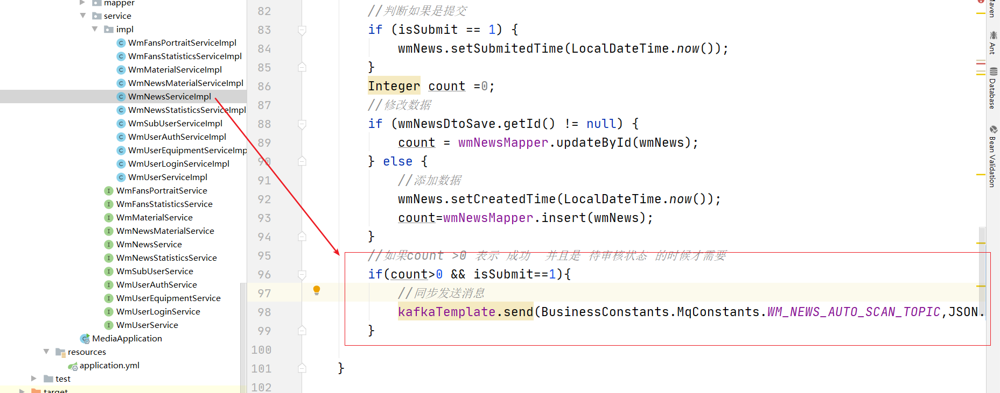

```java
//如果count >0 表示 成功  并且是 待审核状态 的时候才需要
if(count>0 && isSubmit==1){
    //同步发送消息
    kafkaTemplate.send(BusinessConstants.MqConstants.WM_NEWS_AUTO_SCAN_TOPIC,JSON.toJSONString(wmNews.getId()));
}
```

添加常量类值：

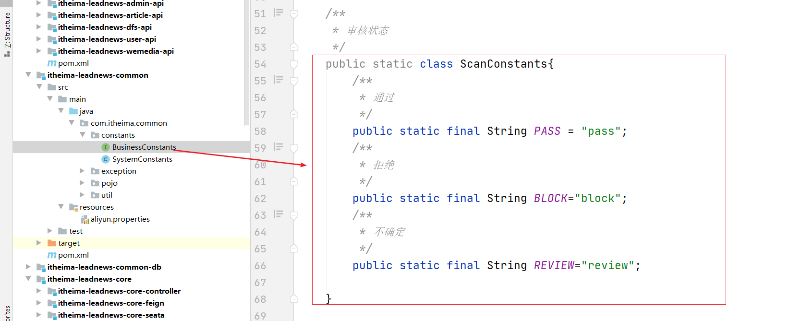

```java
 public static class ScanConstants{
        /**
         * 通过
         */
        public static final String PASS = "pass";
        /**
         * 拒绝
         */
        public static final String BLOCK="block";
        /**
         * 不确定
         */
        public static final String REVIEW="review";

    }
```


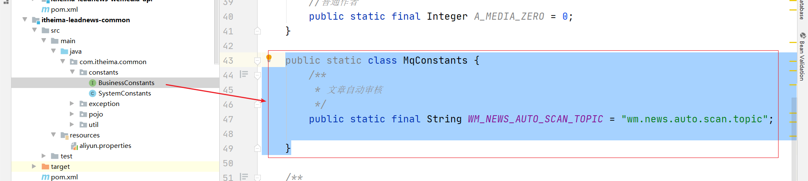

```java
public static class MqConstants {
    /**
         * 文章自动审核
         */
    public static final String WM_NEWS_AUTO_SCAN_TOPIC = "wm.news.auto.scan.topic";

}
```


##### 2.2.1.2 消费者端

(1)添加依赖 ：在admin微服务中添加

```xml
<!-- kafka依赖 begin -->
<dependency>
    <groupId>org.springframework.kafka</groupId>
    <artifactId>spring-kafka</artifactId>
</dependency>
<dependency>
    <groupId>org.springframework.kafka</groupId>
    <artifactId>spring-kafka-test</artifactId>
    <scope>test</scope>
</dependency>
```

(2)修改kafka配置

```yaml
  kafka:
    # 配置连接到服务端集群的配置项 ip:port,ip:port
    bootstrap-servers: 192.168.211.136:9092
    consumer:
      auto-offset-reset: earliest
      group-id: test-consumer-group
      # 默认值即为字符串
      key-deserializer: org.apache.kafka.common.serialization.StringDeserializer
      # 默认值即为字符串
      value-deserializer: org.apache.kafka.common.serialization.StringDeserializer
```

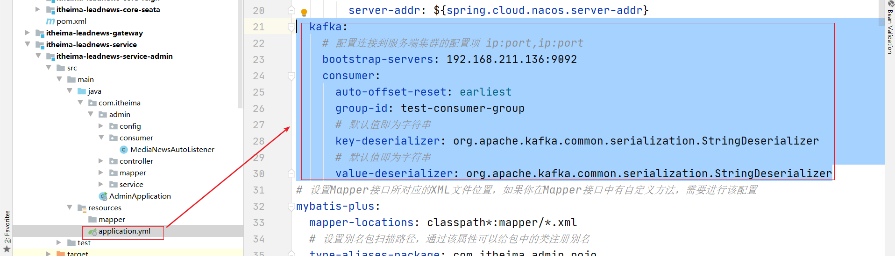

(3) 创建监听类

```java
@Component
public class MediaNewsAutoListener {

    @Autowired
    private WemediaNewsAutoScanService wemediaNewsAutoScanService;

    //监听主题
    @KafkaListener(topics = BusinessConstants.MqConstants.WM_NEWS_AUTO_SCAN_TOPIC)
    public void recevieMessage(ConsumerRecord<?,?> record){
        if(record!=null){
            String value = (String) record.value();
            System.out.println(value);
            try {
                wemediaNewsAutoScanService.autoScanByMediaNewsId(Integer.valueOf(value));
            } catch (Exception e) {
                e.printStackTrace();
            }
        }
    }
}
```


（4）创建WemediaNewsAutoScanService接口和实现类：

```java
@Service
public class WemediaNewsAutoScanServiceImpl implements WemediaNewsAutoScanService {
    @Override
    public void autoScanByMediaNewsId(Integer id) throws Exception {//数据需要进行同步
        System.out.println(id);
        //1 获取文章信息
        //2 获取审核的 文本 和 图片
        //3 进行自动审核
        //4 判断审核的状态 进行更新
        //5 保存文章数据
        //6 更新文章的ID 
    }
}
```

```properties
//1 获取文章信息
//2 获取审核的 文本 和 图片
//3 进行自动审核
//4 判断审核的状态 进行更新
//5 保存文章数据
//6 更新文章的ID 
```


#### 2.2.2 实现监听业务-获取自媒体文章信息

步骤：通过feign进行调用即可

（1）admin端微服务引入依赖

```xml
<!--添加自媒体feign相关-->
<dependency>
    <groupId>com.itheima</groupId>
    <artifactId>itheima-leadnews-wemedia-api</artifactId>
    <version>1.0-SNAPSHOT</version>
</dependency>
```

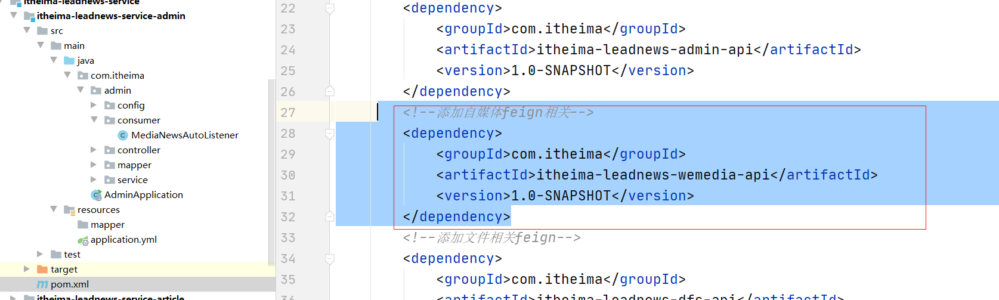

(2)创建feign


```java
@FeignClient(name="leadnews-wemedia",path = "/wmNews",contextId ="wmNews")
public interface WmNewsFeign extends CoreFeign<WmNews> {

}
```

(3)添加依赖 如果有添加则不需要再加了


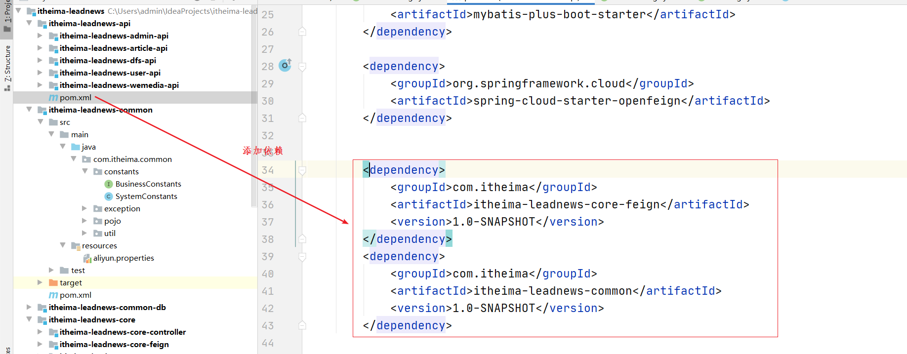


（4）修改feign,如图添加contextId 用于区分不同的业务

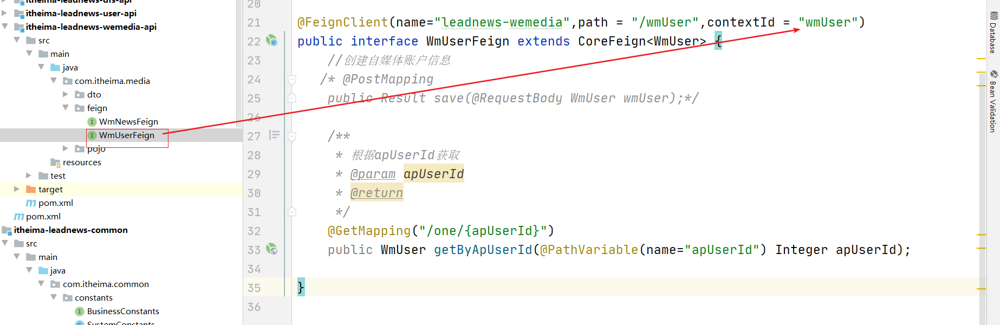


(5)实现类中调用

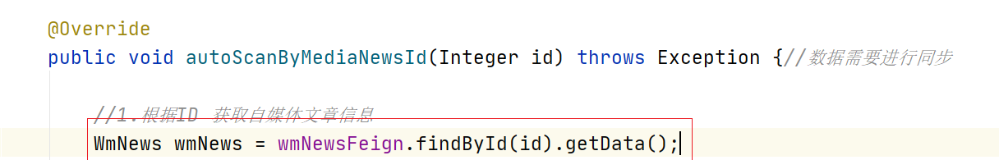

(6) 启用feignclients

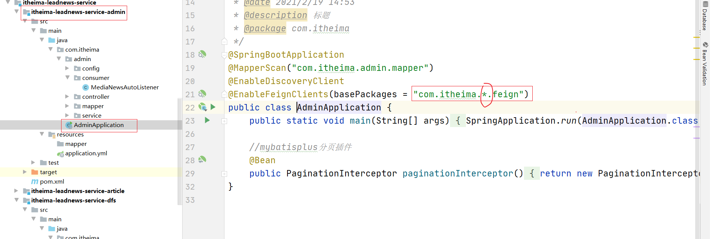


#### 2.2.3 实现监听业务-获取审核的文本和图片

分析：由于有图片和文本 而且 文本是在title 和content中有 图片是封面和content也有，那么就需要解析出content中的图片和文本 分别进行审核。

编写代码如下

```java
//2.1 获取文本图片结合
String content = wmNews.getContent();
//2.2 获取图片合并列表
List<String> imagesFromContent = getImagesFromContent(content, wmNews.getImages());
//2.3获取文本合并列表
List<String> textFromContent = getTextFromContent(content, wmNews.getTitle());
```

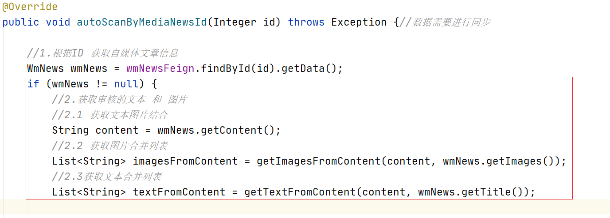

获取图片

```java
 //获取图片
    private List<String> getImagesFromContent(String content, String images) {
        //1.定义一个List 用来封装所有的图片路径
        List<String> imagesAllList  = new ArrayList<String>();
        if(!StringUtils.isEmpty(content)) {
            //2.将content 转成 List<ContentNode>
            List<ContentNode> contentNodes = JSON.parseArray(content, ContentNode.class);

            //3.循环遍历获取到type类型为image的value的值 添加到list中
            for (ContentNode contentNode : contentNodes) {
                if(contentNode.getType().equals("image")){
                    imagesAllList.add(contentNode.getValue());
                }
            }
        }
        //images的数据格式：12345.jpg
        if(!StringUtils.isEmpty(images)) {
            //4.将 images 添加list
            String[] split = images.split(",");
            List<String> imagesList = Arrays.asList(split);
            imagesAllList.addAll(imagesList);
        }
        //5.返回list
        return imagesAllList;
    }
```

获取文本：

```java
  //获取文本
    private List<String> getTextFromContent(String content, String title) {
        //1.定义一个List 用来封装所有的文本
        List<String> texts  = new ArrayList<String>();

        if(!StringUtils.isEmpty(content)) {
            //2.将content 转成 List<ContentNode>
            List<ContentNode> contentNodes = JSON.parseArray(content, ContentNode.class);
            //3.循环遍历获取到type类型为text的value的值 添加到list中
            for (ContentNode contentNode : contentNodes) {
                if (contentNode.getType().equals("text")) {
                    texts.add(contentNode.getValue());
                }
            }
        }
        //4.将title 添加list
        texts.add(title);
        //5.返回list
        return texts;
    }
```


#### 2.2.4 实现监听业务-自动审核

分析：

```properties
根据文本列表 和 图片地址列表 调用阿里云内容发垃圾服务进行审核,再调用本地敏感词进行过滤 并返回结果即可
```

（1）封装审核的方法

```java
@Autowired
private DfsFeign dfsFeign;

@Autowired
private GreenTextScan greenTextScan;

@Autowired
private GreenImageScan greenImageScan;

@Autowired
private AdSensitiveMapper adSensitiveMapper;

//阿里云文本和图片审核 以及 敏感词审核
private String scanTextAndImage(List<String> texts, List<String> images) throws Exception {
    //1审核文本
    if (texts != null) {
        Map map = greenTextScan.greeTextScan(texts);
        String result1 = getScanResult(map);
        //如果不成功 则直接返回 不需要执行了
        if (!result1.equals(BusinessConstants.ScanConstants.PASS)) {
            return result1;
        }
    }


    //2 审核 图片
    if (images != null) {
        List<byte[]> bytes = dfsFeign.downLoadFile(images);
        Map map = greenImageScan.imageScan(bytes);
        String result2 = getScanResult(map);
        //如果不成功 则直接返回 不需要执行了
        if (!result2.equals(BusinessConstants.ScanConstants.PASS)) {
            return result2;
        }
    }
    if(texts!=null) {
        //3 审核敏感词
        List<String> adSensitives = adSensitiveMapper.selectSensitives();
        //这个可以优化放到缓存中
        SensitiveWordUtil.initMap(adSensitives);
        //扫描并判断是否正确DynamicServerListLoadBalancer
        for (String text : texts) {
            Map<String, Integer> stringIntegerMap = SensitiveWordUtil.matchWords(text);
            if (stringIntegerMap.size() > 0) {
                return BusinessConstants.ScanConstants.BLOCK;
            }
        }
    }
    //通过
    return BusinessConstants.ScanConstants.PASS;
}

//封装
private String getScanResult(Map map) {
    Object suggestion = map.get("suggestion");
    if (!suggestion.equals("pass")) {
        //有敏感词
        if (suggestion.equals("block")) {
            return BusinessConstants.ScanConstants.BLOCK;
        }
        //人工审核
        if (suggestion.equals("review")) {
            return BusinessConstants.ScanConstants.REVIEW;
        }
    }
    //如果没错误 返回成功
    return BusinessConstants.ScanConstants.PASS;
}
```

（2）创建dfsfeign 获取图片地址对应的的字节数组列表

创建dfs-api工程，并创建feign

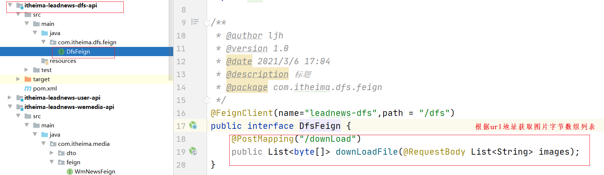


(3)dsf微服务中实现获取字节数组返回


```java
@PostMapping("/downLoad")
public List<byte[]> downLoadFile(@RequestBody List<String> images){
    List<byte[]> bytesList = new ArrayList<>();
    for (String image : images) {
        //解析路径
        StorePath storePath = StorePath.parseFromUrl(image);
        //返回字节数组
        byte[] bytes = fastFileStorageClient.downloadFile(storePath.getGroup(), storePath.getPath(), new DownloadCallback<byte[]>() {
            @Override
            public byte[] recv(InputStream ins) throws IOException {
                byte[] bytes1 = IOUtils.toByteArray(ins);
                return bytes1;
            }
        });
        bytesList.add(bytes);
    }

    return bytesList;
}
```


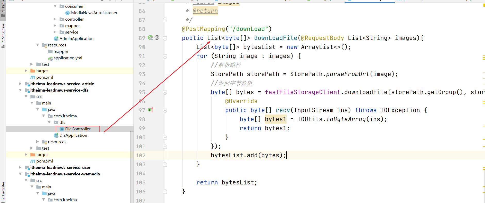


(4)添加依赖到admin微服务中

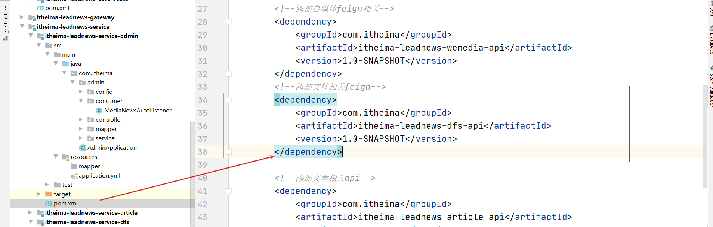


（5）添加方法用于mapper查询敏感词

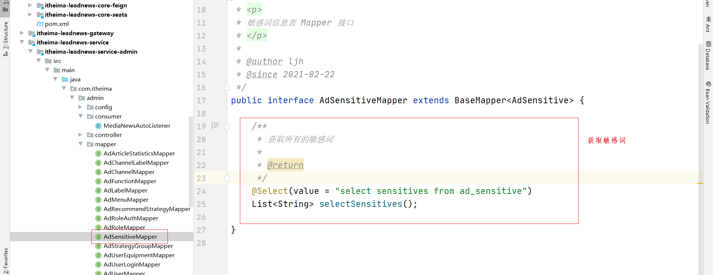


（6）调用方法 添加

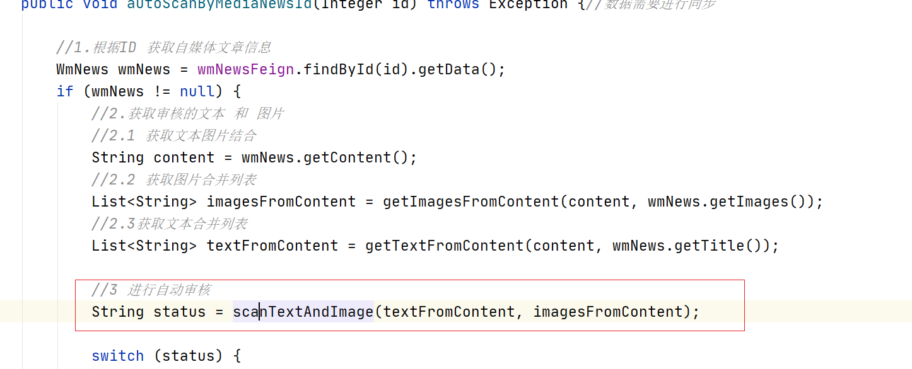


#### 2.2.5 实现监听业务-状态判断

根据上边的分析思路如下：

```properties
	2.5 判断审核的结果
		2.5.1 如果是Block  则 通过feign调用更新自媒体文章的状态为2
		2.5.2 如果是review 则 通过feign调用更新自媒体文章的状态为3
		2.5.3 如果是pass  
			2.5.3.1 判断发布时间是否有值 如果有  则通过feign调用更新自媒体文章的状态为8
			2.5.3.2 判断发布时间是否有值 如果无  则通过feign调用更新自媒体文章的状态为9
```

添加代码如下：

```java
switch (status) {
    // 如果是 拒绝 则更新状态 为【审核失败】
    case BusinessConstants.ScanConstants.BLOCK: {
        WmNews record = new WmNews();
        record.setId(id);
        record.setStatus(2);
        record.setReason("文本或图片违规");
        wmNewsFeign.updateByPrimaryKey(record);
        break;
    }
    // 如果是 审核成功 则更新状态根据情况来进行处理   1如果是发布时间为null 则 更新为9 ; 2: 如果是发布时间不为null 则更新为8
    case BusinessConstants.ScanConstants.PASS: {
        if (wmNews.getPublishTime() != null) {
            WmNews record = new WmNews();
            record.setId(id);
            record.setStatus(8);
            wmNewsFeign.updateByPrimaryKey(record);
        } else {
            WmNews record = new WmNews();
            record.setId(id);
            record.setStatus(9);
            wmNewsFeign.updateByPrimaryKey(record);
        }
        break;
    }
    // 如果是 不确定 则人工审核
    case BusinessConstants.ScanConstants.REVIEW: {
        WmNews record = new WmNews();
        record.setId(id);
        record.setStatus(3);
        wmNewsFeign.updateByPrimaryKey(record);
        break;
    }
    default:
        System.out.println("错误信息");
        break;
}
```

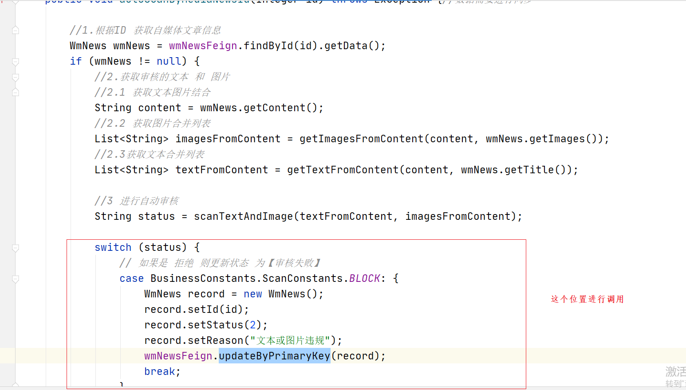


#### 2.2.6 实现监听业务-文章信息进行保存

步骤分析:

```properties
（1）文章信息设计到的表为3张，并且还需要作者信息 所以我们可以定义一个dto对象包含相关属性
（2）定义feign 
（3）实现feign
（4）admin端进行feign调用
	添加依赖
	启用feignclients
	注入并进行调用	
```

（1）定义dto对象

```java
@Data
@Getter
@Setter
public class ArticleInfoDto {
    private ApArticle apArticle;
    private ApArticleContent apArticleContent;
    private ApArticleConfig apArticleConfig;
}

```

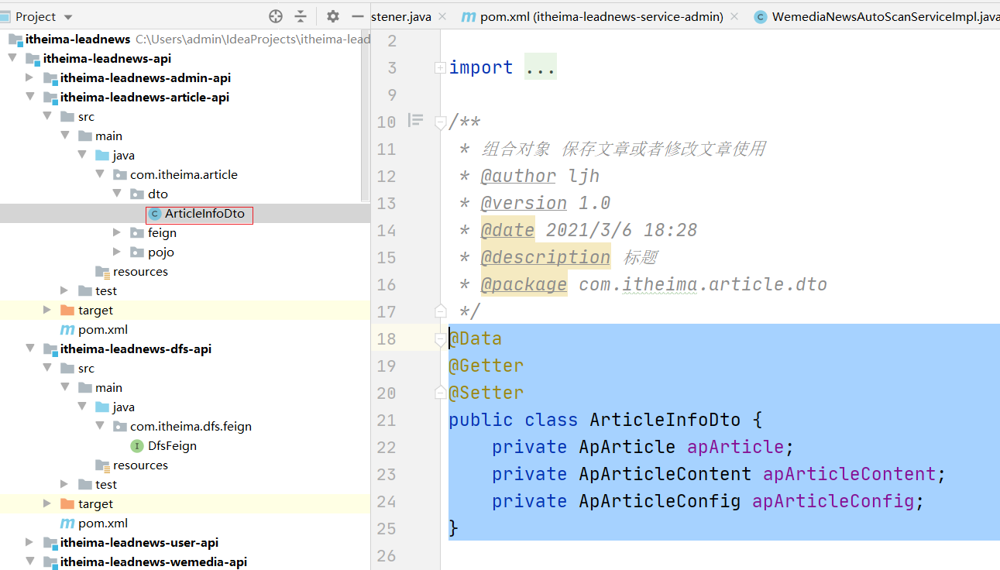

(2)创建feign接口实现更新保存

```java
@FeignClient(name="leadnews-article",path = "/apArticle",contextId = "apArticle")
public interface ApArticleFeign {
    //保存文章或者更新文章信息
    @PostMapping("/articleInfo/save")
    public Result<ApArticle> save(@RequestBody ArticleInfoDto articleInfoDto);
}

```

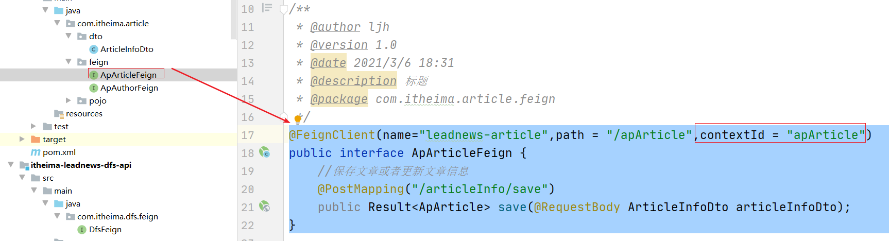

另外也需要修改apAuthorFeign的配置如下：

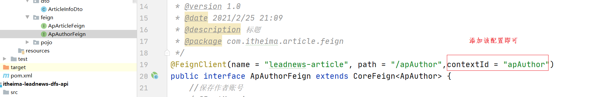

（3）实现feign接口对应的业务逻辑：

controller:

```java
  //保存文章或者更新文章 用于远程调用
    @PostMapping("/articleInfo/save")
    public Result<ApArticle> save(@RequestBody ArticleInfoDto articleInfoDto){
        ApArticle apArticle = apArticleService.saveArticle(articleInfoDto);
        return Result.ok(apArticle);
    }
```

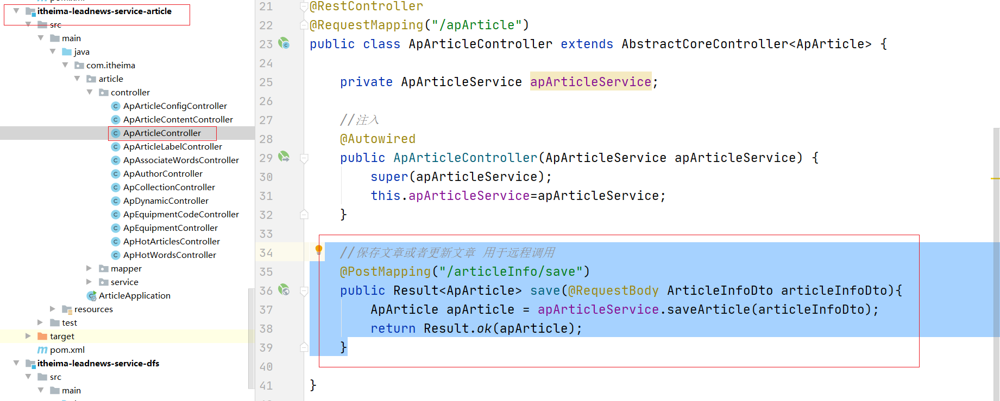

service实现类:

```java
 @Autowired
    private ApArticleMapper apArticleMapper;
    @Autowired
    private ApArticleConfigMapper apArticleConfigMapper;
    @Autowired
    private ApArticleContentMapper apArticleContentMapper;

	//更新的情况不会存在，但是为了避免出现错误，我们可以进行更新
    @Override
    public ApArticle saveArticle(ArticleInfoDto articleInfoDto) {
        //1.获取文章信息 判断 是否有值
        ApArticle apArticle = articleInfoDto.getApArticle();
        //更新的
        if (apArticle.getId() != null) {
            //更新文章
            apArticleMapper.updateById(apArticle);

            //更新配置  不需要更新配置（是在文章审核通过之后进行的）
           /* QueryWrapper<ApArticleConfig> wrapper1 = new QueryWrapper<ApArticleConfig>();
            wrapper1.eq("article_id",apArticle.getId());
            apArticleConfigMapper.update(articleInfoDto.getApArticleConfig(),wrapper1);*/
            //更新内容
            QueryWrapper<ApArticleContent> wrapper2 = new QueryWrapper<ApArticleContent>();
            wrapper2.eq("article_id",apArticle.getId());
            apArticleContentMapper.update(articleInfoDto.getApArticleContent(),wrapper2);
        } else {
            //添加
            apArticle.setCreatedTime(LocalDateTime.now());
            apArticleMapper.insert(apArticle);

            ApArticleConfig apArticleConfig = articleInfoDto.getApArticleConfig();
            apArticleConfig.setArticleId(apArticle.getId());
            apArticleConfigMapper.insert(apArticleConfig);

            ApArticleContent apArticleContent = articleInfoDto.getApArticleContent();
            apArticleContent.setArticleId(apArticle.getId());
            apArticleContentMapper.insert(apArticleContent);
        }
        return apArticle;
    }
```

（4）admin微服务中添加依赖

```xml
<!--添加文章相关api-->
<dependency>
    <groupId>com.itheima</groupId>
    <artifactId>itheima-leadnews-article-api</artifactId>
    <version>1.0-SNAPSHOT</version>
</dependency>
```


(5)实现feign调用

设置flag 表示当状态为9的时候才能进行创建文章。

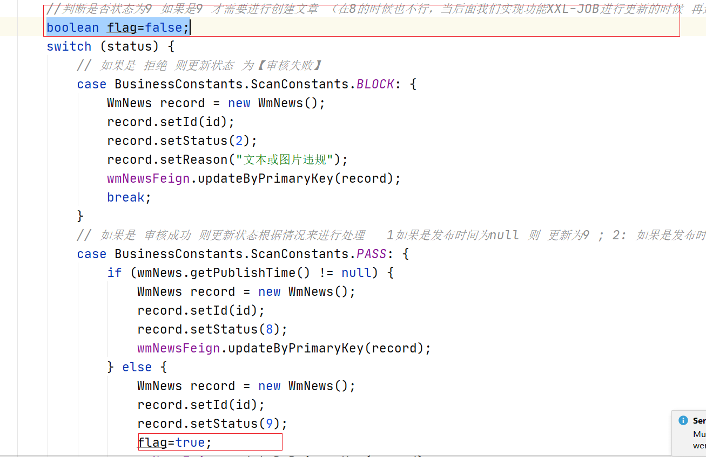

```java
@Autowired
private ApArticleFeign apArticleFeign;
@Override
public void autoScanByMediaNewsId(Integer id) throws Exception {

    //略

    if(flag) {
        //4.保存文章相关信息 并进行状态同步 涉及到三个表 article article_content article_config
        ArticleInfoDto articleInfoDto = new ArticleInfoDto();

        ApArticle article = new ApArticle();

        //该值有可能为null
        if (wmNews.getArticleId() != null) {
            article.setId(wmNews.getArticleId());
        }
        article.setTitle(wmNews.getTitle());
        //根据自媒体账号获取作者信息
        //自媒体账号ID
        ApAuthor apAuthor = apAuthorFeign.getByWmUserId(wmNews.getUserId());
        if (apAuthor != null) {
            article.setAuthorId(apAuthor.getId());
            article.setAuthorName(apAuthor.getName());
        }
        //获取频道
        AdChannel adChannel = adChannelService.getById(wmNews.getChannelId());
        if (adChannel != null) {
            article.setChannelId(adChannel.getId());
            article.setChannelName(adChannel.getName());
        }
        //文章布局
        article.setLayout(wmNews.getType());
        //普通文章
        article.setFlag(0);

        article.setImages(wmNews.getImages());

        article.setLabels(wmNews.getLabels());

        if (wmNews.getPublishTime() != null) {
            article.setPublishTime(wmNews.getPublishTime());
        }
        //同步状态
        article.setSyncStatus(wmNews.getStatus());
        articleInfoDto.setApArticle(article);


        ApArticleConfig articleConfig = new ApArticleConfig();
        //设置默认值
        articleConfig.setIsDown(0);
        //设置默认值
        articleConfig.setIsDelete(0);

        articleInfoDto.setApArticleConfig(articleConfig);


        ApArticleContent articleContent = new ApArticleContent();
        //内容
        articleContent.setContent(wmNews.getContent());

        articleInfoDto.setApArticleContent(articleContent);

        //获取到文章的ID
        Result<ApArticle> resultApArticle = apArticleFeign.save(articleInfoDto);
    }
    //略
}
```

代码所在位置

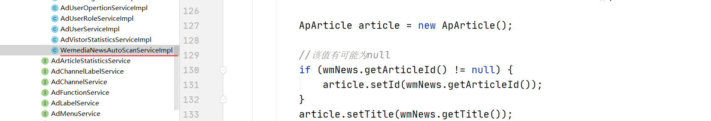


还需要定义apAuthor的方法用于根据自媒体用户的ID 获取作者信息：

```java
/*@PostMapping
    public Result<ApAuthor> save(@RequestBody ApAuthor record);*/
@GetMapping("/author/{wmUserId}")
public ApAuthor getByWmUserId(@PathVariable(name="wmUserId") Integer wmUserId);
```


在文章微服务中进行“实现”接口：

```java
/**
     * 根据mw_user_id 获取作者（）
     * @param wmUserId  自媒体用户的ID主键值
     * @return
     */
@GetMapping("/author/{wmUserId}")
public ApAuthor getByWmUserId(@PathVariable(name="wmUserId") Integer wmUserId){
    QueryWrapper<ApAuthor> queryWrapper = new QueryWrapper<ApAuthor>();
    queryWrapper.eq("wm_user_id",wmUserId);
    return apAuthorService.getOne(queryWrapper);
}
```

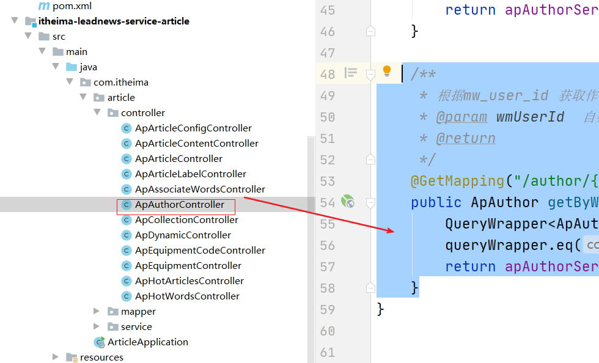


#### 2.2.7 实现监听任务-实现文章ID更新到自媒体文章中


```java

ApArticle data = resultApArticle.getData();
//获取ID 更新到自媒体表当中
Long articleId = data.getId();
WmNews record = new WmNews();
record.setId(id);
record.setArticleId(articleId);

wmNewsFeign.updateByPrimaryKey(record);

```

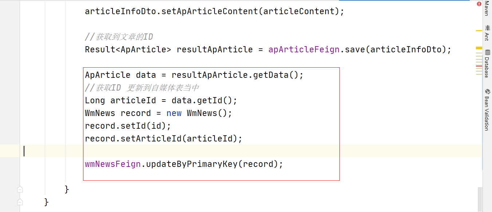


### 2.3 整体代码如下

```java
package com.itheima.admin.service.impl;

import com.alibaba.fastjson.JSON;
import com.itheima.admin.mapper.AdSensitiveMapper;
import com.itheima.admin.pojo.AdChannel;
import com.itheima.admin.service.AdChannelService;
import com.itheima.admin.service.WemediaNewsAutoScanService;
import com.itheima.article.dto.ArticleInfoDto;
import com.itheima.article.feign.ApArticleFeign;
import com.itheima.article.feign.ApAuthorFeign;
import com.itheima.article.pojo.ApArticle;
import com.itheima.article.pojo.ApArticleConfig;
import com.itheima.article.pojo.ApArticleContent;
import com.itheima.article.pojo.ApAuthor;
import com.itheima.common.constants.BusinessConstants;
import com.itheima.common.pojo.Result;
import com.itheima.common.util.GreenImageScan;
import com.itheima.common.util.GreenTextScan;
import com.itheima.common.util.SensitiveWordUtil;
import com.itheima.dfs.feign.DfsFeign;
import com.itheima.media.dto.ContentNode;
import com.itheima.media.feign.WmNewsFeign;
import com.itheima.media.feign.WmUserFeign;
import com.itheima.media.pojo.WmNews;
import org.springframework.beans.factory.annotation.Autowired;
import org.springframework.stereotype.Service;
import org.springframework.util.StringUtils;

import java.util.ArrayList;
import java.util.Arrays;
import java.util.List;
import java.util.Map;

/**
 * 自动审核
 *
 * @author ljh
 * @version 1.0
 * @date 2021/3/5 16:25
 * @description 标题
 * @package com.itheima.admin.service.impl
 */
@Service
public class WemediaNewsAutoScanServiceImpl implements WemediaNewsAutoScanService {
    @Autowired
    private WmNewsFeign wmNewsFeign;

    @Autowired
    private DfsFeign dfsFeign;

    @Autowired
    private GreenTextScan greenTextScan;

    @Autowired
    private GreenImageScan greenImageScan;

    @Autowired
    private AdSensitiveMapper adSensitiveMapper;

    @Autowired
    private ApArticleFeign apArticleFeign;

    @Autowired
    private ApAuthorFeign apAuthorFeign;

    @Autowired
    private AdChannelService adChannelService;


    @Override
    public void autoScanByMediaNewsId(Integer id) throws Exception {//数据需要进行同步

        //1.根据ID 获取自媒体文章信息
        WmNews wmNews = wmNewsFeign.findById(id).getData();
        if (wmNews != null) {
            //2.获取审核的文本 和 图片
            //2.1 获取文本图片结合
            String content = wmNews.getContent();
            //2.2 获取图片合并列表
            List<String> imagesFromContent = getImagesFromContent(content, wmNews.getImages());
            //2.3获取文本合并列表
            List<String> textFromContent = getTextFromContent(content, wmNews.getTitle());

            //3 进行自动审核
            String status = scanTextAndImage(textFromContent, imagesFromContent);

            //判断是否状态为9 如果是9 才需要进行创建文章 （在8的时候也不行，当后面我们实现功能XXL-JOB进行更新的时候 再进行调用）
            boolean flag=false;
            switch (status) {
                    // 如果是 拒绝 则更新状态 为【审核失败】
                case BusinessConstants.ScanConstants.BLOCK: {
                    WmNews record = new WmNews();
                    record.setId(id);
                    record.setStatus(2);
                    record.setReason("文本或图片违规");
                    wmNewsFeign.updateByPrimaryKey(record);
                    break;
                }
                    // 如果是 审核成功 则更新状态根据情况来进行处理   1如果是发布时间为null 则 更新为9 ; 2: 如果是发布时间不为null 则更新为8
                case BusinessConstants.ScanConstants.PASS: {
                    if (wmNews.getPublishTime() != null) {
                        WmNews record = new WmNews();
                        record.setId(id);
                        record.setStatus(8);
                        wmNewsFeign.updateByPrimaryKey(record);
                    } else {
                        WmNews record = new WmNews();
                        record.setId(id);
                        record.setStatus(9);
                        flag=true;
                        wmNewsFeign.updateByPrimaryKey(record);
                    }
                    break;
                }
                    // 如果是 不确定 则人工审核
                case BusinessConstants.ScanConstants.REVIEW: {
                    WmNews record = new WmNews();
                    record.setId(id);
                    record.setStatus(3);
                    wmNewsFeign.updateByPrimaryKey(record);
                    break;
                }
                default:
                    System.out.println("错误信息");
                    break;
            }
            //4.保存文章相关信息 并进行状态同步 涉及到三个表 article article_content article_config
            if(flag) {
                ArticleInfoDto articleInfoDto = new ArticleInfoDto();

                ApArticle article = new ApArticle();

                //该值有可能为null
                if (wmNews.getArticleId() != null) {
                    article.setId(wmNews.getArticleId());
                }
                article.setTitle(wmNews.getTitle());
                //根据自媒体账号获取作者信息
                //自媒体账号ID
                ApAuthor apAuthor = apAuthorFeign.getByWmUserId(wmNews.getUserId());
                if (apAuthor != null) {
                    article.setAuthorId(apAuthor.getId());
                    article.setAuthorName(apAuthor.getName());
                }
                //获取频道
                AdChannel adChannel = adChannelService.getById(wmNews.getChannelId());
                if (adChannel != null) {
                    article.setChannelId(adChannel.getId());
                    article.setChannelName(adChannel.getName());
                }
                //文章布局
                article.setLayout(wmNews.getType());
                //普通文章
                article.setFlag(0);

                article.setImages(wmNews.getImages());

                article.setLabels(wmNews.getLabels());

                if (wmNews.getPublishTime() != null) {
                    article.setPublishTime(wmNews.getPublishTime());
                }
                //同步状态
                article.setSyncStatus(wmNews.getStatus());
                articleInfoDto.setApArticle(article);


                ApArticleConfig articleConfig = new ApArticleConfig();
                //设置默认值
                articleConfig.setIsDown(0);
                //设置默认值
                articleConfig.setIsDelete(0);

                articleInfoDto.setApArticleConfig(articleConfig);


                ApArticleContent articleContent = new ApArticleContent();
                //内容
                articleContent.setContent(wmNews.getContent());

                articleInfoDto.setApArticleContent(articleContent);

                //获取到文章的ID
                Result<ApArticle> resultApArticle = apArticleFeign.save(articleInfoDto);

                ApArticle data = resultApArticle.getData();
                //获取ID 更新到自媒体表当中
                Long articleId = data.getId();
                WmNews record = new WmNews();
                record.setId(id);
                record.setArticleId(articleId);

                wmNewsFeign.updateByPrimaryKey(record);
            }

        }
    }

   //获取图片
    private List<String> getImagesFromContent(String content, String images) {
        //1.定义一个List 用来封装所有的图片路径
        List<String> imagesAllList  = new ArrayList<String>();
        if(!StringUtils.isEmpty(content)) {
            //2.将content 转成 List<ContentNode>
            List<ContentNode> contentNodes = JSON.parseArray(content, ContentNode.class);

            //3.循环遍历获取到type类型为image的value的值 添加到list中
            for (ContentNode contentNode : contentNodes) {
                if(contentNode.getType().equals("image")){
                    imagesAllList.add(contentNode.getValue());
                }
            }
        }
        //images的数据格式：12345.jpg
        if(!StringUtils.isEmpty(images)) {
            //4.将 images 添加list
            String[] split = images.split(",");
            List<String> imagesList = Arrays.asList(split);
            imagesAllList.addAll(imagesList);
        }
        //5.返回list
        return imagesAllList;
    }

    //获取文本并合并
     private List<String> getTextFromContent(String content, String title) {
        //1.定义一个List 用来封装所有的文本
        List<String> texts  = new ArrayList<String>();

        if(!StringUtils.isEmpty(content)) {
            //2.将content 转成 List<ContentNode>
            List<ContentNode> contentNodes = JSON.parseArray(content, ContentNode.class);
            //3.循环遍历获取到type类型为text的value的值 添加到list中
            for (ContentNode contentNode : contentNodes) {
                if (contentNode.getType().equals("text")) {
                    texts.add(contentNode.getValue());
                }
            }
        }
        //4.将title 添加list
        texts.add(title);
        //5.返回list
        return texts;
    }


    //阿里云文本和图片审核 以及 敏感词审核
    private String scanTextAndImage(List<String> texts, List<String> images) throws Exception {
        //1审核文本
        if (texts != null) {
            Map map = greenTextScan.greeTextScan(texts);
            String result1 = getScanResult(map);
            //如果不成功 则直接返回 不需要执行了
            if (!result1.equals(BusinessConstants.ScanConstants.PASS)) {
                return result1;
            }
        }


        //2 审核 图片
        if (images != null) {
            List<byte[]> bytes = dfsFeign.downLoadFile(images);
            Map map = greenImageScan.imageScan(bytes);
            String result2 = getScanResult(map);
            //如果不成功 则直接返回 不需要执行了
            if (!result2.equals(BusinessConstants.ScanConstants.PASS)) {
                return result2;
            }
        }
        if(texts!=null) {
            //3 审核敏感词
            List<String> adSensitives = adSensitiveMapper.selectSensitives();
            //这个可以优化放到缓存中
            SensitiveWordUtil.initMap(adSensitives);
            //扫描并判断是否正确DynamicServerListLoadBalancer
            for (String text : texts) {
                Map<String, Integer> stringIntegerMap = SensitiveWordUtil.matchWords(text);
                if (stringIntegerMap.size() > 0) {
                    return BusinessConstants.ScanConstants.BLOCK;
                }
            }
        }
        //通过
        return BusinessConstants.ScanConstants.PASS;
    }

    //封装
    private String getScanResult(Map map) {
        Object suggestion = map.get("suggestion");
        if (!suggestion.equals("pass")) {
            //有敏感词
            if (suggestion.equals("block")) {
                return BusinessConstants.ScanConstants.BLOCK;
            }
            //人工审核
            if (suggestion.equals("review")) {
                return BusinessConstants.ScanConstants.REVIEW;
            }
        }
        //如果没错误 返回成功
        return BusinessConstants.ScanConstants.PASS;
    }

}

```


## 3 雪花算法

​	在我们机器越来越多的情况下，主键的生成策略 如果还是自增的话，那么就会在逻辑上出现主键不一致的情况。

为了避免这种情况出现，我们可以采用雪花算法来生成主键，并且产生不重复的主键值。如下图可以查看

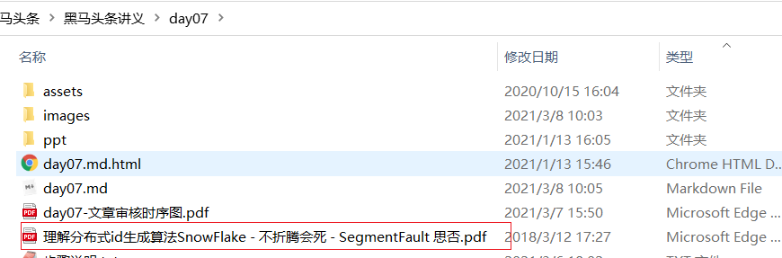


mybatisplus已经为我们提供了该主键的生成策略，可以直接使用，对于文章来讲，可能文章的数据是特别的多，所以文章信息我们可以采用此种解决方案。

使用步骤很简单 如下两个步骤即可：

```properties
1. 定义生成的策略

2. 在微服务中进行配置
```


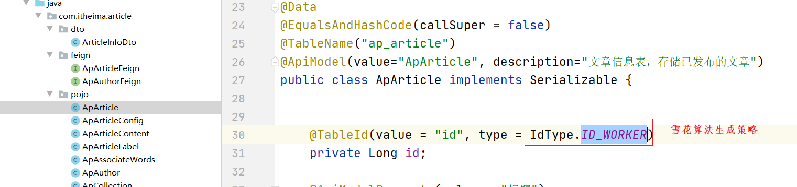


在article微服务中配置 datacenterid和workid

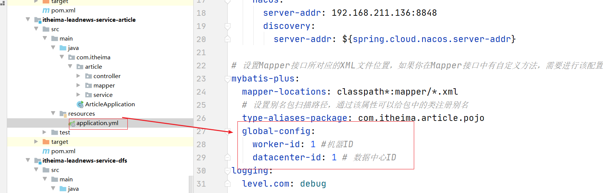


## 4  人工审核文章

### 4.1 需求分析

自媒体文章如果没有自动审核成功，而是到了人工审核（自媒体文章状态为3），需要在admin端人工处理文章的审核

如图所示：

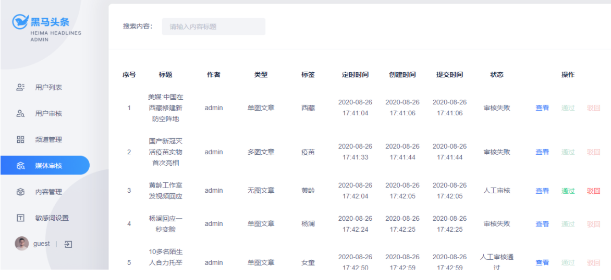

```
管理员后台 可以查看 【人工审核中】和【审核失败】状态下的文章信息，并且可以通过操作界面对某一个文章进行审核通过,和驳回。也就是审核失败。
```

需求如下:

```properties
1 根据条件分页查询自媒体文章数据 前提条件 是查询人工审核中 或者 审核失败状态下的文章信息
2 查询文章的详情信息
3 通过审核 
4 驳回审核
```


### 4.2 功能实现分析

分析如下：

```properties
由于有了admin网关 我们可以直接通过admin网关进行路由到自媒体微服务将数据列出返回即可。在这个查询的过程中由于需求中需要有作者信息 那么就需要联合查询到对应的作者名称。而作者名称就是自媒体用户的名称。

1.根据标题进行分页查询 自媒体文章信息 并且包含 人工审核中和审核失败的文章
2.审核通过
3.审核失败
4.查看文章的详情（需要作者的信息，之前的写好的功能中没有作者信息）
```

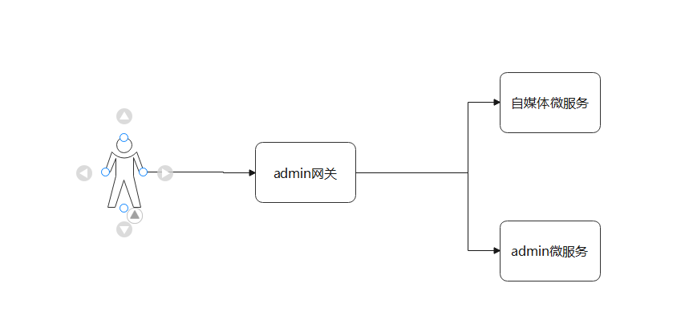

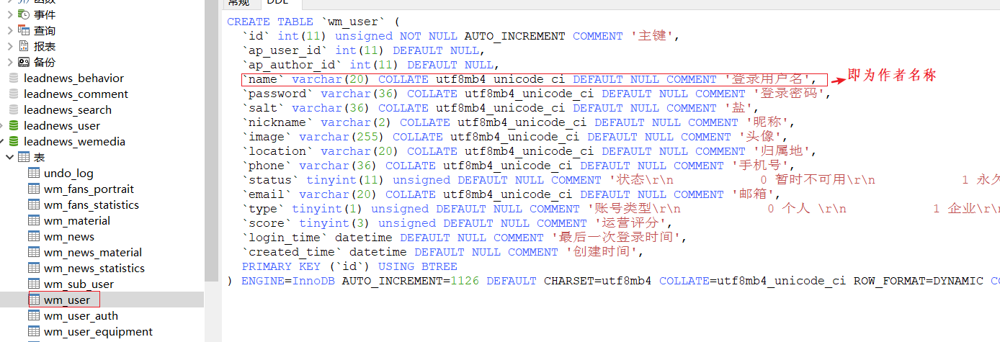


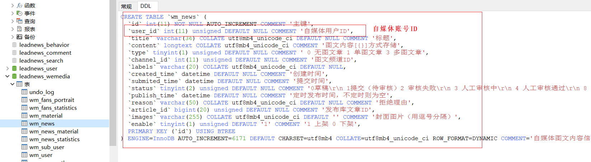


### 4.3 功能实现

#### 4.3.1 条件分页查询功能实现

步骤：

```properties
创建VO
创建controller 实现条件分页查询以及查询
创建service
创建mapper  
```

(1) 创建VO 用于给前端进行展示 需要添加一些必要的字段

```java
@Data
@Setter
@Getter
public class WmNewsVo extends WmNews {
    //作者名称
    private String authorName;
}
```


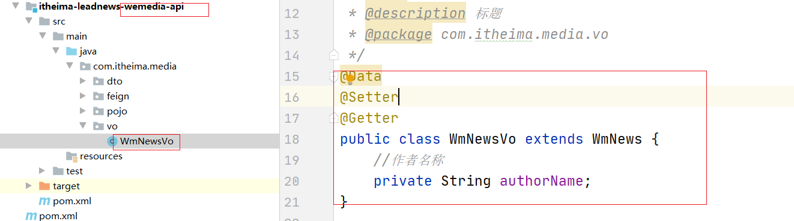

(2)创建controller 进行创建方法

```java
//条件分页列表查询
@PostMapping("/vo/search")
public Result<PageInfo<WmNewsVo>> searchByCondition(@RequestBody PageRequestDto<WmNews> pageRequestDto){
    //1.获取条件
    //2.执行
    PageInfo<WmNewsVo> pageInfo = wmNewsService.pageForCondition(pageRequestDto);
    //4.返回结果
    return Result.ok(pageInfo);
}
```


(3)创建service实现类

```java
@Override
    public PageInfo<WmNewsVo> pageForCondition(PageRequestDto<WmNews> pageRequestDto) {

        String title ="";
        if (pageRequestDto.getBody()!=null && !StringUtils.isEmpty(pageRequestDto.getBody().getTitle())) {
            title = "%"+pageRequestDto.getBody().getTitle()+"%";
        }
        Long page = pageRequestDto.getPage();
        Long size = pageRequestDto.getSize();
        //开始位置
        Long start = (page-1)*size;
        //每页显示的行
        List<WmNewsVo> wmNewsVos = wmNewsMapper.selectMyPage(start,size,title);

        Long total = wmNewsMapper.selectMyCount(title);
        //计算总页数
        Long totalPages = total / size;
        if (total % size != 0) {
            totalPages++;
        }

        PageInfo<WmNewsVo> pageInfo = new PageInfo<WmNewsVo>(page,size,total,totalPages,wmNewsVos);

        return pageInfo;
    }
```

(4)mapper接口创建

```java
public interface WmNewsMapper extends BaseMapper<WmNews> {

    List<WmNewsVo> selectMyPage(@Param(value="start") Long start, @Param(value="size")Long size, @Param(value="title")String title);

    Long selectMyCount(@Param(value="title") String title);
}
```


(5)创建XML映射文件

```xml
<?xml version="1.0" encoding="UTF-8"?>
<!DOCTYPE mapper PUBLIC "-//mybatis.org//DTD Mapper 3.0//EN" "http://mybatis.org/dtd/mybatis-3-mapper.dtd">
<mapper namespace="com.itheima.media.mapper.WmNewsMapper">

    <select id="selectMyPage" resultType="com.itheima.media.vo.WmNewsVo" parameterType="map">
        SELECT
        wn.*, wu.`name` as authorName
        FROM
            wm_news wn
        LEFT JOIN wm_user wu ON wn.user_id = wu.id
        <where>
            <if test="title!=null and title!=''">
                and wn.title LIKE #{title}
            </if>
            and wn.status in (2,3)
        </where>
        LIMIT #{start}, #{size}
    </select>
    <select id="selectMyCount" resultType="java.lang.Long" parameterType="string">
        SELECT count(*)
        FROM
            wm_news wn
        LEFT JOIN wm_user wu ON wn.user_id = wu.id
        <where>
            <if test="title!=null and title!=''">
                and wn.title LIKE #{title}
            </if>
            and wn.status in (2,3)
        </where>
    </select>
</mapper>

```

 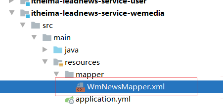


(6)配置admin网关路由 

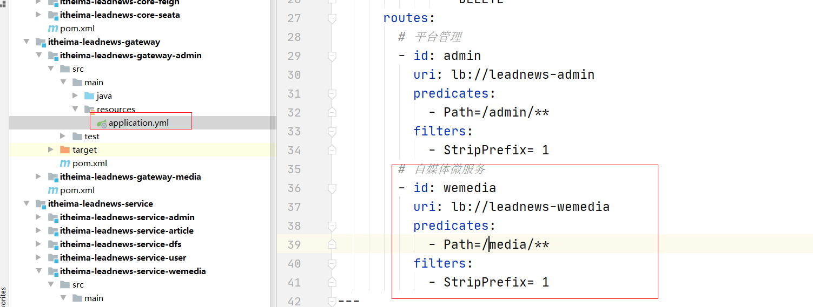

整体配置yaml如下：

```yaml
spring:
  profiles:
    active: dev
---
server:
  port: 6001
spring:
  application:
    name: leadnews-admin-gateway
  profiles: dev
  cloud:
    nacos:
      server-addr: 192.168.211.136:8848
      discovery:
        server-addr: ${spring.cloud.nacos.server-addr}
    gateway:
      globalcors:
        cors-configurations:
          '[/**]': # 匹配所有请求
            allowedOrigins: "*" #跨域处理 允许所有的域
            allowedHeaders: "*"
            allowedMethods: # 支持的方法
              - GET
              - POST
              - PUT
              - DELETE
      routes:
        # 平台管理
        - id: admin
          uri: lb://leadnews-admin
          predicates:
            - Path=/admin/**
          filters:
            - StripPrefix= 1
        # 自媒体微服务
        - id: wemedia
          uri: lb://leadnews-wemedia
          predicates:
            - Path=/media/**
          filters:
            - StripPrefix= 1
---
server:
  port: 6001
spring:
  application:
    name: leadnews-admin-gateway
  profiles: test
  cloud:
    nacos:
      server-addr: 192.168.211.136:8848
      discovery:
        server-addr: ${spring.cloud.nacos.server-addr}
    gateway:
      globalcors:
        cors-configurations:
          '[/**]': # 匹配所有请求
            allowedOrigins: "*" #跨域处理 允许所有的域
            allowedHeaders: "*"
            allowedMethods: # 支持的方法
              - GET
              - POST
              - PUT
              - DELETE
      routes:
        # 平台管理
        - id: admin
          uri: lb://leadnews-admin
          predicates:
            - Path=/admin/**
          filters:
            - StripPrefix= 1
        # 自媒体微服务
        - id: wemedia
          uri: lb://leadnews-wemedia
          predicates:
            - Path=/media/**
          filters:
            - StripPrefix= 1
---
server:
  port: 6001
spring:
  application:
    name: leadnews-admin-gateway
  profiles: pro
  cloud:
    nacos:
      server-addr: 192.168.211.136:8848
      discovery:
        server-addr: ${spring.cloud.nacos.server-addr}
    gateway:
      globalcors:
        cors-configurations:
          '[/**]': # 匹配所有请求
            allowedOrigins: "*" #跨域处理 允许所有的域
            allowedHeaders: "*"
            allowedMethods: # 支持的方法
              - GET
              - POST
              - PUT
              - DELETE
      routes:
        # 平台管理
        - id: admin
          uri: lb://leadnews-admin
          predicates:
            - Path=/admin/**
          filters:
            - StripPrefix= 1
        # 自媒体微服务
        - id: wemedia
          uri: lb://leadnews-wemedia
          predicates:
            - Path=/media/**
          filters:
            - StripPrefix= 1
```


#### 4.3.2 实现文章审核通过和驳回

 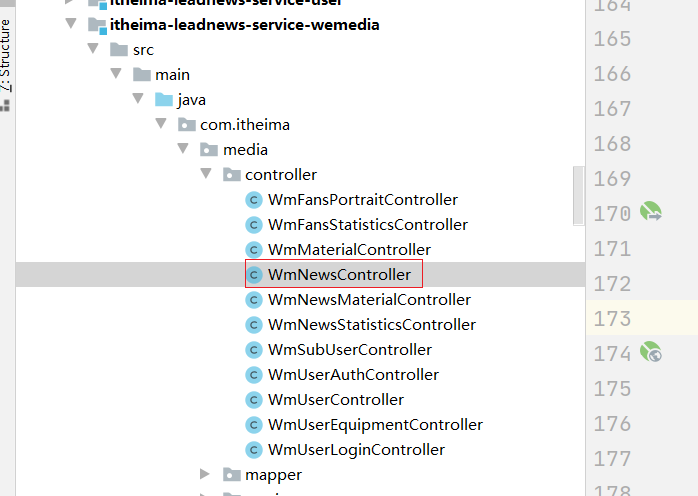

```java
@Autowired
private WmUserService wmUserService;
//审核通过 或者 驳回  8 标识通过  2 标识驳回
@PutMapping("/updateStatus/{id}/{status}")
public Result updateStatus(@PathVariable(name="id")Integer id,@PathVariable(name="status") Integer status){
    if(status==8 || status==2){
        WmNews wmNews = new WmNews();
        wmNews.setId(id);
        wmNews.setStatus(status);
        wmNewsService.updateById(wmNews);
        return Result.ok();
    }else{
        return Result.errorMessage("错误的状态值");
    }
}
```

#### 4.3.3 实现文章详情查询

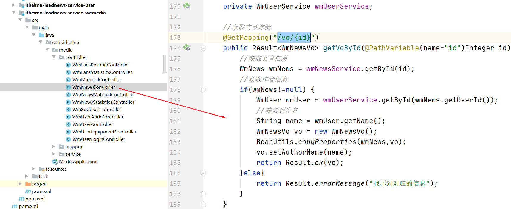

```java
@Autowired
private WmUserService wmUserService;
@GetMapping("/vo/{id}")
public Result<WmNewsVo> getVoById(@PathVariable(name="id")Integer id){
    //获取文章信息
    WmNews wmNews = wmNewsService.getById(id);
    //获取作者信息
    if(wmNews!=null) {
        WmUser wmUser = wmUserService.getById(wmNews.getUserId());
        //获取到作者
        String name = wmUser.getName();
        WmNewsVo vo = new WmNewsVo();
        BeanUtils.copyProperties(wmNews,vo);
        vo.setAuthorName(name);
        return Result.ok(vo);
    }else{
        return Result.errorMessage("找不到对应的信息");
    }
}
```


### 4.4 测试

**查询测试**：

启动微服务 和网关

先登录，

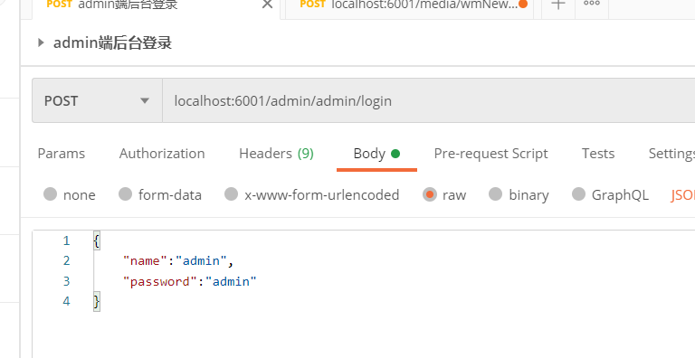

再实现查询：

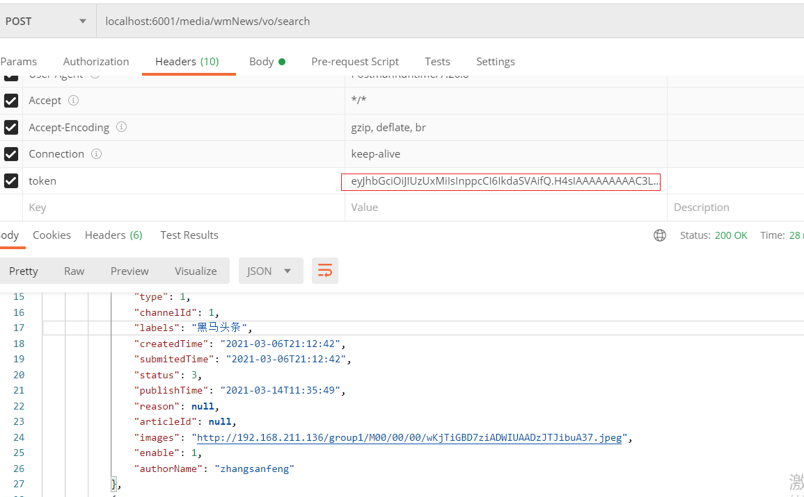


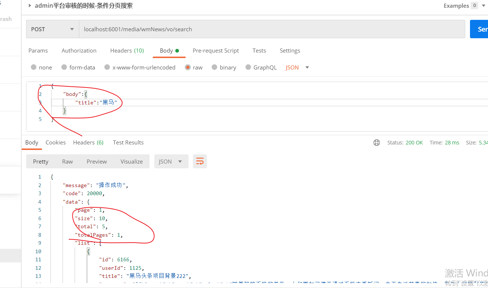


驳回或者审核通过测试 以及查看文章详情测试（略）。