# 第八章 分布式任务调度&人工审核

## 目标

- 能够理解什么是分布式任务调度
- 能够掌握xxl-job的基本使用
- 能够使用xxl-job解决黑马头条项目中定时任务的功能
- 能够完成自媒体端文章上下架同步的问题

## 1 分布式任务调度

首先我们有一个问题：就是当我们的自媒体文章进行了审核之后，有一个状态：8，它还不能发布。那什么时候发布呢？有如下两种情况业务逻辑：

```properties
1. 如果发布时间为空 ，则应当立即发布即可（当然这个在进行人工审核通过的时候也可以做）
2. 如果发布时间不为空，则要判断当前时间 是否超过或者=发布时间 如果是 则发布 如果不是则不发布。
```

以上的逻辑该什么时候执行呢？这个时候可以使用定时任务，我们可以每隔一段时间进行扫描，扫描之后进行执行以上的逻辑。

接下来我们来学习分布式任务调度：查看如下文档

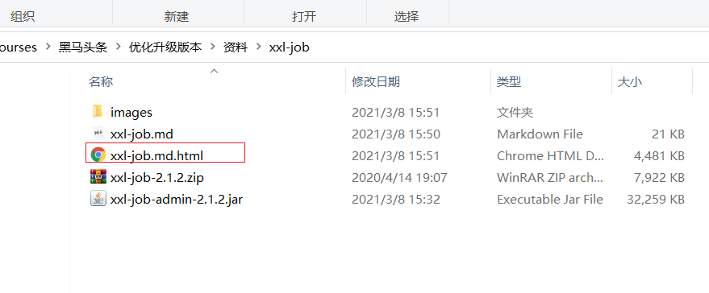

## 2 自媒体文章审核-定时任务扫描待发布文章

### 2.1 需求分析

- 前期回顾：在自媒体文章审核的时候，审核通过后，判断了文章的发布时间大于当前时间，这个时候并没有真正的发布文章，而是把文章的状态设置为了8（审核通过待发布）
- 定时任务的作用就是每分钟去扫描这些待发布的文章，如果当前文章的状态为8，并且发布时间小于=当前时间的，立刻发布当前文章

### 2.2 自媒体文章数据准备


### 2.3 xxl-job调度中心创建调度任务

（1）新建执行器，原则上一个项目一个执行器，方便管理，这里我们编辑下即可

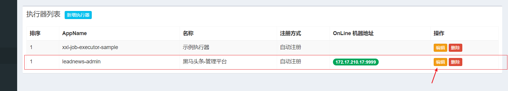

（2）新建任务

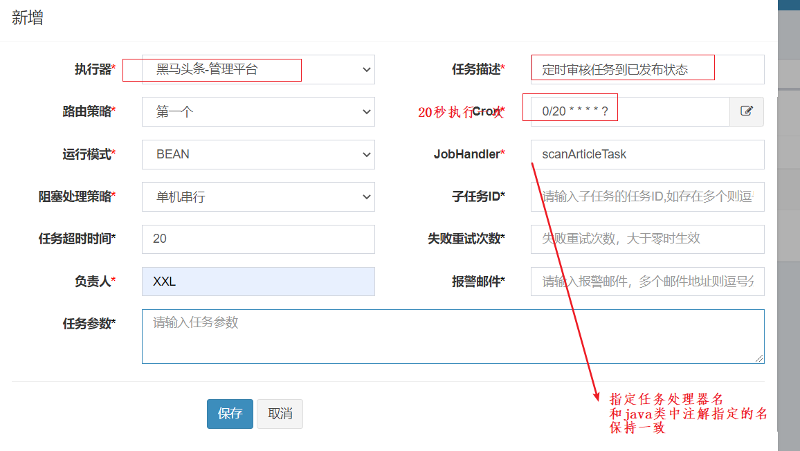

### 2.4 项目集成到黑马头条中

集成功能已经在另外一个学习xxl-job的讲义中实现了。

### 2.5 创建调度任务，定时审核

#### 2.5.1 分析

 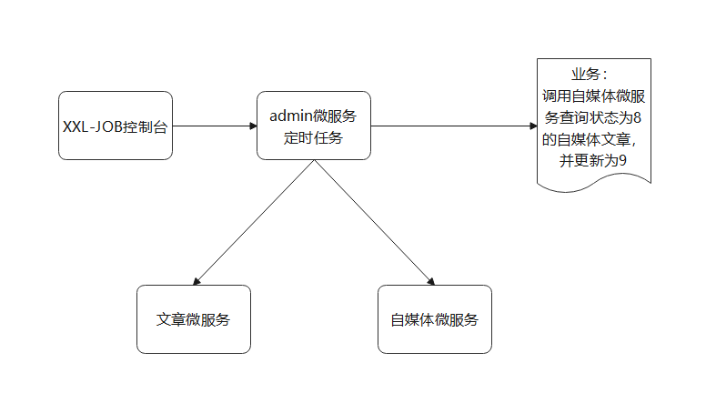

```properties
核心逻辑：定时任务 扫描状态为8的自媒体文章，并判断当前时间和该文章的发布时间是否对应，如果对应则 更新状态为9，并创建文章信息到文章微服务中。

1.查询状态为8的自媒体文章信息
2.判断发布时间 是否有值
	2.1 如果有值 则判断当前时间是否大于等于发布时间，如果是 则更新自媒体文章状态为9，并保存文章信息到文章微服务中。
	2.2 如果没有值，则更新发布时间，将自媒体文章的状态更新为9 并保存文章信息到文章微服务中。
```


#### 2.5.2 功能实现

(1)创建任务,查询自媒体文章后进行审核

```java
package com.itheima.admin.task;

import com.itheima.admin.service.WemediaNewsAutoScanService;
import com.itheima.media.feign.WmNewsFeign;
import com.itheima.media.pojo.WmNews;
import com.xxl.job.core.biz.model.ReturnT;
import com.xxl.job.core.handler.annotation.XxlJob;
import org.springframework.beans.factory.annotation.Autowired;
import org.springframework.stereotype.Component;

import java.time.LocalDateTime;
import java.util.Date;
import java.util.List;

/**
 * @author ljh
 * @version 1.0
 * @date 2021/7/16 14:33
 * @description 标题
 * @package com.itheima.admin.task
 */
@Component
public class ScanTask {

    @Autowired
    private WmNewsFeign wmNewsFeign;

    @Autowired
    private WemediaNewsAutoScanService wemediaNewsAutoScanService;


    //处理业务 注解中写的是任务的名称
    @XxlJob("scanArticleTask")
    public ReturnT<String> handlerScanTask(String param) throws Exception {
        //1.查询所有的状态为8 的自媒体文章的列表
        List<WmNews> wmNewsList = wmNewsFeign.findByStatus(8);
        if(wmNewsList !=null && wmNewsList.size()>0)
        for (WmNews wmNews : wmNewsList) {
            //2.判断当前时间 是否》= 发布时间 如果是 则进行更新为9  并保存文章到文章微服务中

            //发布时间为空 可能是就是人工审核后的数据
            if (wmNews.getPublishTime()==null) {
                //直接修改状态
                WmNews record= new WmNews();
                record.setId(wmNews.getId());
                record.setStatus(9);
                wmNewsFeign.updateByPrimaryKey(record);
                //保存文章的数据
                wmNews.setPublishTime(LocalDateTime.now());
                wemediaNewsAutoScanService.createArticleInfoData(wmNews);


            }else{
                //
                LocalDateTime now = LocalDateTime.now();
                Date date = new Date();
                //当前时间是否>=发布时间
                if(now.isAfter(wmNews.getPublishTime()) || now.isEqual(wmNews.getPublishTime())){
                    //直接修改状态
                    WmNews record= new WmNews();
                    record.setId(wmNews.getId());
                    record.setStatus(9);
                    wmNewsFeign.updateByPrimaryKey(record);
                    //保存文章的数据
                    wemediaNewsAutoScanService.createArticleInfoData(wmNews);
                }else {
                    System.out.println("还没到时间 不做处理");
                }

            }
        }

        return ReturnT.SUCCESS;

    }


}

```

 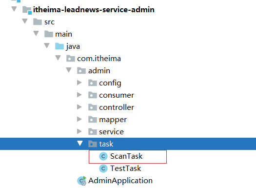

(2)封装保存文章信息到文章微服务的方法

创建接口：

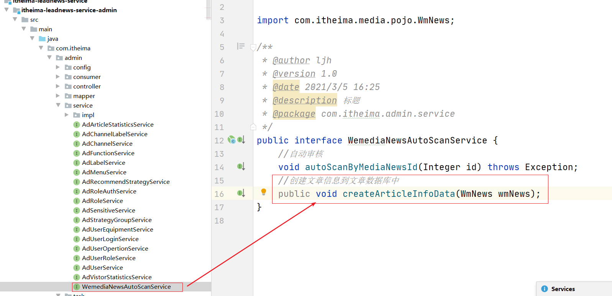

实现类：

```java
 @Override
    public void createArticleInfoData(WmNews wmNews) {
        //4.保存文章相关信息 并进行状态同步 涉及到三个表 article article_content article_config
        ArticleInfoDto articleInfoDto = new ArticleInfoDto();

        ApArticle article = new ApArticle();

        //该值有可能为null
        if (wmNews.getArticleId() != null) {
            article.setId(wmNews.getArticleId());
        }
        article.setTitle(wmNews.getTitle());
        //根据自媒体账号获取作者信息
        //自媒体账号ID
        ApAuthor apAuthor = apAuthorFeign.getByWmUserId(wmNews.getUserId());
        if (apAuthor != null) {
            article.setAuthorId(apAuthor.getId());
            article.setAuthorName(apAuthor.getName());
        }
        //获取频道
        AdChannel adChannel = adChannelService.getById(wmNews.getChannelId());
        if (adChannel != null) {
            article.setChannelId(adChannel.getId());
            article.setChannelName(adChannel.getName());
        }
        //文章布局
        article.setLayout(wmNews.getType());
        //普通文章
        article.setFlag(0);

        article.setImages(wmNews.getImages());

        article.setLabels(wmNews.getLabels());

        if (wmNews.getPublishTime() != null) {
            article.setPublishTime(wmNews.getPublishTime());
        }
        //同步状态
        article.setSyncStatus(wmNews.getStatus());
        articleInfoDto.setApArticle(article);


        ApArticleConfig articleConfig = new ApArticleConfig();
        //设置默认值
        articleConfig.setIsDown(0);
        //设置默认值
        articleConfig.setIsDelete(0);

        articleInfoDto.setApArticleConfig(articleConfig);


        ApArticleContent articleContent = new ApArticleContent();
        //内容
        articleContent.setContent(wmNews.getContent());

        articleInfoDto.setApArticleContent(articleContent);

        //获取到文章的ID
        Result<ApArticle> resultApArticle = apArticleFeign.save(articleInfoDto);

        ApArticle data = resultApArticle.getData();
        //判断如果 传递过来的articleID有值则不用再次更新 todo
        //获取ID 更新到自媒体表当中
        Long articleId = data.getId();
        WmNews record = new WmNews();
        record.setId(wmNews.getId());
        record.setArticleId(articleId);
        wmNewsFeign.updateByPrimaryKey(record);

        //保存数据到ES中
       /* ArticleInfoDocument articleInfoDocument = JSON.parseObject(JSON.toJSONString(data), ArticleInfoDocument.class);
        try {
            articleDocumentSearchFeign.saveToEs(articleInfoDocument);
        } catch (Exception e) {
            e.printStackTrace();
        }*/
    }
```

 

由于自动审核的代码中也有 创建文章信息，所以将其代码抽取出来，直接调用新写的方法，如下图：


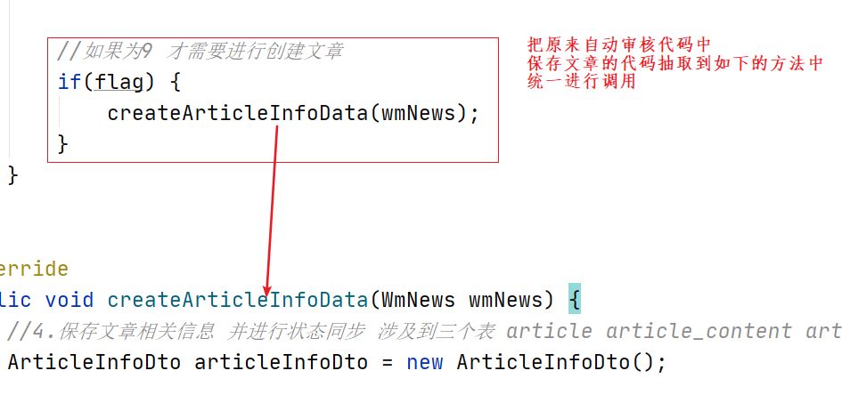

(3)修改feign:

```java
@FeignClient(name="leadnews-wemedia",path = "/wmNews",contextId ="wmNews")
public interface WmNewsFeign extends CoreFeign<WmNews> {
    @GetMapping("/list/{status}")
    public List<WmNews> findByStatus(@PathVariable(name = "status") Integer status) ;
}
```

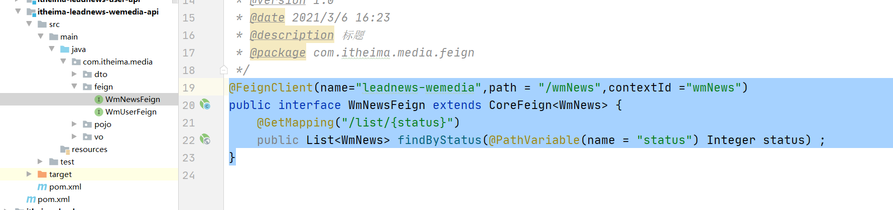


修改自媒体微服务中controller 用于实现feign接口：

```java
@GetMapping("/list/{status}")
public List<WmNews> findByStatus(@PathVariable(name = "status") Integer status) {
    QueryWrapper<WmNews> queryWrapper = new QueryWrapper<WmNews>();
    queryWrapper.eq("status",status);
    List<WmNews> list = wmNewsService.list(queryWrapper);
    return list;
}
```

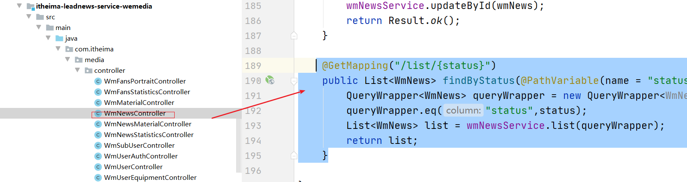


### 2.6 测试

启动微服务，并在 调度中心操作上选启动

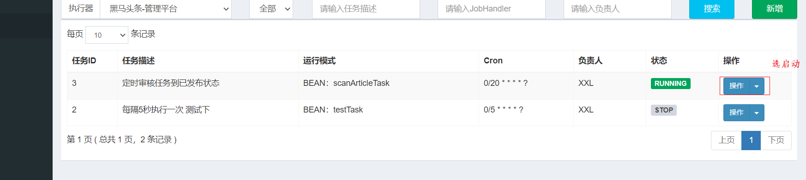


## 3 同步文章信息

### 3.1 需求和思路

需求：

```properties
当第五天我们做了自媒体的文章上下架的时候，也需要对文章微服务中的文章配置信息表中的状态进行更新同步。
```

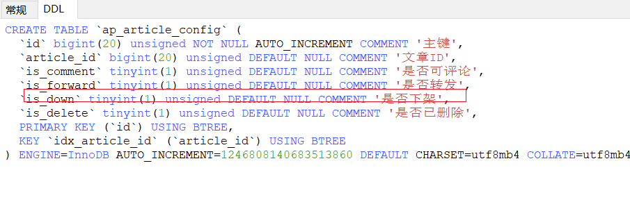

思路：自媒体文章上下架同步文章配置

 

```properties
自媒体文章上下架的时候 发送消到kafka 文章微服务接收消息之后 获取到操作类型：下架或上架 然后进行更新即可
```


### 3.2 功能实现

#### 3.2.1 实现上下架同步文章信息-生产者

(1)添加常量值 

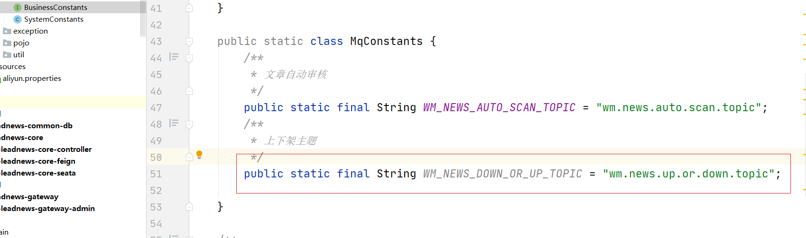

```java
/**
         * 上下架主题
         */
public static final String WM_NEWS_DOWN_OR_UP_TOPIC = "wm.news.up.or.down.topic";

```

(2)发送消息

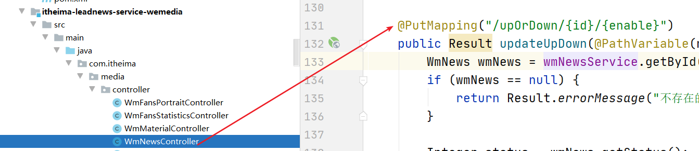

```java
if(flag){
    Map<String,String> msgMap = new HashMap<String,String>();
    msgMap.put("type",String.valueOf(enable));//操作类型 0 标识下架 1 标识上架
    msgMap.put("articleId",String.valueOf(wmNews.getArticleId()));
    kafkaTemplate.send(BusinessConstants.MqConstants.WM_NEWS_DOWN_OR_UP_TOPIC, JSON.toJSONString(msgMap));
}
```

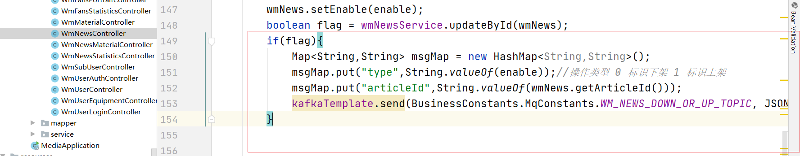


#### 3.2.2 实现上下架同步文章信息-消费者端

(1)添加依赖：在文章微服务中添加依赖

```xml
<!-- kafka依赖 begin -->
<dependency>
    <groupId>org.springframework.kafka</groupId>
    <artifactId>spring-kafka</artifactId>
</dependency>
<dependency>
    <groupId>org.springframework.kafka</groupId>
    <artifactId>spring-kafka-test</artifactId>
    <scope>test</scope>
</dependency>
```

(2)application.yml配置消费者组和监听的ip和端口

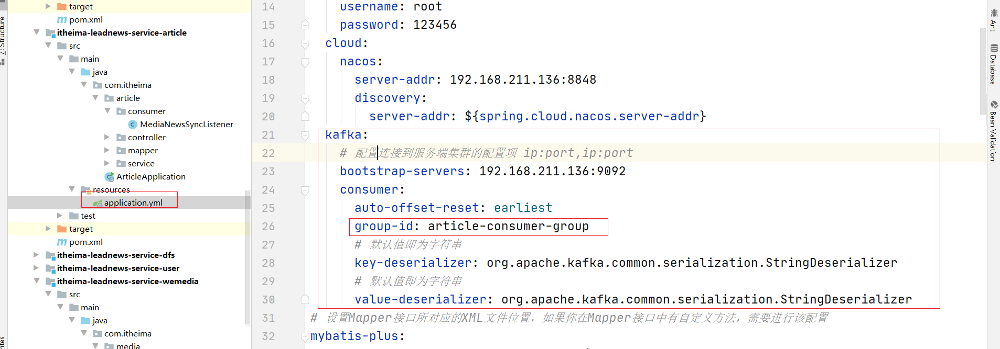

```yaml
spring:
  profiles:
    active: dev
---
server:
  port: 9003
spring:
  application:
    name: leadnews-article
  profiles: dev
  datasource:
    driver-class-name: com.mysql.jdbc.Driver
    url: jdbc:mysql://192.168.211.136:3306/leadnews_article?useSSL=false&useUnicode=true&characterEncoding=UTF-8&serverTimezone=&serverTimezone=Asia/Shanghai
    username: root
    password: 123456
  cloud:
    nacos:
      server-addr: 192.168.211.136:8848
      discovery:
        server-addr: ${spring.cloud.nacos.server-addr}
  kafka:
    # 配置连接到服务端集群的配置项 ip:port,ip:port
    bootstrap-servers: 192.168.211.136:9092
    consumer:
      auto-offset-reset: earliest
      group-id: article-consumer-group
      # 默认值即为字符串
      key-deserializer: org.apache.kafka.common.serialization.StringDeserializer
      # 默认值即为字符串
      value-deserializer: org.apache.kafka.common.serialization.StringDeserializer
# 设置Mapper接口所对应的XML文件位置，如果你在Mapper接口中有自定义方法，需要进行该配置
mybatis-plus:
  mapper-locations: classpath*:mapper/*.xml
  # 设置别名包扫描路径，通过该属性可以给包中的类注册别名
  type-aliases-package: com.itheima.article.pojo
  global-config:
    worker-id: 1 #机器ID
    datacenter-id: 1 # 数据中心ID

logging:
  level.com: debug

---
server:
  port: 9003
spring:
  application:
    name: leadnews-user
  profiles: pro
  datasource:
    driver-class-name: com.mysql.jdbc.Driver
    url: jdbc:mysql://192.168.211.136:3306/leadnews_article?useSSL=false&useUnicode=true&characterEncoding=UTF-8&serverTimezone=&serverTimezone=Asia/Shanghai
    username: root
    password: 123456
  cloud:
    nacos:
      server-addr: 192.168.211.136:8848
      discovery:
        server-addr: ${spring.cloud.nacos.server-addr}
  kafka:
    # 配置连接到服务端集群的配置项 ip:port,ip:port
    bootstrap-servers: 192.168.211.136:9092
    consumer:
      auto-offset-reset: earliest
      group-id: article-consumer-group
      # 默认值即为字符串
      key-deserializer: org.apache.kafka.common.serialization.StringDeserializer
      # 默认值即为字符串
      value-deserializer: org.apache.kafka.common.serialization.StringDeserializer
# 设置Mapper接口所对应的XML文件位置，如果你在Mapper接口中有自定义方法，需要进行该配置
mybatis-plus:
  mapper-locations: classpath*:mapper/*.xml
  # 设置别名包扫描路径，通过该属性可以给包中的类注册别名
  type-aliases-package: com.itheima.article.pojo
  global-config:
    worker-id: 1 #机器ID
    datacenter-id: 1 # 数据中心ID
---
server:
  port: 9003
spring:
  application:
    name: leadnews-user
  profiles: test
  datasource:
    driver-class-name: com.mysql.jdbc.Driver
    url: jdbc:mysql://192.168.211.136:3306/leadnews_article?useSSL=false&useUnicode=true&characterEncoding=UTF-8&serverTimezone=Asia/Shanghai
    username: root
    password: 123456
  cloud:
    nacos:
      server-addr: 192.168.211.136:8848
      discovery:
        server-addr: ${spring.cloud.nacos.server-addr}
  kafka:
    # 配置连接到服务端集群的配置项 ip:port,ip:port
    bootstrap-servers: 192.168.211.136:9092
    consumer:
      auto-offset-reset: earliest
      group-id: article-consumer-group
      # 默认值即为字符串
      key-deserializer: org.apache.kafka.common.serialization.StringDeserializer
      # 默认值即为字符串
      value-deserializer: org.apache.kafka.common.serialization.StringDeserializer
# 设置Mapper接口所对应的XML文件位置，如果你在Mapper接口中有自定义方法，需要进行该配置
mybatis-plus:
  mapper-locations: classpath*:mapper/*.xml
  # 设置别名包扫描路径，通过该属性可以给包中的类注册别名
  type-aliases-package: com.itheima.article.pojo
  global-config:
    worker-id: 1 #机器ID
    datacenter-id: 1 # 数据中心ID
```


(3)编写监听类

```java
package com.itheima.article.consumer;

import com.alibaba.fastjson.JSON;
import com.itheima.article.service.ApArticleConfigService;
import com.itheima.common.constants.BusinessConstants;
import org.apache.kafka.clients.consumer.ConsumerRecord;
import org.springframework.beans.factory.annotation.Autowired;
import org.springframework.kafka.annotation.KafkaListener;
import org.springframework.stereotype.Component;

import java.util.Map;

@Component
public class MediaNewsSyncListener {

    @Autowired
    private ApArticleConfigService apArticleConfigService;


    //监听主题
    @KafkaListener(topics = BusinessConstants.MqConstants.WM_NEWS_DOWN_OR_UP_TOPIC)
    public void recevieMessage(ConsumerRecord<?,?> record){
        if(record!=null){
            //获取到消息
            String value = (String) record.value();
            //进行更新
            Map<String,String> map = JSON.parseObject(value, Map.class);
            //0 下架 1 上架
            String type = map.get("type");
            Integer isDown=0;
            if(Integer.valueOf(type)==0){
                isDown=1;//为下架
            }
            String articleId = map.get("articleId");
            apArticleConfigService.updateByArticleId(Long.valueOf(articleId),isDown);
        }
    }
}
```

(4)创建service和实现类

```java
public interface ApArticleConfigService extends IService<ApArticleConfig> {
    //上架下架更新
    public void updateByArticleId(Long articleId, Integer isDown);
}
```

```java
@Service
public class ApArticleConfigServiceImpl extends ServiceImpl<ApArticleConfigMapper, ApArticleConfig> implements ApArticleConfigService {

    @Autowired
    private ApArticleConfigMapper apArticleConfigMapper;

    @Override
    public void updateByArticleId(Long articleId, Integer isDown) {
        apArticleConfigMapper.updateByArticleId(articleId,isDown);
    }
}
```


(5)修改mapper

```java
public interface ApArticleConfigMapper extends BaseMapper<ApArticleConfig> {

   @Update(value="update ap_article_config set is_down=#{isDown} where article_id=#{articleId}")
    void updateByArticleId(@Param(value="articleId") Long articleId, @Param(value="isDown")Integer isDown);
}
```

#### 3.2.3 测试

略