# 第九章 app端基本功能展示

## 目标

- 能够完成app端文章列表展示功能开发
- 能够完成app端文章详情的功能开发
- 能够掌握解决long类型丢失精度的问题
- 能够完成app端登录的功能
- 能够掌握关注作者功能

## 1 app端-文章列表

### 1.1 需求分析

在手机端可以查看文章信息

 

分析

```properties
1. 默认的情况下 查询 10条 在默认的频道（就是没有频道）查询出 按照发布时间倒序排列的文章数据
2. 当往下滑动时，则重新获取最新的数据，即在手机顶部
3. 当往上滑动时，则获取更多的数据

实际上：就是根据条件分页查询而已，当下滑时，重新获取第一页的数据进行展示 ，上滑动时，就是获取下一页的数据
```

下滑：

 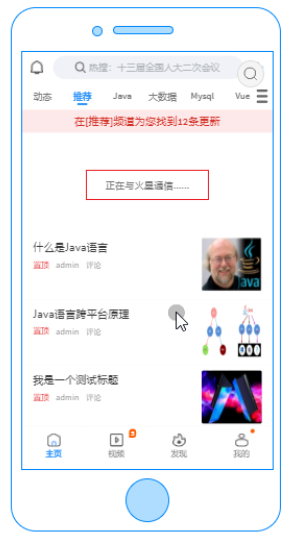


上滑：

 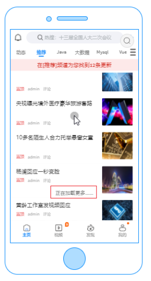

### 1.2功能实现

#### 1.2.1 实现思路分析

```properties
前端发送请求 并传递参数：包括 分页的当前页码 和 每页显示的行 以及 频道的ID 
后台接收请求和参数并执行分页查询 返回结果即可
```

 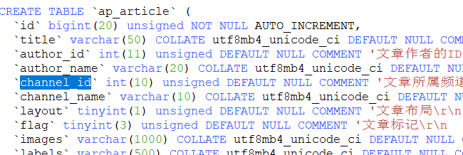

 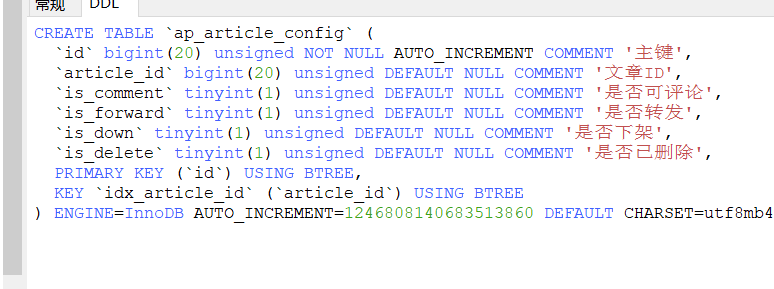

需要涉及到以上两个表 需要关联表查询

#### 1.2.1 功能实现操作

实际上咱们之前已经实现了分页查询了，不需要再实现了，但是之前的实现功能不能满足我们的需求，所以我们重新进行构建。

（1）创建controller

```java
//有条件的 分页 排序查询
    @PostMapping("/searchOrder")
    public Result<PageInfo<ApArticle>> searchOrder(@RequestBody PageRequestDto<ApArticle> pageRequestDto){
        //1.获取当前页码 和 每页显示的行
        if (pageRequestDto.getSize()>10) {
            //设置最多为10
            pageRequestDto.setSize(10L);
        }
        if (pageRequestDto.getPage()<=0) {
            //设置为第一个页
            pageRequestDto.setPage(1L);
        }
        //3.执行分页查询
        PageInfo<ApArticle> pageInfo =   apArticleService.pageByOrder(pageRequestDto);
        return Result.ok(pageInfo);
    }
```

(2)创建service及实现类

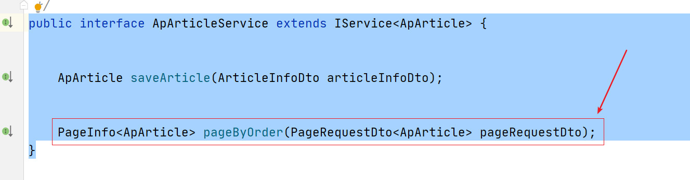


```java
@Override
public PageInfo<ApArticle> pageByOrder(PageRequestDto<ApArticle> pageRequestDto) {
    Long page = pageRequestDto.getPage();
    Long size = pageRequestDto.getSize();
    ApArticle body = pageRequestDto.getBody();
    //如果为空 则创建 并赋值为0 标识查询所有频道列表信息
    if(body!=null && body.getChannelId()!=null){

    }else{
        body = new ApArticle();
        //查询所有频道
        body.setChannelId(0);
    }
    Long start = (page-1)*size;
    List<ApArticle> apArticleList = apArticleMapper.pageByOrder(start,size,body.getChannelId());
    Long total = apArticleMapper.selectArticleCount(body.getChannelId());
    Long totalPages = total/size;
    if(total%size>0){
        totalPages++;
    }
    return new PageInfo<ApArticle>(page,size,total,totalPages,apArticleList);
}
```

(3)创建mapper

```java
public interface ApArticleMapper extends BaseMapper<ApArticle> {

    List<ApArticle> pageByOrder(@Param(value="start") Long start, @Param(value="size")Long size, @Param(value="channelId")Integer channelId);


    Long selectArticleCount(@Param(value="channelId")Integer channelId);
}
```

(4)创建文件

 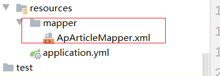

（5）添加SQL语句

```xml
<?xml version="1.0" encoding="UTF-8" ?>
<!DOCTYPE mapper PUBLIC "-//mybatis.org//DTD Mapper 3.0//EN" "http://mybatis.org/dtd/mybatis-3-mapper.dtd" >
<mapper namespace="com.itheima.article.mapper.ApArticleMapper">

    <select id="selectArticleCount" resultType="java.lang.Long" parameterType="java.lang.Integer">
        SELECT
        count(*)
        FROM
        ap_article aa
        LEFT JOIN ap_article_config ac ON aa.id = ac.article_id
        <where>
            AND ac.is_delete = 0
            AND ac.is_down = 0

            <if test="channelId!=null and channelId !=0">
                AND aa.channel_id=#{channelId}
            </if>

        </where>

    </select>
    <select id="pageByOrder" resultType="com.itheima.article.pojo.ApArticle" parameterType="map">
        SELECT
            aa.*
        FROM
            ap_article aa
        LEFT JOIN ap_article_config ac ON aa.id = ac.article_id
        <where>
            AND ac.is_delete = 0
            AND ac.is_down = 0

            <if test="channelId!=null and channelId !=0">
                AND aa.channel_id=#{channelId}
            </if>

        </where>
        ORDER BY
            aa.publish_time DESC
        LIMIT #{start},#{size}
    </select>
</mapper>
```


测试：

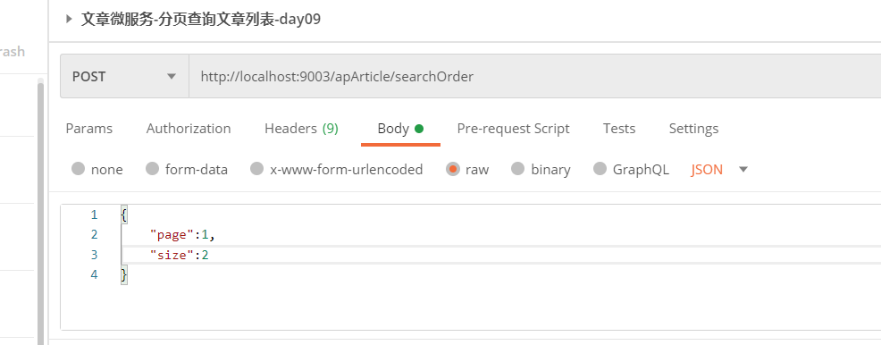

## 2 App端网关搭建

（1）参考其他的网关，新建模块，名称：

（2）pom文件：

```xml
<?xml version="1.0" encoding="UTF-8"?>
<project xmlns="http://maven.apache.org/POM/4.0.0"
         xmlns:xsi="http://www.w3.org/2001/XMLSchema-instance"
         xsi:schemaLocation="http://maven.apache.org/POM/4.0.0 http://maven.apache.org/xsd/maven-4.0.0.xsd">
    <parent>
        <artifactId>itheima-leadnews-gateway</artifactId>
        <groupId>com.itheima</groupId>
        <version>1.0-SNAPSHOT</version>
    </parent>
    <modelVersion>4.0.0</modelVersion>

    <artifactId>itheima-leadnews-gateway-app</artifactId>

    <dependencies>
        <dependency>
            <groupId>org.springframework.cloud</groupId>
            <artifactId>spring-cloud-starter-gateway</artifactId>
        </dependency>
        <dependency>
            <groupId>com.alibaba.cloud</groupId>
            <artifactId>spring-cloud-starter-alibaba-nacos-discovery</artifactId>
        </dependency>
        <dependency>
            <groupId>com.itheima</groupId>
            <artifactId>itheima-leadnews-common</artifactId>
            <version>1.0-SNAPSHOT</version>
            <exclusions>
                <exclusion>
                    <groupId>org.springframework.boot</groupId>
                    <artifactId>spring-boot-starter-web</artifactId>
                </exclusion>
            </exclusions>
        </dependency>
    </dependencies>
</project>
```

（3）application.yml

```yaml
spring:
  profiles:
    active: dev
---
server:
  port: 6003
spring:
  application:
    name: leadnews-app-gateway
  profiles: dev
  cloud:
    nacos:
      server-addr: 192.168.211.136:8848
      discovery:
        server-addr: ${spring.cloud.nacos.server-addr}
    gateway:
      globalcors:
        cors-configurations:
          '[/**]': # 匹配所有请求
            allowedOrigins: "*" #跨域处理 允许所有的域
            allowedHeaders: "*"
            allowedMethods: # 支持的方法
              - GET
              - POST
              - PUT
              - DELETE
      routes:
        # 文章微服务
        - id: article
          uri: lb://leadnews-article
          predicates:
            - Path=/article/**
          filters:
            - StripPrefix= 1
---
server:
  port: 6003
spring:
  application:
    name: leadnews-app-gateway
  profiles: test
  cloud:
    nacos:
      server-addr: 192.168.211.136:8848
      discovery:
        server-addr: ${spring.cloud.nacos.server-addr}
    gateway:
      globalcors:
        cors-configurations:
          '[/**]': # 匹配所有请求
            allowedOrigins: "*" #跨域处理 允许所有的域
            allowedHeaders: "*"
            allowedMethods: # 支持的方法
              - GET
              - POST
              - PUT
              - DELETE
      routes:
        # 文章微服务
        - id: article
          uri: lb://leadnews-article
          predicates:
            - Path=/article/**
          filters:
            - StripPrefix= 1
---
server:
  port: 6003
spring:
  application:
    name: leadnews-app-gateway
  profiles: pro
  cloud:
    nacos:
      server-addr: 192.168.211.136:8848
      discovery:
        server-addr: ${spring.cloud.nacos.server-addr}
    gateway:
      globalcors:
        cors-configurations:
          '[/**]': # 匹配所有请求
            allowedOrigins: "*" #跨域处理 允许所有的域
            allowedHeaders: "*"
            allowedMethods: # 支持的方法
              - GET
              - POST
              - PUT
              - DELETE
      routes:
        # 文章微服务
        - id: article
          uri: lb://leadnews-article
          predicates:
            - Path=/article/**
          filters:
            - StripPrefix= 1
```

（4）引导类：

```java
@SpringBootApplication
@EnableDiscoveryClient
public class GatewayAppApplication {
    public static void main(String[] args) {
        SpringApplication.run(GatewayAppApplication.class,args);
    }
}

```

 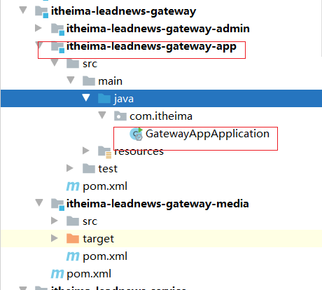


## 4 app文章详情展示

### 4.1 app文章详情-需求分析

 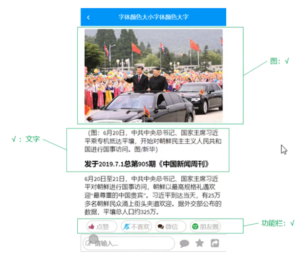

​	在文章列表中点击文章进入到文章详情查看页面，页面显示内容包括：标题、作者、作者头像、发布时间、是否关注、喜欢、不喜欢、分享、评论、收藏、转发、猜你喜欢、打赏等内容。除此之外还需收集用户打开页面时间、阅读次数、阅读百分比等信息。

### 4.2 app文章详情-思路分析

​	文章详情所展示的主要是文章的内容，这个时候无须再次加重ap_article表中的数据，只需要通过前端传递过来的文章id去查询文章的内容即可，同时需要判断当前文章是否已上架和是否已经删除。

由分析得出，主要是通过文章id查询ap_article_content和ap_article_config表的数据即可。

ap_article_content  --> app文章内容表


ap_article_config  --> app文章配置表


### 4.3 App文章详情-功能实现

​	根据文章的ID 获取到文章内容和文章的配置信息 合并之后 返回给前端即可。为此我们可以使用之前用过的一个dto如下：

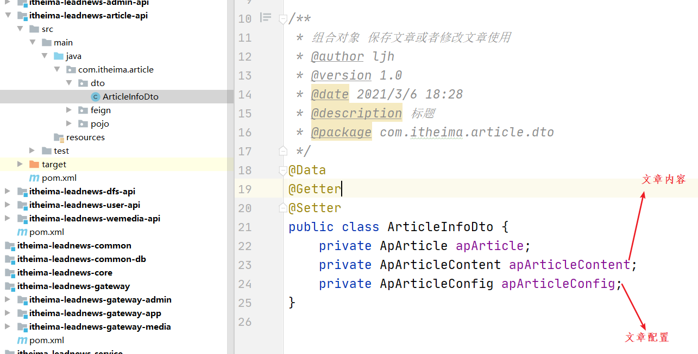

前端获取到该POJO对应个各个属性中的值，即可

#### 4.3.1 controller

```java
@GetMapping("/detail/{articleId}")
    public Result<ArticleInfoDto> detailByArticleId(@PathVariable(name="articleId") Long articleId){
        ArticleInfoDto articleInfoDto = apArticleService.detailByArticleId(articleId);
        return Result.ok(articleInfoDto);
    }
```

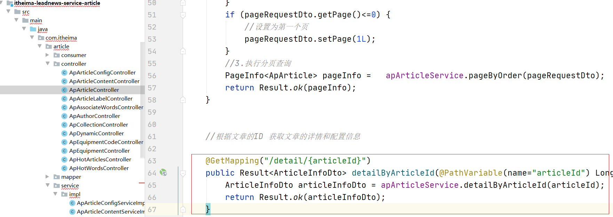


#### 4.3.2 service

```java
@Override
public ArticleInfoDto detailByArticleId(Long articleId) {
    //1.根据articleId 获取文章详情内容
    QueryWrapper<ApArticleContent> queryWrapper1 = new QueryWrapper();
    queryWrapper1.eq("article_id",articleId);

    ApArticleContent articleContent = apArticleContentMapper.selectOne(queryWrapper1);
    //2.获取articleId 获取文章配置信息
    QueryWrapper<ApArticleConfig> queryWrapper2 = new QueryWrapper();
    queryWrapper2.eq("article_id",articleId);
    queryWrapper2.eq("is_down",0);
    queryWrapper2.eq("is_delete",0);
    ApArticleConfig apArticleConfig = apArticleConfigMapper.selectOne(queryWrapper2);
    //3.合并返回
    ArticleInfoDto articleInfoDto = new ArticleInfoDto();
    articleInfoDto.setApArticleContent(articleContent);
    articleInfoDto.setApArticleConfig(apArticleConfig);
    return articleInfoDto;
}
```

#### 4.3.5 测试

​	目前文章id为long类型，在转换json传递到前端以后精度丢失，POSTMAN测试是可以的，所以需要将数据转换成字符串返回给前端即可。也就是在后台返回给前端的时候 默认的情况下是由JACKSON进行转换成JSON的，但是数据还是Long类型所以给前端变成了丢失精度。


### 4.4 Long类型转换精度丢失问题解决

#### 4.4.1 解决方案分析：

​	在后台返回给前端的时候 默认的情况下是由JACKSON进行转换成JSON的，但是数据还是Long类型所以给前端变成了丢失精度。只要在后台返回给前端的时候数据为字符串就可以解决这个问题了。


由此我们可以采用的方式有多种方式：

```
1. 全局设置  全局设置 之后 所有的返回给前端都是返回了字符串
2. 局部设置一个序列化器 在哪里使用哪里添加即可
```

那么我们可以采用第二种 使用自定义序列化器，当某一个字段需要使用到的时候，可以通过注解进行定义即可。jackson已经提供了现有的注解，可以直接使用。

```java
@JsonSerialize(using = 你自定义的序列化器.class)
private Long articleId;
```


第一种：大家可以参考如下**(暂时不用)**

```java
package com.itheima.common.jackson;

import com.fasterxml.jackson.databind.ser.std.ToStringSerializer;
import org.springframework.boot.autoconfigure.jackson.Jackson2ObjectMapperBuilderCustomizer;
import org.springframework.context.annotation.Bean;
import org.springframework.context.annotation.Configuration;
import org.springframework.http.converter.json.Jackson2ObjectMapperBuilder;

@Configuration
public class JacksonConfig {
	/**
	 * Jackson全局转化long类型为String，解决jackson序列化时传入前端Long类型缺失精度问题
	 */
	@Bean
	public Jackson2ObjectMapperBuilderCustomizer jackson2ObjectMapperBuilderCustomizer() {
		Jackson2ObjectMapperBuilderCustomizer cunstomizer = new Jackson2ObjectMapperBuilderCustomizer() {
			@Override
			public void customize(Jackson2ObjectMapperBuilder jacksonObjectMapperBuilder) {
				//变成字符串
				jacksonObjectMapperBuilder.serializerByType(Long.class, ToStringSerializer.instance);
			}
		};
		return cunstomizer;
	}
}
```


#### 4.4.2 实现操作

（1）定义序列化器

```java
package com.itheima.common.util;

import com.fasterxml.jackson.core.JsonGenerator;
import com.fasterxml.jackson.databind.JsonSerializer;
import com.fasterxml.jackson.databind.SerializerProvider;

import java.io.IOException;

/**
 * 自定义序列化器 将Long类型数据转成String
 */
public class Long2StringSerializer extends JsonSerializer<Long> {
    @Override
    public void serialize(Long value, JsonGenerator gen, SerializerProvider serializers) throws IOException {
        if(value!=null){
            gen.writeString(value.toString());
        }

    }
}
```

（2）在字段中进行使用

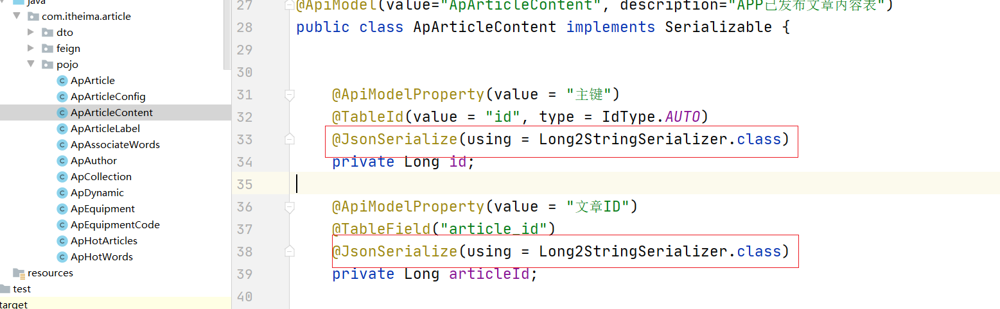

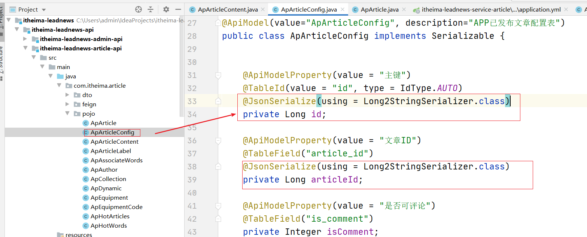

如果其他的地方也需要，则可以根据需要添加注解即可。


测试:

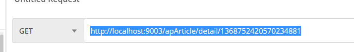

先进过controller 再经过转换器

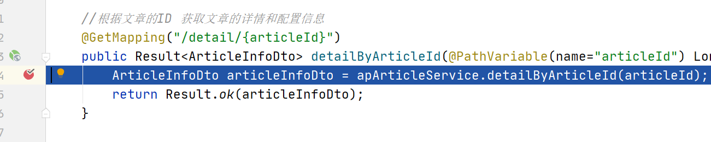


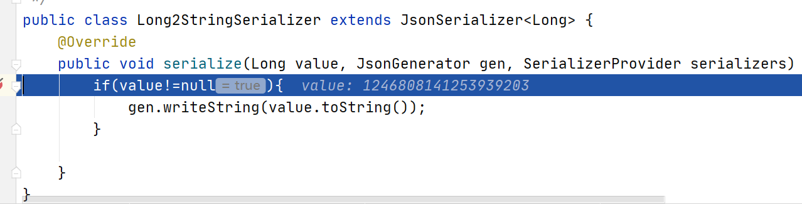

## 5 app端登录功能

### 5.1 app端登录-需求分析

- 点击**登录**可以根据app端的手机号和密码进行登录
- 点击**不登录，先看看**可以在无登录状态下进入app

 


app前端项目启动完成后，直接点击**不登录，先看看**即可，就可以直接跳转到文章列表首页：

 


### 5.2 app端登录-思路分析

概念介绍：**用户设备**，即当前用户所使用的终端设备。 在进行登录或者不登录看一看操作的时候 可以传递给后台，后台接收之后做一些业务处理。这个后面再说。对应的dto有一个设备的ID 需要注意下。

1，用户点击**登录**

- 根据标记值为1 时，并且用户输入手机号和密码到后端进行校验，校验成功生成token返给前端
- 其他请求需要带着token到app网关去校验jwt,校验成功，放行

2，用户点击**不登录，先看看**

- 标记值为0时,生成固定的Token 设置jwt存储的id为0
- 其他请求需要带着token到app网关去校验jwt,校验成功，放行

 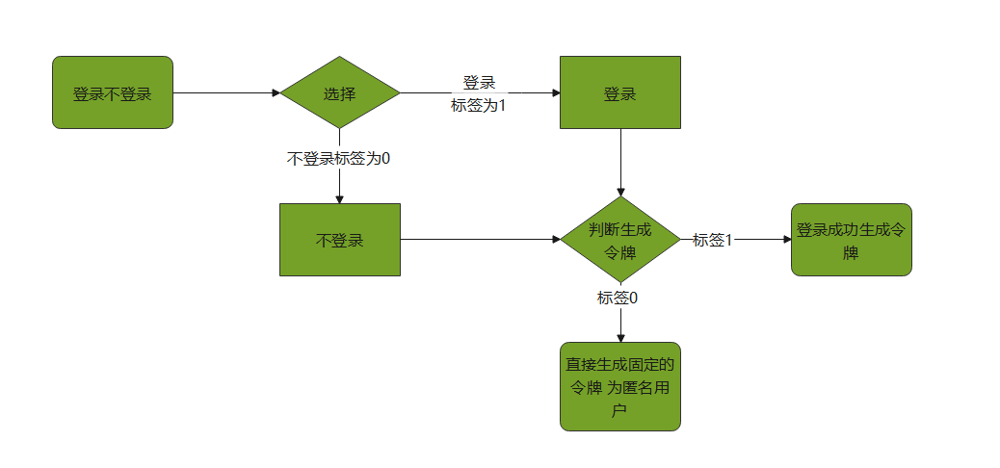


### 5.3 app端登录-功能实现

#### 5.3.1 需求分析

```properties
跟之前的网关的功能实现差不多
先经过网关 判断 如果是有令牌 则放行，如果是没有令牌 则去登录 
登录完成之后返回令牌 再次登录即可。
```

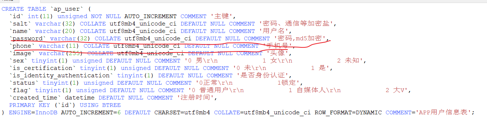


#### 5.3.2 创建dto

```java
@Data
@Getter
@Setter
public class LoginDto {
    //设备id
    private Integer equipmentId;

    //0 表示 不登录先看看   1表示 需要登录 默认为 1
    private Integer flag = 1;

    //手机号
    private String phone;

    //密码
    private String password;
}
```

 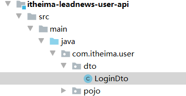

#### 5.3.3 controller

```java
package com.itheima.user.controller;

import com.itheima.common.pojo.Result;
import com.itheima.common.util.AppJwtUtil;
import com.itheima.user.dto.LoginDto;
import com.itheima.user.service.ApUserService;
import org.springframework.beans.factory.annotation.Autowired;
import org.springframework.util.DigestUtils;
import org.springframework.util.StringUtils;
import org.springframework.web.bind.annotation.PostMapping;
import org.springframework.web.bind.annotation.RequestBody;
import org.springframework.web.bind.annotation.RequestMapping;
import org.springframework.web.bind.annotation.RestController;

import java.util.HashMap;
import java.util.Map;

/**
 * @author ljh
 * @version 1.0
 * @date 2021/2/22 15:37
 * @description 标题
 * @package com.itheima.admin.controller
 */
@RestController
@RequestMapping("/app")
public class LoginController {

    @Autowired
    private ApUserService apUserService;

    /**
     * 用户登录
     *
     * @param appUser 接收手机和密码以及设备ID
     * @return
     */
    @PostMapping("/login")
    public Result login(@RequestBody LoginDto appUser) {
        //不登录先看看
        if (appUser.getFlag() == 0) {
            //生成令牌
            Map<String, Object> info = new HashMap<>();
            //默认设置为 0
            String token = AppJwtUtil.createToken(0L);
            info.put("token", token);
            return Result.ok(info);
        } else {
            //要登录
            if (StringUtils.isEmpty(appUser.getPhone()) || StringUtils.isEmpty(appUser.getPassword())) {
                return Result.errorMessage("用户名或密码不能为空");
            }
            //校验用户名和密码
            Map<String, Object> info = apUserService.login(appUser);
            if (info == null) {
                return Result.errorMessage("用户名或密码错误");
            }
            return Result.ok(info);
        }

    }

    public static void main(String[] args) {
        String s = DigestUtils.md5DigestAsHex(("admin" + "").getBytes());
        System.out.println(s);
    }
}

```

#### 5.3.4 service

接口对应实现类

```java
@Service
public class ApUserServiceImpl extends ServiceImpl<ApUserMapper, ApUser> implements ApUserService {

    @Autowired
    private ApUserMapper apUserMapper;

    @Override
    public Map<String, Object> login(LoginDto appUser) {
        //根据用户名获取到用户信息
        QueryWrapper<ApUser> querywrapper = new QueryWrapper<ApUser>() ;
        querywrapper.eq("phone",appUser.getPhone());
        //获取到数据库中的用户
        ApUser user = apUserMapper.selectOne(querywrapper);
        //再获取用户表中的盐值
        if(user==null){
            return null;
        }
        String salt = user.getSalt();
        String password = DigestUtils.md5DigestAsHex((appUser.getPassword() + salt).getBytes());
        //传递过来的密码和数据库中的密码进行匹配
        if(!password.equals(user.getPassword())){
            return null;
        }
        //登录成功
        Map<String,Object> info = new HashMap<>();
        String token = AppJwtUtil.createToken(user.getId().longValue());
        info.put("token",token);
        //密码不要设置
        user.setPassword("");
        info.put("user",user);
        return info;
    }
}
```

#### 5.3.5 网关配置及校验

（1）参考其他的网关系统创建过滤器实现业务逻辑.

```java
package com.itheima.gatewayapp;

import com.itheima.common.constants.SystemConstants;
import com.itheima.common.util.AppJwtUtil;
import io.jsonwebtoken.Claims;
import org.springframework.cloud.gateway.filter.GatewayFilterChain;
import org.springframework.cloud.gateway.filter.GlobalFilter;
import org.springframework.core.Ordered;
import org.springframework.http.HttpStatus;
import org.springframework.http.server.reactive.ServerHttpRequest;
import org.springframework.http.server.reactive.ServerHttpResponse;
import org.springframework.stereotype.Component;
import org.springframework.util.StringUtils;
import org.springframework.web.server.ServerWebExchange;
import reactor.core.publisher.Mono;

@Component
public class AuthorizeFilter implements GlobalFilter, Ordered {
    @Override
    public Mono<Void> filter(ServerWebExchange exchange, GatewayFilterChain chain) {
        //1.获取请求对象和响应对象
        ServerHttpRequest request = exchange.getRequest();
        ServerHttpResponse response = exchange.getResponse();
        //2.判断当前的请求是否为登录，如果是，直接放行
        if(request.getURI().getPath().contains("/app/login")){
            //放行
            return chain.filter(exchange);
        }

        //3.获取当前用户的请求头jwt信息
        //请求头的名称为token
        String jwtToken = request.getHeaders().getFirst("token");

        //4.判断当前令牌是否存在
        if(StringUtils.isEmpty(jwtToken)){
            //如果不存在，向客户端返回错误提示信息
            response.setStatusCode(HttpStatus.UNAUTHORIZED);
            return response.setComplete();
        }

        try {
            //5.如果令牌存在，解析jwt令牌，判断该令牌是否合法，如果不合法，则向客户端返回错误信息
            int result = AppJwtUtil.verifyToken(jwtToken);

            if(result== SystemConstants.JWT_OK){
                //解析数据
                Claims claimsBody = AppJwtUtil.getClaimsBody(jwtToken);
                //设置登录的用户的ID 头名为userId中并下发到下游微服务
                //exchange.getRequest().mutate().header("userId",claimsBody.get("id").toString());
                exchange.getRequest().mutate().header(SystemConstants.USER_HEADER_NAME,claimsBody.get("id").toString());
            }else {
                response.setStatusCode(HttpStatus.UNAUTHORIZED);
                return response.setComplete();
            }
        }catch (Exception e){
            e.printStackTrace();
            //想客户端返回错误提示信息
            response.setStatusCode(HttpStatus.UNAUTHORIZED);
            return response.setComplete();
        }


        //6.放行
        return chain.filter(exchange);
    }

    /**
     * 优先级设置
     * 值越小，优先级越高
     * @return
     */
    @Override
    public int getOrder() {
        return 0;
    }
}
```


 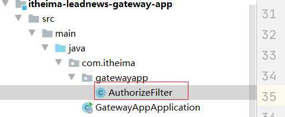


（2）配置yaml 路由到user微服务

 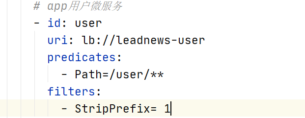

```yaml
spring:
  profiles:
    active: dev
---
server:
  port: 6003
spring:
  application:
    name: leadnews-app-gateway
  profiles: dev
  cloud:
    nacos:
      server-addr: 192.168.211.136:8848
      discovery:
        server-addr: ${spring.cloud.nacos.server-addr}
    gateway:
      globalcors:
        cors-configurations:
          '[/**]': # 匹配所有请求
            allowedOrigins: "*" #跨域处理 允许所有的域
            allowedHeaders: "*"
            allowedMethods: # 支持的方法
              - GET
              - POST
              - PUT
              - DELETE
      routes:
        # 文章微服务
        - id: article
          uri: lb://leadnews-article
          predicates:
            - Path=/article/**
          filters:
            - StripPrefix= 1
        # app用户微服务
        - id: user
          uri: lb://leadnews-user
          predicates:
            - Path=/user/**
          filters:
            - StripPrefix= 1
---
server:
  port: 6003
spring:
  application:
    name: leadnews-app-gateway
  profiles: test
  cloud:
    nacos:
      server-addr: 192.168.211.136:8848
      discovery:
        server-addr: ${spring.cloud.nacos.server-addr}
    gateway:
      globalcors:
        cors-configurations:
          '[/**]': # 匹配所有请求
            allowedOrigins: "*" #跨域处理 允许所有的域
            allowedHeaders: "*"
            allowedMethods: # 支持的方法
              - GET
              - POST
              - PUT
              - DELETE
      routes:
        # 文章微服务
        - id: article
          uri: lb://leadnews-article
          predicates:
            - Path=/article/**
          filters:
            - StripPrefix= 1
        # app用户微服务
        - id: user
          uri: lb://leadnews-user
          predicates:
            - Path=/user/**
          filters:
            - StripPrefix= 1
---
server:
  port: 6003
spring:
  application:
    name: leadnews-app-gateway
  profiles: pro
  cloud:
    nacos:
      server-addr: 192.168.211.136:8848
      discovery:
        server-addr: ${spring.cloud.nacos.server-addr}
    gateway:
      globalcors:
        cors-configurations:
          '[/**]': # 匹配所有请求
            allowedOrigins: "*" #跨域处理 允许所有的域
            allowedHeaders: "*"
            allowedMethods: # 支持的方法
              - GET
              - POST
              - PUT
              - DELETE
      routes:
        # 文章微服务
        - id: article
          uri: lb://leadnews-article
          predicates:
            - Path=/article/**
          filters:
            - StripPrefix= 1
        # app用户微服务
        - id: user
          uri: lb://leadnews-user
          predicates:
            - Path=/user/**
          filters:
            - StripPrefix= 1
```


测试：如果设置为0 则登录为匿名用户

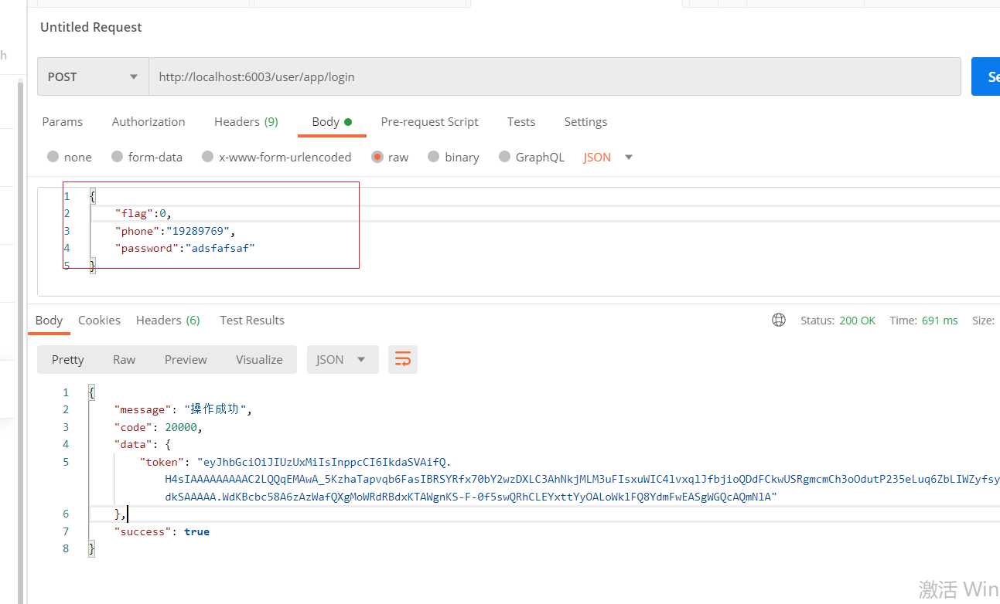


## 6 app端-关注作者或取消关注

### 6.1 需求分析

 

如上效果：

当前登录后的用户可以关注作者，也可以取消关注作者

### 6.2 思路分析

一个用户关注了作者，作者是由用户实名认证以后开通的作者权限，才有了作者信息，作者肯定是app中的一个用户。

从用户的角度出发：一个用户可以关注其他多个作者

从作者的角度出发：一个用户（同是作者）也可以拥有很多个粉丝

实现步骤：

> 1 前端传递作者id获取作者信息，最终获取中作者在当前app端的账号id
>
> 2 如果是关注操作，需要保存数据，用户保存关注的作者，作者保存当前的粉丝
>
> 2.1 异步记录关注行为（后面开发，为了推荐做准备）
>
> 3 如果是取消关注，删除用户关注的作者，删除作者当前的粉丝

流程分析：


- app端关注信息表

  记录了当前登录用户和关注人（作者）的关系，方便当前用户查看关注的作者

- app端用户粉丝表

  记录了作者与粉丝的关系，方便作者查看自己的粉丝，同时当前作者也是app中的一个用户


- app用户表与app作者表是一对一关系，只有在用户认证以后才会有作者出现
- app用户表与app用户关注表是一对多的关系，一个用户可以关注多个作者
- app用户表与app用户粉丝表是一对多的关系，一个用户可以拥有多个粉丝


 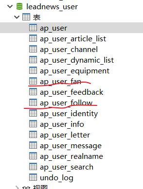


 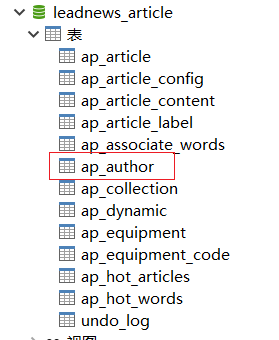


ap_user_follow   APP用户关注信息表


ap_user_fan  APP用户粉丝信息表


### 6.3 功能实现

#### 6.3.1 需求分析

需求是需要实现两个功能：

```properties
1. app用户登录之后 关注某一个作者（该作者 也一定是APP用户）
2. app用户登录之后 可以取消关注一个作者（该作者 也一定是APP用户）

关注也好 取消关注也好 都要对 粉丝信息表 和 关注表 进行保存和删除关系。
```

步骤：

```properties
（1）定义DTO 设置需要传递给后台的参数属性 
（2）编写controller service mapper 实现相关的业务逻辑即可 注意需要判断权限
```

#### 6.3.2 功能实现

（1）创建dto

```java
@Data
@Setter
@Getter
public class UserRelationDto {

    // 文章作者ID
    Integer authorId;

    //作者名称
    String authorName;

    // 文章id
    Long articleId;
    /**
     * 操作方式
     * 1  关注
     * 0  取消
     */
    Integer operation;
}
```

 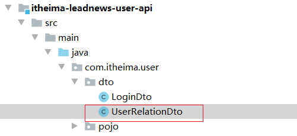


(2)添加一个枚举类型

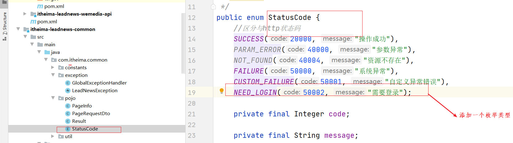

添加构造函数，如果有就不用添加了：如下

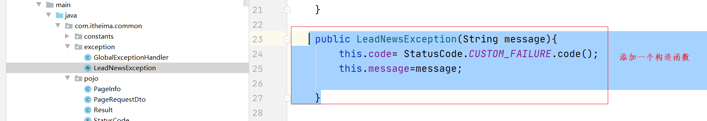


（3）再入下图位置修改 controller 

 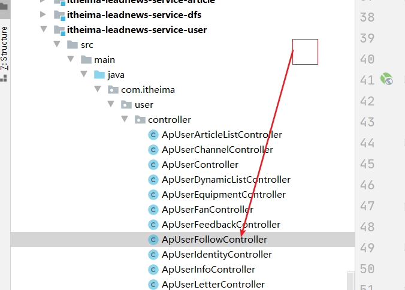

```java
//当前登录用户关注某一个作者 或者取消某一个作者
@PostMapping("/follow")
public Result follow(@RequestBody UserRelationDto relationDto) throws Exception {
    //1.先获取当前登录的用户 判断是否为0 如果为 0 则 为匿名用户 不能关注
    String userInfo = RequestContextUtil.getUserInfo();
    if (StringUtils.isEmpty(userInfo)) {
        //需要登录
        throw new LeadNewsException(StatusCode.NEED_LOGIN.code(), StatusCode.NEED_LOGIN.message());
    }
    //如果是0 则是匿名用户 也不能关注或者取消关注
    if (RequestContextUtil.isAnonymous()) {
        throw new LeadNewsException(StatusCode.NEED_LOGIN.code(), StatusCode.NEED_LOGIN.message());
    }
    if(relationDto==null){
        throw new LeadNewsException(StatusCode.CUSTOM_FAILURE.code(), "传递的参数有问题");
    }
    //2.能获取到登录用户 则 开始执行业务
    Integer currentUserId = Integer.valueOf(userInfo);
    apUserFollowService.followUserByWho(relationDto, currentUserId);
    return Result.ok();
}
```

requestcontextUtil类中添加工具方法：

```
  /**
     * 是否是匿名用户
     * @return
     */
    public static boolean isAnonymous(){
        return "0".equals(getUserInfo());
    }
```

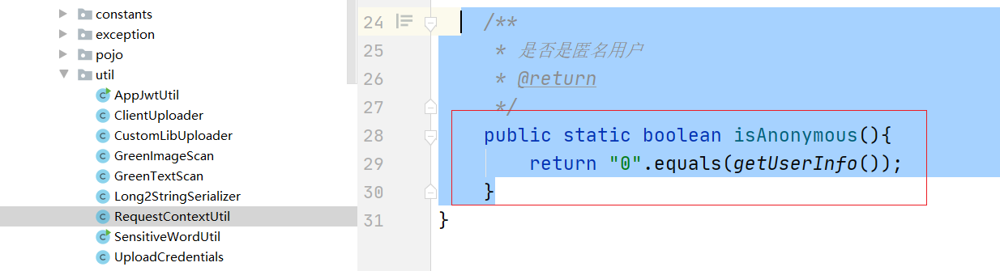


(4)修改service 

```java
public interface ApUserFollowService extends IService<ApUserFollow> {

    //取消关注和关注
    void followUserByWho(UserRelationDto relationDto, Integer currentUserId) throws Exception;
}
```

(5)修改service实现类

实现步骤如下：

```
1.判断条件检查参数
2.获取操作类型 要关注还是取消关注
3.根据文章ID 获取作者信息 并获取作者对应的APP userid的值
4.判断是否为关注 还是取消关注 如果是关注
	4.1先查询是否已有关注表记录
	4.2再查询是否有粉丝表记录
	4.3进行数据封装 最终存储到数据库表中即可
5.如果是取消关注
```


```java
@Service
public class ApUserFollowServiceImpl extends ServiceImpl<ApUserFollowMapper, ApUserFollow> implements ApUserFollowService {

    @Autowired
    private ApUserFollowMapper apUserFollowMapper;

    @Autowired
    private ApUserFanMapper apUserFanMapper;

    @Autowired
    private ApAuthorFeign apAuthorFeign;

    @Autowired
    private ApUserMapper apUserMapper;


    @Override
    @Transactional(rollbackFor = {Exception.class,LeadNewsException.class})
    public void followUserByWho(UserRelationDto relationDto, Integer currentUserId) throws Exception {
        //1.获取操作类型
        if (relationDto.getOperation() == null || relationDto.getOperation() < 0 || relationDto.getOperation() > 1) {
            throw new LeadNewsException("错误的操作类型");
        }
        if(StringUtils.isEmpty(relationDto.getAuthorId())){
            throw new LeadNewsException("作者ID不能为空");
        }
        //先根据作者的ID 获取用该作者对应的APP用户的ID 值 再进行操作
        ApAuthor data = apAuthorFeign.findById(relationDto.getAuthorId()).getData();

        if(data==null){
            throw new LeadNewsException("没有该作者");
        }
        //进行关注
        if (relationDto.getOperation() == 1) {
            //2.判断如果是关注 则需要保存数据到 follow和fan表中
            //2.1先查询是否有该记录在关注表，如果有就不需要再关注了 说明接口调用有业务流程的问题
            QueryWrapper<ApUserFollow> queryWrapper1 = new QueryWrapper<ApUserFollow>();
            queryWrapper1.eq("user_id",currentUserId);
            queryWrapper1.eq("follow_id",data.getUserId());
            ApUserFollow userFollow = apUserFollowMapper.selectOne(queryWrapper1);
            if(userFollow!=null){
                throw new LeadNewsException("关注表已经存在记录");
            }
            userFollow = new ApUserFollow();

            userFollow.setCreatedTime(LocalDateTime.now());
            //关注人
            userFollow.setUserId(currentUserId);
            //被关注人ID 作者对应的 appUserID的值
            userFollow.setFollowId(data.getUserId());
            //被关注人名称 作者对应的 appUser的名称 由于作者名称和appUser表中的名字一样，所以可以用他，页面传递过来作者名称即可
            userFollow.setFollowName(relationDto.getAuthorName());
            //暂时硬编码
            userFollow.setLevel(0);
            userFollow.setIsNotice(1);

            //2.2 添加至数据库中
            apUserFollowMapper.insert(userFollow);

            //2.3 查询 是否存在关联表 如果有 则说明已经存在 抛出异常，有问题
            QueryWrapper<ApUserFan> queryWrapper2 = new QueryWrapper<ApUserFan>();
            queryWrapper2.eq("user_id",data.getUserId());//作者对应的 APP用户的ID
            queryWrapper2.eq("fans_id",currentUserId);// 粉丝ID 就是当前的用户的ID

            ApUserFan apUserFan = apUserFanMapper.selectOne(queryWrapper2);
            if(apUserFan!=null){
                throw new LeadNewsException("粉丝表数据已经存在");
            }
            apUserFan = new ApUserFan();
            apUserFan.setCreatedTime(LocalDateTime.now());
            //作者对应的 APPUSER的id
            apUserFan.setUserId(data.getUserId());
            //作者粉丝的ID 就是当前用户
            apUserFan.setFansId(currentUserId);

            //粉丝的名称 即为当前用户的名称
            ApUser apUser = apUserMapper.selectById(currentUserId);
            if(apUser==null){
                throw new LeadNewsException("用户不存在");
            }
            apUserFan.setFansName(apUser.getName());

            apUserFan.setLevel(0);
            apUserFan.setIsDisplay(1);
            apUserFan.setIsShieldLetter(0);
            apUserFan.setIsShieldComment(0);
            apUserFanMapper.insert(apUserFan);

        } else {
            //3.判断如果是取消关注 则需要删除 fan follow中的关系数据
            QueryWrapper<ApUserFollow> queryWrapper1 = new QueryWrapper<ApUserFollow>();
            queryWrapper1.eq("user_id",currentUserId);
            queryWrapper1.eq("follow_id",data.getUserId());
            apUserFollowMapper.delete(queryWrapper1);

            QueryWrapper<ApUserFan> queryWrapper2 = new QueryWrapper<ApUserFan>();
            queryWrapper2.eq("user_id",data.getUserId());//作者对应的 APP用户的ID
            queryWrapper2.eq("fans_id",currentUserId);// 粉丝ID 就是当前的用户的ID
            apUserFanMapper.delete(queryWrapper2);

        }
    }
}
```

测试：

先登录，再测试

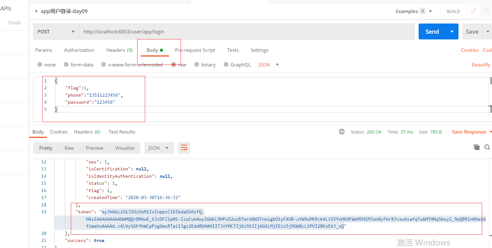

使用该token 通过app网关进行关注或者取消关注。

