# 第十章 app端用户行为处理

## 目标

- 能够理解app端的行为记录
- 能够完成作者关注行为的功能
- 能够完成文章点赞行为的功能
- 能够完成文章阅读行为的功能
- 能够掌握不喜欢和收藏功能的实现思路
- 能够完成app文章关系展示功能


## 1 app-用户操作行为记录

用户行为数据的记录包括了关注、点赞、不喜欢、收藏、阅读等行为

这些行为与当前app端的功能实现没有任何关系，即使没有行为数据，功能也不耽误实现，那为什么要做行为数据的保存呢？

黑马头条项目整个项目开发涉及web展示和大数据分析来给用户推荐文章，如何找出哪些文章是热点文章进行针对性的推荐呢？这个时候需要进行大数据分析的准备工作，埋点。

所谓“埋点”，是数据采集领域（尤其是用户行为数据采集领域）的术语，指的是针对特定用户行为或事件进行捕获、处理和发送的相关技术及其实施过程。比如用户某个icon点击次数、阅读文章的时长，观看视频的时长等等。

黑马头条课程里主要涉及到了关注行为，点赞行为，阅读行为的保存。其他类似于不喜欢、收藏功能可根据这些实现的功能自行实现。

### 1.1 行为微服务搭建

#### 1.1.1 创建行为微服务

处理行为是一个量比较大的操作，所以专门创建一个微服务来处理行为相关操作，参考别的微服务进行搭建即可

 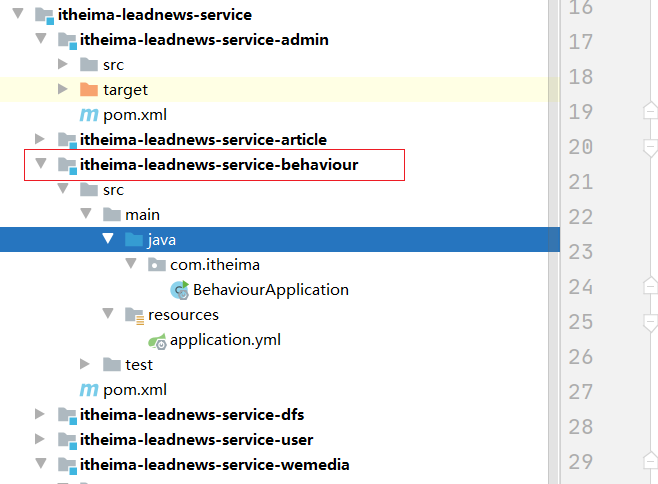


创建api:

 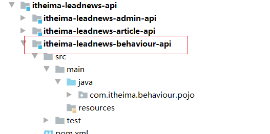

行为服务中pom.xml:

```xml
<?xml version="1.0" encoding="UTF-8"?>
<project xmlns="http://maven.apache.org/POM/4.0.0"
         xmlns:xsi="http://www.w3.org/2001/XMLSchema-instance"
         xsi:schemaLocation="http://maven.apache.org/POM/4.0.0 http://maven.apache.org/xsd/maven-4.0.0.xsd">
    <parent>
        <artifactId>itheima-leadnews-service</artifactId>
        <groupId>com.itheima</groupId>
        <version>1.0-SNAPSHOT</version>
    </parent>
    <modelVersion>4.0.0</modelVersion>

    <artifactId>itheima-leadnews-service-behaviour</artifactId>

    <dependencies>
        <dependency>
            <groupId>com.itheima</groupId>
            <artifactId>itheima-leadnews-behaviour-api</artifactId>
            <version>1.0-SNAPSHOT</version>
        </dependency>
        <dependency>
            <groupId>com.itheima</groupId>
            <artifactId>itheima-leadnews-common-db</artifactId>
            <version>1.0-SNAPSHOT</version>
        </dependency>
        <dependency>
            <groupId>com.itheima</groupId>
            <artifactId>itheima-leadnews-core-controller</artifactId>
            <version>1.0-SNAPSHOT</version>
        </dependency>
    </dependencies>
</project>
```

#### 1.1.2 application.yml

```yaml
spring:
  profiles:
    active: dev
---
server:
  port: 9006
spring:
  profiles: dev
  application:
    name: leadnews-behaviour
  cloud:
    nacos:
      discovery:
        server-addr: 192.168.211.136:8848
  datasource:
    driver-class-name: com.mysql.jdbc.Driver
    url: jdbc:mysql://192.168.211.136:3306/leadnews_behaviour?useSSL=false&useUnicode=true&characterEncoding=UTF-8&serverTimezone=&serverTimezone=Asia/Shanghai
    username: root
    password: 123456
# 设置Mapper接口所对应的XML文件位置，如果你在Mapper接口中有自定义方法，需要进行该配置
mybatis-plus:
  mapper-locations: classpath*:mapper/*.xml
  # 设置别名包扫描路径，通过该属性可以给包中的类注册别名
  type-aliases-package: com.itheima.behaviour.pojo
logging:
  level.com: debug

---
server:
  port: 9006
spring:
  profiles: test
  application:
    name: leadnews-behaviour
  cloud:
    nacos:
      discovery:
        server-addr: 192.168.211.136:8848
  datasource:
    driver-class-name: com.mysql.jdbc.Driver
    url: jdbc:mysql://192.168.211.136:3306/leadnews_behaviour?useSSL=false&useUnicode=true&characterEncoding=UTF-8&serverTimezone=&serverTimezone=Asia/Shanghai
    username: root
    password: 123456
# 设置Mapper接口所对应的XML文件位置，如果你在Mapper接口中有自定义方法，需要进行该配置
mybatis-plus:
  mapper-locations: classpath*:mapper/*.xml
  # 设置别名包扫描路径，通过该属性可以给包中的类注册别名
  type-aliases-package: com.itheima.behaviour.pojo
---
server:
  port: 9006
spring:
  profiles: pro
  application:
    name: leadnews-behaviour
  cloud:
    nacos:
      discovery:
        server-addr: 192.168.211.136:8848
  datasource:
    driver-class-name: com.mysql.jdbc.Driver
    url: jdbc:mysql://192.168.211.136:3306/leadnews_behaviour?useSSL=false&useUnicode=true&characterEncoding=UTF-8&serverTimezone=&serverTimezone=Asia/Shanghai
    username: root
    password: 123456
# 设置Mapper接口所对应的XML文件位置，如果你在Mapper接口中有自定义方法，需要进行该配置
mybatis-plus:
  mapper-locations: classpath*:mapper/*.xml
  # 设置别名包扫描路径，通过该属性可以给包中的类注册别名
  type-aliases-package: com.itheima.behaviour.pojo
```

#### 1.1.3 启动类

```java
@SpringBootApplication
@EnableDiscoveryClient
@MapperScan(basePackages = "com.itheima.behaviour.mapper")
public class BehaviourApplication {
    public static void main(String[] args) {
        SpringApplication.run(BehaviourApplication.class,args);
    }
    @Bean
    public PaginationInterceptor paginationInterceptor() {
        return new PaginationInterceptor();
    }
}
```


#### 1.1.4 使用代码生成器生成

通过代码生成器生成pojo,controller,service ,mapper，和xml

 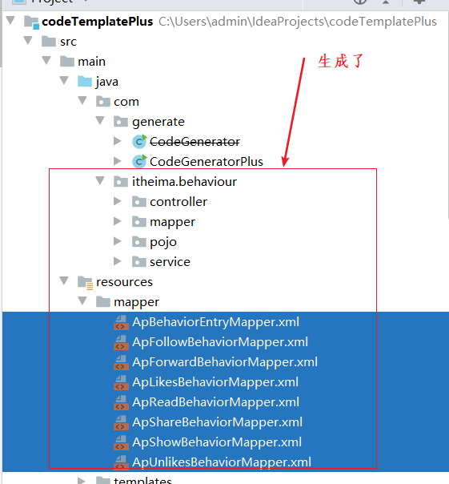


生成之后copy到如下目录：


 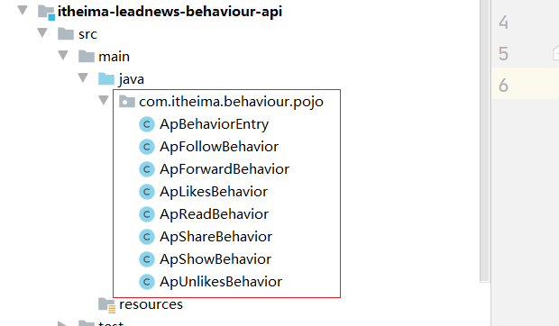

 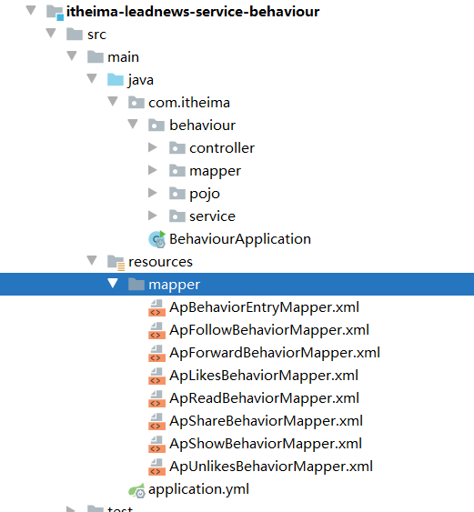

### 1.2 关注行为

#### 1.2.1 需求分析

​	在文章详情中，当用户点击了关注作者按钮，需要记录当前行为到表中，目前只需要存储数据即可，后期会做实时的流式处理，根据这些基础数据做热点文章的计算。

#### 1.2.2 思路分析

（1）ap_follow_behavior  APP关注行为表


（2）ap_behavior_entry   行为实体表

行为实体指的是使用的终端设备或者是登录的用户，统称为**行为实体**。

`type :0终端设备  1用户  `

行为实体与APP关注行为表是一对多的关系，关注行为需要知道是谁（设备或用户）关注了该文章信息


关注与取消关注的功能已经实现，当用户点击了关注保存关注行为，取消关注不保存数据。

因为只做保存操作，只需要在【关注业务操作】的时候发送消息给行为微服务 【行为微服务】获取消息进行数据保存即可。

实现步骤：

> 1 用户微服务中关注操作发送消息，保存用户行为
>
> 2 行为微服务接收消息
>
> 2.1 获取行为实体
>
> 2.2 保存数据

 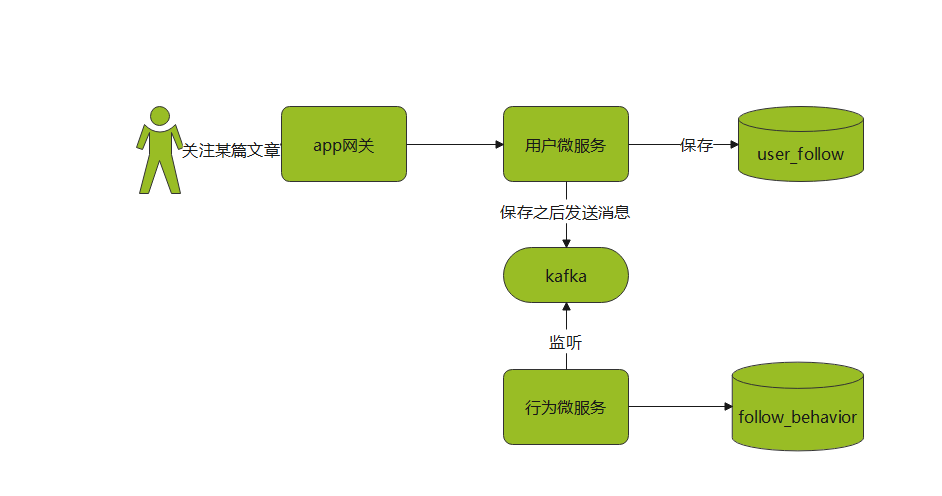


#### 1.2.3 功能实现

##### 1.2.3.1 环境搭建

（1）用户微服务添加依赖

```xml
<!-- kafka依赖 begin -->
<dependency>
    <groupId>org.springframework.kafka</groupId>
    <artifactId>spring-kafka</artifactId>
</dependency>
<dependency>
    <groupId>org.springframework.kafka</groupId>
    <artifactId>spring-kafka-test</artifactId>
    <scope>test</scope>
</dependency>
```

（2）在用户微服务中搭建kafka的环境

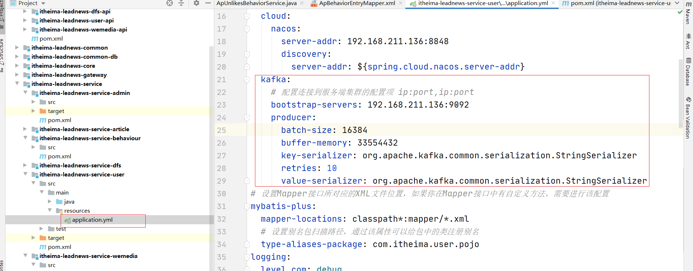

```yaml
spring:
  profiles:
    active: dev
---
server:
  port: 9002
spring:
  application:
    name: leadnews-user
  profiles: dev
  datasource:
    driver-class-name: com.mysql.jdbc.Driver
    url: jdbc:mysql://192.168.211.136:3306/leadnews_user?useSSL=false&useUnicode=true&characterEncoding=UTF-8&serverTimezone=&serverTimezone=Asia/Shanghai
    username: root
    password: 123456
  cloud:
    nacos:
      server-addr: 192.168.211.136:8848
      discovery:
        server-addr: ${spring.cloud.nacos.server-addr}
  kafka:
    # 配置连接到服务端集群的配置项 ip:port,ip:port
    bootstrap-servers: 192.168.211.136:9092
    producer:
      batch-size: 16384
      buffer-memory: 33554432
      key-serializer: org.apache.kafka.common.serialization.StringSerializer
      retries: 10
      value-serializer: org.apache.kafka.common.serialization.StringSerializer
# 设置Mapper接口所对应的XML文件位置，如果你在Mapper接口中有自定义方法，需要进行该配置
mybatis-plus:
  mapper-locations: classpath*:mapper/*.xml
  # 设置别名包扫描路径，通过该属性可以给包中的类注册别名
  type-aliases-package: com.itheima.user.pojo
logging:
  level.com: debug
---
server:
  port: 9002
spring:
  application:
    name: leadnews-user
  profiles: pro
  datasource:
    driver-class-name: com.mysql.jdbc.Driver
    url: jdbc:mysql://192.168.211.136:3306/leadnews_user?useSSL=false&useUnicode=true&characterEncoding=UTF-8&serverTimezone=&serverTimezone=Asia/Shanghai
    username: root
    password: 123456
  cloud:
    nacos:
      server-addr: 192.168.211.136:8848
      discovery:
        server-addr: ${spring.cloud.nacos.server-addr}
  kafka:
    # 配置连接到服务端集群的配置项 ip:port,ip:port
    bootstrap-servers: 192.168.211.136:9092
    producer:
      batch-size: 16384
      buffer-memory: 33554432
      key-serializer: org.apache.kafka.common.serialization.StringSerializer
      retries: 10
      value-serializer: org.apache.kafka.common.serialization.StringSerializer
# 设置Mapper接口所对应的XML文件位置，如果你在Mapper接口中有自定义方法，需要进行该配置
mybatis-plus:
  mapper-locations: classpath*:mapper/*.xml
  # 设置别名包扫描路径，通过该属性可以给包中的类注册别名
  type-aliases-package: com.itheima.user.pojo
---
server:
  port: 9002
spring:
  application:
    name: leadnews-user
  profiles: test
  datasource:
    driver-class-name: com.mysql.jdbc.Driver
    url: jdbc:mysql://192.168.211.136:3306/leadnews_user?useSSL=false&useUnicode=true&characterEncoding=UTF-8&serverTimezone=Asia/Shanghai
    username: root
    password: 123456
  cloud:
    nacos:
      server-addr: 192.168.211.136:8848
      discovery:
        server-addr: ${spring.cloud.nacos.server-addr}
  kafka:
    # 配置连接到服务端集群的配置项 ip:port,ip:port
    bootstrap-servers: 192.168.211.136:9092
    producer:
      batch-size: 16384
      buffer-memory: 33554432
      key-serializer: org.apache.kafka.common.serialization.StringSerializer
      retries: 10
      value-serializer: org.apache.kafka.common.serialization.StringSerializer
# 设置Mapper接口所对应的XML文件位置，如果你在Mapper接口中有自定义方法，需要进行该配置
mybatis-plus:
  mapper-locations: classpath*:mapper/*.xml
  # 设置别名包扫描路径，通过该属性可以给包中的类注册别名
  type-aliases-package: com.itheima.user.pojo
```


（3）添加依赖到行为服务

```xml
<!-- kafka依赖 begin -->
<dependency>
    <groupId>org.springframework.kafka</groupId>
    <artifactId>spring-kafka</artifactId>
</dependency>
<dependency>
    <groupId>org.springframework.kafka</groupId>
    <artifactId>spring-kafka-test</artifactId>
    <scope>test</scope>
</dependency>
```

 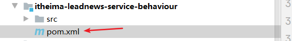

（4）修改yaml文件：添加kafka消费者：

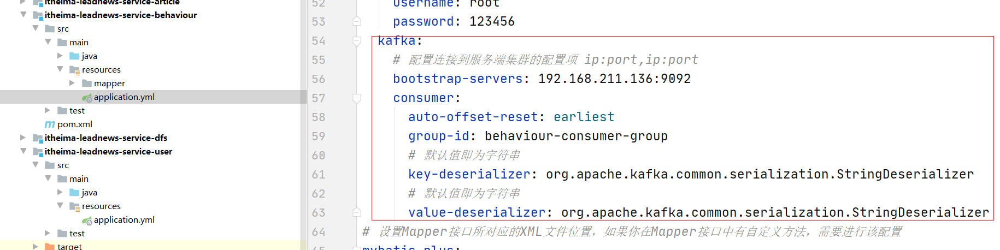

```yaml
spring:
  profiles:
    active: dev
---
server:
  port: 9006
spring:
  profiles: dev
  application:
    name: leadnews-behaviour
  cloud:
    nacos:
      discovery:
        server-addr: 192.168.211.136:8848
  datasource:
    driver-class-name: com.mysql.jdbc.Driver
    url: jdbc:mysql://192.168.211.136:3306/leadnews_behaviour?useSSL=false&useUnicode=true&characterEncoding=UTF-8&serverTimezone=&serverTimezone=Asia/Shanghai
    username: root
    password: 123456
  kafka:
    # 配置连接到服务端集群的配置项 ip:port,ip:port
    bootstrap-servers: 192.168.211.136:9092
    consumer:
      auto-offset-reset: earliest
      group-id: behaviour-consumer-group
      # 默认值即为字符串
      key-deserializer: org.apache.kafka.common.serialization.StringDeserializer
      # 默认值即为字符串
      value-deserializer: org.apache.kafka.common.serialization.StringDeserializer
# 设置Mapper接口所对应的XML文件位置，如果你在Mapper接口中有自定义方法，需要进行该配置
mybatis-plus:
  mapper-locations: classpath*:mapper/*.xml
  # 设置别名包扫描路径，通过该属性可以给包中的类注册别名
  type-aliases-package: com.itheima.behaviour.pojo
logging:
  level.com: debug

---
server:
  port: 9006
spring:
  profiles: test
  application:
    name: leadnews-behaviour
  cloud:
    nacos:
      discovery:
        server-addr: 192.168.211.136:8848
  datasource:
    driver-class-name: com.mysql.jdbc.Driver
    url: jdbc:mysql://192.168.211.136:3306/leadnews_behaviour?useSSL=false&useUnicode=true&characterEncoding=UTF-8&serverTimezone=&serverTimezone=Asia/Shanghai
    username: root
    password: 123456
  kafka:
    # 配置连接到服务端集群的配置项 ip:port,ip:port
    bootstrap-servers: 192.168.211.136:9092
    consumer:
      auto-offset-reset: earliest
      group-id: behaviour-consumer-group
      # 默认值即为字符串
      key-deserializer: org.apache.kafka.common.serialization.StringDeserializer
      # 默认值即为字符串
      value-deserializer: org.apache.kafka.common.serialization.StringDeserializer
# 设置Mapper接口所对应的XML文件位置，如果你在Mapper接口中有自定义方法，需要进行该配置
mybatis-plus:
  mapper-locations: classpath*:mapper/*.xml
  # 设置别名包扫描路径，通过该属性可以给包中的类注册别名
  type-aliases-package: com.itheima.behaviour.pojo
---
server:
  port: 9006
spring:
  profiles: pro
  application:
    name: leadnews-behaviour
  cloud:
    nacos:
      discovery:
        server-addr: 192.168.211.136:8848
  datasource:
    driver-class-name: com.mysql.jdbc.Driver
    url: jdbc:mysql://192.168.211.136:3306/leadnews_behaviour?useSSL=false&useUnicode=true&characterEncoding=UTF-8&serverTimezone=&serverTimezone=Asia/Shanghai
    username: root
    password: 123456
  kafka:
    # 配置连接到服务端集群的配置项 ip:port,ip:port
    bootstrap-servers: 192.168.211.136:9092
    consumer:
      auto-offset-reset: earliest
      group-id: behaviour-consumer-group
      # 默认值即为字符串
      key-deserializer: org.apache.kafka.common.serialization.StringDeserializer
      # 默认值即为字符串
      value-deserializer: org.apache.kafka.common.serialization.StringDeserializer
# 设置Mapper接口所对应的XML文件位置，如果你在Mapper接口中有自定义方法，需要进行该配置
mybatis-plus:
  mapper-locations: classpath*:mapper/*.xml
  # 设置别名包扫描路径，通过该属性可以给包中的类注册别名
  type-aliases-package: com.itheima.behaviour.pojo
```


##### 1.2.3.2 生产者实现

发送消息需要准备一个FollowBehaviorDto,进行数据的传递

(1)创建dto

```java
package com.itheima.behaviour.dto;

import lombok.Data;
import lombok.Getter;
import lombok.Setter;

@Data
@Setter
@Getter
public class FollowBehaviorDto {
    //文章id
    Long articleId;
    //被关注者 用户ID
    Integer followId;
    //关注者  用户id
    Integer userId;
    //设备ID
    Integer equipmentId;
}
```

 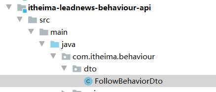


(2)新建常量，固定当前消息的topic

```java
public static final String FOLLOW_BEHAVIOR_TOPIC="follow.behavior.topic";
```

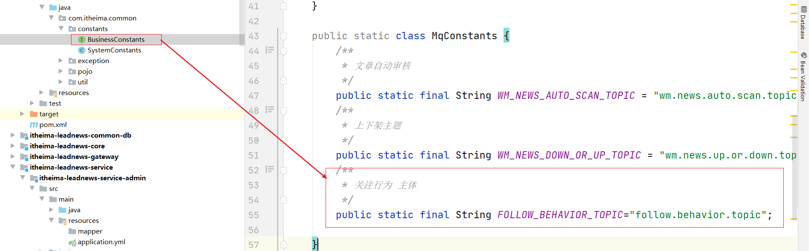


(3)用户微服务中添加依赖：

```xml
<dependency>
    <groupId>com.itheima</groupId>
    <artifactId>itheima-leadnews-behaviour-api</artifactId>
    <version>1.0-SNAPSHOT</version>
</dependency>
```

(4)注入`KafkaTemplate` 并在实现类中发送消息

```java
//记录关注行为
FollowBehaviorDto dto = new FollowBehaviorDto();
//被关注者 用户的ID
dto.setFollowId(data.getUserId());
//文章
dto.setArticleId(relationDto.getArticleId());
//关注者 用户的ID
dto.setUserId(currentUserId);
//异步发送消息，保存关注行为
kafkaTemplate.send(BusinessConstants.MqConstants.FOLLOW_BEHAVIOR_TOPIC, JSON.toJSONString(dto));
```

整体代码如下：

```java
@Service
public class ApUserFollowServiceImpl extends ServiceImpl<ApUserFollowMapper, ApUserFollow> implements ApUserFollowService {

    @Autowired
    private ApUserFollowMapper apUserFollowMapper;

    @Autowired
    private ApUserFanMapper apUserFanMapper;

    @Autowired
    private ApAuthorFeign apAuthorFeign;

    @Autowired
    private ApUserMapper apUserMapper;

    @Autowired
    private KafkaTemplate kafkaTemplate;


    @Override
    @Transactional(rollbackFor = {Exception.class,LeadNewsException.class})
    public void followUserByWho(UserRelationDto relationDto, Integer currentUserId) throws Exception {
        //1.获取操作类型
        if (relationDto.getOperation() == null || relationDto.getOperation() < 0 || relationDto.getOperation() > 1) {
            throw new LeadNewsException("错误的操作类型");
        }
        if(StringUtils.isEmpty(relationDto.getAuthorId())){
            throw new LeadNewsException("作者ID不能为空");
        }
        //先根据作者的ID 获取用该作者对应的APP用户的ID 值 再进行操作
        ApAuthor data = apAuthorFeign.findById(relationDto.getAuthorId()).getData();

        if(data==null){
            throw new LeadNewsException("没有该作者");
        }
        //进行关注
        if (relationDto.getOperation() == 1) {
            //2.判断如果是关注 则需要保存数据到 follow和fan表中
            //2.1先查询是否有该记录在关注表，如果有就不需要再关注了 说明接口调用有业务流程的问题
            QueryWrapper<ApUserFollow> queryWrapper1 = new QueryWrapper<ApUserFollow>();
            queryWrapper1.eq("user_id",currentUserId);
            queryWrapper1.eq("follow_id",data.getUserId());
            ApUserFollow userFollow = apUserFollowMapper.selectOne(queryWrapper1);
            if(userFollow!=null){
                throw new LeadNewsException("关注表已经存在记录");
            }
            userFollow = new ApUserFollow();

            userFollow.setCreatedTime(LocalDateTime.now());
            //关注人
            userFollow.setUserId(currentUserId);
            //被关注人ID 作者对应的 appUserID的值
            userFollow.setFollowId(data.getUserId());
            //被关注人名称 作者对应的 appUser的名称 由于作者名称和appUser表中的名字一样，所以可以用他，页面传递过来作者名称即可
            userFollow.setFollowName(relationDto.getAuthorName());
            //暂时硬编码
            userFollow.setLevel(0);
            userFollow.setIsNotice(1);

            //2.2 添加至数据库中
            apUserFollowMapper.insert(userFollow);

            //2.3 查询 是否存在关联表 如果有 则说明已经存在 抛出异常，有问题
            QueryWrapper<ApUserFan> queryWrapper2 = new QueryWrapper<ApUserFan>();
            queryWrapper2.eq("user_id",data.getUserId());//作者对应的 APP用户的ID
            queryWrapper2.eq("fans_id",currentUserId);// 粉丝ID 就是当前的用户的ID

            ApUserFan apUserFan = apUserFanMapper.selectOne(queryWrapper2);
            if(apUserFan!=null){
                throw new LeadNewsException("粉丝表数据已经存在");
            }
            apUserFan = new ApUserFan();
            apUserFan.setCreatedTime(LocalDateTime.now());
            //作者对应的 APPUSER的id
            apUserFan.setUserId(data.getUserId());
            //作者粉丝的ID 就是当前用户
            apUserFan.setFansId(currentUserId);

            //粉丝的名称 即为当前用户的名称
            ApUser apUser = apUserMapper.selectById(currentUserId);
            if(apUser==null){
                throw new LeadNewsException("用户不存在");
            }
            apUserFan.setFansName(apUser.getName());

            apUserFan.setLevel(0);
            apUserFan.setIsDisplay(1);
            apUserFan.setIsShieldLetter(0);
            apUserFan.setIsShieldComment(0);
            apUserFanMapper.insert(apUserFan);

            //关注完了之后发送消息

            //记录关注行为
            FollowBehaviorDto dto = new FollowBehaviorDto();
            //被关注者 用户的ID
            dto.setFollowId(data.getUserId());
            //文章
            dto.setArticleId(relationDto.getArticleId());
            //关注者 用户的ID
            dto.setUserId(currentUserId);
            //异步发送消息，保存关注行为
            kafkaTemplate.send(BusinessConstants.MqConstants.FOLLOW_BEHAVIOR_TOPIC, JSON.toJSONString(dto));
        } else {
            //3.判断如果是取消关注 则需要删除 fan follow中的关系数据
            QueryWrapper<ApUserFollow> queryWrapper1 = new QueryWrapper<ApUserFollow>();
            queryWrapper1.eq("user_id",currentUserId);
            queryWrapper1.eq("follow_id",data.getUserId());
            apUserFollowMapper.delete(queryWrapper1);

            QueryWrapper<ApUserFan> queryWrapper2 = new QueryWrapper<ApUserFan>();
            queryWrapper2.eq("user_id",data.getUserId());//作者对应的 APP用户的ID
            queryWrapper2.eq("fans_id",currentUserId);// 粉丝ID 就是当前的用户的ID
            apUserFanMapper.delete(queryWrapper2);

        }
    }
}
```

##### 1.2.3.3 消费者实现

步骤：

```properties
（1）在行为微服务中实现查询行为实体业务

（2）在行为微服务中实现保存关注行为数据

（3）在行为微服务中创建监听类监听消息 实现业务
```


（1）在行为微服务中实现查询行为实体业务

 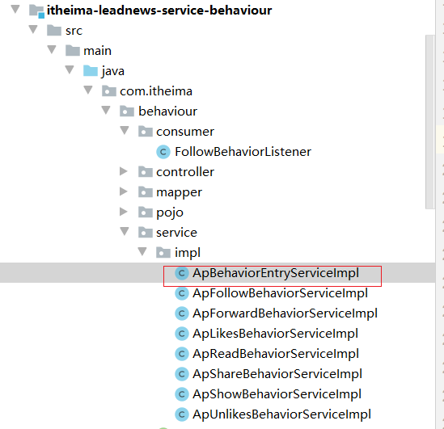

```java
@Service
public class ApBehaviorEntryServiceImpl extends ServiceImpl<ApBehaviorEntryMapper, ApBehaviorEntry> implements ApBehaviorEntryService {


    @Override
    public ApBehaviorEntry findByUserIdOrEquipmentId(Integer userId, Integer type) {
        QueryWrapper<ApBehaviorEntry> queryWrapper = new QueryWrapper<ApBehaviorEntry>();
        queryWrapper.eq("entry_id",userId);
        queryWrapper.eq("type",type);//标识用户
        ApBehaviorEntry entry = getOne(queryWrapper);
        return entry;
    }
}
```

（2）在行为微服务中实现保存关注行为数据

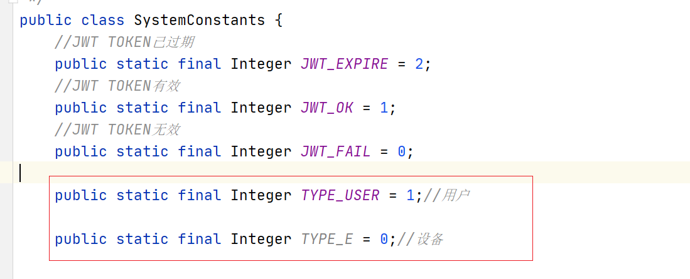

```

    public static final Integer TYPE_USER = 1;//用户

    public static final Integer TYPE_E = 0;//设备
```


```java
@Service
public class ApFollowBehaviorServiceImpl extends ServiceImpl<ApFollowBehaviorMapper, ApFollowBehavior> implements ApFollowBehaviorService {

    @Autowired
    private ApBehaviorEntryService apBehaviorEntryService;

    @Override
    public void saveFollowBehavior(FollowBehaviorDto dto) {
        //1.查询行为实体
      ApBehaviorEntry apBehaviorEntry = apBehaviorEntryService.findByUserIdOrEquipmentId(userId, SystemConstants.TYPE_USER);
        if (entry != null) {
            //2.判断 如果行为实体为空 则不做处理
            //3.如果 行为实体有值 则保存关注行为数据
            ApFollowBehavior alb = new ApFollowBehavior();
            //设置实体ID
            alb.setEntryId(entry.getId());
            //设置创建时间
            alb.setCreatedTime(LocalDateTime.now());
            //设置文章的ID
            alb.setArticleId(dto.getArticleId());
            //设置被关注者 用户的ID
            alb.setFollowId(dto.getFollowId());
            save(alb);
        }
    }
}
```

 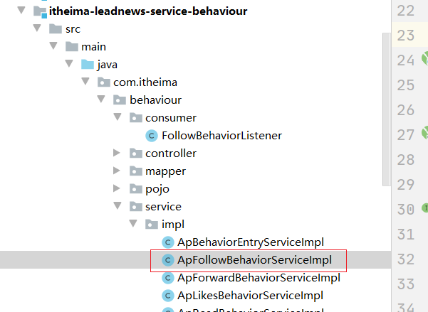


（3）在行为微服务中创建监听类监听消息 实现业务

```java
@Component
public class FollowBehaviorListener {

    @Autowired
    private ApFollowBehaviorService apFollowBehaviorService;

    //监听消息
    @KafkaListener(topics = BusinessConstants.MqConstants.FOLLOW_BEHAVIOR_TOPIC)
    public void receiverMessage(ConsumerRecord<?,?> record){
        if(record!=null){
            FollowBehaviorDto dto = JSON.parseObject(record.value().toString(), FollowBehaviorDto.class);
            //保存关注行为数据
            apFollowBehaviorService.saveFollowBehavior(dto);
        }
    }
}
```


(4) 测试

先登录 


再关注：

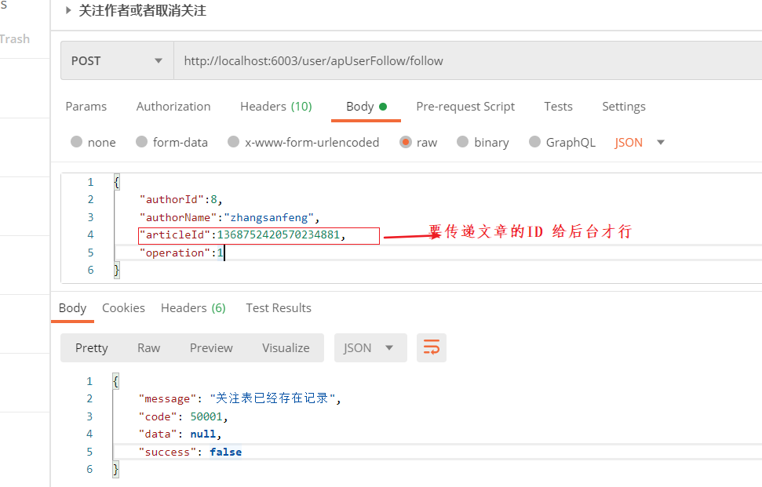

查看：

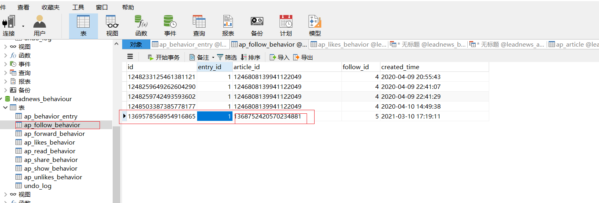


### 1.3 点赞行为

#### 1.3.1 需求分析

 

当前登录的用户点击了”赞“,就要保存当前行为数据

#### 1.3.2 思路分析

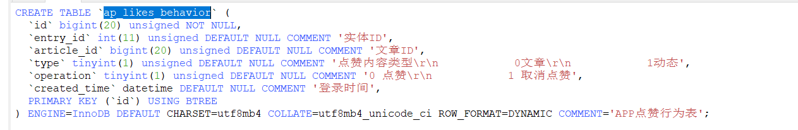

当前用户点赞以后保存数据，取消点赞则不删除数据

保存也是根据当前**行为实体和文章id**进行保存

#### 1.3.3 功能实现

（1）创建dto 用于接收页面传递的参数进行保存点赞行为

```java
@Data
@Setter
@Getter
public class LikesBehaviourDto {
    // 设备ID
    Integer equipmentId;

    // 文章、动态、评论等ID
    Long articleId;
    /**
     * 喜欢内容类型
     * 0文章
     * 1动态
     * 2评论
     */
    Integer type;

    /**
     * 喜欢操作方式
     * 1 点赞
     * 0 取消点赞
     */
    Integer operation;
}
```

 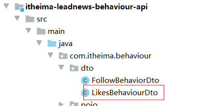

（2）controller

```java
@PostMapping("/like")
public Result like(@RequestBody LikesBehaviourDto likesBehaviourDto) throws Exception{
    apLikesBehaviorService.like(likesBehaviourDto);
    return Result.ok();
}
```

 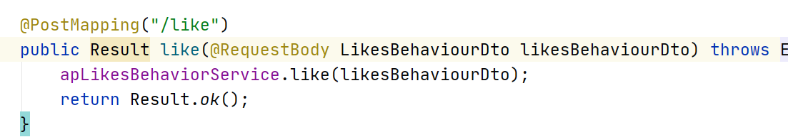

（3）业务层

```java
@Service
public class ApLikesBehaviorServiceImpl extends ServiceImpl<ApLikesBehaviorMapper, ApLikesBehavior> implements ApLikesBehaviorService {

    @Autowired
    private ApBehaviorEntryService apBehaviorEntryService;
    @Override
    public void like(LikesBehaviourDto likesBehaviourDto) throws Exception {

        //1.检查 参数值
        if(likesBehaviourDto == null
                || likesBehaviourDto.getArticleId() == null
                || likesBehaviourDto.getType() > 2
                || likesBehaviourDto.getType() < 0
                || likesBehaviourDto.getOperation() < 0
                || likesBehaviourDto.getOperation() > 1){
            throw new LeadNewsException("错误的参数");
        }
       //2.先获取当前用户的ID 如果是0 标识匿名用户 如果不是0 就是真实的用户

        String userInfo = RequestContextUtil.getUserInfo();
        ApBehaviorEntry entry = null;
        if(userInfo.equals("0")){
            //匿名用户
            entry = apBehaviorEntryService.findByUserIdOrEquipmentId(likesBehaviourDto.getEquipmentId(), SystemConstants.TYPE_E);
        }else{
            //真实的用户
            entry = apBehaviorEntryService.findByUserIdOrEquipmentId(Integer.valueOf(userInfo), SystemConstants.TYPE_USER);
        }
        if(entry==null){
            throw new LeadNewsException("实体对象不存在");
        }

        //2.添加数据到表中(添加 也有可能是更新)

        if(likesBehaviourDto.getOperation()==1) {
            //点赞
            //查询是否存在点赞记录 如果有 则不用点赞
            //select * from xxx where entry_id=? and article_id=?


            QueryWrapper<ApLikesBehavior> queryWrapper =new QueryWrapper<ApLikesBehavior>();
            queryWrapper.eq("entry_id",entry.getId());
            queryWrapper.eq("article_id",likesBehaviourDto.getArticleId());
            ApLikesBehavior apLikesBehavior = apLikesBehaviorMapper.selectOne(queryWrapper);
            if(apLikesBehavior!=null){//说明有记录（有可能是取消点赞的）

                if(apLikesBehavior.getOperation()==0){
                    apLikesBehavior.setOperation(1);//
                    apLikesBehaviorMapper.updateById(apLikesBehavior);
                }

                return;
            }

            ApLikesBehavior entity = new ApLikesBehavior();
            entity.setOperation(likesBehaviourDto.getOperation());
            entity.setArticleId(likesBehaviourDto.getArticleId());
            entity.setEntryId(entry.getId());//根据用户ID 或者设备ID 从 实体表中获取实体对象 再获取到主键 设置到这里
            entity.setCreatedTime(LocalDateTime.now());
            entity.setType(0);
            apLikesBehaviorMapper.insert(entity);
        }else{
            //取消点赞

            //更新  update xxx set operation=0 where entry_id=? and article_id=? and operation=1
            QueryWrapper<ApLikesBehavior> queryWrapper =new QueryWrapper<ApLikesBehavior>();
            queryWrapper.eq("entry_id",entry.getId());
            queryWrapper.eq("article_id",likesBehaviourDto.getArticleId());
            queryWrapper.eq("operation",1);
            ApLikesBehavior apLikesBehavior = apLikesBehaviorMapper.selectOne(queryWrapper);
            if(apLikesBehavior!=null){
                apLikesBehavior.setOperation(0);
                apLikesBehaviorMapper.updateById(apLikesBehavior);
            }

        }
    }
}
```

添加异常构造函数：

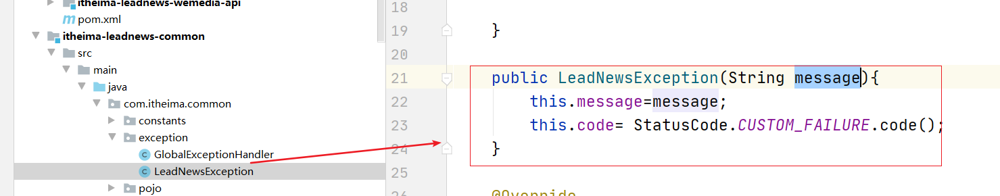


（4）在app网关中配置行为微服务的路由

```yaml
spring:
  profiles:
    active: dev
---
server:
  port: 6003
spring:
  application:
    name: leadnews-app-gateway
  profiles: dev
  cloud:
    nacos:
      server-addr: 192.168.211.136:8848
      discovery:
        server-addr: ${spring.cloud.nacos.server-addr}
    gateway:
      globalcors:
        cors-configurations:
          '[/**]': # 匹配所有请求
            allowedOrigins: "*" #跨域处理 允许所有的域
            allowedHeaders: "*"
            allowedMethods: # 支持的方法
              - GET
              - POST
              - PUT
              - DELETE
      routes:
        # 文章微服务
        - id: article
          uri: lb://leadnews-article
          predicates:
            - Path=/article/**
          filters:
            - StripPrefix= 1
        # app用户微服务
        - id: user
          uri: lb://leadnews-user
          predicates:
            - Path=/user/**
          filters:
            - StripPrefix= 1
        - id: behaviour
          uri: lb://leadnews-behaviour
          predicates:
            - Path=/behaviour/**
          filters:
            - StripPrefix= 1
---
server:
  port: 6003
spring:
  application:
    name: leadnews-app-gateway
  profiles: test
  cloud:
    nacos:
      server-addr: 192.168.211.136:8848
      discovery:
        server-addr: ${spring.cloud.nacos.server-addr}
    gateway:
      globalcors:
        cors-configurations:
          '[/**]': # 匹配所有请求
            allowedOrigins: "*" #跨域处理 允许所有的域
            allowedHeaders: "*"
            allowedMethods: # 支持的方法
              - GET
              - POST
              - PUT
              - DELETE
      routes:
        # 文章微服务
        - id: article
          uri: lb://leadnews-article
          predicates:
            - Path=/article/**
          filters:
            - StripPrefix= 1
        # app用户微服务
        - id: user
          uri: lb://leadnews-user
          predicates:
            - Path=/user/**
          filters:
            - StripPrefix= 1
        - id: behaviour
          uri: lb://leadnews-behaviour
          predicates:
            - Path=/behaviour/**
          filters:
            - StripPrefix= 1
---
server:
  port: 6003
spring:
  application:
    name: leadnews-app-gateway
  profiles: pro
  cloud:
    nacos:
      server-addr: 192.168.211.136:8848
      discovery:
        server-addr: ${spring.cloud.nacos.server-addr}
    gateway:
      globalcors:
        cors-configurations:
          '[/**]': # 匹配所有请求
            allowedOrigins: "*" #跨域处理 允许所有的域
            allowedHeaders: "*"
            allowedMethods: # 支持的方法
              - GET
              - POST
              - PUT
              - DELETE
      routes:
        # 文章微服务
        - id: article
          uri: lb://leadnews-article
          predicates:
            - Path=/article/**
          filters:
            - StripPrefix= 1
        # app用户微服务
        - id: user
          uri: lb://leadnews-user
          predicates:
            - Path=/user/**
          filters:
            - StripPrefix= 1
        - id: behaviour
          uri: lb://leadnews-behaviour
          predicates:
            - Path=/behaviour/**
          filters:
            - StripPrefix= 1
```

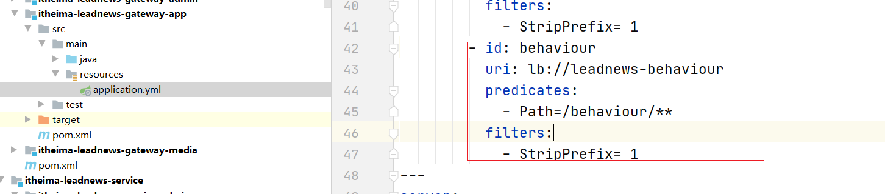


（5）由于点赞 主键没有自增，我们使用雪花算法来生成主键

添加如下代码：

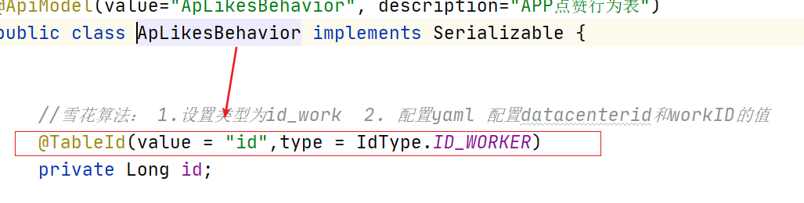

修改如下配置：

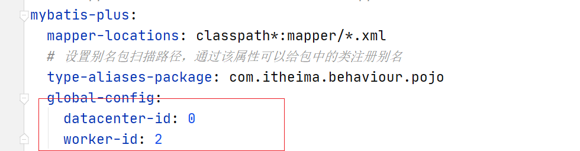

（6）测试

 启动项目：

 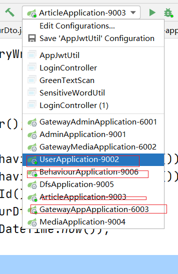

先app登录：

 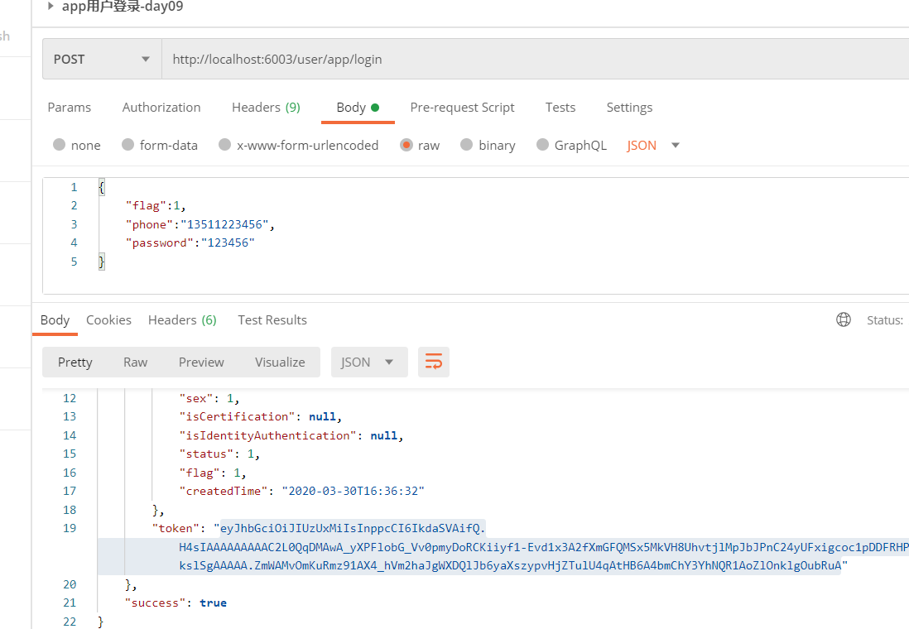


点赞：

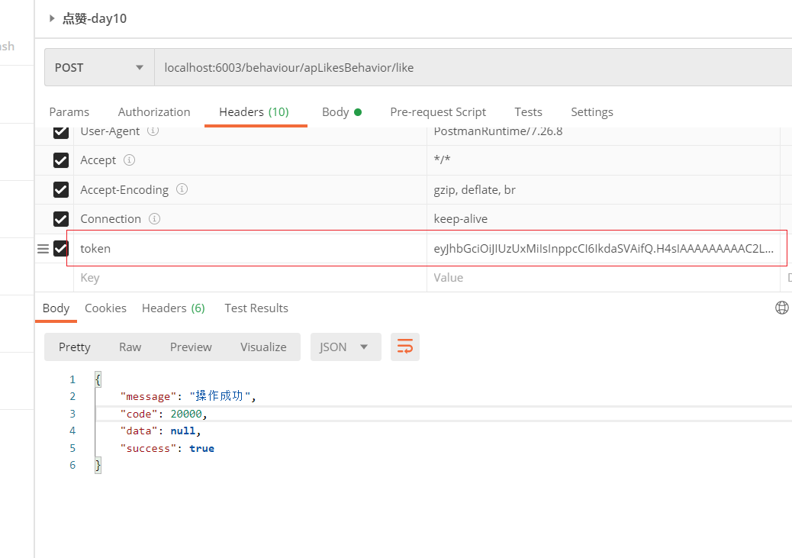

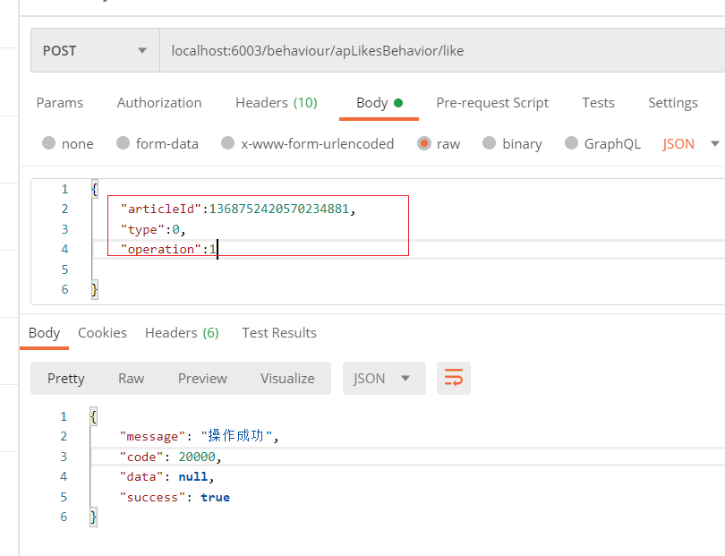

校验成功：

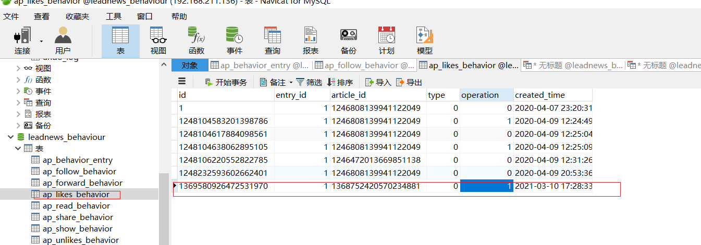


### 1.4 阅读行为

#### 1.4.1 需求分析

当用户查看了某一篇文章，需要记录当前用户查看的次数，阅读时长，阅读文章的比例，加载的时长（非必要）

这些数据保存到一个表中。当用户查看了一篇文章的详情，点击返回重新加入文章列表发送请求，记录当前用户阅读此文章的行为。

#### 1.4.2 思路分析

ap_read_behavior APP阅读行为表


当点击一篇文章之后，查看了之后，点击返回重新回到文章列表的时候，由前端发送请求给到后台即可。至于次数，时长由前端来进行计算即可。

#### 1.4.3 功能实现

（1）创建dto来接收请求数据

```java
@Data
public class ReadBehaviorDto {
    // 设备ID
    Integer equipmentId;

    // 文章、动态、评论等ID
    Long articleId;

    /**
     * 阅读次数
     */
    Integer count;

    /**
     * 阅读时长（S)
     */
    Integer readDuration;

    /**
     * 阅读百分比 不带小数
     */
    Integer percentage;

    /**
     * 加载时间
     */
    Integer loadDuration;

}
```

 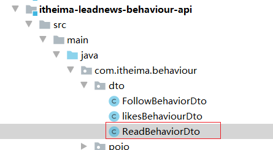


(2) controller


```java
@PostMapping("/read")
public Result read(@RequestBody ReadBehaviorDto readBehaviorDto) throws Exception{
    apReadBehaviorService.readBehavior(readBehaviorDto);
    return Result.ok();
}
```

 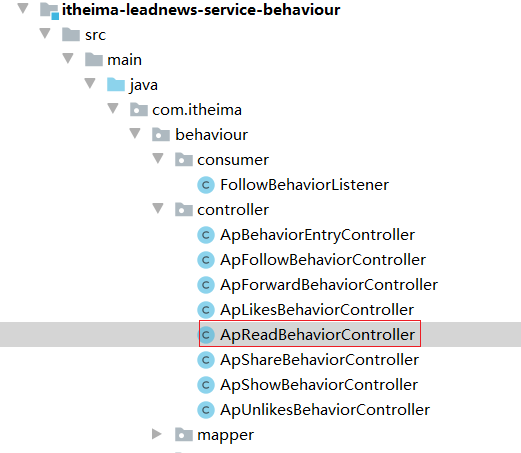

(3) 业务层

```java
@Service
public class ApReadBehaviorServiceImpl extends ServiceImpl<ApReadBehaviorMapper, ApReadBehavior> implements ApReadBehaviorService {

    @Autowired
    private ApBehaviorEntryService apBehaviorEntryService;

    @Override
    public void readBehavior(ReadBehaviorDto readBehaviorDto) throws Exception {
        //1.参数校验
        if(readBehaviorDto == null || readBehaviorDto.getArticleId() == null){
            throw new LeadNewsException("文章不存在");
        }
        //2.查询行为实体
        String userInfo = RequestContextUtil.getUserInfo();
        //设备
        ApBehaviorEntry apBehaviorEntry = null;
           if(userInfo.equals("0")){
            //2.如果是匿名用户 则点赞的是设备
            entry= apBehaviorEntryService.findByUserIdOrEquipmentId(readBehaviorDto.getEquipmentId(), SystemConstants.TYPE_E);
        }else{
            //3.如果是真实的用户 则点赞的是用户
            entry= apBehaviorEntryService.findByUserIdOrEquipmentId(Integer.valueOf(userInfo), SystemConstants.TYPE_USER);
        }

        if(apBehaviorEntry == null){
            throw new LeadNewsException("不存在的行为实体");
        }

        //3.保存或更新阅读的行为
        QueryWrapper<ApReadBehavior> queryWrapper = new QueryWrapper<ApReadBehavior>();
        queryWrapper.eq("entry_id",apBehaviorEntry.getId());
        queryWrapper.eq("article_id",readBehaviorDto.getArticleId());

        ApReadBehavior apReadBehavior = getOne(queryWrapper);
        if(apReadBehavior == null){
            apReadBehavior = new ApReadBehavior();
            apReadBehavior.setCount(readBehaviorDto.getCount());
            apReadBehavior.setArticleId(readBehaviorDto.getArticleId());
            apReadBehavior.setPercentage(readBehaviorDto.getPercentage());
            apReadBehavior.setEntryId(apBehaviorEntry.getId());
            apReadBehavior.setLoadDuration(readBehaviorDto.getLoadDuration());
            apReadBehavior.setReadDuration(readBehaviorDto.getReadDuration());
            apReadBehavior.setCreatedTime(LocalDateTime.now());
            save(apReadBehavior);
        }else{
            apReadBehavior.setUpdatedTime(LocalDateTime.now());
            apReadBehavior.setCount((apReadBehavior.getCount()+1));
            updateById(apReadBehavior);
        }
    }
}
```

同样设置主键采用雪花算法实现：

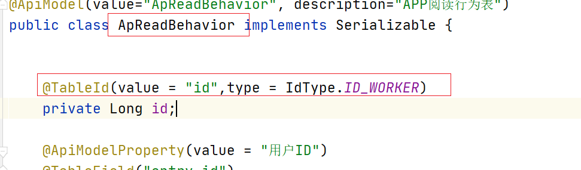


(4)测试

当用户查看了一篇文章的详情，点击返回重新加入文章列表发送请求，记录当前用户阅读此文章的行为.该行为通过POSTMAN来进行测试。

先登录：


阅读行为保存：

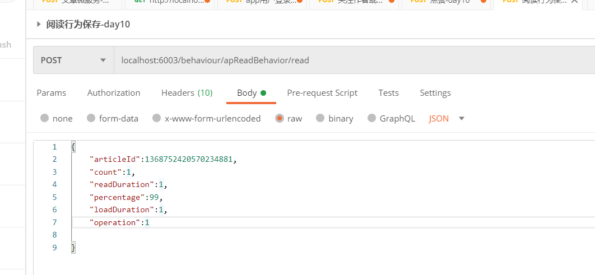

```json
{
    "articleId":1368752420570234881,
    "count":1,
    "readDuration":1,
    "percentage":99,
    "loadDuration":1,
    "operation":1

}
```

点击三次之后：

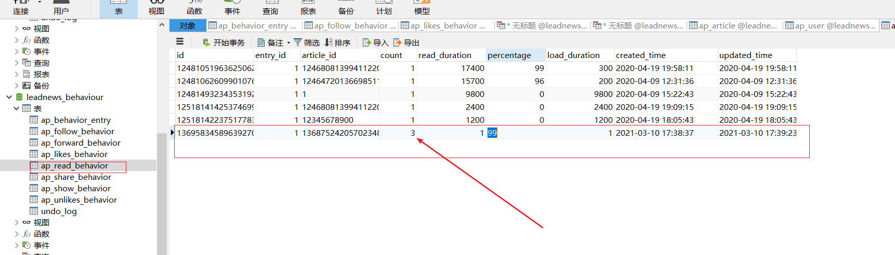


### 1.5 不喜欢行为和收藏行为(作业)

#### 1.5.1不喜欢实现思路

为什么会有不喜欢？

 一旦用户点击了不喜欢，不再给当前用户推荐这一类型的文章信息

```properties
1.定义DTO 用于接收请求传递过来的参数 
2.编写controller service 在service 中首先需要获取当前用户是否为 用户 或者设备。判断是否有行为实体，如果有则进行保存，保存的时候先校验是否已经存在，如果存在，则为更新即可
3.设置POJO主键生成策略为 雪花算法生成。
```

ap_unlikes_behavior APP不喜欢行为表


dto:

```java
@Data
public class UnLikesBehaviorDto {
 
    Integer equipmentId;

    Long articleId;

    /**
     * 不喜欢操作方式
     * 0 不喜欢
     * 1 取消不喜欢
     */
    Integer type;

}
```

#### 1.5.2 收藏功能实现思路

收藏表在文章库中，为什么不设计在行为库？

因为app端用户可以个人中心找到自己收藏的文章列表，这样设计更方便。便于关联表查询，如果是夸库，则不能关联表查询。

 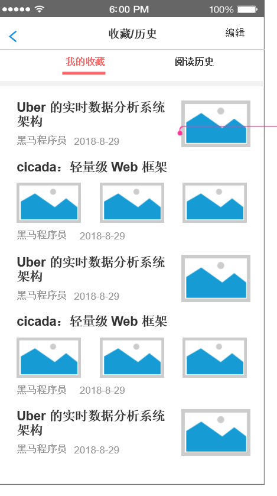


 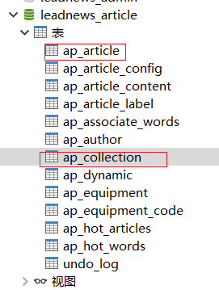


```properties
1.定义DTO 用于接收请求传递过来的参数
2.编写controller service 在service 中首先需要获取当前用户是否为 用户 或者设备。判断是否有行为实体，如果有则进行保存，保存的时候先校验是否已经存在，如果存在，则为更新即可
3.设置POJO主键生成策略为 雪花算法生成。
```

ap_collection APP收藏信息表


对象dto

```java
@Data
public class CollectionBehaviorDto {
    // 设备ID
  
    Integer equipmentId;
    // 文章、动态ID
 
    Long entryId;
    /**
     * 收藏内容类型
     * 0文章
     * 1动态
     */
     Integer type;

    /**
     * 操作类型
     * 0收藏
     * 1取消收藏
     */
    Integer operation;
	/**
	  发布时间 冗余字段 接收页面文章的发布时间值
	*/
    LocalDateTime publishedTime;

}
```

## 2 app文章关系展示功能

### 2.1 app文章关系-需求分析

 

主要是用来展示文章的关系，app端用户必须登录，判断当前用户**是否已经关注该文章的作者、是否收藏了此文章、是否点赞了文章、是否不喜欢该文章等**

例：如果当前用户点赞了该文章，点赞按钮进行高亮，其他功能类似。

### 2.2 app文章关系-思路分析

#### 2.2.1 实现思路

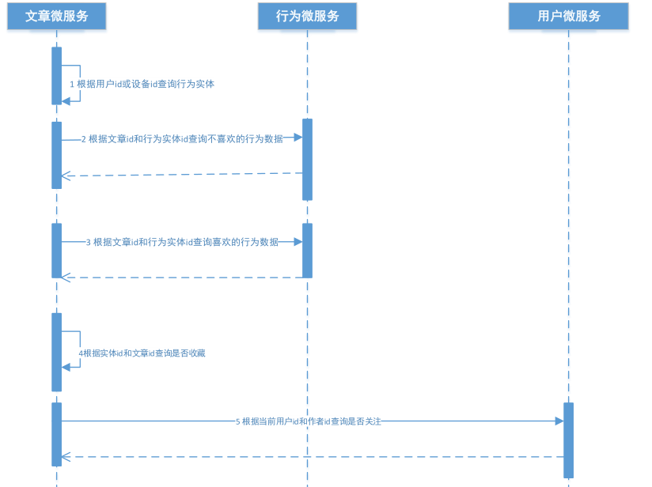


1 用户查看文章详情，展示文章信息（功能已实现），同时需要展示当前文章的行为（点赞，收藏等）

2 根据用户id(已登录)或设备id(未登录)去查询当前实体id

3 通过实体id和前端传递过来的文章id去查询收藏表、点赞表、不喜欢表；其中点赞和不喜欢需要远程调用behavior微服务获取数据。

4 在文章详情展示是否关注此作者，需要通过当前用户和作者关系表进行查询，有数据则关注，无数据则没有关注

返回的格式如下：

```json
{"isfollow":true,"islike":true,"isunlike":false,"iscollection":true}
```


通过图来说明思路如下：

 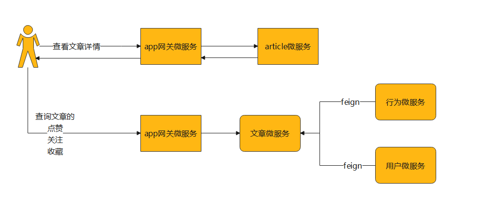

```properties
简单总结下就是 点击查询文章详情时，再发送一个请求 通过文章微服务获取其他相关的譬如：收藏，关注，点赞，等数据 判断是否关注，点赞 ，收藏之后返回一个JSON给前端 前端根据JSON的值进行展示即可
```


#### 2.2.2 表关系说明


### 2.3 功能实现


#### 2.3.1 思路分析

页面请求 过来后台controller 接收 调用service service内部业务逻辑如下

```properties
//1.定义变量
//2.通过feign调用查询 行为实体
//3.查询是否关注  查询是否喜欢  查询是否收藏  查询是否点赞
//3.1 通过feign调用查询 是否喜欢
//3.2 通过feign调用查询 是否点赞
//3.3 通过feign调用查询 是否关注
//3.4 查询是否收藏
//4.获取之后组合map 返回即可,返回的数据格式如下：
{"isfollow":true,"islike":true,"isunlike":false,"iscollection":true}
```

#### 2.3.2 文章微服务

(1) com.itheima.article.dto下创建dto

```java
@Data
@Getter
@Setter
public class ArticleBehaviourDtoQuery {
    // 设备ID
    Integer equipmentId;
    // 文章ID
    Long articleId;
    // 作者ID
    Integer authorId;
}
```

 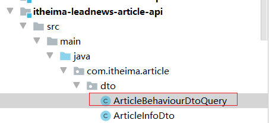

(2)创建controller

```java
@PostMapping("/load/article/behavior")
public Result<Map<String,Object>> loadArticleBehaviour(@RequestBody ArticleBehaviourDtoQuery articleBehaviourDtoQuery){
    Map<String,Object> resultMap = apArticleService.loadArticleBehaviour(articleBehaviourDtoQuery);
    return Result.ok(resultMap);
}
```

 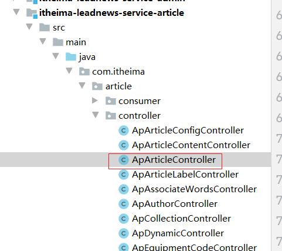

(3)业务实现类

```java
@Override
public Map<String, Object> loadArticleBehaviour(ArticleBehaviourDtoQuery articleBehaviourDtoQuery) {
    //1.定义变量
    //是否喜欢 默认是false
    boolean isunlike=false;
    //是否点赞 默认是false
    boolean islike = false;
    //是否收藏
    boolean isCollection = false;
    //是否关注
    boolean isFollow = false;
    Map<String,Object> resultMap = new HashMap<String,Object>();
    //{"isfollow":true,"islike":true,"isunlike":false,"iscollection":true}
    resultMap.put("isfollow",isFollow);
    resultMap.put("islike",islike);
    resultMap.put("isunlike",isunlike);
    resultMap.put("iscollection",isCollection);
    //2.通过feign调用查询 行为实体        
    //3.查询是否关注  查询是否喜欢  查询是否收藏 查询是否点赞
    //3.1 通过feign调用查询 是否喜欢       
    //3.2 通过feign调用查询 是否点赞       
    //3.3 通过feign调用查询 是否关注
    //3.3.1 首先根据表结构获取相关的思路（根据页面传递的作者的ID 获取到作者表信息 获取到对应的appuser的ID）

    //3.3.2 再根据该appuserId 和当前的用户的appUserId 从关注表中获取到信息 如果不为空即可

    //3.4 查询是否收藏

    //4.获取之后组合map 返回即可

    return resultMap;
}
```

启动类中开启feignclient支持：

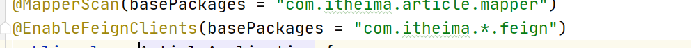


#### 2.3.3 实现查询行为实体

（1）创建feign

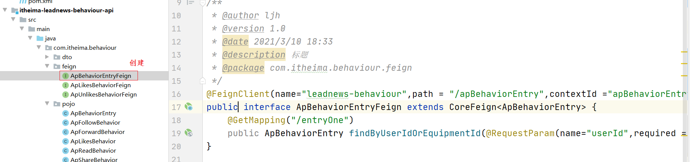

```java
@FeignClient(name="leadnews-behaviour",path = "/apBehaviorEntry",contextId ="apBehaviorEntry" )
public interface ApBehaviorEntryFeign extends CoreFeign<ApBehaviorEntry> {
    @GetMapping("/entryOne")
    public ApBehaviorEntry findByUserIdOrEquipmentId(
            @RequestParam(name="userId",required = true) Integer userId,
            @RequestParam(name="equipmentId",required = true)Integer type);
}

```


（2）在文章微服务中添加依赖：

```xml
<dependency>
    <groupId>com.itheima</groupId>
    <artifactId>itheima-leadnews-behaviour-api</artifactId>
    <version>1.0-SNAPSHOT</version>
</dependency>
```

（3）在行为微服务中实现feign

controller:

 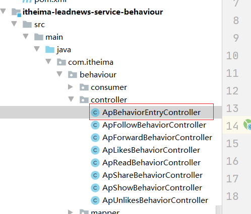

```java
/**
     * 根据设备ID 或者用户的ID 获取实体对象
     * @param userId
     * @param type
     * @return
     */
    @GetMapping("/entryOne")
    public ApBehaviorEntry findByUserIdOrEquipmentId(
            @RequestParam(name="userId",required = true) Integer userId,
            @RequestParam(name="equipmentId",required = true)Integer type){
        if (type > 1 || type < 0) {
            return null;
        }
        return apBehaviorEntryService.findByUserIdOrEquipmentId(userId,type);
    }
```


(4)在文章微服务中调用：

 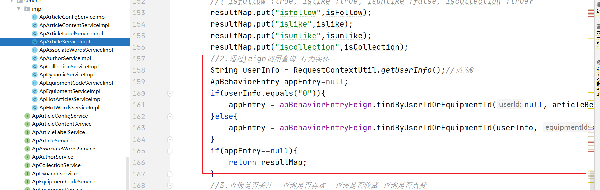

```java
@Autowired
private ApBehaviorEntryFeign apBehaviorEntryFeign;

//略。。。。。


//2.通过feign调用查询 行为实体
String userInfo = RequestContextUtil.getUserInfo();//值为0
ApBehaviorEntry appEntry=null;
if(userInfo.equals("0")){
            //2.如果是匿名用户 则点赞的是设备
            entry= apBehaviorEntryFeign.findByUserIdOrEquipmentId(articleBehaviourDtoQuery.getEquipmentId(), SystemConstants.TYPE_E);
        }else{
            //3.如果是真实的用户 则点赞的是用户
            entry= apBehaviorEntryFeign.findByUserIdOrEquipmentId(Integer.valueOf(userInfo), SystemConstants.TYPE_USER);
        }
if(appEntry==null){
    return resultMap;
}

//略......
```

#### 2.3.4 查询是否喜欢

（1）创建feign接口：

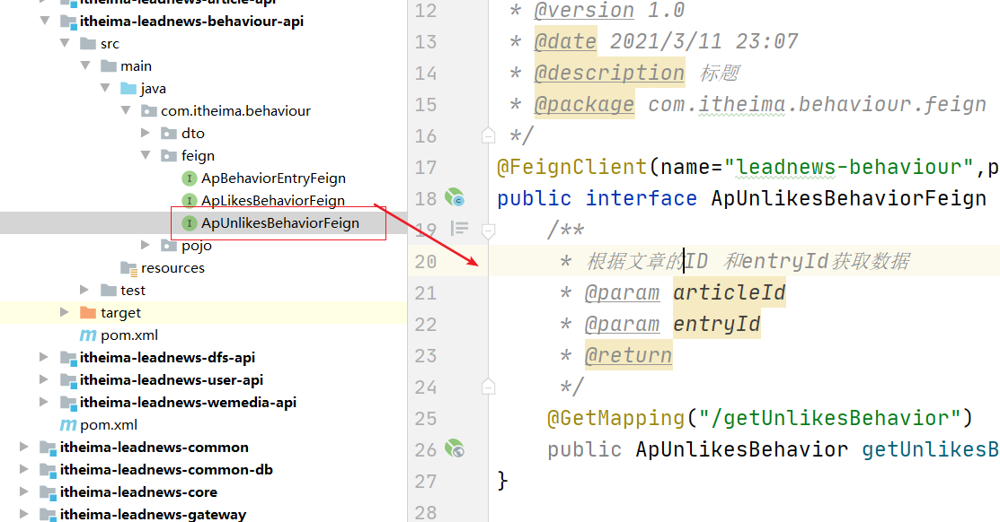

```java
@FeignClient(name="leadnews-behaviour",path = "/apUnlikesBehavior",contextId = "apUnlikesBehavior")
public interface ApUnlikesBehaviorFeign extends CoreFeign<ApUnlikesBehavior> {
    /**
     * 根据文章的ID 和entryId获取数据
     * @param articleId
     * @param entryId
     * @return
     */
    @GetMapping("/getUnlikesBehavior")
    public ApUnlikesBehavior getUnlikesBehavior(@RequestParam(name="articleId") Long articleId,@RequestParam(name="entryId")Integer entryId);
}

```

(2)行为微服务实现feign接口

```java
@GetMapping("/getUnlikesBehavior")
public ApUnlikesBehavior getUnlikesBehavior(@RequestParam(name="articleId") Long articleId, @RequestParam(name="entryId")Integer entryId){
    QueryWrapper<ApUnlikesBehavior> querywraper = new QueryWrapper<ApUnlikesBehavior>();
    querywraper.eq("entry_id",entryId);
    querywraper.eq("article_id",articleId);
    ApUnlikesBehavior apUnlikesBehavior = apUnlikesBehaviorService.getOne(querywraper);
    return apUnlikesBehavior;
}
```

 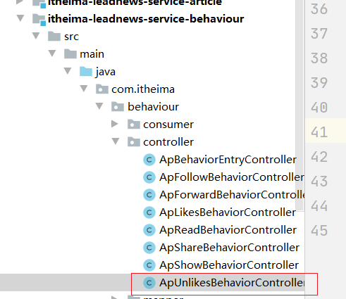

(3)文章微服务中调用：

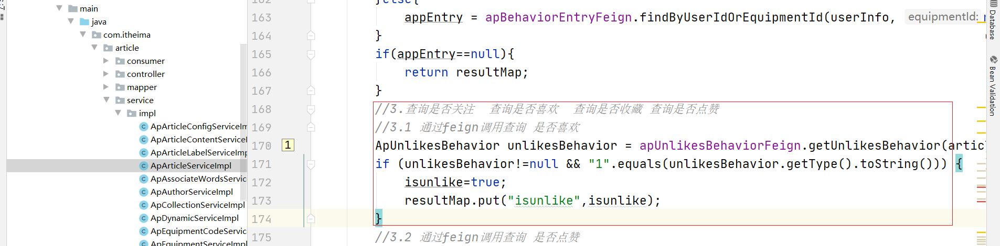


```java
@Autowired
private ApUnlikesBehaviorFeign apUnlikesBehaviorFeign;


//略......
//3.查询是否关注  查询是否喜欢  查询是否收藏 查询是否点赞
//3.1 通过feign调用查询 是否喜欢
ApUnlikesBehavior unlikesBehavior = apUnlikesBehaviorFeign.getUnlikesBehavior(articleBehaviourDtoQuery.getArticleId(), appEntry.getId());
if (unlikesBehavior!=null && "1".equals(unlikesBehavior.getType().toString())) {
    isunlike=true;
    resultMap.put("isunlike",isunlike);
}
//略......
```


#### 2.3.5 查询是否点赞

（1）创建feign

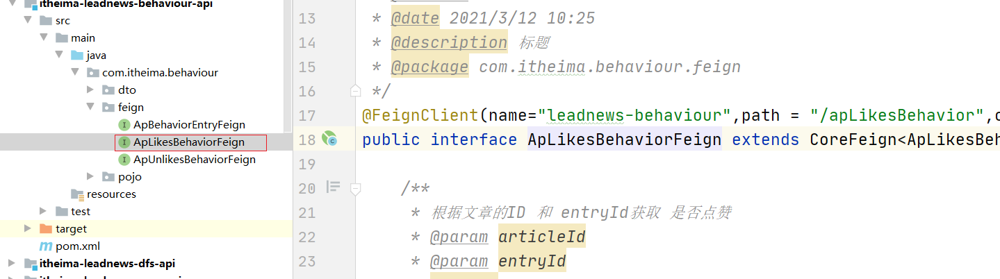

```java
@FeignClient(name="leadnews-behaviour",path = "/apLikesBehavior",contextId = "apLikesBehavior")
public interface ApLikesBehaviorFeign extends CoreFeign<ApLikesBehavior> {

    /**
     * 根据文章的ID 和 entryId获取 是否点赞
     * @param articleId
     * @param entryId
     * @return
     */
    @GetMapping("/getLikesBehavior")
    public ApLikesBehavior getLikesBehavior(@RequestParam(name="articleId") Long articleId, @RequestParam(name="entryId")Integer entryId);

}
```

(2)行为微服务实现feign接口

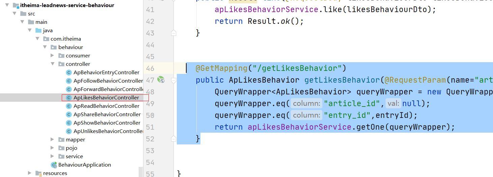

```java
@GetMapping("/getLikesBehavior")
public ApLikesBehavior getLikesBehavior(@RequestParam(name="articleId") Long articleId, @RequestParam(name="entryId")Integer entryId){
    QueryWrapper<ApLikesBehavior> queryWrapper = new QueryWrapper<ApLikesBehavior>();
    queryWrapper.eq("article_id",null);
    queryWrapper.eq("entry_id",entryId);
    return apLikesBehaviorService.getOne(queryWrapper);
}
```


（3）文章微服务调用

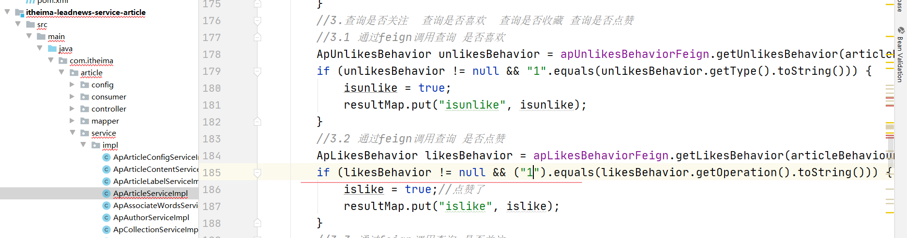


```java
 @Autowired
private ApLikesBehaviorFeign apLikesBehaviorFeign;


//略......
ApLikesBehavior likesBehavior = apLikesBehaviorFeign.getLikesBehavior(articleBehaviourDtoQuery.getArticleId(), appEntry.getId());
//1标识点赞
if(likesBehavior!=null && ("1").equals(likesBehavior.getOperation().toString())){
    islike=true;//点赞了
    resultMap.put("islike",islike);
}
//略....
```


#### 2.3.6 查询是否关注

这个需要注意：

```
关注表是在user微服务中，并且 表中的关注者 和被关注者 对应的存储都是appUser中的ID ，使用时需要用到当前的作者信息。
思路：
先根据作者ID 查询作者信息 在根据作者信息中的userId   和当前的用户的ID 通过feign调用获取到关注表信息。判断即可。
```

（1）在user-api中创建feign接口

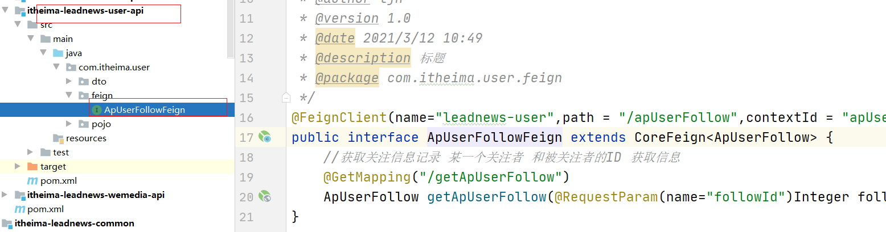

```java
 @FeignClient(name="leadnews-user",path = "/apUserFollow",contextId = "apUserFollow")
public interface ApUserFollowFeign extends CoreFeign<ApUserFollow> {
    //获取关注信息记录 某一个关注者 和被关注者的ID 获取信息
    @GetMapping("/getApUserFollow")
    ApUserFollow getApUserFollow(@RequestParam(name="followId")Integer followId,@RequestParam(name="userId")Integer userId);
}
```

(2)在用户微服务中实现接口：

```java
 @GetMapping("/getApUserFollow")
    ApUserFollow getApUserFollow(@RequestParam(name="followId")Integer followId,@RequestParam(name="userId")Integer userId){

        QueryWrapper<ApUserFollow> queryWrapper = new QueryWrapper<>();
        queryWrapper.eq("follow_id",followId);
        queryWrapper.eq("user_id",userId);
        return apUserFollowService.getOne(queryWrapper);
    }

```

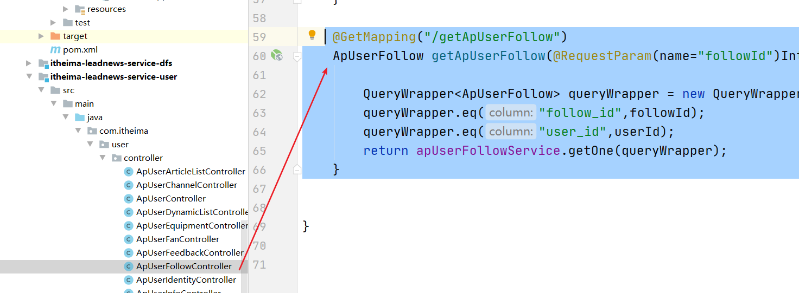

(3)在文章微服务中添加依赖：

```xml
<dependency>
    <groupId>com.itheima</groupId>
    <artifactId>itheima-leadnews-user-api</artifactId>
    <version>1.0-SNAPSHOT</version>
</dependency>
```

(4)调用：

```java
 @Autowired
    private ApAuthorMapper apAuthorMapper;

    @Autowired
    private ApUserFollowFeign apUserFollowFeign;

//略....
ApAuthor apAuthor = apAuthorMapper.selectById(articleBehaviourDtoQuery.getAuthorId());
if(apAuthor!=null){
    Integer followId = apAuthor.getUserId();
    Integer userId = Integer.valueOf(userInfo);
    ApUserFollow apUserFollow = apUserFollowFeign.getApUserFollow(followId, userId);
    //3.3.2 再根据该appuserId 和当前的用户的appUserId 从关注表中获取到信息 如果不为空即可
    if(apUserFollow!=null){
        isFollow=true;
        resultMap.put("isfollow",isFollow);
    }
}
//略...
```

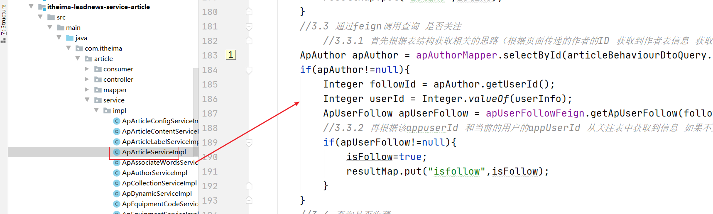


#### 2.3.7 查询是否收藏

查询是否收藏 由于 收藏表在文章微服务直接调用即可

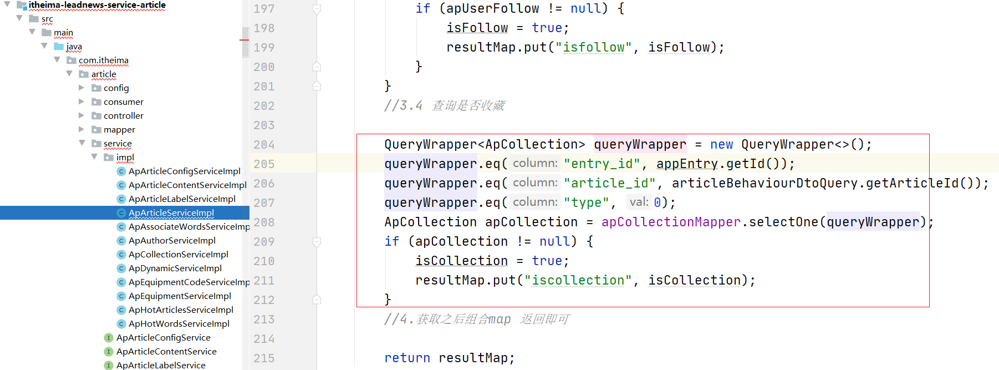

```java
//3.4 查询是否收藏
QueryWrapper<ApCollection> queryWrapper = new QueryWrapper<>();
queryWrapper.eq("entry_id", appEntry.getId());
queryWrapper.eq("article_id", articleBehaviourDtoQuery.getArticleId());
queryWrapper.eq("type", 0);
ApCollection apCollection = apCollectionMapper.selectOne(queryWrapper);
if (apCollection != null) {
    isCollection = true;
    resultMap.put("iscollection", isCollection);
}
```


### 2.4 文章微服务中获取行为的整体代码如下

```java
 @Autowired
    private ApBehaviorEntryFeign apBehaviorEntryFeign;

    @Autowired
    private ApUnlikesBehaviorFeign apUnlikesBehaviorFeign;

    @Autowired
    private ApLikesBehaviorFeign apLikesBehaviorFeign;

    @Autowired
    private ApAuthorMapper apAuthorMapper;

    @Autowired
    private ApUserFollowFeign apUserFollowFeign;

    @Autowired
    private ApCollectionMapper apCollectionMapper;

    @Override
    public Map<String, Object> loadArticleBehaviour(ArticleBehaviourDtoQuery articleBehaviourDtoQuery) {
        //1.定义变量
        //是否喜欢 默认是false
        boolean isunlike=false;
        //是否点赞 默认是false
        boolean islike = false;
        //是否收藏
        boolean isCollection = false;
        //是否关注
        boolean isFollow = false;
        Map<String,Object> resultMap = new HashMap<String,Object>();
        //{"isfollow":true,"islike":true,"isunlike":false,"iscollection":true}
        resultMap.put("isfollow",isFollow);
        resultMap.put("islike",islike);
        resultMap.put("isunlike",isunlike);
        resultMap.put("iscollection",isCollection);
        //2.通过feign调用查询 行为实体
        String userInfo = RequestContextUtil.getUserInfo();//值为0
        ApBehaviorEntry appEntry=null;
      if(userInfo.equals("0")){
            //2.如果是匿名用户 则点赞的是设备
            entry= apBehaviorEntryFeign.findByUserIdOrEquipmentId(articleBehaviourDtoQuery.getEquipmentId(), SystemConstants.TYPE_E);
        }else{
            //3.如果是真实的用户 则点赞的是用户
            entry= apBehaviorEntryFeign.findByUserIdOrEquipmentId(Integer.valueOf(userInfo), SystemConstants.TYPE_USER);
        }
        if(appEntry==null){
            return resultMap;
        }
        //3.查询是否关注  查询是否喜欢  查询是否收藏 查询是否点赞
        //3.1 通过feign调用查询 是否喜欢
        ApUnlikesBehavior unlikesBehavior = apUnlikesBehaviorFeign.getUnlikesBehavior(articleBehaviourDtoQuery.getArticleId(), appEntry.getId());
        if (unlikesBehavior!=null && "1".equals(unlikesBehavior.getType().toString())) {
            isunlike=true;
            resultMap.put("isunlike",isunlike);
        }
        //3.2 通过feign调用查询 是否点赞
        ApLikesBehavior likesBehavior = apLikesBehaviorFeign.getLikesBehavior(articleBehaviourDtoQuery.getArticleId(), appEntry.getId());
        if(likesBehavior!=null && ("1").equals(likesBehavior.getOperation().toString())){
            islike=true;//点赞了
            resultMap.put("islike",islike);
        }
        //3.3 通过feign调用查询 是否关注
            //3.3.1 首先根据表结构获取相关的思路（根据页面传递的作者的ID 获取到作者表信息 获取到对应的appuser的ID）
        ApAuthor apAuthor = apAuthorMapper.selectById(articleBehaviourDtoQuery.getAuthorId());
        if(apAuthor!=null){
            Integer followId = apAuthor.getUserId();
            Integer userId = Integer.valueOf(userInfo);
            ApUserFollow apUserFollow = apUserFollowFeign.getApUserFollow(followId, userId);
            //3.3.2 再根据该appuserId 和当前的用户的appUserId 从关注表中获取到信息 如果不为空即可
            if(apUserFollow!=null){
                isFollow=true;
                resultMap.put("isfollow",isFollow);
            }
        }
        //3.4 查询是否收藏
        QueryWrapper<ApCollection> queryWrapper = new QueryWrapper<>();
        queryWrapper.eq("entry_id", appEntry.getId());
        queryWrapper.eq("article_id", articleBehaviourDtoQuery.getArticleId());
        queryWrapper.eq("type", 0);
        ApCollection apCollection = apCollectionMapper.selectOne(queryWrapper);
        if (apCollection != null) {
            isCollection = true;
            resultMap.put("iscollection", isCollection);
        }
        //4.获取之后组合map 返回即可

        return resultMap;
    }
```

