# 第十一章 app端评论系统开发

## 目标

- 能够完成对mongodb的环境搭建
- 能够掌握mongodb的基本使用
- 能够完成app端评论的查询、发表、点赞等功能
- 能够完成app端评论回复的查询，发表、点赞功能

## 1 Mongodb

### 1.1Mongodb简介

MongoDB是一个开源、高性能、无模式的文档型数据库

**应用场景：**

- 支持文本查询

- 不需要支持事务，不存在复杂的多表查询

- 存储数据可持久化

- 需要TB甚至 PB 级别数据存储

- 需求变化较快，数据模型无法确认，预计使用快速迭代开发形式

- 需要至少2000以上的读写QPS【高性能】

- 能支持快速水平扩展【高扩展】

- 99.999%高可用【高可用】

### 1.2 Mongodb安装

#### 1.2.1 拉取镜像

```shell
docker pull mongo
```

#### 1.2.2 创建容器

```shell
docker run -di --name mongo-service -p 27017:27017 -v ~/data/mongodata:/data  mongo
```


#### 1.2.3 可视化工具

studio3t是mongodb优秀的客户端工具。官方地址在https://studio3t.com/

下载studio3t


同学不用下载，可以使用资料文件夹中提供好的软件安装即可。

 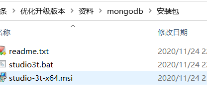

安装并启动

 

创建连接

 

 

 

**注意：以上的链接的ip地址以及端口以自己实际的服务器的ip地址和端口为准**


连接成功：

 

## 2 app端评论-发表评论

### 2.1 需求分析

 

- 文章详情页下方可以查看评论信息，按照点赞数量倒序排列，展示**评论内容、评论的作者、点数数、回复数、时间**，默认查看10条评论，如果想查看更多，可以点击加载更多进行分页
- 可以针对当前文章发布评论
- 可以针对于某一条评论进行点赞操作

### 2.2 思路分析

（1）需要将数据存储到mongodb中，所以先创建两个pojo ，他们之间关系如下

 

思路分析

​	根据文章id发表评论，输入内容发表评论，评论内容不能超过140字，评论内容需要做文本垃圾检测（暂时不做），将数据存储到mongodb中。


需要搭建一个评论微服务，实现相关的功能。


### 2.3 搭建评论微服务

（1）创建项目itheima-leadnews-service-comment

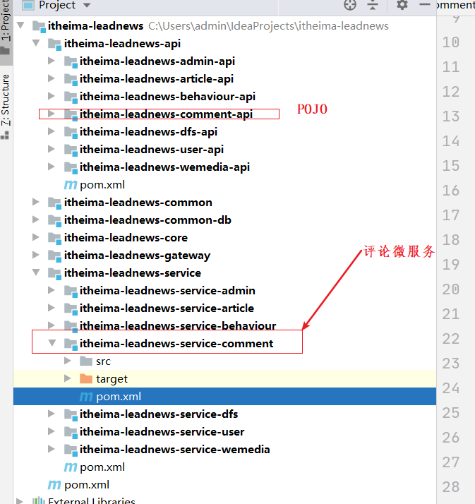

（2）微服务中pom依赖

```xml
<?xml version="1.0" encoding="UTF-8"?>
<project xmlns="http://maven.apache.org/POM/4.0.0"
         xmlns:xsi="http://www.w3.org/2001/XMLSchema-instance"
         xsi:schemaLocation="http://maven.apache.org/POM/4.0.0 http://maven.apache.org/xsd/maven-4.0.0.xsd">
    <parent>
        <artifactId>itheima-leadnews-service</artifactId>
        <groupId>com.itheima</groupId>
        <version>1.0-SNAPSHOT</version>
    </parent>
    <modelVersion>4.0.0</modelVersion>

    <artifactId>itheima-leadnews-service-comment</artifactId>
    <dependencies>
        <dependency>
            <groupId>com.itheima</groupId>
            <artifactId>itheima-leadnews-comment-api</artifactId>
            <version>1.0-SNAPSHOT</version>
        </dependency>

        <dependency>
            <groupId>com.itheima</groupId>
            <artifactId>itheima-leadnews-common-db</artifactId>
            <version>1.0-SNAPSHOT</version>
        </dependency>
        <dependency>
            <groupId>com.itheima</groupId>
            <artifactId>itheima-leadnews-core-controller</artifactId>
            <version>1.0-SNAPSHOT</version>
        </dependency>

        <dependency>
            <groupId>com.itheima</groupId>
            <artifactId>itheima-leadnews-user-api</artifactId>
            <version>1.0-SNAPSHOT</version>
        </dependency>

        <dependency>
            <groupId>org.springframework.boot</groupId>
            <artifactId>spring-boot-starter-data-mongodb</artifactId>
        </dependency>

        <!--junit5 可加可不加-->
        <dependency>
            <groupId>org.springframework.boot</groupId>
            <artifactId>spring-boot-starter-test</artifactId>
            <scope>test</scope>
            <exclusions>
                <exclusion>
                    <groupId>org.junit.vintage</groupId>
                    <artifactId>junit-vintage-engine</artifactId>
                </exclusion>
            </exclusions>
        </dependency>
    </dependencies>
</project>
```

（3）application.yml

```yaml
spring:
  profiles:
    active: dev
---
server:
  port: 9007
spring:
  application:
    name: leadnews-comment
  profiles: dev
  datasource:
    driver-class-name: com.mysql.jdbc.Driver
    url: jdbc:mysql://192.168.211.136:3306/leadnews_comment?useSSL=false&useUnicode=true&characterEncoding=UTF-8&serverTimezone=&serverTimezone=Asia/Shanghai
    username: root
    password: 123456
  cloud:
    nacos:
      server-addr: 192.168.211.136:8848
      discovery:
        server-addr: ${spring.cloud.nacos.server-addr}
  data:
    mongodb:
      host: 192.168.211.136
      port: 27017
      database: leadnews-comment
# 设置Mapper接口所对应的XML文件位置，如果你在Mapper接口中有自定义方法，需要进行该配置
mybatis-plus:
  mapper-locations: classpath*:mapper/*.xml
  # 设置别名包扫描路径，通过该属性可以给包中的类注册别名
  type-aliases-package: com.itheima.article.pojo
  global-config:
    worker-id: 1 #机器ID
    datacenter-id: 1 # 数据中心ID

logging:
  level.com: debug

---
server:
  port: 9007
spring:
  application:
    name: leadnews-user
  profiles: pro
  datasource:
    driver-class-name: com.mysql.jdbc.Driver
    url: jdbc:mysql://192.168.211.136:3306/leadnews_comment?useSSL=false&useUnicode=true&characterEncoding=UTF-8&serverTimezone=&serverTimezone=Asia/Shanghai
    username: root
    password: 123456
  cloud:
    nacos:
      server-addr: 192.168.211.136:8848
      discovery:
        server-addr: ${spring.cloud.nacos.server-addr}
  data:
    mongodb:
      host: 192.168.211.136
      port: 27017
      database: leadnews-comment
# 设置Mapper接口所对应的XML文件位置，如果你在Mapper接口中有自定义方法，需要进行该配置
mybatis-plus:
  mapper-locations: classpath*:mapper/*.xml
  # 设置别名包扫描路径，通过该属性可以给包中的类注册别名
  type-aliases-package: com.itheima.article.pojo
  global-config:
    worker-id: 1 #机器ID
    datacenter-id: 1 # 数据中心ID
---
server:
  port: 9007
spring:
  application:
    name: leadnews-user
  profiles: test
  datasource:
    driver-class-name: com.mysql.jdbc.Driver
    url: jdbc:mysql://192.168.211.136:3306/leadnews_comment?useSSL=false&useUnicode=true&characterEncoding=UTF-8&serverTimezone=Asia/Shanghai
    username: root
    password: 123456
  cloud:
    nacos:
      server-addr: 192.168.211.136:8848
      discovery:
        server-addr: ${spring.cloud.nacos.server-addr}
  data:
    mongodb:
      host: 192.168.211.136
      port: 27017
      database: leadnews-comment
# 设置Mapper接口所对应的XML文件位置，如果你在Mapper接口中有自定义方法，需要进行该配置
mybatis-plus:
  mapper-locations: classpath*:mapper/*.xml
  # 设置别名包扫描路径，通过该属性可以给包中的类注册别名
  type-aliases-package: com.itheima.article.pojo
  global-config:
    worker-id: 1 #机器ID
    datacenter-id: 1 # 数据中心ID
```

数据库其实可以暂时不用。我们先放到这。链接上去。

 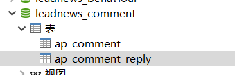


（4）启动类

```java
@SpringBootApplication
@EnableDiscoveryClient
@MapperScan(basePackages = "com.itheima.*.mapper")
@EnableFeignClients(basePackages = "com.itheima.*.feign")
public class CommentApplication {
    public static void main(String[] args) {
        SpringApplication.run(CommentApplication.class,args);
    }
}

```

（5）配置mongodb(已经配置好了)

 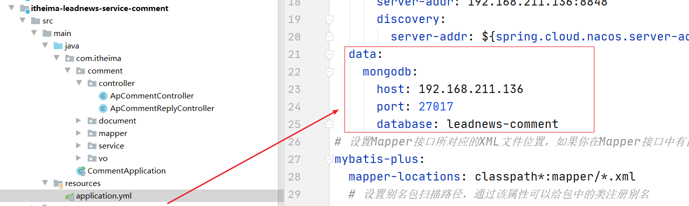

（5）使用代码生成器生成相关的类

 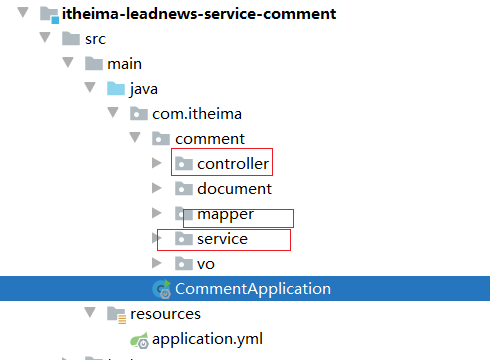

 

(6)创建POJO 映射到mongdb中：

 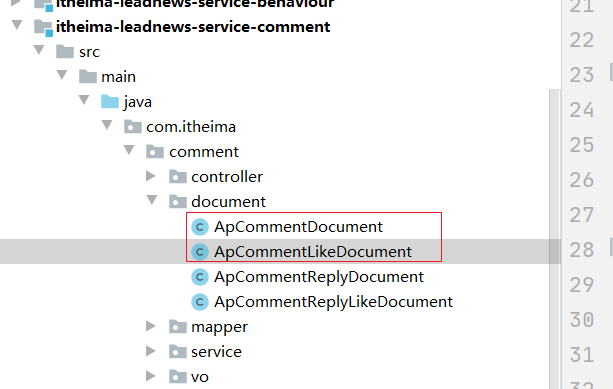

```java
package com.itheima.comment.document;

import lombok.Data;
import org.springframework.data.mongodb.core.mapping.Document;

import java.math.BigDecimal;
import java.time.LocalDateTime;

@Data
@Document("ap_comment")
public class ApCommentDocument {

    /**
     * id 主键
     */
    private String id;

    /**
     * 评论人的ID
     */
    private Integer userId;

    /**
     * 评论人的昵称
     */
    private String nickName;

    /**
     * 评论人的头像
     */
    private String headImage;

    /**
     * 文章id
     */
    private Long articleId;

    /**
     * 文章所属的频道ID
     */
    private Integer channelId;

    /**
     * 评论人写的内容
     */
    private String content;


    /**
     * 总的点赞数
     */
    private Integer likes;

    /**
     * 总的回复数
     */
    private Integer replys;

    /**
     * 经度
     */
    private BigDecimal longitude;

    /**
     * 维度
     */
    private BigDecimal latitude;


    /**
     * 评论时间
     */
    private LocalDateTime createdTime;

    /**
     * 更新时间
     */
    private LocalDateTime updatedTime;

}
```


```java
@Data
@Document("ap_comment_like")
public class ApCommentLikeDocument {

    /**
     * id
     */
    private String id;

    /**
     * 点赞人的ID
     */
    private Integer userId;

    /**
     * 被点赞的评论id
     */
    private String commentId;


    //取消点赞就是 删除评论点赞记录

}
```


**基本的CURD操作mongodb** 回顾：


新版本的springboot 不需要写RunWith

```java
package com.itheima.comment.test;

import com.itheima.comment.document.ApCommentDocument;
import org.junit.jupiter.api.Test;
import org.springframework.beans.factory.annotation.Autowired;
import org.springframework.boot.test.context.SpringBootTest;
import org.springframework.data.domain.PageRequest;
import org.springframework.data.domain.Pageable;
import org.springframework.data.domain.Sort;
import org.springframework.data.mongodb.core.MongoTemplate;
import org.springframework.data.mongodb.core.query.Criteria;
import org.springframework.data.mongodb.core.query.Query;
import org.springframework.data.mongodb.core.query.Update;

import java.util.List;

/**
 * @author ljh
 * @version 1.0
 * @date 2021/3/12 14:28
 * @description 标题
 * @package com.itheima.comment.test
 */
@SpringBootTest
public class MongodbTest {
    @Autowired
    private MongoTemplate mongoTemplate;

    //添加
    @Test
    public void testCreate() {
        for (int i = 0; i < 10; i++) {
            ApCommentDocument apComment = new ApCommentDocument();
            apComment.setContent("这是一个评论");
            apComment.setLikes(20 + i);
            mongoTemplate.insert(apComment);
        }

    }

    //查询一个
    @Test
    public void testFindOne() {
        ApCommentDocument apComment = mongoTemplate.findById("5f7012e03ea2da5788227a6f", ApCommentDocument.class);
        System.out.println(apComment);
    }

    //条件查询
    @Test
    public void testQuery() {
//        Query query = Query.query(Criteria.where("_id").is("5f7012e03ea2da5788227a6f"));
        Query query = Query.query(Criteria.where("likes").lt(28));
        query.with(Sort.by(Sort.Direction.DESC, "likes"));
        Pageable pageable = PageRequest.of(1, 3);
        query.with(pageable);
        List<ApCommentDocument> apComments = mongoTemplate.find(query, ApCommentDocument.class);
        System.out.println(apComments);
    }

    //删除
    @Test
    public void testDelete() {
        mongoTemplate.remove(Query.query(Criteria.where("_id").is("5f7012e03ea2da5788227a6f")), ApCommentDocument.class);
    }

    //修改
    @Test
    public void testUpdate() {
        Query query = Query.query(Criteria.where("_id").is("5f7015e63ea2da1618d173eb"));
        Update update = new Update().set("content", "itcast");
        mongoTemplate.updateMulti(query, update, ApCommentDocument.class);
    }
}

```

 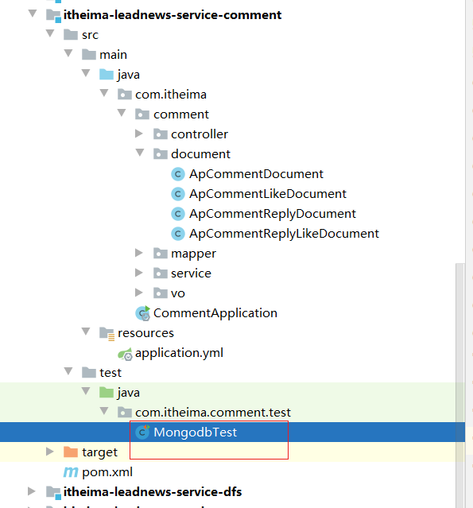


### 2.4 功能实现

#### 2.4.1 需求分析

```java
实现发表评论
APP端 点击按钮 --》输入文字 点击提交即可

后台接收之后，进行保存到mongodb即可
```

发表评论:CommentSaveDto

 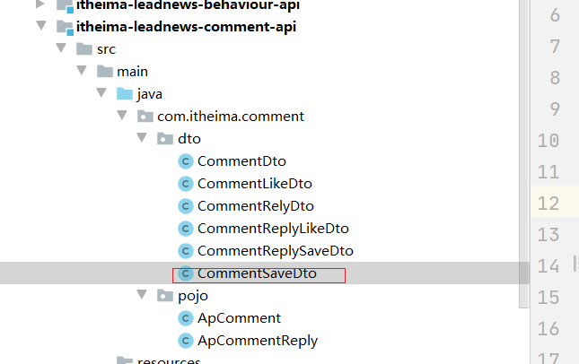

```java
@Data
public class CommentSaveDto {
    /**
     * 文章id
     */
    private Long articleId;

    /**
     * 评论内容
     */
    private String content;
}
```


#### 2.4.2 controller

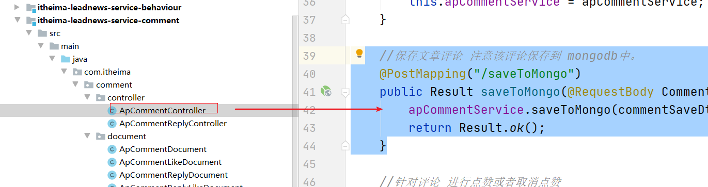

```java
//保存文章评论 注意该评论保存到 mongodb中。
@PostMapping("/saveToMongo")
public Result saveToMongo(@RequestBody CommentSaveDto commentSaveDto) throws Exception {
    apCommentService.saveToMongo(commentSaveDto);
    return Result.ok();
}
```


#### 2.4.3 service层

```java
@Autowired
    private MongoTemplate mongoTemplate;

    @Autowired
    private ApUserFeign apUserFeign;


    @Override
    public void saveToMongo(CommentSaveDto commentSaveDto) throws Exception {
        //1.校验数据是否符合要求
        if(StringUtils.isEmpty(commentSaveDto.getContent()) || commentSaveDto.getArticleId()==null){
            throw new LeadNewsException("评论内容不能为空");
        }
        //2.判断当前用户是否已经登录
        String userInfo = RequestContextUtil.getUserInfo();
        if(userInfo.equals("0")){
            throw new LeadNewsException(StatusCode.NEED_LOGIN.code(),StatusCode.NEED_LOGIN.message());
        }
        //3.设置数据 添加到 mongo中
        ApCommentDocument entity = new ApCommentDocument();
        entity.setLikes(0);
        entity.setReplys(0);
        entity.setContent(commentSaveDto.getContent());
        entity.setUpdatedTime(LocalDateTime.now());
        entity.setCreatedTime(LocalDateTime.now());
        entity.setArticleId(commentSaveDto.getArticleId());
        //entity.setChannelId();
        entity.setUserId(Integer.valueOf(userInfo));
        ApUser apUser = apUserFeign.findById(Integer.valueOf(userInfo)).getData();
        if(apUser!=null){
            entity.setNickName(apUser.getName());
            entity.setHeadImage(apUser.getImage());
        }
        //需要远程调用获取到登录的用户的ap_user对象 中的 头像和 昵称
        mongoTemplate.insert(entity);
    }
```

需要用到feign,所以引入依赖：如果有就不用加了

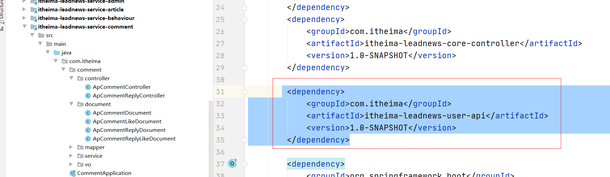

启动类中开启扫描

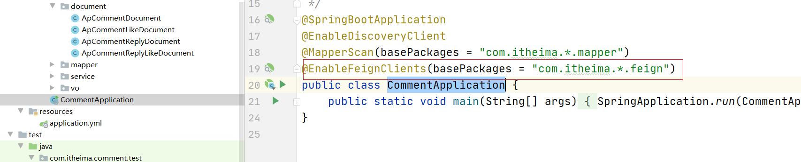


#### 2.4.4 网关进行配置

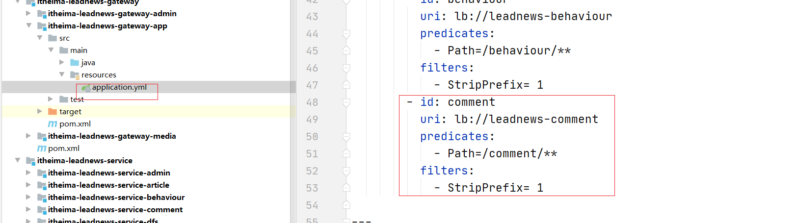

```yaml
spring:
  profiles:
    active: dev
---
server:
  port: 6003
spring:
  application:
    name: leadnews-app-gateway
  profiles: dev
  cloud:
    nacos:
      server-addr: 192.168.211.136:8848
      discovery:
        server-addr: ${spring.cloud.nacos.server-addr}
    gateway:
      globalcors:
        cors-configurations:
          '[/**]': # 匹配所有请求
            allowedOrigins: "*" #跨域处理 允许所有的域
            allowedHeaders: "*"
            allowedMethods: # 支持的方法
              - GET
              - POST
              - PUT
              - DELETE
      routes:
        # 文章微服务
        - id: article
          uri: lb://leadnews-article
          predicates:
            - Path=/article/**
          filters:
            - StripPrefix= 1
        # app用户微服务
        - id: user
          uri: lb://leadnews-user
          predicates:
            - Path=/user/**
          filters:
            - StripPrefix= 1
        - id: behaviour
          uri: lb://leadnews-behaviour
          predicates:
            - Path=/behaviour/**
          filters:
            - StripPrefix= 1
        - id: comment
          uri: lb://leadnews-comment
          predicates:
            - Path=/comment/**
          filters:
            - StripPrefix= 1

---
server:
  port: 6003
spring:
  application:
    name: leadnews-app-gateway
  profiles: test
  cloud:
    nacos:
      server-addr: 192.168.211.136:8848
      discovery:
        server-addr: ${spring.cloud.nacos.server-addr}
    gateway:
      globalcors:
        cors-configurations:
          '[/**]': # 匹配所有请求
            allowedOrigins: "*" #跨域处理 允许所有的域
            allowedHeaders: "*"
            allowedMethods: # 支持的方法
              - GET
              - POST
              - PUT
              - DELETE
      routes:
        # 文章微服务
        - id: article
          uri: lb://leadnews-article
          predicates:
            - Path=/article/**
          filters:
            - StripPrefix= 1
        # app用户微服务
        - id: user
          uri: lb://leadnews-user
          predicates:
            - Path=/user/**
          filters:
            - StripPrefix= 1
        - id: behaviour
          uri: lb://leadnews-behaviour
          predicates:
            - Path=/behaviour/**
          filters:
            - StripPrefix= 1
        - id: comment
          uri: lb://leadnews-comment
          predicates:
            - Path=/comment/**
          filters:
            - StripPrefix= 1
---
server:
  port: 6003
spring:
  application:
    name: leadnews-app-gateway
  profiles: pro
  cloud:
    nacos:
      server-addr: 192.168.211.136:8848
      discovery:
        server-addr: ${spring.cloud.nacos.server-addr}
    gateway:
      globalcors:
        cors-configurations:
          '[/**]': # 匹配所有请求
            allowedOrigins: "*" #跨域处理 允许所有的域
            allowedHeaders: "*"
            allowedMethods: # 支持的方法
              - GET
              - POST
              - PUT
              - DELETE
      routes:
        # 文章微服务
        - id: article
          uri: lb://leadnews-article
          predicates:
            - Path=/article/**
          filters:
            - StripPrefix= 1
        # app用户微服务
        - id: user
          uri: lb://leadnews-user
          predicates:
            - Path=/user/**
          filters:
            - StripPrefix= 1
        - id: behaviour
          uri: lb://leadnews-behaviour
          predicates:
            - Path=/behaviour/**
          filters:
            - StripPrefix= 1
        - id: comment
          uri: lb://leadnews-comment
          predicates:
            - Path=/comment/**
          filters:
            - StripPrefix= 1
```


## 3 app端评论-点赞评论

### 3.1 需求分析

用户点赞，可以增加点赞数量，点赞后不仅仅要增加点赞数，需要记录当前用户对于当前评论的数据记录

用户取消点赞，点赞减一，更新点赞数据


### 3.2 功能实现

#### 3.2.1 dto创建

用户点赞:CommentLikeDto

```java
@Data
public class CommentLikeDto {
    /**
     * 评论id
     */
    private String commentId;

    /**
     * 1：点赞
     * 0：取消点赞
     */
    private Integer operation;
}
```

 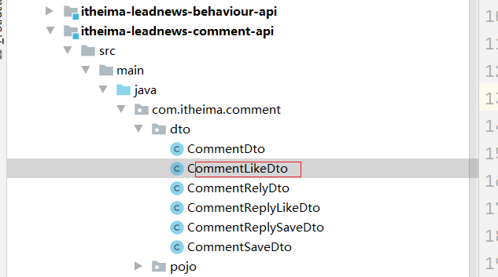


#### 3.2.2 controller

```java
//针对评论 进行点赞或者取消点赞
@PostMapping("/like")
public Result like(@RequestBody CommentLikeDto commentLikeDto) throws Exception {
    if (commentLikeDto == null) {
        throw new LeadNewsException("错误");
    }
    if (commentLikeDto.getCommentId() == null || commentLikeDto.getOperation() == null) {
        throw new LeadNewsException("不能为空");
    }
    apCommentService.like(commentLikeDto);
    return Result.ok();
}
```


#### 3.2.3 service

```java
@Override
    public void like(CommentLikeDto commentLikeDto) throws LeadNewsException {
        //1.校验数据是否符合要求
        if(StringUtils.isEmpty(commentLikeDto.getCommentId()) || commentLikeDto.getOperation()==null){
            throw new LeadNewsException("点赞的评论的ID 和操作类型不能为null");
        }
        if(commentLikeDto.getOperation()>1 || commentLikeDto.getOperation()<0){
            throw new LeadNewsException("operation操作范围只能是0-1");
        }
        //2.判断当前用户是否已经登录
        String userInfo = RequestContextUtil.getUserInfo();
        if(userInfo.equals("0")){
            throw new LeadNewsException(StatusCode.NEED_LOGIN.code(),StatusCode.NEED_LOGIN.message());
        }
        //3.设置数据 添加,删除到 mongo中
        if(commentLikeDto.getOperation()==1){

            //条件判断 如果有点赞了就不用再点赞了
            Query query2 = Query.query(Criteria.where("userId").is(Integer.valueOf(userInfo)).and("commentId").is(commentLikeDto.getCommentId()));
            List<ApCommentLikeDocument> apCommentDocumentLikes = mongoTemplate.find(query2, ApCommentLikeDocument.class);
            if(apCommentDocumentLikes!=null && apCommentDocumentLikes.size()>0){
                return;
            }

            ApCommentLikeDocument entity = new ApCommentLikeDocument();
            entity.setUserId(Integer.valueOf(userInfo));
            entity.setCommentId(commentLikeDto.getCommentId());
            mongoTemplate.save(entity);

            //评论的数量+1   select * from comment where id=?  update
            /*ApCommentDocument apCommentDocument = mongoTemplate.findById(commentLikeDto.getCommentId(), ApCommentDocument.class);
            apCommentDocument.setLikes(apCommentDocument.getLikes()+1);
            mongoTemplate.save(apCommentDocument);*/

            Query query = Query.query(Criteria.where("_id").is(commentLikeDto.getCommentId()));
            Update update = new Update();
            update.inc("likes");//+1
            mongoTemplate.findAndModify(query,update,ApCommentDocument.class);

        }else{
            //取消点赞 delete from xxx where user_id=? and commentId=?
            Query query = Query.query(Criteria.where("userId").is(Integer.valueOf(userInfo)).and("commentId").is(commentLikeDto.getCommentId()));
            mongoTemplate.findAllAndRemove(query,ApCommentLikeDocument.class);

            //点赞数-1
            Query query1 = Query.query(Criteria.where("_id").is(commentLikeDto.getCommentId()));
            Update update = new Update();
            update.inc("likes",-1);//-1
            mongoTemplate.findAndModify(query1,update,ApCommentDocument.class);
        }
    }
```

#### 3.2.4 测试

使用postmen来测试

## 4 app端评论-评论列表

### 4.1 需求分析

 

查询评论列表，根据当前文章id进行检索，按照点赞数量倒序，分页查询（默认10条数据）

```properties
可以参考这个：https://www.cnblogs.com/linhan/p/4248679.html
1.每次查询10条数据 限制
2.下一页的时候，传递最后一个评论数据的 【时间】 根据时间查询数据 并限制10条 即可
```

### 4.2 功能实现

#### 4.2.1 VO定义

由于返回列表数据需要标记该评论是否被点赞过，之前的POJO没有该标记，所以现在添加一个字段进行展示

```java
@Data
public class CommentVo extends ApCommentDocument {

    //1标识被当前用户点赞了    0 标识 该评论没有被当前用点赞
    private Integer operation=0;
}

```

 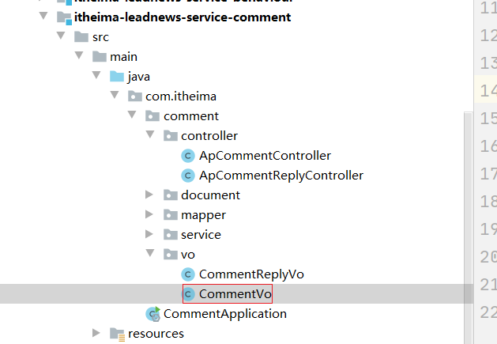


查询评论列表:CommentDto 

```java
/**
 * 评论列表查询的dto 传递当前页中最后一个评论的时间 即为最小时间
 */
@Data
public class CommentDto {

    /**
     * 文章id
     */
    private Long articleId;


    // 最小时间
    private LocalDateTime minDate;

}
```

 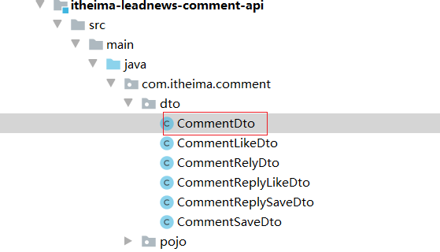


#### 4.2.2 controller


```java
 /**
     * 分页查询 mongodb  返回评论列表展示10条数据限制
     *
     * @return
     */
    @PostMapping("/loadPage")
    public Result<List<CommentVo>> loadPage(@RequestBody CommentDto commentDto) {
        List<CommentVo> list = apCommentService.loadPage(commentDto);
        return Result.ok(list);
    }
```


#### 4.2.3 service层

```java
@Override
    public List<CommentVo> loadPage(CommentDto commentDto) {

        //1查询评论列表
        // select * from comment where creattime < ? and article_id=? order by createtime desc limit 10
        LocalDateTime minDate = commentDto.getMinDate();

        //一页最后一条记录的时间 作为查询条件
        if(minDate==null){
            minDate=LocalDateTime.now();
        }


        Query query = Query.query(
                Criteria.where("articleId").is(commentDto.getArticleId())
                .and("createdTime").lt(minDate)
        );

        //排序
        query.with(Sort.by(Sort.Direction.DESC,"createdTime"));

        //限制（分页） 10条记录
        query.limit(10);

        String userInfo = RequestContextUtil.getUserInfo();


        List<ApCommentDocument> apCommentDocuments = mongoTemplate.find(query, ApCommentDocument.class);

        //2查询当前用户对应的点赞记录 select * from likedocument where userId=? and commentId in (apCommentDocuments的评论ID)
        List<String> ids = apCommentDocuments.stream().map(document -> document.getId()).collect(Collectors.toList());

        List<ApCommentLikeDocument> apCommentLikeDocuments = null;
        if(!userInfo.equals("0")){//真实的用户才能点赞的，所以只查询真实用户的点赞记录
            Query query1 = Query.query(
                    Criteria.where("userId").is(Integer.valueOf(userInfo))
                    .and("commentId").in(ids)
            );
            apCommentLikeDocuments = mongoTemplate.find(query1, ApCommentLikeDocument.class);
        }


        //3组合 设置标记是否被点赞   返回voList
        List<CommentVo> commentVosList =new ArrayList<CommentVo>();
        commentVosList = JSON.parseArray(JSON.toJSONString(apCommentDocuments), CommentVo.class);
        for (CommentVo commentVo : commentVosList) {
            if(apCommentLikeDocuments!=null) {
                for (ApCommentLikeDocument apCommentLikeDocument : apCommentLikeDocuments) {
                    if(apCommentLikeDocument.getCommentId().equals(commentVo.getId())) {
                        commentVo.setOperation(1);
                    }
                }
            }

        }
        return commentVosList;
    }
```

#### 4.2.4 测试

略

## 5 app端评论回复-发表回复、点赞回复、回复列表

### 5.1 需求分析

 

- 当用户点击了评论中的**回复**就可以查看所有评论回复内容

- 可以针对当前评论进行回复，需要更新评论的回复数量

- 可以对当前评论回复列表进行点赞操作，同时记录当前回复评论点赞信息

### 5.2 思路分析

（1）数据实体

操作数据实体为mongodb中的集合，评论回复集合是ap_comment_reply

```java
package com.itheima.comment.document;

import lombok.Data;
import org.springframework.data.mongodb.core.mapping.Document;

import java.math.BigDecimal;
import java.time.LocalDateTime;

@Data
@Document("ap_comment_reply")
public class ApCommentReplyDocument {
    /**
     * id
     */
    private String id;

    /**
     * 写下回复的 用户的ID
     */
    private Integer userId;

    /**
     * 写下回复的 用户的昵称
     */
    private String nickName;

    /**
     * 头像
     */
    private String headImage;

    /**
     * 针对的是哪条 评论id 进行回复
     */
    private String commentId;

    /**
     * 回复的内容
     */
    private String content;

    /**
     * 点赞数（回复本身的点赞数量）
     */
    private Integer likes;

    /**
     * 经度
     */
    private BigDecimal longitude;

    /**
     * 维度
     */
    private BigDecimal latitude;


    /**
     * 创建时间
     */
    private LocalDateTime createdTime;

    /**
     * 更新时间
     */
    private LocalDateTime updatedTime;

}
```

回复的点赞信息记录

```java
package com.itheima.comment.document;

import lombok.Data;
import org.springframework.data.mongodb.core.mapping.Document;

@Data
@Document("ap_comment_reply_like")
public class ApCommentReplyLikeDocument {

    /**
     * id
     */
    private String id;

    /**
     * 点赞了回复的用户ID
     */
    private Integer userId;

    /**
     * 点赞了哪一条回复
     */
    private String commentReplyId;


    //点赞 就是有记录 取消点赞 就是删除记录即可

   /* *//**
     * 1：点赞
     * 0：取消点赞
     *//*
    private Integer operation;*/
}
```

 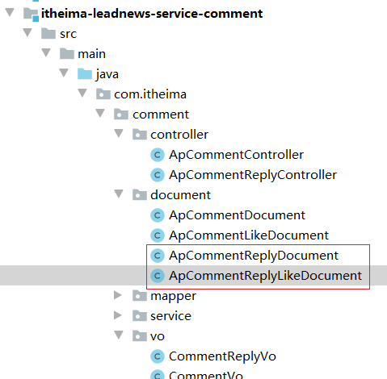


（2）思路分析：

1，用户点击**回复**，根据当前评论id查询对应的所有回复进行展示

2，用户针对于当前的评论进行了回复，需要保存数据，同时需要更新当前评论的回复数

3，可以对回复列表进行点赞操作

### 5.3 功能实现

(1)dto创建

 

CommentReplySaveDto

```java
@Data
public class CommentReplySaveDto {

    //回复内容
    private String content;

    //针对哪一个评论进行回复

    private String commentId;


}
```

CommentReplyLikeDto:

```java
@Data
public class CommentReplyLikeDto {

    /**
     * 针对 回复的ID  为该回复进行点赞或者取消点赞
     */
    private String commentReplyId;

    /**
     * 1：点赞
     * 0：取消点赞
     */
    private Integer operation;
}
```

CommentRelyDto

```java
/**
 * 回复列表查询 传递最后一条回复的时间
 */
@Data
public class CommentRelyDto {

    /**
     * 评论的ID
     */
    private String commentId;


    // 最小时间
    private LocalDateTime minDate;

}
```


(2)controller

```java
 //发表回复
    @PostMapping("/saveReply")
    public Result saveReply(@RequestBody CommentReplySaveDto commentReplySaveDto) throws Exception{
        apCommentReplyService.saveReply(commentReplySaveDto);
        return Result.ok();
    }

    //点赞回复

    @PostMapping("/replyLike")
    public Result replyLike(@RequestBody CommentReplyLikeDto commentReplyLikeDto) throws Exception{
        apCommentReplyService.replyLike(commentReplyLikeDto);
        return Result.ok();
    }

    //获取回复列表


    @PostMapping("/loadPage")
    public Result<List<CommentReplyVo>> loadPage(@RequestBody  CommentRelyDto commentRelyDto){
        List<CommentReplyVo> commentReplyVoList = apCommentReplyService.loadPage(commentRelyDto);
        return Result.ok(commentReplyVoList);
    }
```


加载评论回复列表数据封装类

```java
@Data
public class CommentReplyVo extends ApCommentReplyDocument {

    //标记 当前用户 是否针对该回复 是否被点赞了
    /**
     * 1：点赞了
     * 0：没有点赞
     */
    private Integer operation=0;
}
```


 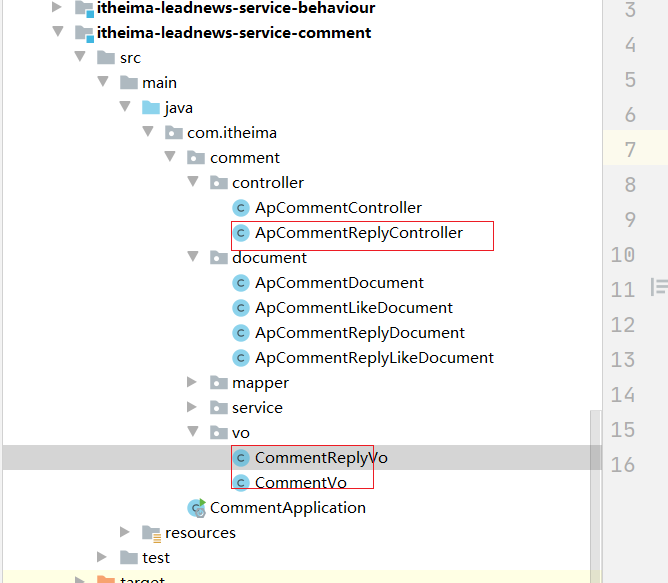


（3）service

```java
@Service
public class ApCommentReplyServiceImpl extends ServiceImpl<ApCommentReplyMapper, ApCommentReply> implements ApCommentReplyService {

    @Autowired
    private MongoTemplate mongoTemplate;

    @Autowired
    private ApUserFeign apUserFeign;


    @Override
    public void saveReply(CommentReplySaveDto commentReplySaveDto) throws  Exception {
        //1.校验数据是否符合要求
        if(StringUtils.isEmpty(commentReplySaveDto.getContent()) || commentReplySaveDto.getCommentId()==null){
            throw new LeadNewsException("回复的内容不能为空，评论ID也不能为空");
        }
        //2.判断当前用户是否已经登录
        String userInfo = RequestContextUtil.getUserInfo();
        if(userInfo.equals("0")){
            throw new LeadNewsException(StatusCode.NEED_LOGIN.code(),StatusCode.NEED_LOGIN.message());
        }
        //3.设置数据 添加到 mongo中
        ApCommentReplyDocument entity = new ApCommentReplyDocument();
        entity.setLikes(0);
        entity.setContent(commentReplySaveDto.getContent());
        entity.setUpdatedTime(LocalDateTime.now());
        entity.setCreatedTime(LocalDateTime.now());
        entity.setCommentId(commentReplySaveDto.getCommentId());

        //指的是写下回复的用户的ID 也就是当前登录用户的ID
        entity.setUserId(Integer.valueOf(userInfo));

        //远程调用  性能      token创建的时候 多添加两个字段  然后网关校验

        //校验之后 将令牌解析出来 解析出 用户的ID 用户的名称 用户的头像
        ApUser apUser = apUserFeign.findById(Integer.valueOf(userInfo)).getData();
        if(apUser!=null){
            entity.setNickName(apUser.getName());
            entity.setHeadImage(apUser.getImage());
        }

        /*String userInfoJson = RequestContextUtil.getUserInfoJson();
        Map map = JSON.parseObject(userInfoJson, Map.class);
        entity.setHeadImage(map.get("headImage").toString());
        entity.setNickName(map.get("nickName").toString());*/
        //需要远程调用获取到登录的用户的ap_user对象 中的 头像和 昵称
        mongoTemplate.insert(entity);

        //要将该回复对应的评论的回复数量+1  todo

        //update xxx set replys=replys+1 where id=? (评论表)

        Query query2 = Query.query(Criteria.where("_id").is(commentReplySaveDto.getCommentId()));
        Update update = new Update();
        update.inc("replys");//+1 评论的回复数量 + 1
        mongoTemplate.findAndModify(query2,update, ApCommentDocument.class);

    }

    @Override
    public void replyLike(CommentReplyLikeDto commentReplyLikeDto) throws Exception{
        //1.校验数据是否符合要求
        if(StringUtils.isEmpty(commentReplyLikeDto.getCommentReplyId()) || commentReplyLikeDto.getOperation()==null){
            throw new LeadNewsException("点赞的评论的ID 和操作类型不能为null");
        }
        if(commentReplyLikeDto.getOperation()>1 || commentReplyLikeDto.getOperation()<0){
            throw new LeadNewsException("operation操作范围只能是0-1");
        }
        //2.判断当前用户是否已经登录
        String userInfo = RequestContextUtil.getUserInfo();
        if(userInfo.equals("0")){
            throw new LeadNewsException(StatusCode.NEED_LOGIN.code(),StatusCode.NEED_LOGIN.message());
        }
        //3.设置数据 添加点赞记录,删除点赞记录到 mongo中
        if(commentReplyLikeDto.getOperation()==1){

            //条件判断 如果有点赞了就不用再点赞了
            Query query2 = Query.query(Criteria.where("userId")
                    .is(Integer.valueOf(userInfo))
                    .and("commentReplyId").is(commentReplyLikeDto.getCommentReplyId()));
            List<ApCommentReplyLikeDocument> likesList = mongoTemplate.find(query2, ApCommentReplyLikeDocument.class);
            if(likesList!=null && likesList.size()>0){
                return;
            }

            ApCommentReplyLikeDocument entity = new ApCommentReplyLikeDocument();
            entity.setUserId(Integer.valueOf(userInfo));
            entity.setCommentReplyId(commentReplyLikeDto.getCommentReplyId());
            mongoTemplate.save(entity);

            //评论的数量+1   select * from comment where id=?  update
            /*ApCommentDocument apCommentDocument = mongoTemplate.findById(commentLikeDto.getCommentId(), ApCommentDocument.class);
            apCommentDocument.setLikes(apCommentDocument.getLikes()+1);
            mongoTemplate.save(apCommentDocument);*/

            Query query = Query.query(Criteria.where("_id").is(commentReplyLikeDto.getCommentReplyId()));
            Update update = new Update();
            update.inc("likes");//+1 回复的点赞数量+1
            mongoTemplate.findAndModify(query,update, ApCommentReplyDocument.class);

        }else{
            //取消点赞 delete from xxx where user_id=? and commentId=?
            Query query = Query.query(Criteria.where("userId").is(Integer.valueOf(userInfo)).and("commentReplyId").is(commentReplyLikeDto.getCommentReplyId()));
            mongoTemplate.findAllAndRemove(query, ApCommentReplyLikeDocument.class);

            //回复的点赞数 -1
            Query query1 = Query.query(Criteria.where("_id").is(commentReplyLikeDto.getCommentReplyId()));
            Update update = new Update();
            update.inc("likes",-1);//-1
            mongoTemplate.findAndModify(query1,update,ApCommentReplyDocument.class);
        }
    }

    @Override
    public List<CommentReplyVo> loadPage(CommentRelyDto commentRelyDto) {
        //1查询评论列表
        // select * from reply where creattime < ? and commentId=? order by createtime desc limit 10
        LocalDateTime minDate = commentRelyDto.getMinDate();

        //一页最后一条记录的时间 作为查询条件
        if(minDate==null){
            minDate=LocalDateTime.now();
        }


        Query query = Query.query(
                Criteria.where("commentId").is(commentRelyDto.getCommentId())
                        .and("createdTime").lt(minDate)
        );

        //排序
        query.with(Sort.by(Sort.Direction.DESC,"createdTime"));

        //限制（分页） 10条记录
        query.limit(10);

        List<ApCommentReplyDocument> replyDocumentList = mongoTemplate.find(query, ApCommentReplyDocument.class);

        //找 当前用户点站了哪些回复
        //2查询当前用户对应的点赞记录 select * from relylike where userId=? and replyId in (回复列表中的 回复ID)
        List<String> ids = replyDocumentList.stream().map(reply -> reply.getId()).collect(Collectors.toList());


        List<ApCommentReplyLikeDocument> replyLikeDocumentList = null;
        String userInfo = RequestContextUtil.getUserInfo();
        if(!userInfo.equals("0")){//真实的用户才能点赞的，所以只查询真实用户的点赞记录
            Query query1 = Query.query(
                    Criteria.where("userId").is(Integer.valueOf(userInfo))
                            .and("commentReplyId").in(ids)
            );
            //一定是张三点赞了的
            replyLikeDocumentList = mongoTemplate.find(query1, ApCommentReplyLikeDocument.class);
        }


        //3组合 设置标记是否被点赞   返回voList
        List<CommentReplyVo> commentReplyVoList =new ArrayList<CommentReplyVo>();

        //目前该数据没有被标记 当前用户是否点赞了该回复
        commentReplyVoList = JSON.parseArray(JSON.toJSONString(replyDocumentList), CommentReplyVo.class);

        if(replyLikeDocumentList!=null) {
            for (CommentReplyVo commentReplyVo : commentReplyVoList) {

                for (ApCommentReplyLikeDocument replyLikeDocument : replyLikeDocumentList) {
                    if (replyLikeDocument.getCommentReplyId().equals(commentReplyVo.getId())) {
                        commentReplyVo.setOperation(1);//匹配上 就是点赞了
                    }
                }
            }
        }
        return commentReplyVoList;
    }
}
```

