# 第十二章 app端文章搜索

## 目标

- 能够熟悉docker搭建ElasticSearch的环境
- 能够掌握创建索引的思路
- 能够完成app端文章的搜索
- 能够完成app端搜索记录的管理
- 能够完成搜索关键词的联想功能

## 1 搭建ElasticSearch环境(给的虚拟机已经搭建)

### 1.1 拉取镜像

```shell
docker pull elasticsearch:7.4.0
```

### 1.2 创建容器

```shell
docker run -di --name elasticsearch -p 9200:9200 -p 9300:9300 -v /usr/share/elasticsearch/plugins:/usr/share/elasticsearch/plugins -e "discovery.type=single-node" elasticsearch:7.4.0
```

开机自启

```shell
docker update --restart=always  elasticsearch
```


### 1.3 配置中文分词器 ik

因为在创建elasticsearch容器的时候，映射了目录，所以可以在宿主机上进行配置ik中文分词器在去选择ik分词器的时候，需要与elasticsearch的版本好对应上，把资料中的`elasticsearch-analysis-ik-7.4.0.zip`上传到服务器上。


执行命令：

```shell
unzip elasticsearch-analysis-ik-7.4.0.zip

mv elasticsearch-analysis-ik-7.4.0 ik

docker cp ./ik elasticsearch:/usr/share/elasticsearch/plugins
```

 

如图 容器中已经有这个目录了。

### 1.4 测试

在浏览器中执行路径：

```properties
http://192.168.211.136:9200/
```

### 1.5 安装kibana

(1)拉取镜像

```shell
docker pull kibana:7.4.0
```

(2)创建容器 配置项参考：

https://www.elastic.co/guide/en/kibana/current/docker.html

```shell
docker run -d --name kibana -p 5601:5601 --link elasticsearch -e "ELASTICSEARCH_URL=http://192.168.211.136:9200" kibana:7.4.0
```

(3)开机自启：

```shell
docker update --restart=always kibana
```

(4)测试:http://192.168.211.136:5601/

 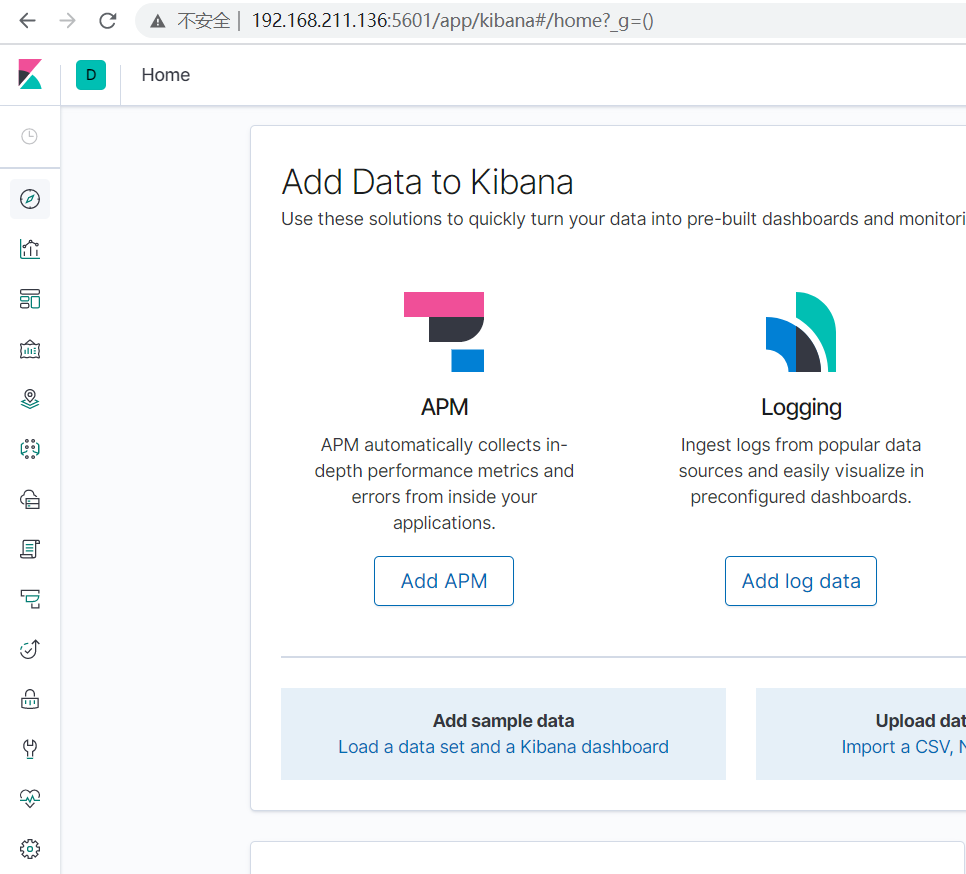

### 1.6 kibana的介绍

#### 1.6.1 介绍

​	我们上面使用的是elasticsearch-head插件实现数据查找的，但是elasticsearch-head的功能比较单一，我们这里需要一个更专业的工具实现对日志的实时分析，也就是我们接下来要讲的kibana。

Kibana 是一款开源的数据分析和可视化平台，它是 Elastic Stack 成员之一，设计用于和 Elasticsearch 协作。您可以使用 Kibana 对 Elasticsearch 索引中的数据进行搜索、查看、交互操作。您可以很方便的利用图表、表格及地图对数据进行多元化的分析和呈现。

Kibana 可以使大数据通俗易懂。它很简单，基于浏览器的界面便于您快速创建和分享动态数据仪表板来追踪 Elasticsearch 的实时数据变化。

#### 1.6.2 使用

可以通过他提供的界面，使用DSL语句实现相关的CRUD的操作。他有提示功能，不用我们去记忆。如图，点击左侧

 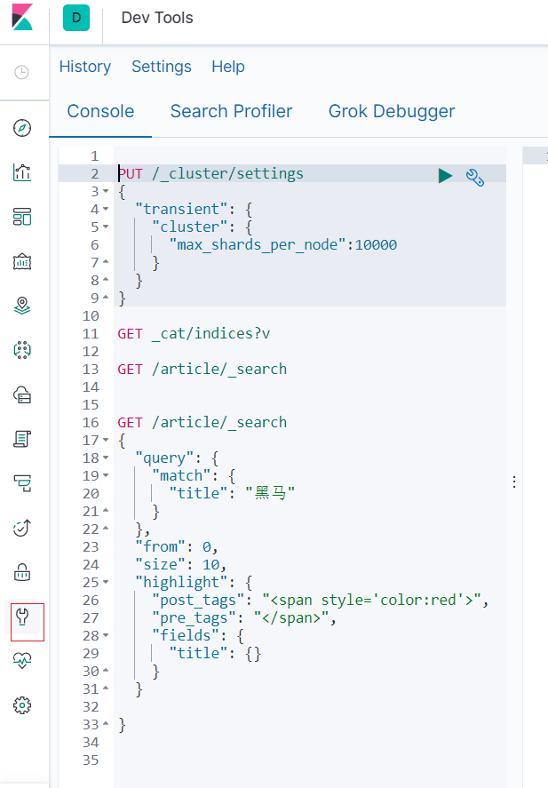

​	Query DSL是一个Java开源框架用于构建类型安全的SQL查询语句。采用API代替传统的拼接字符串来构造查询语句。目前Querydsl支持的平台包括JPA,JDO，SQL，Java Collections，RDF，Lucene，Hibernate Search。elasticsearch提供了一整套基于JSON的查询DSL语言来定义查询。
Query DSL当作是一系列的抽象的查询表达式树(AST)特定查询能够包含其它的查询，(如 bool ), 有些查询能够包含过滤器(如 constant_score), 还有的可以同时包含查询和过滤器 (如 filtered). 都能够从ES支持查询集合里面选择任意一个查询或者是从过滤器集合里面挑选出任意一个过滤器, 这样的话，我们就可以构造出任意复杂（maybe 非常有趣）的查询了。

(1)查询所有索引

```properties
GET /_cat/indices?v
```

(2)删除某个索引

```properties
DELETE /skuinfo
```


(3)新增索引  注意：新增索引的时候也可以添加映射

```properties
PUT /user
```

(4) 创建映射  并查看映射

```properties
# 添加映射
PUT /user/_mapping
{
  "properties": {
    "name":{
      "type": "text",
      "analyzer": "ik_smart",
      "search_analyzer": "ik_smart",
      "store": false
    },
    "city":{
      "type": "text",
      "analyzer": "ik_smart",
      "search_analyzer": "ik_smart",
      "store": false
    },
    "age":{
      "type": "long",
      "store": false
    },
    "description":{
      "type": "text",
      "analyzer": "ik_smart",
      "search_analyzer": "ik_smart",
      "store": false
    }
  }
}
# 查看映射
GET /user/_mapping
```


```properties
https://www.elastic.co/guide/en/elasticsearch/reference/current/explicit-mapping.html
```


（5）新增文档

```
https://www.elastic.co/guide/en/elasticsearch/reference/current/docs-index_.html
```

```properties
PUT /user/_doc/1
{
  "name":"李四",
  "age":22,
  "city":"深圳",
  "description":"李四来自湖北武汉！"
}
```


再新增几条数据进行测试：

```properties
#新增文档数据 id=2
PUT /user/_doc/2
{
  "name":"王五",
  "age":35,
  "city":"深圳",
  "description":"王五家住在深圳！"
}

#新增文档数据 id=3
PUT /user/_doc/3
{
  "name":"张三",
  "age":19,
  "city":"深圳",
  "description":"在深圳打工，来自湖北武汉"
}

#新增文档数据 id=4
PUT /user/_doc/4
{
  "name":"张三丰",
  "age":66,
  "city":"武汉",
  "description":"在武汉读书，家在武汉！"
}

#新增文档数据 id=5
PUT /user/_doc/5
{
  "name":"赵子龙",
  "age":77,
  "city":"广州",
  "description":"赵子龙来自深圳宝安，但是在广州工作！",
  "address":"广东省茂名市"
}

#新增文档数据 id=6
PUT /user/_doc/6
{
  "name":"赵毅",
  "age":55,
  "city":"广州",
  "description":"赵毅来自广州白云区，从事电子商务8年！"
}

#新增文档数据 id=7
PUT /user/_doc/7
{
  "name":"赵哈哈",
  "age":57,
  "city":"武汉",
  "description":"武汉赵哈哈，在深圳打工已有半年了，月薪7500！"
}
```

（6）更新文档

```properties
POST /user/_update/1
{

    "doc": {
       "age":19
    }
 
}
```

(7)删除文档：

```
DELETE /user/_doc/7
```

(8)获取文档

```properties
GET /user/_doc/1
```


(9)过滤查询 查询所有

```properties
GET /user/_search
{
  "query": {
    "match_all": {}
  }
}
```

(10) 排序

```properties
GET /user/_search
{
  "query": {
    "match_all": {}
  },
  "sort": [
    {
      "age": {
        "order": "desc"
      }
    }
  ]
}
```


(11)分页

```properties
GET /user/_search
{
  "query": {
    "match_all": {}
  },
  "from": 0,
  "size": 2, 
  "sort": [
    {
      "age": {
        "order": "desc"
      }
    }
  ]
}
```

(12)term查询

```properties

GET /user/_search
{
  "query": {
    "term": {
      "city": {
        "value": "深圳"
      }
    }
  },
  "from": 0,
  "size": 2, 
  "sort": [
    {
      "age": {
        "order": "desc"
      }
    }
  ]
}

```

(13)范围查询：

```properties
GET /user/_search
{
  "query": {
    "range": {
      "age": {
        "gte": 17,
        "lte": 30
      }
    }
  },
  "from": 0,
  "size": 2, 
  "sort": [
    {
      "age": {
        "order": "desc"
      }
    }
  ]
}
```

(14)bool查询

```properties
GET /user/_search
{
  "query": {
    "bool": {
      "must": [
        {
          "range": {
            "age": {
              "gte": 18,
              "lte": 56
            }
          }
        },{
          "term": {
            "city": {
              "value": "深圳"
            }
          }
        }
      ]
    }
  },
  "from": 0,
  "size": 2, 
  "sort": [
    {
      "age": {
        "order": "desc"
      }
    }
  ]
}
```

(15)高亮

```properties
GET /user/_search
{
  "query": {
    "match": {
      "city": "深圳"
    }
  },
  "from": 0,
  "size": 2, 
  "sort": [
    {
      "age": {
        "order": "desc"
      }
    }
  ],
  "highlight": {
    "pre_tags": "<span>",
    "post_tags": "</span>",
    "fields": {
      "city": {}
    }
  }
}
```


## 2 app端文章搜索

### 2.1 需求分析

搜索页面

 

搜索结果页面

 

- 用户输入关键可搜索文章列表
- 文章列表展示与home展示一样，当用户点击某一篇文章，可查看文章详情

### 2.2 思路分析

为了加快检索的效率，在查询的时候不会直接从数据库中查询文章，需要在elasticsearch中进行高速检索。

实现思路

- 需要把文章相关的数据存储到es索引库中
- 在搜索微服务中进行检索，查询的是es库，展示文章列表，需要根据关键字进行查询
- 在搜索的时候，用户输入了关键字，需要对当前用户记录搜索历史

### 2.3 功能实现

#### 2.3.1 步骤说明

首先要实现功能，需要独立搭建一个搜索微服务，并且将文章数据导入到es中，

然后根据搜索方框输入的值实现分词搜索即可（例如：匹配查询）

大体的步骤如下：

```properties
1.创建微服务工程  添加依赖
2.创建API工程 添加依赖
3.创建POJO 添加注解映射
4.创建启动类 并在启动类中实现数据导入
5.实现搜索功能即可
```

#### 2.3.2 搜索微服务搭建

(1)创建搜索微服务工程和api工程

 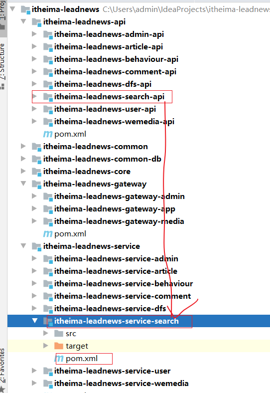

itheima-leadnews-search-api 工程如下依赖：

```xml
<?xml version="1.0" encoding="UTF-8"?>
<project xmlns="http://maven.apache.org/POM/4.0.0"
         xmlns:xsi="http://www.w3.org/2001/XMLSchema-instance"
         xsi:schemaLocation="http://maven.apache.org/POM/4.0.0 http://maven.apache.org/xsd/maven-4.0.0.xsd">
    <parent>
        <artifactId>itheima-leadnews-api</artifactId>
        <groupId>com.itheima</groupId>
        <version>1.0-SNAPSHOT</version>
    </parent>
    <modelVersion>4.0.0</modelVersion>

    <artifactId>itheima-leadnews-search-api</artifactId>

    <dependencies>
        <dependency>
            <groupId>org.springframework.boot</groupId>
            <artifactId>spring-boot-starter-data-elasticsearch</artifactId>
            <exclusions>
                <exclusion>
                    <groupId>org.elasticsearch.client</groupId>
                    <artifactId>elasticsearch-rest-high-level-client</artifactId>
                </exclusion>
                <exclusion>
                    <groupId>org.elasticsearch.client</groupId>
                    <artifactId>elasticsearch-rest-client</artifactId>
                </exclusion>
                <exclusion>
                    <groupId>org.elasticsearch</groupId>
                    <artifactId>elasticsearch</artifactId>
                </exclusion>
            </exclusions>
        </dependency>

        <dependency>
            <groupId>org.elasticsearch.client</groupId>
            <artifactId>elasticsearch-rest-high-level-client</artifactId>
            <version>7.4.0</version>
        </dependency>
        <dependency>
            <groupId>org.elasticsearch.client</groupId>
            <artifactId>elasticsearch-rest-client</artifactId>
            <version>7.4.0</version>
        </dependency>
        <dependency>
            <groupId>org.elasticsearch</groupId>
            <artifactId>elasticsearch</artifactId>
            <version>7.4.0</version>
        </dependency>
    </dependencies>


</project>
```

搜索微服务工程如下：

```xml
<?xml version="1.0" encoding="UTF-8"?>
<project xmlns="http://maven.apache.org/POM/4.0.0"
         xmlns:xsi="http://www.w3.org/2001/XMLSchema-instance"
         xsi:schemaLocation="http://maven.apache.org/POM/4.0.0 http://maven.apache.org/xsd/maven-4.0.0.xsd">
    <parent>
        <artifactId>itheima-leadnews-service</artifactId>
        <groupId>com.itheima</groupId>
        <version>1.0-SNAPSHOT</version>
    </parent>
    <modelVersion>4.0.0</modelVersion>

    <artifactId>itheima-leadnews-service-search</artifactId>


    <dependencies>
        <dependency>
            <groupId>com.itheima</groupId>
            <artifactId>itheima-leadnews-common-db</artifactId>
            <version>1.0-SNAPSHOT</version>
        </dependency>

        <dependency>
            <groupId>com.itheima</groupId>
            <artifactId>itheima-leadnews-search-api</artifactId>
            <version>1.0-SNAPSHOT</version>
        </dependency>

        <dependency>
            <groupId>com.itheima</groupId>
            <artifactId>itheima-leadnews-article-api</artifactId>
            <version>1.0-SNAPSHOT</version>
        </dependency>
        <dependency>
            <groupId>com.itheima</groupId>
            <artifactId>itheima-leadnews-behaviour-api</artifactId>
            <version>1.0-SNAPSHOT</version>
        </dependency>
        <dependency>
            <groupId>com.itheima</groupId>
            <artifactId>itheima-leadnews-core-controller</artifactId>
            <version>1.0-SNAPSHOT</version>
        </dependency>
        <!-- kafka依赖 begin -->
        <dependency>
            <groupId>org.springframework.kafka</groupId>
            <artifactId>spring-kafka</artifactId>
        </dependency>
        <dependency>
            <groupId>org.springframework.kafka</groupId>
            <artifactId>spring-kafka-test</artifactId>
            <scope>test</scope>
        </dependency>


    </dependencies>

</project>
```

(2)启动类

```java
@SpringBootApplication
@EnableDiscoveryClient
@MapperScan(basePackages = "com.itheima.search.mapper")
@EnableFeignClients(basePackages = "com.itheima.*.feign")
public class SearchApplication {
    public static void main(String[] args) {
        SpringApplication.run(SearchApplication.class,args);
    }

    @Bean
    public PaginationInterceptor paginationInterceptor() {
        return new PaginationInterceptor();
    }
}
```

(4)yaml

```yaml
spring:
  profiles:
    active: dev
---
server:
  port: 9008
spring:
  application:
    name: leadnews-search
  profiles: dev
  datasource:
    driver-class-name: com.mysql.jdbc.Driver
    url: jdbc:mysql://192.168.211.136:3306/leadnews_search?useSSL=false&useUnicode=true&characterEncoding=UTF-8&serverTimezone=&serverTimezone=Asia/Shanghai
    username: root
    password: 123456
  cloud:
    nacos:
      server-addr: 192.168.211.136:8848
      discovery:
        server-addr: ${spring.cloud.nacos.server-addr}
  kafka:
    # 配置连接到服务端集群的配置项 ip:port,ip:port
    bootstrap-servers: 192.168.211.136:9092
    producer:
      batch-size: 16384
      buffer-memory: 33554432
      key-serializer: org.apache.kafka.common.serialization.StringSerializer
      retries: 10
      value-serializer: org.apache.kafka.common.serialization.StringSerializer
    consumer:
      auto-offset-reset: earliest
      group-id: search-consumer-group
      # 默认值即为字符串
      key-deserializer: org.apache.kafka.common.serialization.StringDeserializer
      # 默认值即为字符串
      value-deserializer: org.apache.kafka.common.serialization.StringDeserializer
  redis:
    host: 192.168.211.136
  elasticsearch:
    rest:
      uris:
        - http://192.168.211.136:9200
# 设置Mapper接口所对应的XML文件位置，如果你在Mapper接口中有自定义方法，需要进行该配置
mybatis-plus:
  mapper-locations: classpath*:mapper/*.xml
  # 设置别名包扫描路径，通过该属性可以给包中的类注册别名
  type-aliases-package: com.itheima.search.pojo
logging:
  level.org: debug
---
server:
  port: 9008
spring:
  application:
    name: leadnews-search
  profiles: pro
  datasource:
    driver-class-name: com.mysql.jdbc.Driver
    url: jdbc:mysql://192.168.211.136:3306/leadnews_search?useSSL=false&useUnicode=true&characterEncoding=UTF-8&serverTimezone=&serverTimezone=Asia/Shanghai
    username: root
    password: 123456
  cloud:
    nacos:
      server-addr: 192.168.211.136:8848
      discovery:
        server-addr: ${spring.cloud.nacos.server-addr}
  kafka:
    # 配置连接到服务端集群的配置项 ip:port,ip:port
    bootstrap-servers: 192.168.211.136:9092
    producer:
      batch-size: 16384
      buffer-memory: 33554432
      key-serializer: org.apache.kafka.common.serialization.StringSerializer
      retries: 10
      value-serializer: org.apache.kafka.common.serialization.StringSerializer
    consumer:
      auto-offset-reset: earliest
      group-id: search-consumer-group
      # 默认值即为字符串
      key-deserializer: org.apache.kafka.common.serialization.StringDeserializer
      # 默认值即为字符串
      value-deserializer: org.apache.kafka.common.serialization.StringDeserializer
  redis:
    host: 192.168.211.136
  elasticsearch:
    rest:
      uris:
        - http://192.168.211.136:9200
# 设置Mapper接口所对应的XML文件位置，如果你在Mapper接口中有自定义方法，需要进行该配置
mybatis-plus:
  mapper-locations: classpath*:mapper/*.xml
  # 设置别名包扫描路径，通过该属性可以给包中的类注册别名
  type-aliases-package: com.itheima.search.pojo
---
server:
  port: 9008
spring:
  application:
    name: leadnews-search
  profiles: test
  datasource:
    driver-class-name: com.mysql.jdbc.Driver
    url: jdbc:mysql://192.168.211.136:3306/leadnews_search?useSSL=false&useUnicode=true&characterEncoding=UTF-8&serverTimezone=Asia/Shanghai
    username: root
    password: 123456
  cloud:
    nacos:
      server-addr: 192.168.211.136:8848
      discovery:
        server-addr: ${spring.cloud.nacos.server-addr}
  kafka:
    # 配置连接到服务端集群的配置项 ip:port,ip:port
    bootstrap-servers: 192.168.211.136:9092
    producer:
      batch-size: 16384
      buffer-memory: 33554432
      key-serializer: org.apache.kafka.common.serialization.StringSerializer
      retries: 10
      value-serializer: org.apache.kafka.common.serialization.StringSerializer
    consumer:
      auto-offset-reset: earliest
      group-id: search-consumer-group
      # 默认值即为字符串
      key-deserializer: org.apache.kafka.common.serialization.StringDeserializer
      # 默认值即为字符串
      value-deserializer: org.apache.kafka.common.serialization.StringDeserializer
  redis:
    host: 192.168.211.136
  elasticsearch:
    rest:
      uris:
        - http://192.168.211.136:9200
# 设置Mapper接口所对应的XML文件位置，如果你在Mapper接口中有自定义方法，需要进行该配置
mybatis-plus:
  mapper-locations: classpath*:mapper/*.xml
  # 设置别名包扫描路径，通过该属性可以给包中的类注册别名
  type-aliases-package: com.itheima.search.pojo
```


#### 2.3.3 代码生成器生成代码如下

 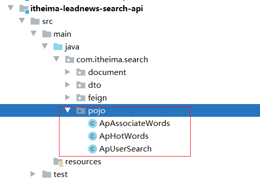


 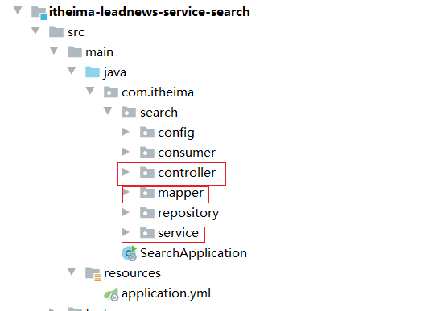


#### 2.3.4 创建POJO添加注解映射

如下 将来我们要搜索文章 为此我们添加如下的字段 并通过注解自动的创建映射。

```java
package com.itheima.search.document;
@Data
//固定为 “_doc”,配置也不会生效
@Document(indexName = "article")
public class ArticleInfoDocument implements Serializable {

    @Id
    //需要将long类型的数据转成字符串，因为es中存储的都是字符串
    @JsonSerialize(using = Long2StringSerializer.class)
    private Long id;

    @Field(type = FieldType.Text,analyzer = "ik_smart")
    private String title;

    private Integer authorId;

    private String authorName;

    private Integer channelId;

    private String channelName;

    private Integer layout;

    private String images;

    private Integer likes;

    private Integer collection;

    private Integer comment;

    private Integer views;

    private LocalDateTime createdTime;

    private LocalDateTime publishTime;


}
```

 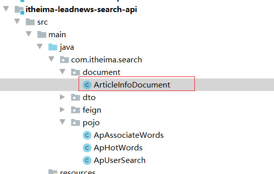


#### 2.3.5 初始化数据导入

当系统重启的时候我们可以一次性执行一次 将文章数据导入到ES服务器中即可

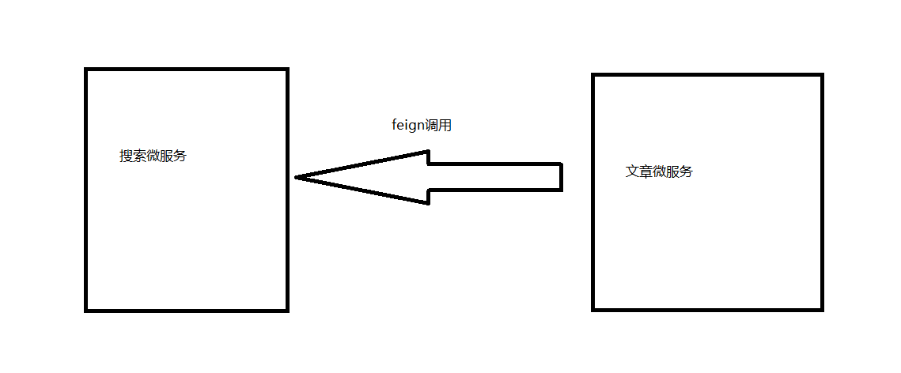

（1）添加依赖

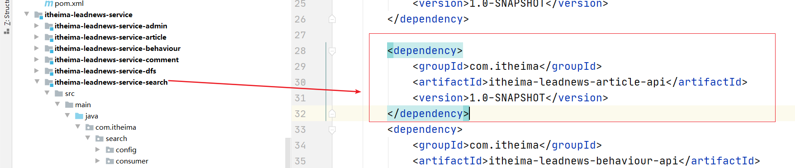

（2）启动类中实现调用通过注解：@PostConstruct


@PostConstruct的作用是 当启动的时候方法会被执行一次。

```java
@Autowired
private ApArticleFeign apArticleFeign;

@Autowired
private ArticleInfoDocumentRepository articleInfoRepository;


//系统启动的时候执行一次即可
@PostConstruct
public void  importEsData(){
    List<ApArticle> data = apArticleFeign.findAll().getData();
    if(data!=null){
        List<ArticleInfoDocument> articleInfos = JSON.parseArray(JSON.toJSONString(data), ArticleInfoDocument.class);
        articleInfoRepository.saveAll(articleInfos);
    }
}
```

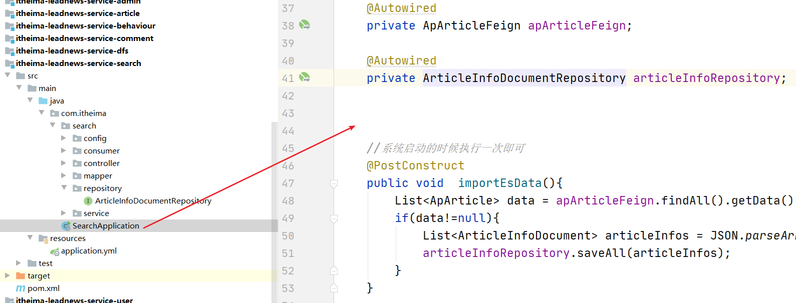


(3)创建Repository

```java
public interface ArticleInfoDocumentRepository extends ElasticsearchRepository<ArticleInfoDocument,Long> {

}
```

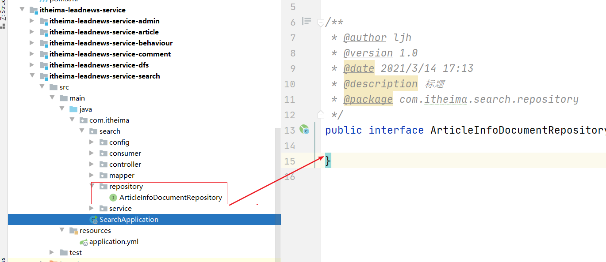


先启动article微服务 再启动搜索微服务即可自动进行导入。


#### 2.3.6 网关配置

首先需要在app的网关中添加搜索微服务的路由配置：

 

```yaml
spring:
  profiles:
    active: dev
---
server:
  port: 6003
spring:
  application:
    name: leadnews-app-gateway
  profiles: dev
  cloud:
    nacos:
      server-addr: 192.168.211.136:8848
      discovery:
        server-addr: ${spring.cloud.nacos.server-addr}
    gateway:
      globalcors:
        cors-configurations:
          '[/**]': # 匹配所有请求
            allowedOrigins: "*" #跨域处理 允许所有的域
            allowedHeaders: "*"
            allowedMethods: # 支持的方法
              - GET
              - POST
              - PUT
              - DELETE
      routes:
        # 文章微服务
        - id: article
          uri: lb://leadnews-article
          predicates:
            - Path=/article/**
          filters:
            - StripPrefix= 1
        # app用户微服务
        - id: user
          uri: lb://leadnews-user
          predicates:
            - Path=/user/**
          filters:
            - StripPrefix= 1
        - id: behaviour
          uri: lb://leadnews-behaviour
          predicates:
            - Path=/behaviour/**
          filters:
            - StripPrefix= 1
        - id: comment
          uri: lb://leadnews-comment
          predicates:
            - Path=/comment/**
          filters:
            - StripPrefix= 1
        - id: search
          uri: lb://leadnews-search
          predicates:
            - Path=/search/**
          filters:
            - StripPrefix= 1

---
server:
  port: 6003
spring:
  application:
    name: leadnews-app-gateway
  profiles: test
  cloud:
    nacos:
      server-addr: 192.168.211.136:8848
      discovery:
        server-addr: ${spring.cloud.nacos.server-addr}
    gateway:
      globalcors:
        cors-configurations:
          '[/**]': # 匹配所有请求
            allowedOrigins: "*" #跨域处理 允许所有的域
            allowedHeaders: "*"
            allowedMethods: # 支持的方法
              - GET
              - POST
              - PUT
              - DELETE
      routes:
        # 文章微服务
        - id: article
          uri: lb://leadnews-article
          predicates:
            - Path=/article/**
          filters:
            - StripPrefix= 1
        # app用户微服务
        - id: user
          uri: lb://leadnews-user
          predicates:
            - Path=/user/**
          filters:
            - StripPrefix= 1
        - id: behaviour
          uri: lb://leadnews-behaviour
          predicates:
            - Path=/behaviour/**
          filters:
            - StripPrefix= 1
        - id: comment
          uri: lb://leadnews-comment
          predicates:
            - Path=/comment/**
          filters:
            - StripPrefix= 1
        - id: search
          uri: lb://leadnews-search
          predicates:
            - Path=/search/**
          filters:
            - StripPrefix= 1
---
server:
  port: 6003
spring:
  application:
    name: leadnews-app-gateway
  profiles: pro
  cloud:
    nacos:
      server-addr: 192.168.211.136:8848
      discovery:
        server-addr: ${spring.cloud.nacos.server-addr}
    gateway:
      globalcors:
        cors-configurations:
          '[/**]': # 匹配所有请求
            allowedOrigins: "*" #跨域处理 允许所有的域
            allowedHeaders: "*"
            allowedMethods: # 支持的方法
              - GET
              - POST
              - PUT
              - DELETE
      routes:
        # 文章微服务
        - id: article
          uri: lb://leadnews-article
          predicates:
            - Path=/article/**
          filters:
            - StripPrefix= 1
        # app用户微服务
        - id: user
          uri: lb://leadnews-user
          predicates:
            - Path=/user/**
          filters:
            - StripPrefix= 1
        - id: behaviour
          uri: lb://leadnews-behaviour
          predicates:
            - Path=/behaviour/**
          filters:
            - StripPrefix= 1
        - id: comment
          uri: lb://leadnews-comment
          predicates:
            - Path=/comment/**
          filters:
            - StripPrefix= 1
        - id: search
          uri: lb://leadnews-search
          predicates:
            - Path=/search/**
          filters:
            - StripPrefix= 1
```

### 2.4 文章搜索功能实现

#### 2.4.1 分析

​	输入文本，再点击按钮的时候，就可以发送请求到后台，后台接收请求和参数之后 执行查询，并返回数据即可，要分页展示即可。

创建dto

```java
@Data
public class SearchDto {

    // 设备ID
    Integer equipmentId;
    /**
     * 搜索关键字
     */
    String keywords;
    /**
     * 当前页
     */
    Integer page;
    /**
     * 分页条数
     */
    Integer size;


}
```

 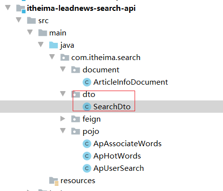


#### 2.4.2 controller

```java
@RestController
@RequestMapping("/article")
public class SearchController {

    @Autowired
    private ArticleInfoDocumentSearchService articleInfoDocumentSearchService;

    /**
     * 分页查询
     *
     * @param searchDto
     * @return
     */
    @PostMapping("/search")
    public Result<PageInfo<ArticleInfoDocument>> search(@RequestBody SearchDto searchDto) {
        PageInfo<ArticleInfoDocument> articleInfo = articleInfoDocumentSearchService.search(searchDto);
        return Result.ok(articleInfo);
    }   

}
```

 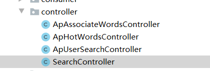


#### 2.4.3 service

```java
public interface ArticleInfoDocumentSearchService {

    PageInfo<ArticleInfoDocument> search(SearchDto searchDto);

}
```


```java
@Service
public class ArticleInfoSearchServiceImpl implements ArticleInfoDocumentSearchService {

    @Autowired
    private ElasticsearchRestTemplate elasticsearchRestTemplate;  


    //kafka 发送消息 进行异步操作 额外定义一个单独的微服务进行search相关数据库的更新。
    //目前暂时放到一起 即：自己是生产者也是消费者。

    @Override
    public PageInfo<ArticleInfoDocument> search(SearchDto searchDto) {

        //1.获取搜索关键字 并设置默认值
        if (StringUtils.isEmpty(searchDto.getKeywords())) {
            //设置默认值
            searchDto.setKeywords("华为");
        }
        //2.获取当前页码 和 分页的条数 如果为null 设置默认值
        if (searchDto.getPage() == null || searchDto.getPage() <= 0) {
            searchDto.setPage(1);
        }
        if (searchDto.getSize() == null || searchDto.getSize() > 10) {
            searchDto.setSize(10);
        }


        //3.创建查询对象
        NativeSearchQueryBuilder nativeSearchQueryBuilder = new NativeSearchQueryBuilder();

        //4.设置查询条件
        nativeSearchQueryBuilder.withQuery(QueryBuilders.matchQuery("title", searchDto.getKeywords()));

        //4.1设置高亮条件
        nativeSearchQueryBuilder.withHighlightFields(new HighlightBuilder.Field("title"));
        nativeSearchQueryBuilder.withHighlightBuilder(new HighlightBuilder()
                .preTags("<span style=\"color:red\">").postTags("</span>"));

        //4.2设置排序和分页
        nativeSearchQueryBuilder.withPageable(PageRequest.of((searchDto.getPage() - 1), searchDto.getSize()));
        nativeSearchQueryBuilder.withSort(SortBuilders.fieldSort("publishTime").order(SortOrder.DESC));
        //5.构建查询对象
        NativeSearchQuery query = nativeSearchQueryBuilder.build();
        //6.执行查询
        SearchHits<ArticleInfoDocument> searchHits = elasticsearchRestTemplate.search(query, ArticleInfoDocument.class, IndexCoordinates.of("article"));
        //获取总记录数
        long totalHits = searchHits.getTotalHits();
        List<ArticleInfoDocument> list = new ArrayList<ArticleInfoDocument>();
        for (SearchHit<ArticleInfoDocument> searchHit : searchHits) {

            ArticleInfoDocument content = searchHit.getContent();
            //获取高亮数据
            Map<String, List<String>> highlightFields = searchHit.getHighlightFields();
            //获取title的高亮
            List<String> list1 = highlightFields.get("title");
            StringBuffer sb = new StringBuffer();
            for (String value : list1) {
                sb.append(value);
            }
            if (!StringUtils.isEmpty(sb)) {
                content.setTitle(sb.toString());
            }
            list.add(content);
        }
        //7.获取结果
        Long totalPages = totalHits / searchDto.getSize();
        if (totalHits % searchDto.getSize() > 0) {
            totalPages++;
        }
        //8.封装返回
        PageInfo<ArticleInfoDocument> objectPageInfo = new PageInfo<ArticleInfoDocument>(Long.valueOf(searchDto.getPage()), Long.valueOf(searchDto.getSize()), totalHits, totalPages, list);

       

        return objectPageInfo;
    }
}
```


测试的时候发现：有转换异常，我们需要自定义一个转换器，将Long类型的数据转换成localDateTime:

如下创建一个配置类：

```java
//https://blog.csdn.net/qq_33302985/article/details/109059044
//https://docs.spring.io/spring-data/elasticsearch/docs/4.2.1/reference/html/#elasticsearch.mapping.meta-model.conversions
//转换器配置
@Configuration
public class ElasticsearchConfiguration extends ElasticsearchConfigurationSupport {

    @Bean
    @Override
    @Primary
    public ElasticsearchCustomConversions elasticsearchCustomConversions() {
        List<Converter> converters = new ArrayList<>();
        converters.add(DateToLocalDateTimeConverter.INSTANCE);
        converters.add(StringToLocalDateTimeConverter.INSTANCE);
        converters.add(LongToLocalDateTimeConverter.INSTANCE);
        return new ElasticsearchCustomConversions(converters);
    }

    //long类型转成时间类型
    @ReadingConverter
    enum LongToLocalDateTimeConverter implements Converter<Long, LocalDateTime> {

        INSTANCE;

        @Override
        public LocalDateTime convert(Long source) {
            return Instant.ofEpochMilli(source).atZone(ZoneId.systemDefault()).toLocalDateTime();
        }

    }

    //strig类型转成时间类型
    @ReadingConverter
    enum StringToLocalDateTimeConverter implements Converter<String, LocalDateTime> {

        INSTANCE;

        @Override
        public LocalDateTime convert(String source) {
            DateTimeFormatter df = DateTimeFormatter.ofPattern("yyyy-MM-dd HH:mm:ss");
            return LocalDateTime.parse(source, df);
        }

    }

    //写将日期类型转换成时间类型
    @WritingConverter
    enum DateToLocalDateTimeConverter implements Converter<Date, LocalDateTime> {

        INSTANCE;

        @Override
        public LocalDateTime convert(Date date) {
            Instant instant = date.toInstant();
            return instant.atZone(ZoneId.systemDefault()).toLocalDateTime();
        }
    }
}
```


### 2.5 实现文章自动审核构建索引数据

#### 2.5.1 分析

在之前我们做了文章的自动审核，如果审核通过，则需要将数据存储到ES中。之前没有做，现在来做。

思路分析：

```properties
在审核通过之后，调用feign 直接将数据传递给搜素微服务，搜素微服务讲数据存储到es中即可
```

#### 2.5.2 添加依赖

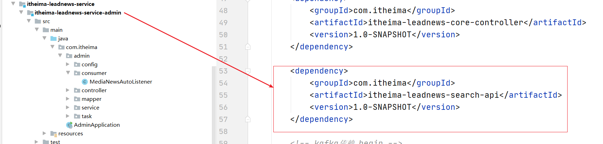


#### 2.5.3 创建feign

```java
@FeignClient(name = "leadnews-search", path = "/article", contextId = "article")
public interface ArticleDocumentSearchFeign {
    /**
     * 保存数据
     *
     * @param articleInfoDocument
     * @return
     */
    @PostMapping("/save")
    public Result saveToEs(@RequestBody ArticleInfoDocument articleInfoDocument);

}
```

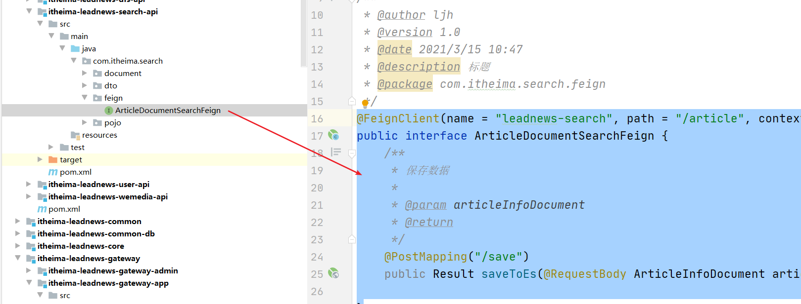


#### 2.5.4 实现feign

controller

```java
 /**
     * 添加信息
     *
     * @param articleInfoDocument
     * @return
     */
    @PostMapping("/save")
    public Result saveToEs(@RequestBody ArticleInfoDocument articleInfoDocument) {
        articleInfoDocumentSearchService.save(articleInfoDocument);
        return Result.ok();
    }
```

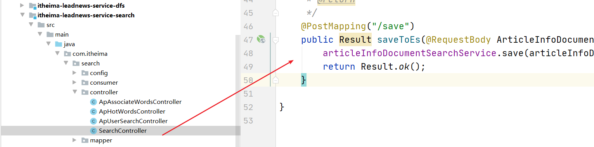

service:

```java
  @Autowired
    private ArticleInfoDocumentRepository articleInfoRepository;

@Override
public void save(ArticleInfoDocument articleInfoDocument) {
    articleInfoRepository.save(articleInfoDocument);
}
```


## 3 app端搜索-搜索记录

### 3.1 需求分析

 

- 展示用户的搜索历史5条（点击搜索历史记录）
- 可以删除搜索记录
- 用户输入文本点击搜索的时候需要将搜索的文本存储到搜索信息表中

### 3.2 思路分析

ap_user_search APP用户搜索信息表:

 

```java
1.当搜索的时候 添加数据到搜索信息表中的时候 可以采用异步，通过发送消息的方式存储
2.注意，点击查看【搜索记录】发送请求到后台 可以获取到记录列表即可
3.点击删除提示的时候 将搜索记录删除（我们不需要删除数据，只修改状态栏位 做为一个标记）
```

### 3.3 保存搜索记录

#### 3.3.1 添加kafka依赖

```yaml
kafka:
    # 配置连接到服务端集群的配置项 ip:port,ip:port
    bootstrap-servers: 192.168.211.136:9092
    producer:
      batch-size: 16384
      buffer-memory: 33554432
      key-serializer: org.apache.kafka.common.serialization.StringSerializer
      retries: 10
      value-serializer: org.apache.kafka.common.serialization.StringSerializer
    consumer:
      auto-offset-reset: earliest
      group-id: search-consumer-group
      # 默认值即为字符串
      key-deserializer: org.apache.kafka.common.serialization.StringDeserializer
      # 默认值即为字符串
      value-deserializer: org.apache.kafka.common.serialization.StringDeserialize
```

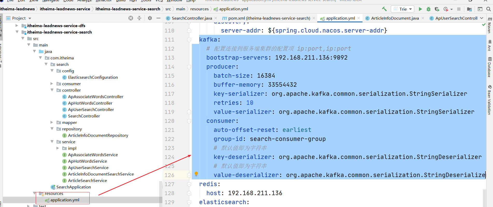

```yaml
spring:
  profiles:
    active: dev
---
server:
  port: 9008
spring:
  application:
    name: leadnews-search
  profiles: dev
  datasource:
    driver-class-name: com.mysql.jdbc.Driver
    url: jdbc:mysql://192.168.211.136:3306/leadnews_search?useSSL=false&useUnicode=true&characterEncoding=UTF-8&serverTimezone=&serverTimezone=Asia/Shanghai
    username: root
    password: 123456
  cloud:
    nacos:
      server-addr: 192.168.211.136:8848
      discovery:
        server-addr: ${spring.cloud.nacos.server-addr}
  kafka:
    # 配置连接到服务端集群的配置项 ip:port,ip:port
    bootstrap-servers: 192.168.211.136:9092
    producer:
      batch-size: 16384
      buffer-memory: 33554432
      key-serializer: org.apache.kafka.common.serialization.StringSerializer
      retries: 10
      value-serializer: org.apache.kafka.common.serialization.StringSerializer
    consumer:
      auto-offset-reset: earliest
      group-id: search-consumer-group
      # 默认值即为字符串
      key-deserializer: org.apache.kafka.common.serialization.StringDeserializer
      # 默认值即为字符串
      value-deserializer: org.apache.kafka.common.serialization.StringDeserializer
  redis:
    host: 192.168.211.136
  elasticsearch:
    rest:
      uris:
        - http://192.168.211.136:9200
# 设置Mapper接口所对应的XML文件位置，如果你在Mapper接口中有自定义方法，需要进行该配置
mybatis-plus:
  mapper-locations: classpath*:mapper/*.xml
  # 设置别名包扫描路径，通过该属性可以给包中的类注册别名
  type-aliases-package: com.itheima.search.pojo
logging:
  level.org: debug
---
server:
  port: 9008
spring:
  application:
    name: leadnews-search
  profiles: pro
  datasource:
    driver-class-name: com.mysql.jdbc.Driver
    url: jdbc:mysql://192.168.211.136:3306/leadnews_search?useSSL=false&useUnicode=true&characterEncoding=UTF-8&serverTimezone=&serverTimezone=Asia/Shanghai
    username: root
    password: 123456
  cloud:
    nacos:
      server-addr: 192.168.211.136:8848
      discovery:
        server-addr: ${spring.cloud.nacos.server-addr}
  kafka:
    # 配置连接到服务端集群的配置项 ip:port,ip:port
    bootstrap-servers: 192.168.211.136:9092
    producer:
      batch-size: 16384
      buffer-memory: 33554432
      key-serializer: org.apache.kafka.common.serialization.StringSerializer
      retries: 10
      value-serializer: org.apache.kafka.common.serialization.StringSerializer
    consumer:
      auto-offset-reset: earliest
      group-id: search-consumer-group
      # 默认值即为字符串
      key-deserializer: org.apache.kafka.common.serialization.StringDeserializer
      # 默认值即为字符串
      value-deserializer: org.apache.kafka.common.serialization.StringDeserializer
  redis:
    host: 192.168.211.136
  elasticsearch:
    rest:
      uris:
        - http://192.168.211.136:9200
# 设置Mapper接口所对应的XML文件位置，如果你在Mapper接口中有自定义方法，需要进行该配置
mybatis-plus:
  mapper-locations: classpath*:mapper/*.xml
  # 设置别名包扫描路径，通过该属性可以给包中的类注册别名
  type-aliases-package: com.itheima.search.pojo
---
server:
  port: 9008
spring:
  application:
    name: leadnews-search
  profiles: test
  datasource:
    driver-class-name: com.mysql.jdbc.Driver
    url: jdbc:mysql://192.168.211.136:3306/leadnews_search?useSSL=false&useUnicode=true&characterEncoding=UTF-8&serverTimezone=Asia/Shanghai
    username: root
    password: 123456
  cloud:
    nacos:
      server-addr: 192.168.211.136:8848
      discovery:
        server-addr: ${spring.cloud.nacos.server-addr}
  kafka:
    # 配置连接到服务端集群的配置项 ip:port,ip:port
    bootstrap-servers: 192.168.211.136:9092
    producer:
      batch-size: 16384
      buffer-memory: 33554432
      key-serializer: org.apache.kafka.common.serialization.StringSerializer
      retries: 10
      value-serializer: org.apache.kafka.common.serialization.StringSerializer
    consumer:
      auto-offset-reset: earliest
      group-id: search-consumer-group
      # 默认值即为字符串
      key-deserializer: org.apache.kafka.common.serialization.StringDeserializer
      # 默认值即为字符串
      value-deserializer: org.apache.kafka.common.serialization.StringDeserializer
  redis:
    host: 192.168.211.136
  elasticsearch:
    rest:
      uris:
        - http://192.168.211.136:9200
# 设置Mapper接口所对应的XML文件位置，如果你在Mapper接口中有自定义方法，需要进行该配置
mybatis-plus:
  mapper-locations: classpath*:mapper/*.xml
  # 设置别名包扫描路径，通过该属性可以给包中的类注册别名
  type-aliases-package: com.itheima.search.pojo
```

#### 3.3.2 发送消息

```java
  @Autowired
    private ArticleInfoDocumentRepository articleInfoRepository;

    @Autowired
    private KafkaTemplate kafkaTemplate; 
private void sendMessage(SearchDto searchDto) {
        //发送异步消息  {type:0,keywords:"关键字",userId:"用户的ID或者是设备的ID"}
        Map<String,String> messageInfo = new HashMap<>();

        String userInfo = RequestContextUtil.getUserInfo();
        if(userInfo.equals("0")){
            messageInfo.put("type","0");
            messageInfo.put("userId",searchDto.getEquipmentId().toString());

        }else {
            messageInfo.put("type","1");
            messageInfo.put("userId",userInfo);
        }
        messageInfo.put("keywords",keywords);

        try {
            kafkaTemplate.send(BusinessConstants.MqConstants.SEARCH_BEHAVIOR_TOPIC, JSON.toJSONString(messageInfo));

        } catch (Exception e) {
            e.printStackTrace();
        }
    }
```


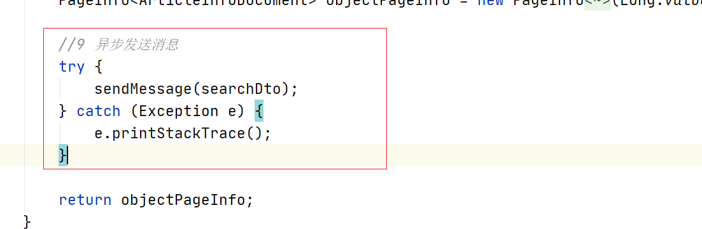


整体代码:

```java
package com.itheima.search.service.impl;

import com.alibaba.fastjson.JSON;
import com.itheima.common.constants.BusinessConstants;
import com.itheima.common.pojo.PageInfo;
import com.itheima.common.util.RequestContextUtil;
import com.itheima.search.document.ArticleInfoDocument;
import com.itheima.search.dto.SearchDto;
import com.itheima.search.repository.ArticleInfoDocumentRepository;
import com.itheima.search.service.ArticleInfoDocumentSearchService;
import org.elasticsearch.index.query.QueryBuilders;
import org.elasticsearch.search.fetch.subphase.highlight.HighlightBuilder;
import org.elasticsearch.search.sort.SortBuilders;
import org.elasticsearch.search.sort.SortOrder;
import org.springframework.beans.factory.annotation.Autowired;
import org.springframework.data.domain.PageRequest;
import org.springframework.data.elasticsearch.core.ElasticsearchRestTemplate;
import org.springframework.data.elasticsearch.core.SearchHit;
import org.springframework.data.elasticsearch.core.SearchHits;
import org.springframework.data.elasticsearch.core.mapping.IndexCoordinates;
import org.springframework.data.elasticsearch.core.query.NativeSearchQuery;
import org.springframework.data.elasticsearch.core.query.NativeSearchQueryBuilder;
import org.springframework.kafka.core.KafkaTemplate;
import org.springframework.stereotype.Service;
import org.springframework.util.StringUtils;

import java.util.ArrayList;
import java.util.HashMap;
import java.util.List;
import java.util.Map;

/**
 * @author ljh
 * @version 1.0
 * @date 2021/3/14 21:25
 * @description 标题
 * @package com.itheima.search.service.impl
 */
@Service
public class ArticleInfoSearchServiceImpl implements ArticleInfoDocumentSearchService {

    @Autowired
    private ElasticsearchRestTemplate elasticsearchRestTemplate;
    @Autowired
    private ArticleInfoDocumentRepository articleInfoRepository;

    @Autowired
    private KafkaTemplate kafkaTemplate;


    //kafka 发送消息 进行异步操作 额外定义一个单独的微服务进行search相关数据库的更新。
    //目前暂时放到一起 即：自己是生产者也是消费者。

    @Override
    public PageInfo<ArticleInfoDocument> search(SearchDto searchDto) {

        //1.获取搜索关键字 并设置默认值
        if (StringUtils.isEmpty(searchDto.getKeywords())) {
            //设置默认值
            searchDto.setKeywords("华为");
        }
        //2.获取当前页码 和 分页的条数 如果为null 设置默认值
        if (searchDto.getPage() == null || searchDto.getPage() <= 0) {
            searchDto.setPage(1);
        }
        if (searchDto.getSize() == null || searchDto.getSize() > 10) {
            searchDto.setSize(10);
        }


        //3.创建查询对象
        NativeSearchQueryBuilder nativeSearchQueryBuilder = new NativeSearchQueryBuilder();

        //4.设置查询条件
        nativeSearchQueryBuilder.withQuery(QueryBuilders.matchQuery("title", searchDto.getKeywords()));

        //4.1设置高亮条件
        nativeSearchQueryBuilder.withHighlightFields(new HighlightBuilder.Field("title"));
        nativeSearchQueryBuilder.withHighlightBuilder(new HighlightBuilder()
                .preTags("<span style=\"color:red\">").postTags("</span>"));

        //4.2设置排序和分页
        nativeSearchQueryBuilder.withPageable(PageRequest.of((searchDto.getPage() - 1), searchDto.getSize()));
        nativeSearchQueryBuilder.withSort(SortBuilders.fieldSort("publishTime").order(SortOrder.DESC));
        //5.构建查询对象
        NativeSearchQuery query = nativeSearchQueryBuilder.build();
        //6.执行查询
        SearchHits<ArticleInfoDocument> searchHits = elasticsearchRestTemplate.search(query, ArticleInfoDocument.class, IndexCoordinates.of("article"));
        //获取总记录数
        long totalHits = searchHits.getTotalHits();
        List<ArticleInfoDocument> list = new ArrayList<ArticleInfoDocument>();
        for (SearchHit<ArticleInfoDocument> searchHit : searchHits) {

            ArticleInfoDocument content = searchHit.getContent();
            //获取高亮数据
            Map<String, List<String>> highlightFields = searchHit.getHighlightFields();
            //获取title的高亮
            List<String> list1 = highlightFields.get("title");
            StringBuffer sb = new StringBuffer();
            for (String value : list1) {
                sb.append(value);
            }
            if (!StringUtils.isEmpty(sb)) {
                content.setTitle(sb.toString());
            }
            list.add(content);
        }
        //7.获取结果
        Long totalPages = totalHits / searchDto.getSize();
        if (totalHits % searchDto.getSize() > 0) {
            totalPages++;
        }
        //8.封装返回
        PageInfo<ArticleInfoDocument> objectPageInfo = new PageInfo<ArticleInfoDocument>(Long.valueOf(searchDto.getPage()), Long.valueOf(searchDto.getSize()), totalHits, totalPages, list);

        //9 异步发送消息
        try {
            sendMessage(searchDto);
        } catch (Exception e) {
            e.printStackTrace();
        }

        return objectPageInfo;
    }

    private void sendMessage(SearchDto searchDto) {
       //发送异步消息  {type:0,keywords:"关键字",userId:"用户的ID或者是设备的ID"}
        Map<String,String> messageInfo = new HashMap<>();

        String userInfo = RequestContextUtil.getUserInfo();
        if(userInfo.equals("0")){
            messageInfo.put("type","0");
            messageInfo.put("userId",searchDto.getEquipmentId().toString());

        }else {
            messageInfo.put("type","1");
            messageInfo.put("userId",userInfo);
        }
        messageInfo.put("keywords",keywords);

        try {
            kafkaTemplate.send(BusinessConstants.MqConstants.SEARCH_BEHAVIOR_TOPIC, JSON.toJSONString(messageInfo));

        } catch (Exception e) {
            e.printStackTrace();
        }
    }

    @Override
    public void save(ArticleInfoDocument articleInfoDocument) {
        articleInfoRepository.save(articleInfoDocument);
    }
}

```

创建常量：

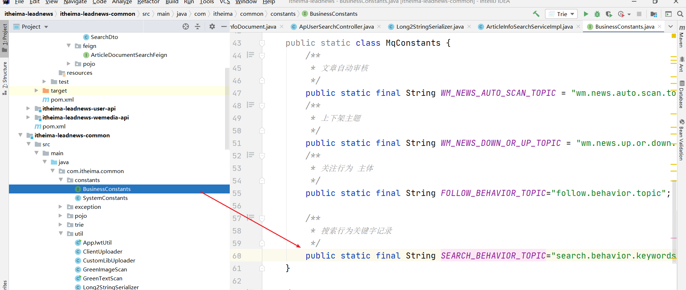


```java
 /**
         * 搜索行为关键字记录
         */
        public static final String SEARCH_BEHAVIOR_TOPIC="search.behavior.keywords.topic";
```

#### 3.3.3 消费者接受消息

（1）创建消费者

```java
@Component
public class SearchUserBehaviourConsumer {

    @Autowired
    private ApUserSearchMapper apUserSearchMapper;

    @Autowired
    private ApBehaviorEntryFeign apBehaviorEntryFeign;


    //接收消息
    @KafkaListener(topics = BusinessConstants.MqConstants.SEARCH_BEHAVIOR_TOPIC)
    public void recevieMessageSearch(ConsumerRecord<String, String> record) {
        String value = record.value();//消息本身 就是JSON
        Map<String,String> map = JSON.parseObject(value, Map.class);

        //记录下数据到数据库中

        ApUserSearch entity = new ApUserSearch();
        entity.setCreatedTime(LocalDateTime.now());
        entity.setKeyword(map.get("keywords"));
        entity.setStatus(1);

        String userId = map.get("userId");
        String type = map.get("type");
        ApBehaviorEntry entry = apBehaviorEntryFeign.findByUserIdOrEquipmentId(Integer.valueOf(userId),Integer.valueOf(type));
        if(entity==null){
            //日志进行error记录下来
            return;
        }
        entity.setEntryId(entry.getId());
        QueryWrapper<ApUserSearch> queryWrapper = new QueryWrapper<>();
        queryWrapper.eq("entry_id",entry.getId());
        queryWrapper.eq("keyword",map.get("keywords"));
        queryWrapper.eq("status",1);

        List<ApUserSearch> apUserSearches = apUserSearchMapper.selectList(queryWrapper);
        if(apUserSearches!=null && apUserSearches.size()>0){
            //存在记录
            return;
        }

        apUserSearchMapper.insert(entity);
    }
}
```

 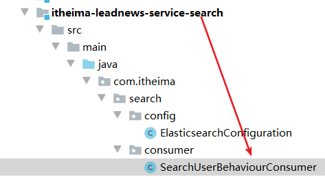


(2)添加依赖

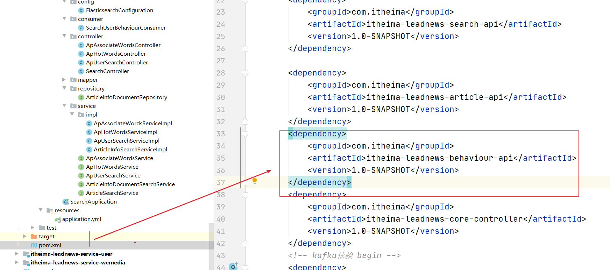


### 3.4 查询搜索记录

controller:

```java
//分页查询搜索记录  每页查询 5条
    @PostMapping("/searchFive")
    public Result<PageInfo<ApUserSearch>> findByPage(@RequestBody SearchDto searchDto) {
        Integer size = searchDto.getSize();
        Integer page = searchDto.getPage();
        if (size == null || size > 5) {
            size = 5;
        }
        if (page == null || page <= 0) {
            page = 1;
        }


        String userInfo = RequestContextUtil.getUserInfo();
        //设备
        ApBehaviorEntry entry = null;
        if ("0".equals(userInfo)) {
            entry = apBehaviorEntryFeign.findByUserIdOrEquipmentId(null, searchDto.getEquipmentId().toString());

        } else {
            //登录的用户
            entry = apBehaviorEntryFeign.findByUserIdOrEquipmentId(userInfo, null);
        }
        if (entry == null) {
            return Result.error();
        }
        IPage<ApUserSearch> pageObject = new Page<ApUserSearch>(page, size);
        QueryWrapper<ApUserSearch> queryWrapper = new QueryWrapper<ApUserSearch>();
        queryWrapper.eq("entry_id", entry.getId());
        //状态为1
        queryWrapper.eq("status", 1);
        IPage<ApUserSearch> page1 = apUserSearchService.page(pageObject, queryWrapper);
        PageInfo<ApUserSearch> pageInfo = getPageInfo(page1);
        return Result.ok(pageInfo);
    }
```


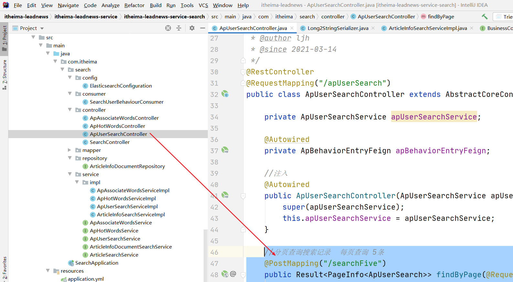


### 3.5 删除搜索记录

```java
//删除搜索记录 已经有了 抽象类中已经实现 但是我们要做的事情是将状态更新为0  而不是删除
@Override
@DeleteMapping("/{id}")
public Result deleteById(@PathVariable(name = "id") Serializable id) {
    ApUserSearch entity = new ApUserSearch();
    entity.setId((Integer) id);
    entity.setStatus(0);
    apUserSearchService.updateById(entity);
    return Result.ok();
}
```

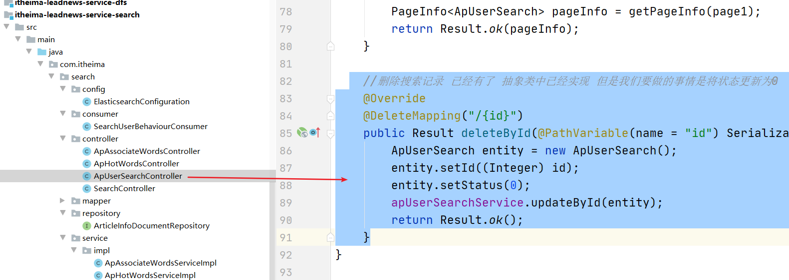


## 4 app端搜索-关键字联想词

### 4.1 需求分析

 

- 根据用户输入的关键字展示联想词 根据创建时间来进行排序

### 4.2 思路分析

表结构: ap_associate_words 联想词表


### 4.3 功能实现

#### 4.3.1 需求分析

就是根据用户输入的文本，当输入文本的时候 我们根据文本进行查询关联表数据，展示10个数据给用户即可


#### 4.3.2 controller

```java
@PostMapping("/searchTen")
public Result<List<ApAssociateWords>> findByPage(@RequestBody SearchDto searchDto) {

    //List<ApAssociateWords> associateWordsList = apAssociateWordsService.searchV2(searchDto);

    //1.只查询前10条联想词即可 不用展示特别多
    searchDto.setSize(10);
    searchDto.setPage(1);
    Page<ApAssociateWords> apAssociateWordsPage = new Page<ApAssociateWords>(searchDto.getPage(), searchDto.getSize());
    QueryWrapper<ApAssociateWords> queryWrapper = new QueryWrapper<ApAssociateWords>();
    queryWrapper.like("associate_words", searchDto.getKeywords());
    queryWrapper.orderByDesc("created_time");
    IPage<ApAssociateWords> page = apAssociateWordsService.page(apAssociateWordsPage, queryWrapper);

    return Result.ok(page.getRecords());
    //return Result.ok(associateWordsList);
}
```

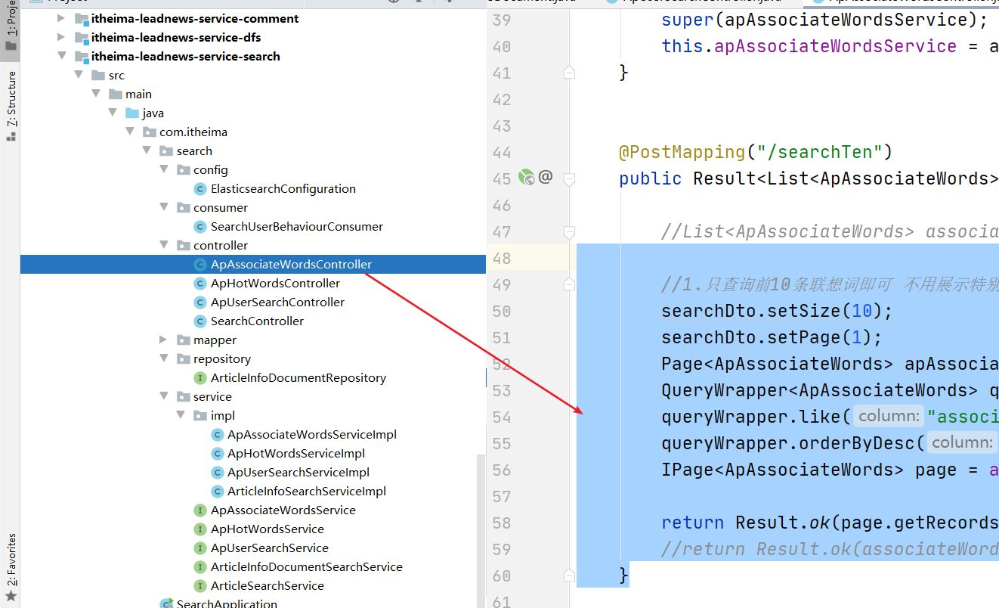


### 4.4 优化改造关键字联想词

#### 4.4.1现有问题

每次输入关键字的时候都会调用后台获取数据，频繁的发起请求查询数据库，并且是模糊查询

随着联想词的搜索越来越频繁，每次从数据库查询非常占用数据库资源，同时查询效率比较低。

#### 4.4.2 优化方案Trie树

Trie树：又称单词查找树，Trie树，是一种树形结构，是一种哈希树的变种。典型应用是用于统计，排
序和保存大量的字符串（但不仅限于字符串），所以经常被搜索引擎系统用于文本词频统计。它的优点
是：利用字符串的公共前缀来减少查询时间，最大限度地减少无谓的字符串比较，查询效率比哈希树
高。前缀查询即可

**词组为：黑马程序员、黑马头条、黑马旅游、黑猫**


- 根节点不包含字符，除根节点外的每一个子节点都包含一个字符。

- 从根节点到某一节点，路径上经过的字符连接起来，就是该节点对应的字符串。

- 每个单词的公共前缀作为一个字符节点保存。


#### 4.4.3 集成到项目中

(1)思路：

```properties
在spring容器初始化的时候 将数据库中数据查询出来 初始化到trie树结构中，并初始化创建trie对象
在service中编写方法，当页面输入单词时，发送请求到后台 后台接收之后，将词添加至树中
并直接按照输入的词 作为前缀进行搜索然后返回列表即可
```


(2)在common中添加依赖

```xml
<dependency>
    <groupId>com.github.takawitter</groupId>
    <artifactId>trie4j</artifactId>
    <version>0.9.8</version>
</dependency>
```

(3)启动类中

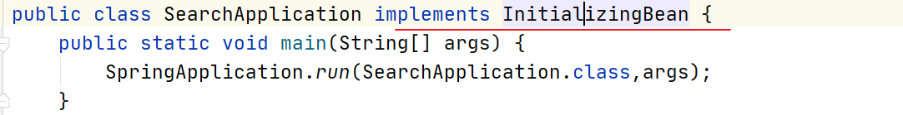

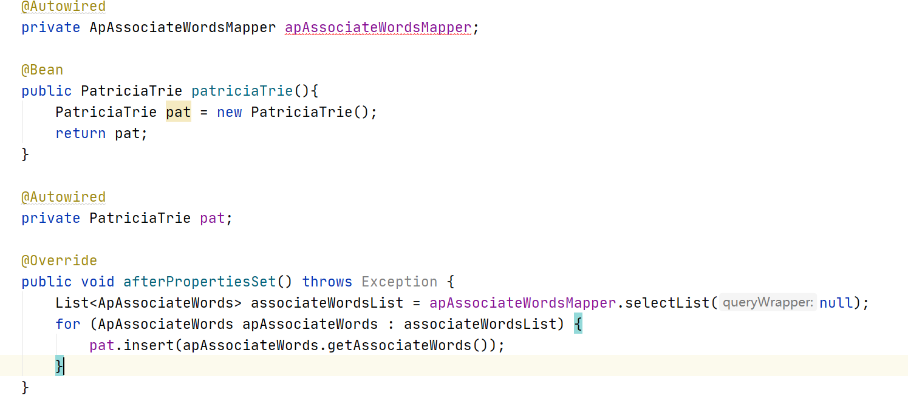

代码如下：

```java
@SpringBootApplication
@EnableDiscoveryClient
@MapperScan(basePackages = "com.itheima.*.mapper")
@EnableFeignClients(basePackages = "com.itheima.*.feign")
public class SearchApplication implements InitializingBean {
    public static void main(String[] args) {
        SpringApplication.run(SearchApplication.class,args);
    }

    //分页插件
    @Bean
    public PaginationInterceptor paginationInterceptor() {
        return new PaginationInterceptor();
    }
    //写一个方法 用POSTConstructor的注解修饰 就可以了  --》类似于 <bean init-method

    @Autowired
    private ApArticleFeign apArticleFeign;
    @Autowired
    private ArticleInfoDocumentRepository articleInfoDocumentRepository;

    @PostConstruct//执行一次，启动的时候执行一次
    public void importEsData(){
        System.out.println("===========哈哈哈==========执行了");
         //1.通过feign 远程调用 获取文章数据
        List<ApArticle> data = apArticleFeign.findAll().getData();
        //2.调用DAO的方法执行添加的动作
        if(data!=null && data.size()>0){
            //先将对象转出JSON字符串 再讲JSON转出LIST
            String jsonString = JSON.toJSONString(data);
            List<ArticleInfoDocument> articleInfoDocuments = JSON.parseArray(jsonString, ArticleInfoDocument.class);
            articleInfoDocumentRepository.saveAll(articleInfoDocuments);
        }
    }


    @Autowired
    private ApAssociateWordsMapper apAssociateWordsMapper;

    @Bean
    public PatriciaTrie patriciaTrie(){
        PatriciaTrie pat = new PatriciaTrie();
        return pat;
    }

    @Autowired
    private PatriciaTrie pat;

    @Override
    public void afterPropertiesSet() throws Exception {
        List<ApAssociateWords> associateWordsList = apAssociateWordsMapper.selectList(null);
        for (ApAssociateWords apAssociateWords : associateWordsList) {
            pat.insert(apAssociateWords.getAssociateWords());
        }
    }
}
```


(4)controller:

```java
@PostMapping("/searchTen")
public Result<List<String>> searchTen(@RequestBody SearchDto searchDto){
    List<String> list =  apAssociateWordsService.searchV2(searchDto);
    return Result.ok(list);
}
```


(5)service:

```java
@Override
public List<String> searchV2(SearchDto searchDto) {
    String keywords = searchDto.getKeywords();
    pat.insert(searchDto.getKeywords());
    List<String> list = (List<String>) pat.predictiveSearch(keywords);
    if (list != null && list.size() > 10) {
        list = list.subList(0, 10);
    }

    return list;
}
```

