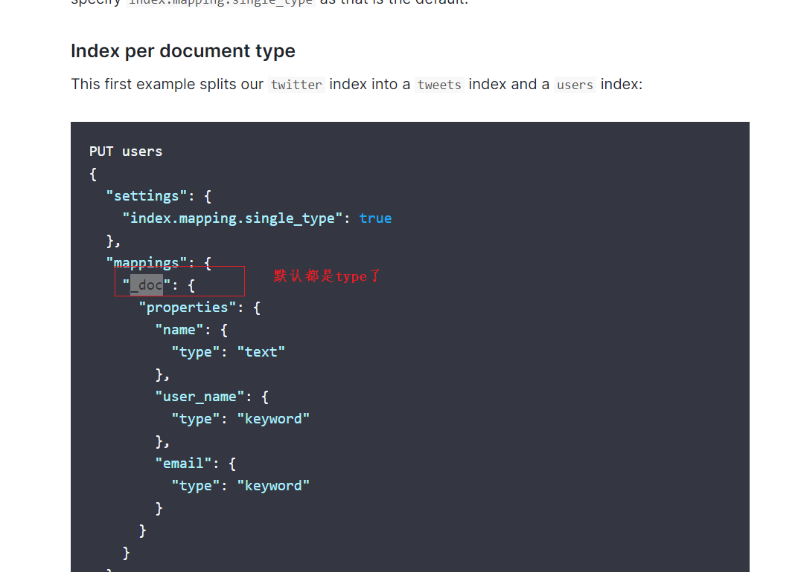
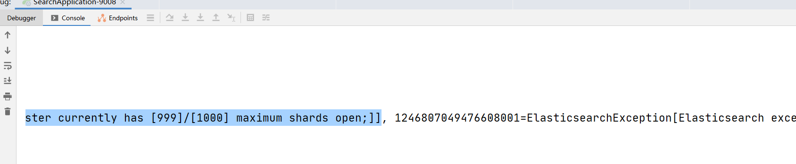

https://www.cnblogs.com/756623607-zhang/p/12147410.html


https://www.elastic.co/guide/en/elasticsearch/reference/7.3/removal-of-types.html





(2)如果出错：




https://blog.csdn.net/yanxilou/article/details/106364200


解决如下：

```properties
PUT /_cluster/settings
{
  "transient": {
    "cluster": {
      "max_shards_per_node":10000
    }
  }
}
```


原因：是创建了自动的索引。参考官方说明：

```
https://www.elastic.co/guide/en/elasticsearch/reference/6.2/monitoring-settings.html
```


