# 第十五章 项目链路追踪

## 目标

- 能说出分布式链路追踪的概念，以及为什么要链路追踪
- 能说出Google Dapper中的一些概念，如trace，span，采样率
- 能说出OpenTracing标准中定义的Trace，Span，以及Span的组成
- 能够说出skywalking的核心功能要点
- 能够说出skywalking组成
- 完成skywalking的环境搭建
- 完成应用程序接入skywalking的功能
- 完成skywalking邮件告警的功能
- 完成项目自动化部署接入skywalking

## 1.分布式链路追踪概述

随着系统设计变得日趋复杂，越来越多的组件开始走向分布式化，如微服务、分布式数据库、分布式缓存等，使得后台服务构成了一种复杂的分布式网络。往往前端的一个请求需要经过多个微服务、跨越多个数据中心才能最终获取到结果，如下图


并且随着业务的不断扩张，服务之间互相调用会越来越复杂，这个庞大的分布式系统调用网络可能会变的如下图所示：


那随之而来的就是我们将会面临的诸多困扰：

- 问题定位：当某一个服务节点出现问题导致整个调用失败，无法快速清晰地定位问题服务。
- 性能分析：服务存在相互依赖调用的关系，当某一个服务接口耗时过长，会导致整个接口调用变的很慢，我们无法明确每一个接口的耗时。
- 服务拓扑图：随着需求迭代，系统之间调用关系变化频繁，靠人工很难梳理清楚系统之间的调用关系。 
- 服务告警：当服务出现问题，我们无法做到由系统自动通知相关人员。

   **为了解决这些问题，分布式链路追踪应运而生。它会将一次分布式请求还原成调用链路，将一次分布式请求的调用情况集中展示，比如各个服务节点上的耗时、请求具体到达哪台机器上、每个服务节点的请求状态、生成服务调用拓扑图等等。也就是说我们要设计并开发一些分布式追踪系统来帮助我们解决这些问题**

### 1.1.什么是 Tracing


Wikipedia 中，对 Tracing 的[定义](https://www.wikiwand.com/en/Tracing_(software)) 是，在软件工程中，Tracing 指使用特定的日志记录程序的执行信息，与之相近的还有两个概念，它们分别是 Logging 和 Metrics。

- Logging：用于记录离散的事件，包含程序执行到某一点或某一阶段的详细信息。
- Metrics：可聚合的数据，且通常是固定类型的时序数据，包括 Counter、Gauge、Histogram 等。
- Tracing：记录单个请求的处理流程，其中包括服务调用和处理时长等信息。

针对每种分析需求，我们都有非常强大的集中式分析工具。

- Logging：[ELK](https://www.elastic.co/)，近几年势头最猛的日志分析服务，无须多言。
- Metrics：[Prometheus](https://prometheus.io/)，第二个加入 CNCF 的开源项目，非常好用。
- Tracing：[OpenTracing](http://opentracing.io/) 和 [Jaeger](https://www.jaegertracing.io/)，Jaeger 是 Uber 开源的一个兼容 OpenTracing 标准的分布式追踪服务。目前 Jaeger 也加入了 CNCF。

### 1.2.为什么需要Distributed Tracing

微服务极大地改变了软件的开发和交付模式，单体应用被拆分为多个微服务，单个服务的复杂度大幅降低，库之间的依赖也转变为服务之间的依赖。由此带来的问题是部署的粒度变得越来越细，众多服务给运维带来巨大压力。

随着服务数量的增多和内部调用链的复杂化，仅凭借日志和性能监控很难做到 “See the Whole Picture”，在进行问题排查或是性能分析的时候，无异于盲人摸象。分布式追踪能够帮助开发者直观分析请求链路，快速定位性能瓶颈，逐渐优化服务间依赖，也有助于开发者从更宏观的角度更好地理解整个分布式系统。

**分布式追踪系统的原理：**

   分布式追踪系统大体分为三个部分，**数据采集、数据持久化、数据展示**。数据采集是指在代码中埋点，设置请求中要上报的阶段，以及设置当前记录的阶段隶属于哪个上级阶段。数据持久化则是指将上报的数据落盘存储，数据展示则是前端查询与之关联的请求阶段，并在界面上呈现

   

   上图是一个请求的流程例子，请求从客户端发出，到达负载均衡，再依次进行认证、计费，最后取到目标资源。

   

   请求过程被采集之后，会以上图的形式呈现，横坐标是时间，圆角矩形是请求的执行的各个阶段。

  

## 2.Google Dapper

现今业界分布式链路追踪的理论基础主要来自于 Google 的一篇论文《Dapper, a Large-Scale Distributed Systems Tracing Infrastructure》

论文在线地址：https://storage.googleapis.com/pub-tools-public-publication-data/pdf/36356.pdf，已下载，可从今日课程资料中获取

国内的翻译版：https://bigbully.github.io/Dapper-translation/

在此文中阐述了Google在生产环境下对于分布式链路追踪系统Drapper的设计思路与使用经验。随后各大厂商基于这篇论文都开始自研自家的分布式链路追踪产品。如阿里的Eagle eye(鹰眼)、zipkin，京东的“Hydra”、大众点评的“CAT”、新浪的“Watchman”、唯品会的“Microscope”、窝窝网的“Tracing”都是基于这片文章的设计思路而实现的。所以要学习分布式链路追踪，对于Dapper论文的理解至关重要。

Google对于Drapper设计初衷同样也是因为其内部整个生产环境的部署非常复杂，涉及到了非常多的服务，且这些服务由不同的团队通过不同的语言进行开发，跨越多个不同的数据中心，部署在几千台服务器上，因此由其Drapper开发团队设计和实现了Google生产环境下的分布式跟踪系统。

**Drapper提出了设计分布式链路追踪系统的三个目标：**

- 低消耗：在生产环境下，服务的一点点损耗，都有可能不得不将其摘除。所以追踪系统对于服务的影响要尽可能的小。
- 应用级透明：对于应用的程序员来说，是不需要知道有跟踪系统这回事的。如果一个跟踪系统想生效，还必须要依赖应用的开发者主动配合，那么这个跟踪系统也太脆弱了，往往由于跟踪系统在应用中植入代码的bug或疏忽导致应用系统出了问题，那这样无法满足我们对跟踪系统“无所不在的部署”这个需求，对于当下这种快节奏的开发环境来说尤为重要。
- 延展性：随着我们业务的系统的变化，我们的跟踪系统需要能够支撑未来服务和集群规模的变化。

### 2.1.Dapper的分布式跟踪


图中展示的是一个和5台服务器相关的一个服务，包括：前端A，两个中间层B和C，以及两个后端D和E。当一个用户（这个用例的发起人）发起一个请求时，首先到达前端，然后发送两个RPC到服务器B和C。B会马上做出反应，但是C需要和后端的D和E交互之后再返还给A，由A来响应最初的请求，在这个过程中我们可以使用一个跟踪标识符（message identifiers）和时间戳（timestamped events）来记录服务器上每一次发送和接收动作，这其实是一个简易的分布式跟踪实现。

如果要实现一个最简单的分布式跟踪，现在有两种解决方案，黑盒(black-box)和基于标注(annotation-based)的监控方案

**黑盒方案**：假定需要跟踪的除了上述信息之外没有额外的信息，这样我们可以使用统计回归技术来推断两者之间的关系

**基于标注的方案**：依赖于应用程序或中间件明确地标记一个全局ID，从而连接每一条记录和发起者的请求

虽然黑盒方案比标注方案更轻便，但却需要更多的数据，以获得足够的精度，因为他们依赖于统计推论。基于标注的方案最主要的缺点是很明显的，需要代码植入。在我们的生产环境中，因为所有的应用程序都使用相同的线程模型，控制流和RPC系统，我们发现，可以把代码植入限制在一个很小的通用组件库中，从而实现了监测系统的应用对开发人员是有效地透明。

**因此Dapper的跟踪架构像是内嵌在RPC调用的树形结构，从形式上看，Dapper跟踪模型使用的树形结构，Span以及Annotation。**

#### 2.1.1.跟踪树和span

一个请求到达应用后所调用的所有服务所有服务组成的调用链就像一个树结构（如下图），就是我们所说的跟踪树（我们也可以叫做trace，每一个Trace都会生成一个唯一的trace-id）


在一次Trace中，每个服务的**每一次调用**，就是一个**基本工作单元**，就像上图中的每一个树节点，称之为**span**

每一个span都有一个唯一id作为唯一标识，我们称为span-id，另外每个span中通过一个**parentId标明本次调用的发起者**（就是发起者的span-id）

下图也说明了span在一个大的跟踪过程中是什么样的，Dapper记录了span名称，以及每个span的ID和父ID，用以构建在一次追踪过程中不同span之间的关系。如果一个span没有父ID被称为root span。所有span都挂在一个特定的跟踪树上，也共用一个跟踪id（trace-id，在图中未示出）。所有这些ID用全局唯一的64位整数标示。


下面我们再来看一下单独的span的细节图如下：


图中的span记录了两个名为“Helper.Call”的RPC(分别为server端和client端)。span的开始时间和结束时，如果应用程序开发者选择在跟踪中增加他们自己的注释（如图中“foo”的注释）(业务数据)，这些信息也会和其他span信息一样记录下来。

#### 2.1.2.Annotation

Dapper允许应用程序开发人员在Dapper跟踪的过程中添加额外的信息，以监控更高级别的系统行为，或帮助调试问题。我们允许用户（应用程序开发人员）通过一个简单的API定义带时间戳的Annotation，核心的示例代码如下图


这些Annotation可以添加任意内容。为了保护Dapper的用户意外的过分热衷于日志的记录，每一个跟踪span有一个可配置的总Annotation量的上限，除了简单的文本Annotation，Dapper也支持的key-value映射的 Annotation，提供给开发人员更强的跟踪能力，如持续的计数器，二进制消息记录和在一个进程上跑着的任意的用户数据。

#### 2.1.3.采样率

低损耗是Dapper的一个关键的设计目标，如果这个工具的价值未被证实但又对性能有影响的话，你就可以理解服务运营人员为什么不愿意部署它。况且，我们还希望让开发人员使用Annotation的API，而不用担心额外的开销。另外我们还发现，某些类型的Web服务对植入带来的性能损耗确实非常敏感。因此，除了把Dapper的收集工作对基本组件的性能损耗限制的尽可能小之外，我们还有进一步控制损耗的办法，那就是遇到大量请求时只记录其中的一小部分。

另外下图展示的是一Dapper数据采样的一个流程


生产环境的集群机器信息所产生的span数据首先写入本地日志文件中。接着Dapper的守护进程和收集组件把这些数据从生产环境的主机中拉出来。并最终写到Dapper的Bigtable数据仓库中，一次跟踪被设计成Bigtable中的一行，每一列相当于一个span。

在生产环境下，对跟踪数据处理中，这个守护进程从来没有超过0.3%的单核cpu使用率，而且只有很少量的内存使用（以及堆碎片的噪音）。我们还限制了Dapper守护进程为内核scheduler最低的优先级，以防在一台高负载的服务器上发生cpu竞争。

Dapper的第一个生产版本在Google内部的所有进程上使用统一的采样率，为1/1024。这个简单的方案是对我们的高吞吐量的线上服务来说是非常有用，因为那些感兴趣的事件(在大吞吐量的情况下)仍然很有可能经常出现，并且通常足以被捕捉到。

然而，在较低的采样率和较低的传输负载下可能会导致错过重要事件，而想用较高的采样率就需要能接受的性能损耗。对于这样的系统的解决方案就是覆盖默认的采样率，这需要手动干预的。

我们在部署可变采样的过程中，参数化配置采样率时，不是使用一个统一的采样方案，而是使用一个采样期望率来标识单位时间内采样的追踪。这样一来，低流量低负载自动提高采样率，而在高流量高负载的情况下会降低采样率，使损耗一直保持在控制之下。实际使用的采样率会随着跟踪本身记录下来，这有利于从Dapper的跟踪数据中准确的分析。


**Dapper的救火能力**

对于一些“救火”任务，Dapper可以处理其中的一部分。“救火”任务在这里是指在分布式系统上一些风险很高的操作，对于那些高延迟，或者可能更糟糕的在正常负载下都会响应超时的服务，Dapper通常会把这些延迟瓶颈的位置隔离出来。通过与Dapper守护进程的直接通信，那些特定的高延迟的跟踪数据轻易的收集到。当出现灾难性故障时，通常是没有必要去看统计数据以确定根本原因，只查看示例跟踪就足够了(因为前文提到过从Dapper守护进程中几乎可以立即获得跟踪数据)。

## 3.OpenTracing

OpenTracing 于 2016 年 10 月加入 CNCF 基金会，是继 Kubernetes 和 Prometheus 之后，第三个加入 CNCF 的开源项目。它是一个中立的（厂商无关、平台无关）分布式追踪的 API 规范，提供统一接口，可方便开发者在自己的服务中集成一种或多种分布式追踪的实现。

### 3.1.发展历史

早在 2005 年，Google 就在内部部署了一套分布式追踪系统 Dapper，并发表了一篇论文[《Dapper, a Large-Scale Distributed Systems Tracing Infrastructure》](https://ai.google/research/pubs/pub36356)，阐述了该分布式追踪系统的设计和实现，可以视为分布式追踪领域的鼻祖。随后出现了受此启发的开源实现，如 Zipkin、SourceGraph 开源的 Appdash、Red Hat 的 Hawkular APM、Uber 开源的 Jaeger 等。但各家的分布式追踪方案是互不兼容的，这才诞生了 OpenTracing。OpenTracing 是一个 Library，定义了一套通用的数据上报接口，要求各个分布式追踪系统都来实现这套接口。这样一来，应用程序只需要对接 OpenTracing，而无需关心后端采用的到底什么分布式追踪系统，因此开发者可以无缝切换分布式追踪系统，也使得在通用代码库增加对分布式追踪的支持成为可能。


目前，主流的分布式追踪实现基本都已经支持 OpenTracing。

### 3.2.数据模型

这部分在 OpenTracing 的规范中写的非常清楚，下面只大概翻译一下其中的关键部分，细节可参考原始文档 [《The OpenTracing Semantic Specification》](https://github.com/opentracing/specification/blob/master/specification.md)。

```markdown
Causal relationships between Spans in a single Trace
解释了Trace 和 Span的因果关系

        [Span A]  ←←←(the root span)
            |
     +------+------+
     |             |
 [Span B]      [Span C] ←←←(Span C is a `ChildOf` Span A)
     |             |
 [Span D]      +---+-------+
               |           |
           [Span E]    [Span F] >>> [Span G] >>> [Span H]
                                       ↑
                                       ↑
                                       ↑
                         (Span G `FollowsFrom` Span F)
```

**Trace** ：调用链，每个调用链由多个 Span 组成（可类比为咱们之前所说的跟踪树）。

**Span** ：可以理解为某个处理阶段。Span 和 Span 的关系称为 Reference。上图中，总共有标号为 A-H 的 8 个阶段（每一次的调用就是一个处理阶段）。

如果按时间关系呈现调用链如下：

```markdown
––|–––––––|–––––––|–––––––|–––––––|–––––––|–––––––|–––––––|–> time

 [Span A···················································]
   [Span B··············································]
      [Span D··········································]
    [Span C········································]
         [Span E·······]        [Span F··] [Span G··] [Span H··]
```

**每个Span包含如下状态：**

- 操作名称
- 起始时间
- 结束时间
- 一组 KV 值，作为阶段的标签（Span Tags）
- 阶段日志（Span Logs）
- 阶段上下文（SpanContext），其中包含 Trace ID 和 Span ID
- 引用关系（References）

Span可以有 `ChildOf` 和 `FollowsFrom` 两种引用关系。`ChildOf` 用于表示父子关系，即在某个阶段中发生了另一个阶段，是最常见的阶段关系，典型的场景如调用 RPC 接口、执行 SQL、写数据。`FollowsFrom` 表示跟随关系，意为在某个阶段之后发生了另一个阶段，用来描述顺序执行关系。

脱离分布式追踪系统单独讲 OpenTracing 的使用方法的话，意义不大，后文我们会以实际的实现为主来进行讲解。

## 4.java探针技术-javaAgent

### 4.1.javaAgent概述

Java Agent这个技术对大多数人来说都比较陌生，但是大家都都多多少少接触过一些，实际上我们平时用过的很多工具都是基于java Agent来实现的，例如：热部署工具JRebel，springboot的热部署插件，各种线上诊断工具（btrace, greys），阿里开源的arthas等等。

其实java Agent在JDK1.5以后，我们可以使用agent技术构建一个独立于应用程序的代理程序（即Agent），用来协助监测、运行甚至替换其他JVM上的程序。使用它可以实现虚拟机级别的AOP功能，并且这种方式一个典型的优势就是无代码侵入。

Agent分为两种，一种是在主程序之前运行的Agent，一种是在主程序之后运行的Agent（前者的升级版，1.6以后提供）。

### 4.2.javaAgent入门

#### 4.2.1.主程序之前运行的Agent

在实际使用过程中，javaagent是java命令的一个参数。通过java 命令启动我们的应用程序的时候，可通过参数 -javaagent 指定一个 jar 包（也就是我们的代理agent），能够实现在我们应用程序的主程序运行之前来执行我们指定jar包中的特定方法，在该方法中我们能够实现动态增强Class等相关功能，并且该 jar包有2个要求：

1. 这个 jar 包的 META-INF/MANIFEST.MF 文件必须指定 Premain-Class 项，该选项指定的是一个类的全路径
2. Premain-Class 指定的那个类必须实现 premain() 方法。

从字面上理解，Premain-Class 就是运行在 main 函数之前的的类。当Java 虚拟机启动时，在执行 main 函数之前，JVM 会先运行`-javaagent`所指定 jar 包内 Premain-Class 这个类的 premain 方法 。

我们可以通过在命令行输入`java`看到相应的参数，其中就有和java agent相关的

 

在上面`-javaagent`参数中提到了参阅`java.lang.instrument`，这是在`rt.jar` 中定义的一个包，该路径下有两个重要的类：

 

该包提供了一些工具帮助开发人员在 Java 程序运行时，动态修改系统中的 Class 类型。其中，使用该软件包的一个关键组件就是 Javaagent，如果从本质上来讲，Java Agent 是一个遵循一组严格约定的常规 Java 类。 上面说到 javaagent命令要求指定的类中必须要有premain()方法，并且对premain方法的签名也有要求，签名必须满足以下两种格式：

```java
public static void premain(String agentArgs, Instrumentation inst)
    
public static void premain(String agentArgs)
```

JVM 会优先加载 带 `Instrumentation` 签名的方法，加载成功忽略第二种，如果第一种没有，则加载第二种方法

下面我们来编写一个入门demo：

1：首先编写一个agent程序，创建一个agent项目agentdemo，使用maven进行构建，

2：添加pom相关配置

```xml
<packaging>jar</packaging>
<properties>
    <java.version>1.8</java.version>
</properties>

<build>
    <plugins>
        <plugin>
            <groupId>org.apache.maven.plugins</groupId>
            <artifactId>maven-jar-plugin</artifactId>
            <version>3.1.2</version>
        </plugin>
    </plugins>
</build>
```

3：编写一个类：com.itheima.TestPreMainAgent，且必须具备premain方法的实现

```java
/**
 * Created by 传智播客*黑马程序员.
 */
public class TestPreMainAgent {

    public static void premain(String agentArgs, Instrumentation inst) {
        System.out.println("premain runing");
    }
}
```

4：在src/main/resources目录下创建一个目录：META-INF，在该目录下创建一个文件：MANIFEST.MF

```markdown
Manifest-Version: 1.0
Can-Redefine-Classes: true
Can-Retransform-Classes: true
Premain-Class: com.itheima.TestPreMainAgent

```

注意：最后需要多一行空行

> Can-Redefine-Classes ：true表示能重定义此代理所需的类，默认值为 false（可选）
>
> Can-Retransform-Classes ：true 表示能重转换此代理所需的类，默认值为 false （可选）
>
> Premain-Class ：包含 premain 方法的类（类的全路径名）


MANIFEST.MF文件这里如果你不去手动指定的话，直接打包，默认会在打包的文件中生成一个MANIFEST.MF文件：比如一个springboot工程打包后生成的MANIFEST.MF文件如下

```markdown
Manifest-Version: 1.0
Implementation-Title: test-agent
Implementation-Version: 0.0.1-SNAPSHOT
Built-By: yangyue
Implementation-Vendor-Id: com.rickiyang.learn
Spring-Boot-Version: 2.0.9.RELEASE
Main-Class: org.springframework.boot.loader.JarLauncher
Start-Class: com.rickiyang.learn.LearnApplication
Spring-Boot-Classes: BOOT-INF/classes/
Spring-Boot-Lib: BOOT-INF/lib/
Created-By: Apache Maven 3.5.2
Build-Jdk: 1.8.0_151
Implementation-URL: https://projects.spring.io/spring-boot/#/spring-bo
 ot-starter-parent/test-agent
 
```

包含当前的一些版本信息，当前工程的启动类等相关信息。

**因此这个地方一定要注意，一般我们通过一些工具去打包的话默认会把我们自己MANIFEST.MF文件被默认配置替换掉了，可能需要自己手动将自己的MANIFEST.MF替换到jar包中**

因此我们也可以使用maven插件去生成所需要的MANIFEST.MF，从而不需要自己手动编写MANIFEST.MF

```xml
<plugin>
    <groupId>org.apache.maven.plugins</groupId>
    <artifactId>maven-jar-plugin</artifactId>
    <version>3.1.2</version>
    <configuration>
        <archive>
            <!--自动添加META-INF/MANIFEST.MF -->
            <manifest>
                <addClasspath>true</addClasspath>
            </manifest>
            <manifestEntries>
                <Premain-Class>com.itheima.TestPreMainAgent</Premain-Class>
                <Can-Redefine-Classes>true</Can-Redefine-Classes>
                <Can-Retransform-Classes>true</Can-Retransform-Classes>
            </manifestEntries>
        </archive>
    </configuration>
</plugin>
```

5：使用maven的package对项目进行打包，然后把打出来的jar包拷贝到随意的目录：

 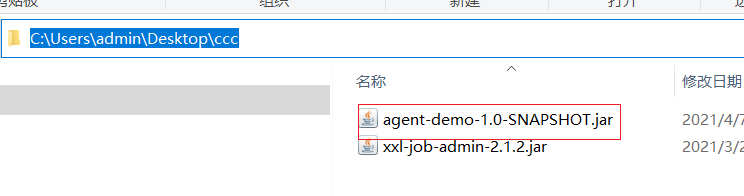

6：创建一个新的maven项目：作为自己的测试项目，编写一个类就可以了：com.itheima.AgentTestApplication

```java

public class AgentTestApplication {
    public static void main(String[] args) {
        System.out.println("====");
    }
}
```


7：启动该类的main方法 使用idea方式设置参数来启动，如下图：

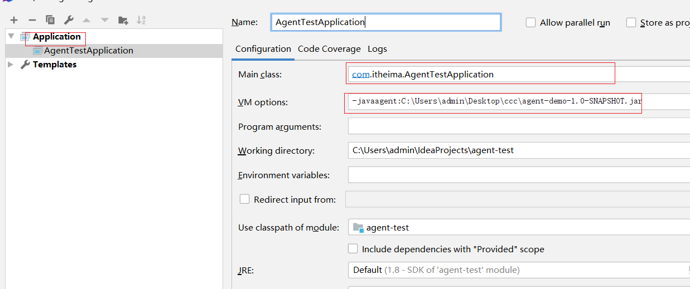


8：如果我们不直接在idea中启动我们的应用程序，而是将我们的程序打成jar包启动，那我们首先需要在pom文件中添加相关的插件

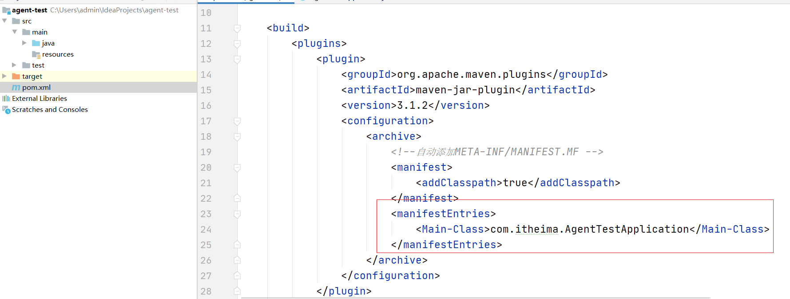

```xml

<build>
    <plugins>
        <plugin>
            <groupId>org.apache.maven.plugins</groupId>
            <artifactId>maven-jar-plugin</artifactId>
            <version>3.1.2</version>
            <configuration>
                <archive>
                    <!--自动添加META-INF/MANIFEST.MF -->
                    <manifest>
                        <addClasspath>true</addClasspath>
                    </manifest>
                    <manifestEntries>
                        <Main-Class>com.itheima.AgentTestApplication</Main-Class>
                    </manifestEntries>
                </archive>
            </configuration>
        </plugin>
    </plugins>
</build>
```

9：使用maven的package对项目进行打包，然后把打出来的jar包拷贝带C盘下，然后打开cmd，输入命令


```shell
java -javaagent:./agent-demo-1.0-SNAPSHOT.jar -jar agent-test-1.0-SNAPSHOT.jar 
```

运行如下

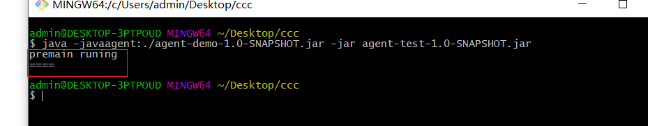


**总结：**

**这种agent JVM 会先执行 premain 方法，大部分类加载都会通过该方法，注意：是大部分，不是所有。当然，遗漏的主要是系统类，因为很多系统类先于 agent 执行，而用户类的加载肯定是会被拦截的。也就是说，这个方法是在 main 方法启动前拦截大部分类的加载活动，既然可以拦截类的加载，那么就可以去做重写类这样的操作，结合第三方的字节码编译工具，比如ASM，javassist，cglib等等来改写实现类。**

#### 4.2.2.主程序之后运行的Agent

上面介绍的是在 JDK 1.5中提供的，开发者只能在main加载之前添加手脚，在 Java SE 6 中提供了一个新的代理操作方法：agentmain，可以在 main 函数开始运行之后再运行。

跟`premain`函数一样， 开发者可以编写一个含有`agentmain`函数的 Java 类，具备以下之一的方法即可

```java
public static void agentmain (String agentArgs, Instrumentation inst)

public static void agentmain (String agentArgs)
```

同样需要在MANIFEST.MF文件里面设置“Agent-Class”来指定包含 agentmain 函数的类的全路径。

1：在原来的demo项目中创建一个新的类：com.itheima.TestAgentClass，并编写方法agenmain

```java

public class TestAgentClass {

    public static void agentmain (String agentArgs, Instrumentation inst){
        System.out.println("agentmain runing");
    }
}
```

2：在pom.xml中添加配置如下

```xml
<plugin>
    <groupId>org.apache.maven.plugins</groupId>
    <artifactId>maven-jar-plugin</artifactId>
    <version>3.1.2</version>
    <configuration>
        <archive>
            <!--自动添加META-INF/MANIFEST.MF -->
            <manifest>
                <addClasspath>true</addClasspath>
            </manifest>
            <manifestEntries>
                <Premain-Class>com.itheima.TestPreMainAgent</Premain-Class>
                <!--添加这个即可-->
                <Agent-Class>com.itheima.TestAgentClass</Agent-Class>
                <Can-Redefine-Classes>true</Can-Redefine-Classes>
                <Can-Retransform-Classes>true</Can-Retransform-Classes>
            </manifestEntries>
        </archive>
    </configuration>
</plugin>
```

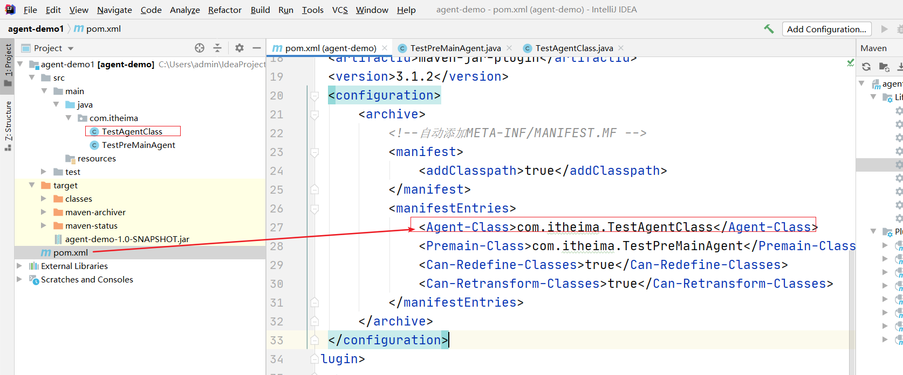


3：使用maven的package命令打包，然后复制打好的包到C盘


4：找到测试工程，并修改如下：

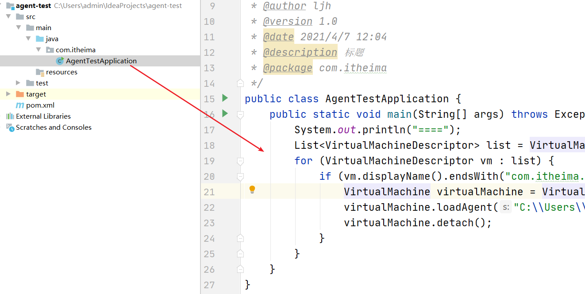

```java
public class AgentTestApplication {
    public static void main(String[] args) throws Exception {
        System.out.println("====");
        List<VirtualMachineDescriptor> list = VirtualMachine.list();
        for (VirtualMachineDescriptor vm : list) {
            if (vm.displayName().endsWith("com.itheima.AgentTestApplication")) {
                VirtualMachine virtualMachine = VirtualMachine.attach(vm.id());
                virtualMachine.loadAgent("C:\\Users\\admin\\Desktop\\ccc\\agent-demo-1.0-SNAPSHOT.jar");
                virtualMachine.detach();
            }
        }
    }
}
```

> list()方法会去寻找当前系统中所有运行着的JVM进程，你可以打印`vmd.displayName()`看到当前系统都有哪些JVM进程在运行。因为main函数执行起来的时候进程名为当前类名，所以通过这种方式可以去找到当前的进程id。
>
> 注意：在mac上安装了的jdk是能直接找到 VirtualMachine 类的，但是在windows中安装的jdk无法找到，如果你遇到这种情况，请手动将你jdk安装目录下：lib目录中的tools.jar添加进当前工程的Libraries中。

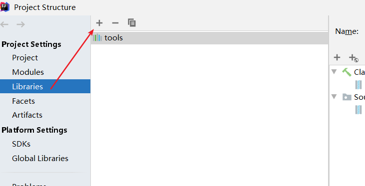


除了如上图方式，我们推荐使用如下的在maven中添加依赖的方式代替如上图片的方式：

```xml
<dependencies>
    <dependency>
        <groupId>com.sun</groupId>
        <artifactId>tools</artifactId>
        <version>1.8</version>
        <scope>system</scope>
        <systemPath>${java.home}/../lib/tools.jar</systemPath>
    </dependency>
</dependencies>
```

之所以要这样写是因为：agent要在主程序运行后加载，我们不可能在主程序中编写加载的代码，只能另写程序，那么另写程序如何与主程序进行通信？这里用到的机制就是attach机制，它可以将JVM A连接至JVM B，并发送指令给JVM B执行。

然后运行，结果如下图所示：

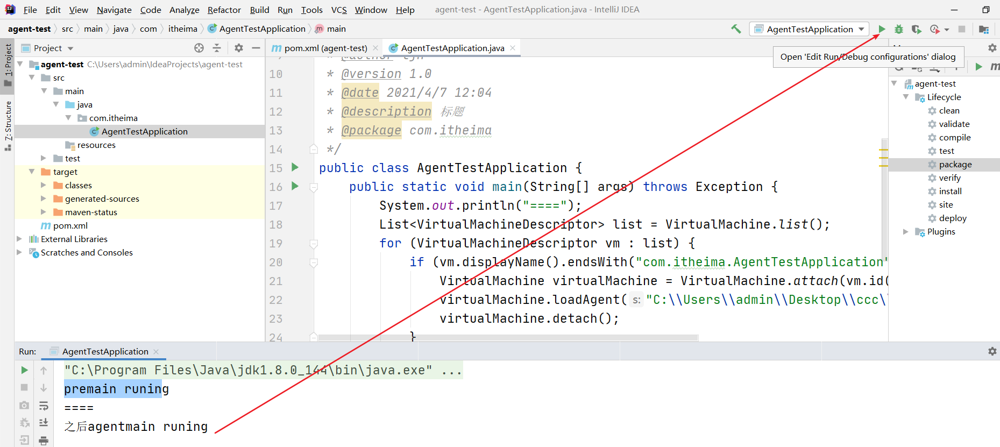


**总结：**

**以上就是Java Agent的俩个简单小栗子了，Java Agent十分强大，它能做到的不仅仅是打印几个监控数值而已，还包括使用Transformer等高级功能进行类替换，方法修改等，要使用Instrumentation的相关API则需要对字节码等技术有较深的认识。**


详细的可以参考这篇文章

```
https://www.cnblogs.com/rickiyang/p/11368932.html
```


## 5.skyWalking

### 5.1.skyWalking概述


2015年由个人吴晟（华为开发者）主导开源，作者是华为开发云监控产品经理，主导监控产品的规划、技术路线及相关研发工作，也是OpenTracing分布式追踪标准组织成员 ，该项目 2017年加入Apache孵化器，是一个分布式系统的应用程序性能监控工具（APM），专为微服务、云原生架构和基于容器（Docker、K8s、Mesos）架构而设计。

官方站点：<http://skywalking.apache.org/>

GitHub项目地址：<https://github.com/apache/skywalking>

其核心功能要点如下：

- **指标分析**：服务，实例，端点指标分析
- **问题分析**：在运行时分析代码，找到问题的根本原因
- **服务拓扑**：提供服务的拓扑图分析
- **依赖分析**：服务实例和端点依赖性分析
- **服务检测**：检测慢速的服务和端点
- **性能优化**：根据服务监控的结果提供性能优化的思路
- **链路追踪**：分布式跟踪和上下文传播
- **数据库监控**：数据库访问指标监控统计，检测慢速数据库访问语句（包括SQL语句）
- **服务告警**：服务告警功能

> 名词解释：
>
> - 服务（service）：业务资源应用系统
> - 端点（endpoint）：应用系统对外暴露的功能接口
> - 实例（instance）：物理机
>
> 


### 5.2.skyWalking架构设计

skyWalking的整体架构设计如下图所示：


skyWalking整体可分为：客户端，服务端

客户端：agent组件

​	基于探针技术采集服务相关信息（包括跟踪数据和统计数据），然后将采集到的数据上报给skywalking的数据收集器

服务端：又分为OAP，Storage，WebUI

OAP：observability analysis platform可观测性分析平台，负责接收客户端上报的数据，对数据进行分析，聚合，计算后将数据进行存储，并且还会提供一些查询API进行数据的查询，这个模块其实就是我们所说的链路追踪系统的Collector收集器

Storage：skyWalking的存储介质，默认是采用H2，同时支持许多其他的存储介质，比如：ElastaticSearch，mysql等

WebUI：提供一些图形化界面展示对应的跟踪数据，指标数据等等


### 5.3.skyWalking环境搭建

#### 5.3.1.skyWalking下载

skyWalking可从官方站点下载：<http://skywalking.apache.org/downloads/>，本文中使用8.2.0版本


#### 5.3.3.部署skyWalking

 

已经下载好了将其解压到（推荐不带中文）的目录中，解压之后如下

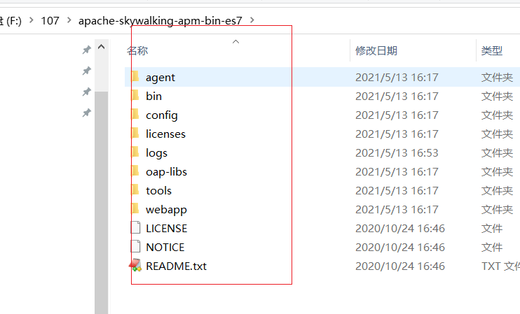


默认的情况下skywalking使用h2作为存储介质，我们可以使用elasticsearch来存。修改如下配置：

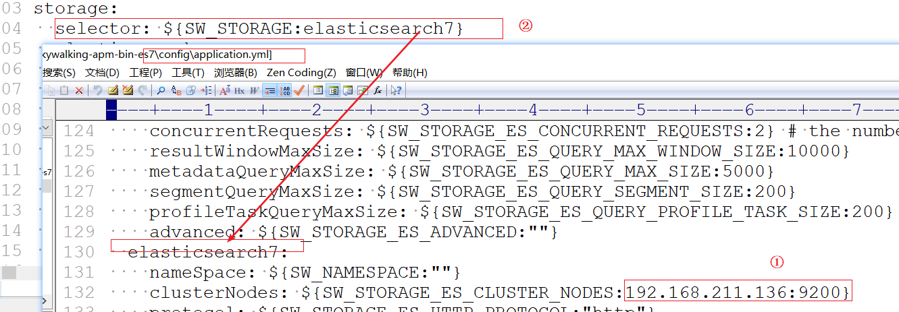


docker启动es，并启动skywalking:

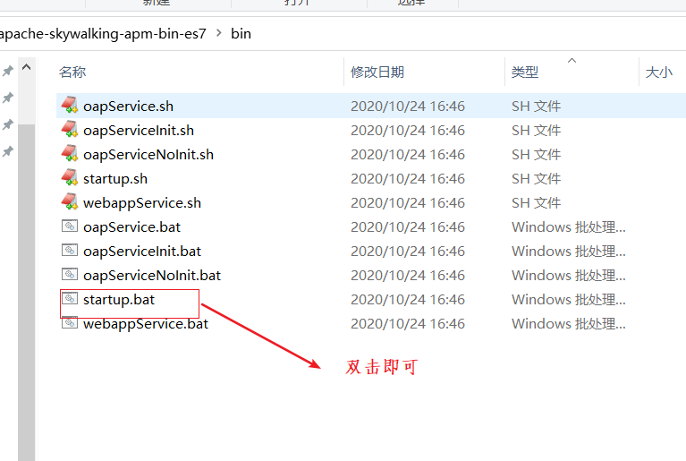


浏览器输入：

```html
http://localhost:8080
```

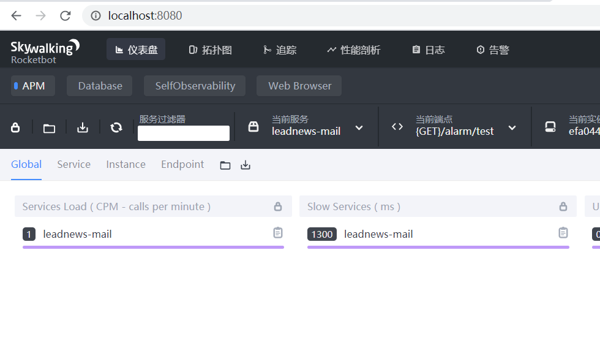


**cpm 每分钟请求数**

cpm 全称 call per minutes，是吞吐量(Throughput)指标。

下图是拼接的全局、服务、实例和接口的吞吐量及平均吞吐量。


185cpm=185/60=3.08个请求/秒

**SLA 服务等级协议**

服务等级协议用来表示提供服务的水平，可以衡量平台的可用性，下面是N个9的计算

```markdown
1年 = 365天 = 8760小时
99     = 8760 * 1%     => 3.65天----------------》相当于全年有3.65天不可用，2个9就基本不可用了
99.9   = 8760 * 0.1%   => 8.76小时--------------》相当于全年有8.76小时不可用
99.99  = 8760 * 0.01%  => 52.6分钟
99.999 = 8760 * 0.001% => 5.26分钟
```

因此，全年只要发生一次较大规模宕机事故，4个9肯定没戏，一般平台3个9差不多。


**Percent Response 百分位数统计**

Skywalking 有 **“p50、p75、p90、p95、p99”** 一些列值，图中的 **“p99:390”** 表示 99% 请求的响应时间在390ms以内。


**Heatmap 热力图**

Heapmap 可译为热力图、热度图都可以，图中颜色越深，表示请求数越多，这和GitHub Contributions很像，commit越多，颜色越深。

纵坐标是响应时间，鼠标放上去，可以看到具体的数量。

通过热力图，一方面可以直观感受平台的整体流量，另一方面也可以感受整体性能。


### 5.4.应用程序接入skyWalking


#### 5.4.1 使用说明

应用程序接入skywalking非常的简单，只需在应用程序启动时通过`-javaagent`来指定skyWalking的agent的组件

首先在下载好的skyWalking中找到agent组件：


进入到agent目录：

 

通过`-javaagent`来指定skywalking的agent组件的skywalking-agent.jar即可

另外：agent负责采集数据然后将数据提交到OAP（collector）中，因此我们需要在agent的配置文件中指定OAP的地址，当然默认是本地127.0.0.1

进入到config目录，找到：agent.config配置文件

 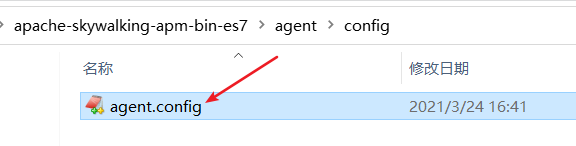

未修改前如下：注意目前不用修改。


接下来我们需要在应用程序启动的时候指定VM参数如下：(注意：要指向自己电脑中的agent存放的位置)

```properties
-javaagent:F:\107\apache-skywalking-apm-bin-es7\agent\skywalking-agent.jar -Dskywalking.agent.service_name=leadnews-admin
```

> 注意：如果一个服务作多节点部署，最好保证服务名称不一样
>
> 当然如果一样也可以，只不过是一个服务有多个实例

图示如下：


#### 5.4.2 测试案例

等会我们还要用到邮件服务，所以先建立邮件服务实现【测试】案例,实现mail远程调用文章。

 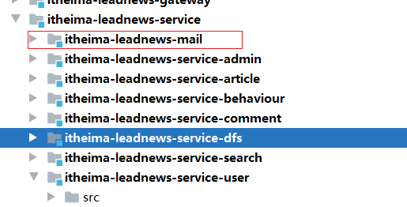

pom.xml:

```xml
<?xml version="1.0" encoding="UTF-8"?>
<project xmlns="http://maven.apache.org/POM/4.0.0"
         xmlns:xsi="http://www.w3.org/2001/XMLSchema-instance"
         xsi:schemaLocation="http://maven.apache.org/POM/4.0.0 http://maven.apache.org/xsd/maven-4.0.0.xsd">
    <parent>
        <artifactId>itheima-leadnews-service</artifactId>
        <groupId>com.itheima</groupId>
        <version>1.0-SNAPSHOT</version>
    </parent>
    <modelVersion>4.0.0</modelVersion>

    <artifactId>itheima-leadnews-mail</artifactId>

    <dependencies>
        <dependency>
            <groupId>com.itheima</groupId>
            <artifactId>itheima-leadnews-common</artifactId>
            <version>1.0-SNAPSHOT</version>
        </dependency>
        <dependency>
            <groupId>org.springframework.boot</groupId>
            <artifactId>spring-boot-starter-mail</artifactId>
        </dependency>


        <dependency>
            <groupId>com.itheima</groupId>
            <artifactId>itheima-leadnews-article-api</artifactId>
            <version>1.0-SNAPSHOT</version>
        </dependency>
    </dependencies>

    <build>
        <plugins>
            <plugin>
                <groupId>org.springframework.boot</groupId>
                <artifactId>spring-boot-maven-plugin</artifactId>

            </plugin>
        </plugins>
    </build>
</project>
```

启动类：

```java
package com.itheima;

import org.springframework.boot.SpringApplication;
import org.springframework.boot.autoconfigure.SpringBootApplication;
import org.springframework.boot.autoconfigure.jdbc.DataSourceAutoConfiguration;
import org.springframework.cloud.client.discovery.EnableDiscoveryClient;
import org.springframework.context.annotation.Bean;
import org.springframework.web.client.RestTemplate;

/**
 * @author ljh
 * @version 1.0
 * @date 2021/5/13 11:09
 * @description 标题
 * @package com.itheima
 */
@SpringBootApplication(exclude = DataSourceAutoConfiguration.class)
@EnableDiscoveryClient
public class MailApplication {
    public static void main(String[] args) {
        SpringApplication.run(MailApplication.class,args);
    }
    @Bean
    public RestTemplate restTemplate(){
        return new RestTemplate();
    }
}
```

controller

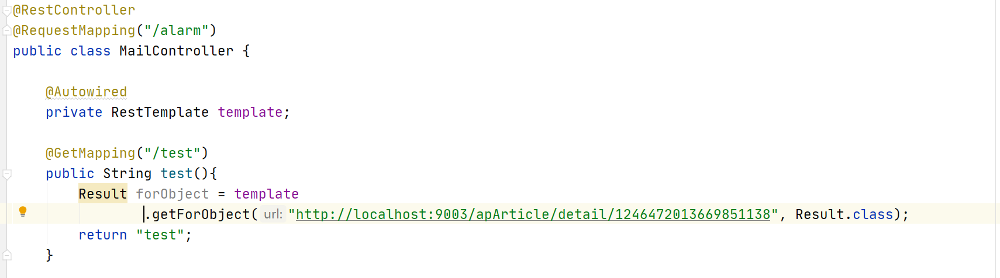


```java
@RestController
@RequestMapping("/alarm")
public class MailController {

    @Autowired
    private RestTemplate template;

    @GetMapping("/test")
    public String test(){
        Result forObject = template
            .getForObject("http://localhost:9003/apArticle/detail/1246472013669851138", Result.class);
        return "test";
    }
}
```


yml:

```yaml
spring:
  profiles:
    active: dev
---
server:
  port: 9009
spring:
  application:
    name: leadnews-mail
  profiles: dev
  cloud:
    nacos:
      server-addr: 192.168.211.136:8848
      discovery:
        server-addr: ${spring.cloud.nacos.server-addr}
```


微服务启动 添加参数如下图：

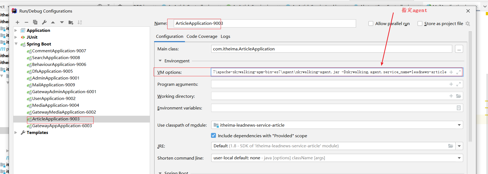


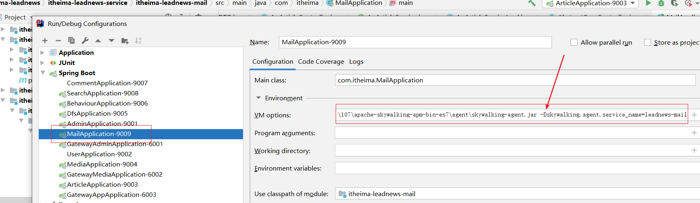


分别启动微服务，并在浏览器调用路径：http://localhost:9009/alarm/test

效果如下：


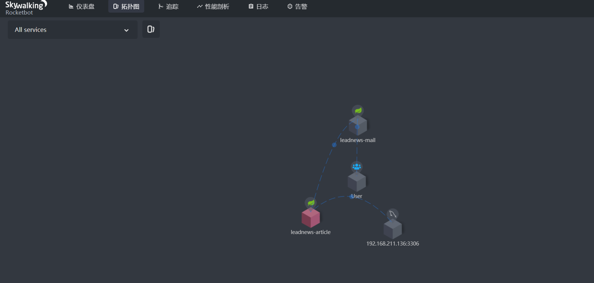


### 5.5.skyWalking配置应用告警

可参考如下文章

```properties
https://skyapm.github.io/document-cn-translation-of-skywalking/zh/6.3.0/setup/backend/backend-alarm.html
```

SkyWalking 告警功能是在6.x版本新增的，其核心由一组规则驱动，这些规则定义在`config/alarm-settings.yml`文件中。 告警的定义分为两部分：

1. **告警规则**：它们定义了应该如何触发度量警报，应该考虑什么条件。
2. **Webhook（网络钩子）**：定义当警告触发时，哪些服务终端需要被告知

#### 5.5.1.告警规则

SkyWalking 的发行版都会默认提供`config/alarm-settings.yml`文件，里面预先定义了一些常用的告警规则。如下：

```yaml
# Licensed to the Apache Software Foundation (ASF) under one
# or more contributor license agreements.  See the NOTICE file
# distributed with this work for additional information
# regarding copyright ownership.  The ASF licenses this file
# to you under the Apache License, Version 2.0 (the
# "License"); you may not use this file except in compliance
# with the License.  You may obtain a copy of the License at
#
#     http://www.apache.org/licenses/LICENSE-2.0
#
# Unless required by applicable law or agreed to in writing, software
# distributed under the License is distributed on an "AS IS" BASIS,
# WITHOUT WARRANTIES OR CONDITIONS OF ANY KIND, either express or implied.
# See the License for the specific language governing permissions and
# limitations under the License.

# Sample alarm rules.
rules:
  # Rule unique name, must be ended with `_rule`.
  service_resp_time_rule:
    metrics-name: service_resp_time
    op: ">"
    threshold: 1000
    period: 10
    count: 3
    silence-period: 5
    message: Response time of service {name} is more than 1000ms in 3 minutes of last 10 minutes.
  service_sla_rule:
    # Metrics value need to be long, double or int
    metrics-name: service_sla
    op: "<"
    threshold: 8000
    # The length of time to evaluate the metrics
    period: 10
    # How many times after the metrics match the condition, will trigger alarm
    count: 2
    # How many times of checks, the alarm keeps silence after alarm triggered, default as same as period.
    silence-period: 3
    message: Successful rate of service {name} is lower than 80% in 2 minutes of last 10 minutes
  service_resp_time_percentile_rule:
    # Metrics value need to be long, double or int
    metrics-name: service_percentile
    op: ">"
    threshold: 1000,1000,1000,1000,1000
    period: 10
    count: 3
    silence-period: 5
    message: Percentile response time of service {name} alarm in 3 minutes of last 10 minutes, due to more than one condition of p50 > 1000, p75 > 1000, p90 > 1000, p95 > 1000, p99 > 1000
  service_instance_resp_time_rule:
    metrics-name: service_instance_resp_time
    op: ">"
    threshold: 1000
    period: 10
    count: 2
    silence-period: 5
    message: Response time of service instance {name} is more than 1000ms in 2 minutes of last 10 minutes
#  Active endpoint related metrics alarm will cost more memory than service and service instance metrics alarm.
#  Because the number of endpoint is much more than service and instance.
#
#  endpoint_avg_rule:
#    metrics-name: endpoint_avg
#    op: ">"
#    threshold: 1000
#    period: 10
#    count: 2
#    silence-period: 5
#    message: Response time of endpoint {name} is more than 1000ms in 2 minutes of last 10 minutes

webhooks:
#  - http://127.0.0.1/notify/
#  - http://127.0.0.1/go-wechat/

```

告警规则配置项的说明：

- **Rule name：**规则名称，也是在告警信息中显示的唯一名称。必须以`_rule`结尾，前缀可自定义
- **Metrics name：**度量名称，取值为oal脚本中的度量名，目前只支持`long`、`double`和`int`类型。
- **Include names：**该规则作用于哪些实体名称，比如服务名，终端名（可选，默认为全部）
- **Exclude names：**该规则作不用于哪些实体名称，比如服务名，终端名（可选，默认为空）
- **Threshold：**阈值
- **OP：** 操作符，目前支持 `>`、`<`、`=`
- **Period：**多久告警规则需要被核实一下。这是一个时间窗口，与后端部署环境时间相匹配
- **Count：**在一个Period窗口中，如果values超过Threshold值（按op），达到Count值，需要发送警报
- **Silence period：**在时间N中触发报警后，在TN -> TN + period这个阶段不告警。 默认情况下，它和Period一样，这意味着相同的告警（在同一个Metrics name拥有相同的Id）在同一个Period内只会触发一次
- **message：**告警消息


**在配置文件中预先定义的告警规则总结如下：**

1. 在过去10分钟内服务平均响应时间超过1秒达3次
2. 在过去10分钟内服务成功率低于80%达2次
3. 在过去10分钟内服务90%响应时间低于1秒达3次
4. 在过去10分钟内服务的响应时间超过1秒达2次
5. 在过去10分钟内端点的响应时间超过1秒达2次


#### 5.5.2.Webhook（网络钩子）

Webhook可以简单理解为是一种Web层面的回调机制，通常由一些事件触发，与代码中的事件回调类似，只不过是Web层面的。由于是Web层面的，所以当事件发生时，回调的不再是代码中的方法或函数，而是服务接口。例如，在告警这个场景，告警就是一个事件。当该事件发生时，SkyWalking就会主动去调用一个配置好的接口，该接口就是所谓的Webhook。

 

#### 5.5.3.邮件告警实践

根据以上两个小节的介绍，可以得知：SkyWalking是不支持直接向邮箱、短信等服务发送告警信息的，SkyWalking只会在发生告警时将告警信息发送至配置好的Webhook接口。

但我们总不能人工盯着该接口的日志信息来得知服务是否发生了告警，因此我们需要在该接口里来实现发送邮件或短信等功能，从而达到个性化的告警通知。

1：首先需要配置webhook接口，在`config/alarm-settings.yml`文件配置如下：

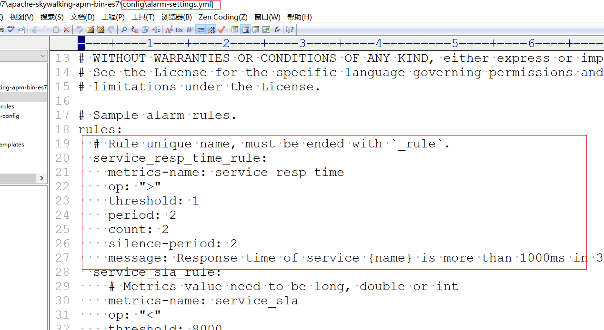

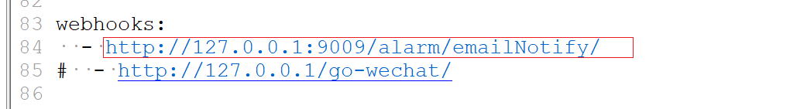


2：在邮件微服务中进行测试-创建dto

```java
@Data
public class AlarmDTO {
    private Integer scopeId;
    private String scope;
    private String name;
    private String id0;
    private String id1;
    private String ruleName;
    private String alarmMessage;
    private Long startTime;
}
```


3：修改application.yml，添加邮件发送相关需要的账号等信息

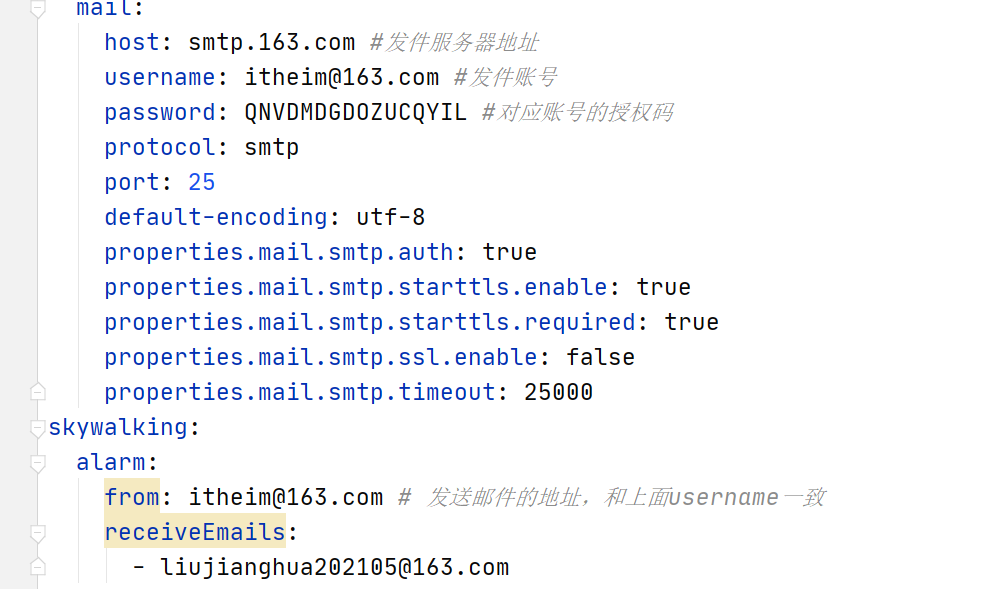

```yaml
spring:
  profiles:
    active: dev
---
server:
  port: 9009
spring:
  application:
    name: leadnews-mail
  profiles: dev
  cloud:
    nacos:
      server-addr: 192.168.211.136:8848
      discovery:
        server-addr: ${spring.cloud.nacos.server-addr}
  mail:
    host: smtp.163.com #发件服务器地址
    username: itheim@163.com #发件账号
    password: QNVDMDGDOZUCQYIL #对应账号的授权码
    protocol: smtp
    port: 25
    default-encoding: utf-8
    properties.mail.smtp.auth: true
    properties.mail.smtp.starttls.enable: true
    properties.mail.smtp.starttls.required: true
    properties.mail.smtp.ssl.enable: false
    properties.mail.smtp.timeout: 25000
skywalking:
  alarm:
    from: itheim@163.com # 发送邮件的地址，和上面username一致
    receiveEmails: #收件人
      - liujianghua202105@163.com
```

同时需要编写一个配置类加载邮件接收人的配置:

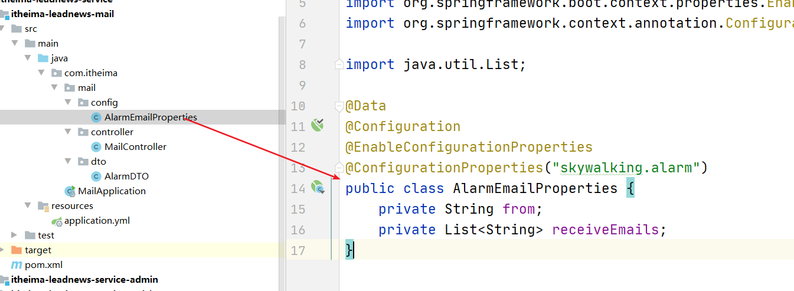

```java
@Data
@Configuration
@EnableConfigurationProperties
@ConfigurationProperties("skywalking.alarm")
public class AlarmEmailProperties {
    private String from;
    private List<String> receiveEmails;
}
```


4：添加方法用于接收邮件调用：

```java
	@Autowired
    private JavaMailSender javaMailSender;

    @Autowired
    private AlarmEmailProperties alarmEamilProperties;

    @PostMapping("/emailNotify")
    public void emailAlarm(@RequestBody List<AlarmDTO> alarmDTOList){

        System.out.println(JSON.toJSONString(alarmDTOList));
        //设置邮件对象
        SimpleMailMessage mailMessage = new SimpleMailMessage();

        //从哪个邮箱发出
        mailMessage.setFrom(alarmEamilProperties.getFrom());

        //发送邮件
        mailMessage.setTo(alarmEamilProperties.getReceiveEmails().toArray(new String [] {}));

        //主题
        mailMessage.setSubject("skywalking告警邮件123");

        //邮件内容
        mailMessage.setText(alarmDTOList.toString());

        javaMailSender.send(mailMessage);

        System.out.println("日志发送成功");
    }
```


5：skyWalking在告警事件发生后需要调用配置好的webhook接口（POST），同时会传递一些参数，是application/json格式的，如下：

```json
[{
    "scopeId": 1,
    "scope": "SERVICE",
    "name": "serviceA",
    "id0": 12,
    "id1": 0,
    "ruleName": "service_resp_time_rule",
    "alarmMessage": "alarmMessage xxxx",
    "startTime": 1560524171000
}, {
    "scopeId": 1,
    "scope": "SERVICE",
    "name": "serviceB",
    "id0": 23,
    "id1": 0,
    "ruleName": "service_resp_time_rule",
    "alarmMessage": "alarmMessage yyy",
    "startTime": 1560524171000
}]
```


让文章微服务中的代码进行除0 用于模拟演示错误：

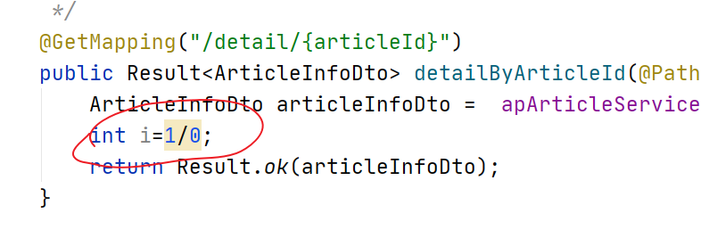

重启微服务 和skywalking


当我们疯狂点击 http://localhost:9009/alarm/test 时 等过2到3分钟就可以看见如下：


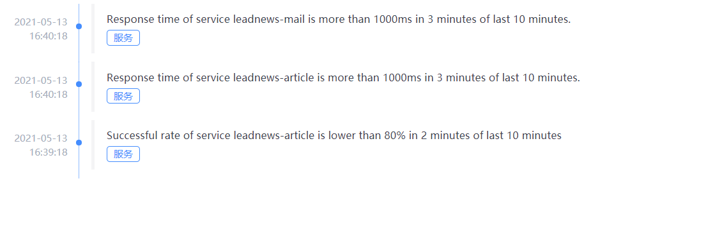

邮箱收到邮件。

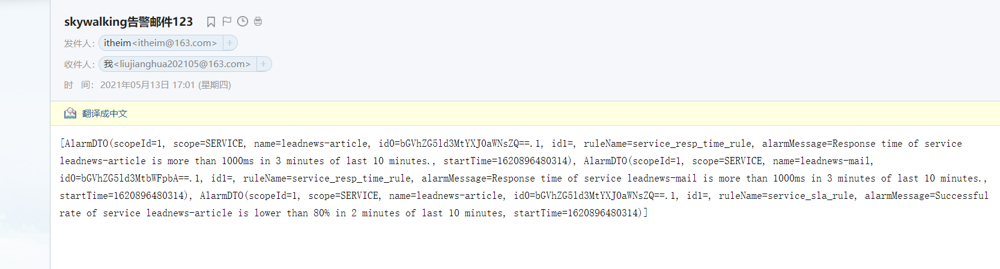


