# xxl-job

## 目标

+ 理解xxl-job是什么？有什么优势
+ 理解目前原生的定时任务的劣势
+ 理解定时任务的核心概念
+ 掌握xxl-job的入门使用


## 1 定时任务的应用场景

+ 定期数据备份
+ 订单超时
+ 定时财务对账
+ 定时提醒和推送
+ 考勤以及数据同步


## 2.原生的定时任务的劣势

+ 任务失败无法进行故障转移
+ 任务失败没有日志记录
+ 分布式集群情况下任务执行多次
+ 无法动态进行中断任务和超时中断
+ 任务失败无法重试
+ 失败无法进行邮件短信和钉钉等通知
+ 无法清楚的进行任务执行监控和报表

## 3.xxl-job介绍

### 3.1 目标

+ 理解什么是xxl-job
+ 理解xxl-job的特点和解决了什么问题
+ 掌握xxl-job的入门

### 3.2 路径

### 3.3 讲解

#### 3.3.1 xxl-job是什么

XXL-JOB是一个分布式任务调度平台，其核心设计目标是开发迅速、学习简单、轻量级、易扩展。现已开放源代码并接入多家公司线上产品线，开箱即用。

它是大众点评公司的许雪里开发出来的框架。

#### 3.3.2 xxl-job的特性

1、简单：支持通过Web页面对任务进行CRUD操作，操作简单，一分钟上手；

2、动态：支持动态修改任务状态、启动/停止任务，以及终止运行中任务，即时生效；

3、路由策略：执行器集群部署时提供丰富的路由策略，包括：第一个、最后一个、轮询、随机、一致性HASH、最不经常使用、最近最久未使用、故障转移、忙碌转移等；

4、故障转移：任务路由策略选择”故障转移”情况下，如果执行器集群中某一台机器故障，将会自动Failover切换到一台正常的执行器发送调度请求。

5、任务超时控制：支持自定义任务超时时间，任务运行超时将会主动中断任务

6、一致性：“调度中心”通过DB锁保证集群分布式调度的一致性, 一次任务调度只会触发一次执行

7、邮件报警：任务失败时支持邮件报警，支持配置多邮件地址群发报警邮件；

8、任务进度监控：支持实时监控任务进度；


#### 3.3.3 xxl-job的几个角色

原生定时任务的概念：

+ 调度器 ：负责对用户定义的所有任务进行调度。
+ 触发器 :   触发器在逻辑上包含两个属性，即如何触发该调度器和触发该调度器之后进行怎么样的操作
+ 任务 :     触发器在被触发后进行的操作，可以指定任意一个类的某个方法。

举例来说：

 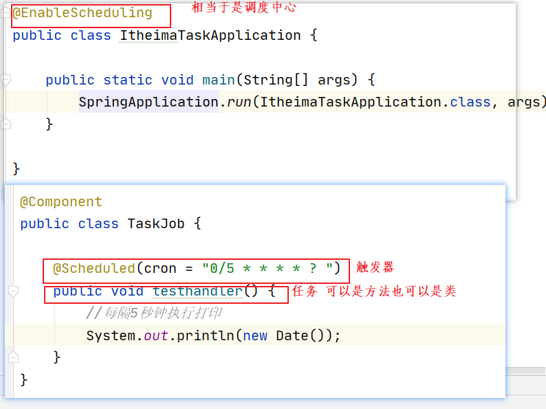


xxl-job中的角色说明：

+ 调度中心 : 将调度行为抽象形成“调度中心”公共平台，而平台自身并不承担业务逻辑，“调度中心”负责发起调度请求
+ 执行器（触发器）: 将任务抽象成分散的JobHandler，交由“执行器”统一管理，“执行器”负责接收调度请求并执行对应的JobHandler中业务逻辑
+ 任务: 具体执行的逻辑代码

“调度”和“任务”两部分可以相互解耦，提高系统整体稳定性和扩展性。

如下搭建好了之后就如图所示

 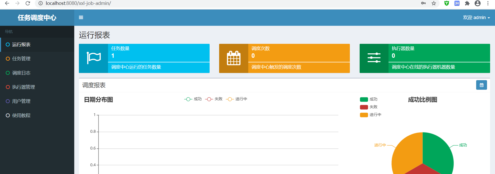


#### 3.3.4 xxl-job的架构

 2.1.0版本架构图

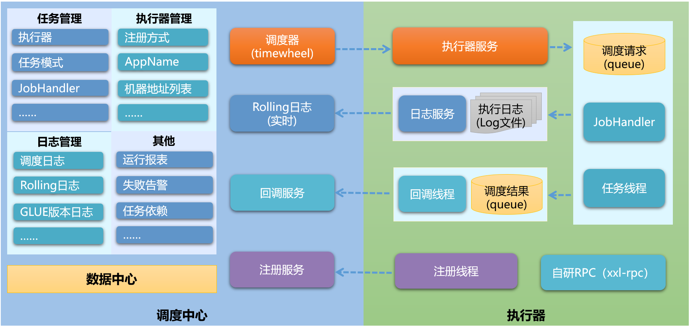


#### 3.3.5 xxl-job的安装

(1) 下载源码

下载地址： `<https://github.com/xuxueli/xxl-job>`

参考文档地址：`<https://www.xuxueli.com/xxl-job/>`

 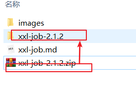

(2) 执行sql

 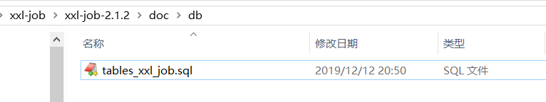

(3)使用idea打开解压之后的项目

 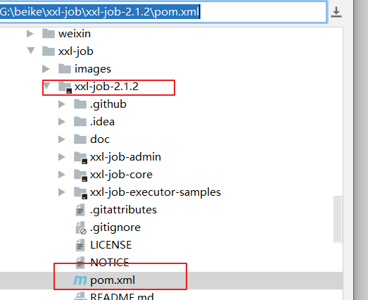

 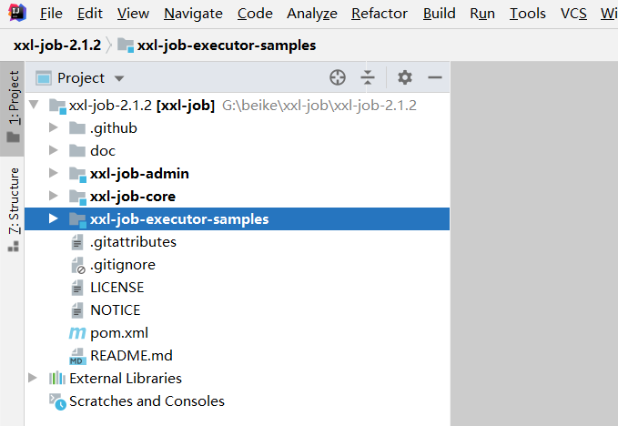


##### 3.3.5.1  配置调度中心

1. `调度中心项目：xxl-job-admin`
2. `作用：统一管理任务调度平台上调度任务，负责触发调度执行，并且提供任务管理平台。`


配置如下： 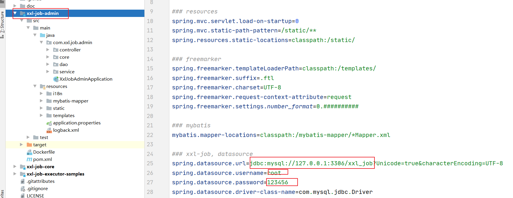


##### 3.3.5.2  启动调度中心

调度中心是一个微服务，启动这个微服务之后，可以通过手动操作界面的方式进行定时任务的定义，管理等操作。


启动完成之后

调度中心访问地址：<http://localhost:8080/xxl-job-admin> (该地址执行器将会使用到，作为回调地址)

默认登录账号 “admin/123456”, 登录后运行界面如下图所示。

 


主要用到的就是任务管理和执行器管理。

##### 3.3.5.3 配置执行器项目

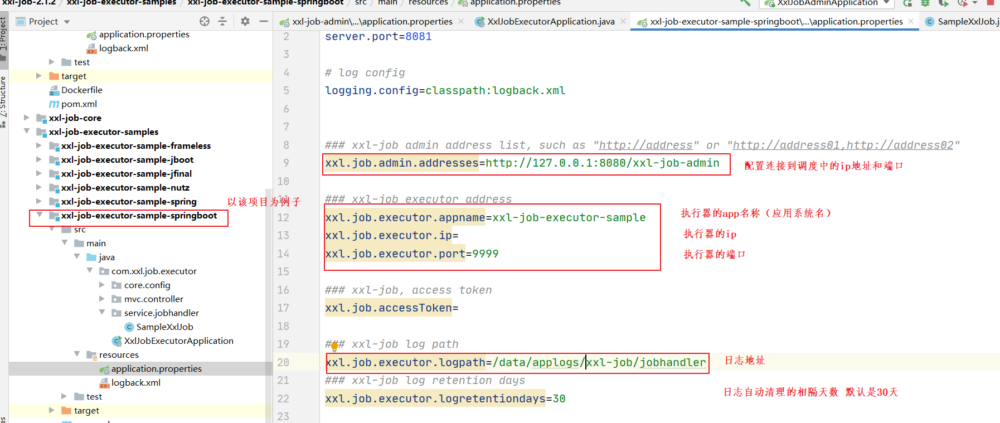


解释：

```properties
### 调度中心部署跟地址 [选填]：如调度中心集群部署存在多个地址则用逗号分隔。执行器将会使用该地址进行"执行器心跳注册"和"任务结果回调"；为空则关闭自动注册；
xxl.job.admin.addresses=http://127.0.0.1:8080/xxl-job-admin
### 执行器通讯TOKEN [选填]：非空时启用；
xxl.job.accessToken=
### 执行器AppName [选填]：执行器心跳注册分组依据；为空则关闭自动注册
xxl.job.executor.appname=xxl-job-executor-sample
### 执行器注册 [选填]：优先使用该配置作为注册地址，为空时使用内嵌服务 ”IP:PORT“ 作为注册地址。从而更灵活的支持容器类型执行器动态IP和动态映射端口问题。
xxl.job.executor.address=
### 执行器IP [选填]：默认为空表示自动获取IP，多网卡时可手动设置指定IP，该IP不会绑定Host仅作为通讯实用；地址信息用于 "执行器注册" 和 "调度中心请求并触发任务"；
xxl.job.executor.ip=
### 执行器端口号 [选填]：小于等于0则自动获取；默认端口为9999，单机部署多个执行器时，注意要配置不同执行器端口；
xxl.job.executor.port=9999
### 执行器运行日志文件存储磁盘路径 [选填] ：需要对该路径拥有读写权限；为空则使用默认路径；
xxl.job.executor.logpath=/data/applogs/xxl-job/jobhandler
### 执行器日志文件保存天数 [选填] ： 过期日志自动清理, 限制值大于等于3时生效; 否则, 如-1, 关闭自动清理功能；
xxl.job.executor.logretentiondays=30
```


##### 3.3.5.4 启动执行器项目

启动该微服务之后 端口为8001，此时再查看调度中心界面发现有变化：

 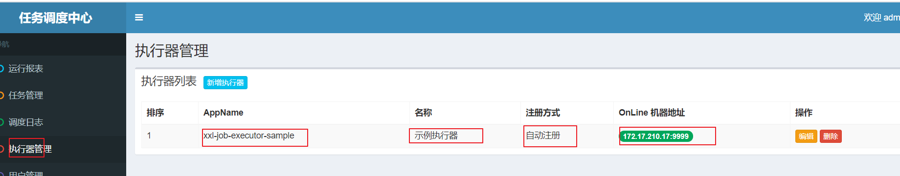


### 3.3.5.5 测试执行任务

使用默认的代码进行任务执行：

 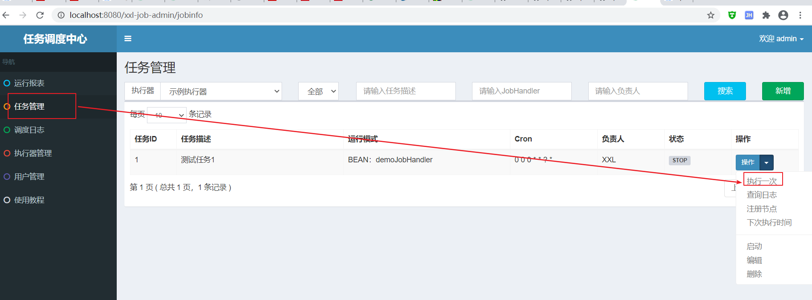

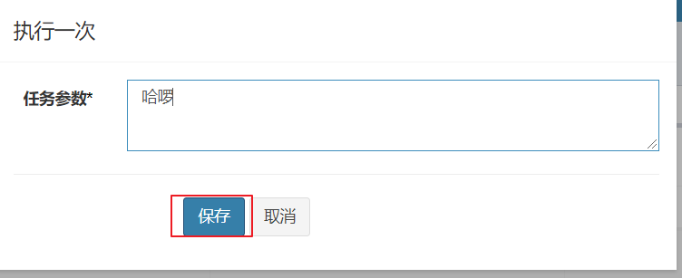


可以查看查询日志：

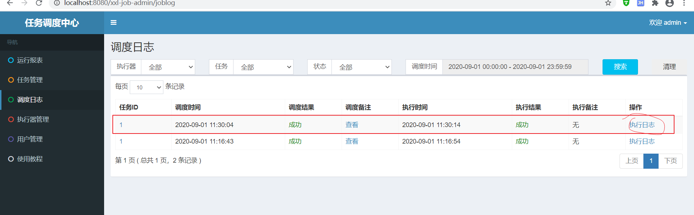


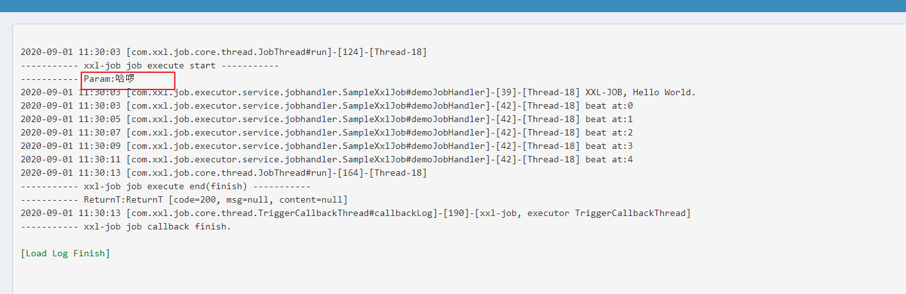


以上不需要我们自己写任务，实际上 项目中已经有了实例代码了，我们来看下

 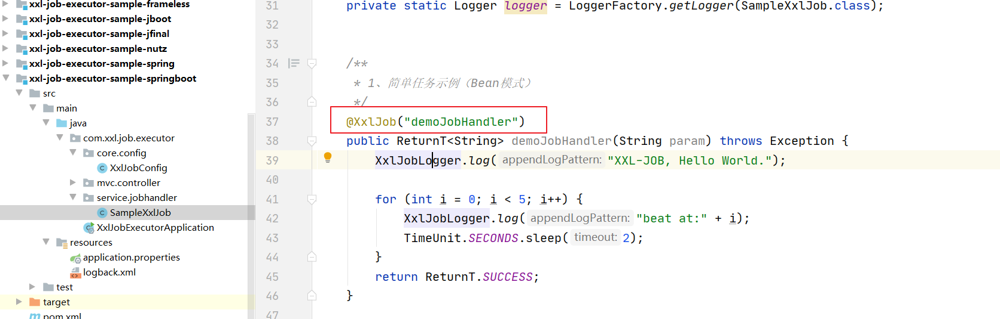

解释：

```
如上 XxlJob("demoJobHandler")实现任务名称为demoJobHandler
方法 参数为 param  对应如下图所示：
```


参数数据：


### 3.4 小结

我们实现了xxl-job的安装和入门任务调用。


## 4 .Xxl-job的任务管理

### 4.1 目标

+ 掌握任务的类型有几种
+ 能掌握实现基于Bean模式的任务和GLUE模式的任务
+ 理解掌握任务创建的属性配置

### 4.2 路径

### 4.3 讲解

#### 4.3.1 任务类型

在我们使用的任务管理中 XXL-JOB项目中包含了2中基本的任务类型：

```
Bean模式任务       需要在项目中编写代码执行
GLUE模式(Java)    直接在调度中心进行配置在线维护执行，能立即生效
```


##### 4.3.1.1 Bean(类)模式


Bean模式任务，支持基于类的开发方式，每个任务对应一个Java类

- 优点：不限制项目环境，兼容性好。即使是无框架项目，如main方法直接启动的项目也可以提供支持，可以参考示例项目 “xxl-job-executor-sample-frameless”；
- 缺点：
  - 每个任务需要占用一个Java类，造成类的浪费；
  - 不支持自动扫描任务并注入到执行器容器，需要手动注入。

```java
public class DemoJobHandler extends IJobHandler {

	@Override
	public ReturnT<String> execute(String param) throws Exception {
		XxlJobLogger.log("XXL-JOB, Hello World.");

		for (int i = 0; i < 5; i++) {
			XxlJobLogger.log("beat at:" + i);
			TimeUnit.SECONDS.sleep(2);
		}
		return SUCCESS;
	}

}
```


##### 4.3.1.2 Bean(方法)模式

Bean模式任务，支持基于方法的开发方式，每个任务对应一个方法。

- 优点：
  - 每个任务只需要开发一个方法，并添加”[@XxlJob](https://github.com/XxlJob)”注解即可，更加方便、快速。
  - 支持自动扫描任务并注入到执行器容器。
- 缺点：要求Spring容器环境；

```java
@XxlJob("demoJobHandler")
public ReturnT<String> execute(String param) {
    XxlJobLogger.log("hello world.");
    return ReturnT.SUCCESS;
}
```

##### 4.3.1.3  GLUE模式(Java)

任务以源码为JAVA的方式维护在调度中心，支持通过Web IDE在线更新，实时编译和生效，因此不需要指定JobHandler

新建: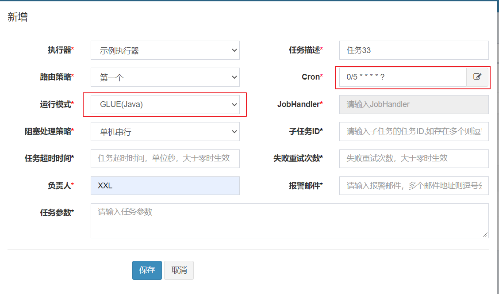

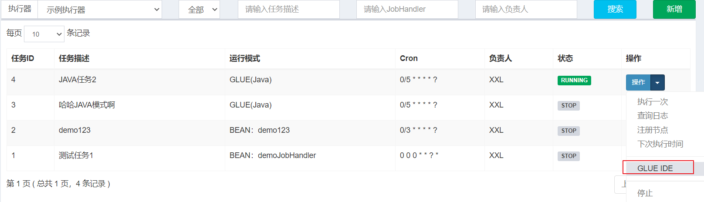

IDE编写如下任务示例：

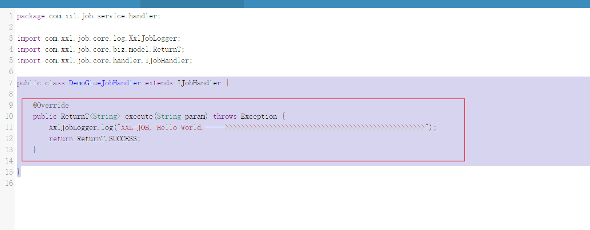


##### 4.3.1.4  GLUE模式(shell)

该模式的任务实际上是一段 “shell” 脚本；

 


#### 4.3.2 任务属性配置


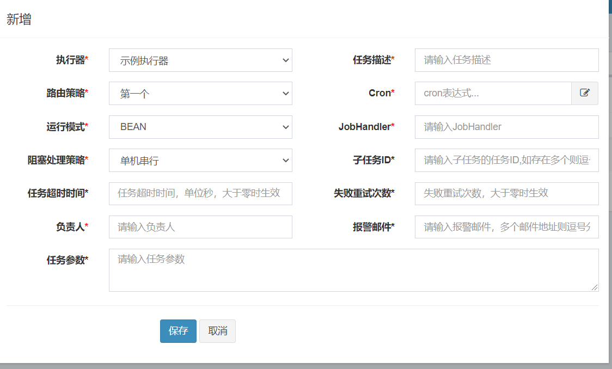

解释说明：

```properties
- 执行器：任务的绑定的执行器，任务触发调度时将会自动发现注册成功的执行器, 实现任务自动发现功能; 另一方面也可以方便的进行任务分组。每个任务必须绑定一个执行器, 可在 "执行器管理" 进行设置;
- 任务描述：任务的描述信息，便于任务管理；
- 路由策略：当执行器集群部署时，提供丰富的路由策略，包括；
    FIRST（第一个）：固定选择第一个机器；
    LAST（最后一个）：固定选择最后一个机器；
    ROUND（轮询）：；
    RANDOM（随机）：随机选择在线的机器；
    CONSISTENT_HASH（一致性HASH）：每个任务按照Hash算法固定选择某一台机器，且所有任务均匀散列在不同机器上。
    LEAST_FREQUENTLY_USED（最不经常使用）：使用频率最低的机器优先被选举；
    LEAST_RECENTLY_USED（最近最久未使用）：最久未使用的机器优先被选举；
    FAILOVER（故障转移）：按照顺序依次进行心跳检测，第一个心跳检测成功的机器选定为目标执行器并发起调度；
    BUSYOVER（忙碌转移）：按照顺序依次进行空闲检测，第一个空闲检测成功的机器选定为目标执行器并发起调度；
    SHARDING_BROADCAST(分片广播)：广播触发对应集群中所有机器执行一次任务，同时系统自动传递分片参数；可根据分片参数开发分片任务；
- Cron：触发任务执行的Cron表达式；
- 运行模式：
    BEAN模式：任务以JobHandler方式维护在执行器端；需要结合 "JobHandler" 属性匹配执行器中任务；
    GLUE模式(Java)：任务以源码方式维护在调度中心；该模式的任务实际上是一段继承自IJobHandler的Java类代码并 "groovy" 源码方式维护，它在执行器项目中运行，可使用@Resource/@Autowire注入执行器里中的其他服务；
    GLUE模式(Shell)：任务以源码方式维护在调度中心；该模式的任务实际上是一段 "shell" 脚本；
    GLUE模式(Python)：任务以源码方式维护在调度中心；该模式的任务实际上是一段 "python" 脚本；
    GLUE模式(PHP)：任务以源码方式维护在调度中心；该模式的任务实际上是一段 "php" 脚本；
    GLUE模式(NodeJS)：任务以源码方式维护在调度中心；该模式的任务实际上是一段 "nodejs" 脚本；
    GLUE模式(PowerShell)：任务以源码方式维护在调度中心；该模式的任务实际上是一段 "PowerShell" 脚本；
- JobHandler：运行模式为 "BEAN模式" 时生效，对应执行器中新开发的JobHandler类“@JobHandler”注解自定义的value值；
- 阻塞处理策略：调度过于密集执行器来不及处理时的处理策略；
    单机串行（默认）：调度请求进入单机执行器后，调度请求进入FIFO队列并以串行方式运行；
    丢弃后续调度：调度请求进入单机执行器后，发现执行器存在运行的调度任务，本次请求将会被丢弃并标记为失败；
    覆盖之前调度：调度请求进入单机执行器后，发现执行器存在运行的调度任务，将会终止运行中的调度任务并清空队列，然后运行本地调度任务；
- 子任务：每个任务都拥有一个唯一的任务ID(任务ID可以从任务列表获取)，当本任务执行结束并且执行成功时，将会触发子任务ID所对应的任务的一次主动调度。
- 任务超时时间：支持自定义任务超时时间，任务运行超时将会主动中断任务；
- 失败重试次数；支持自定义任务失败重试次数，当任务失败时将会按照预设的失败重试次数主动进行重试；
- 报警邮件：任务调度失败时邮件通知的邮箱地址，支持配置多邮箱地址，配置多个邮箱地址时用逗号分隔；
- 负责人：任务的负责人；
- 执行参数：任务执行所需的参数；
```


## 5 测试路由策略


### 5.1 避免任务重复执行

​	调度密集或者耗时任务可能会导致任务阻塞，集群情况下调度组件小概率情况下会重复触发；
针对上述情况，可以通过结合 “单机路由策略（如：第一台、一致性哈希）” + “阻塞策略（如：单机串行、丢弃后续调度）” 来规避，最终避免任务重复执行。

例如我们测试如下：

copy 下实例工程，并设置相关配置 作为微服务集群使用，可以根据不同策略实现不同的效果，这里我们演示机器集群的时候只执行一次。


项目1中创建：


```java
@Component
public class MySample1 {

    private static Logger logger = LoggerFactory.getLogger(MySample1.class);

    @XxlJob(value="demo1")
    public ReturnT<String> demo1(String param){
        System.out.println("now:start:"+new Date());

        XxlJobLogger.log("XXL-JOB, Hello World.demo1:"+param);
        System.out.println("参数打印==="+param);

        System.out.println("now:end:"+new Date());

        return ReturnT.SUCCESS;
    }
}
```

并配置如下：

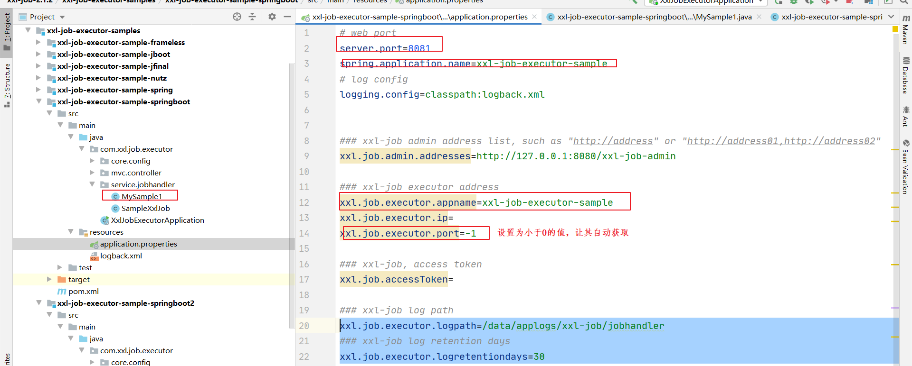


（2）copy项目一 重命名为项目二

 只配置端口不一样。其他都是一样即可。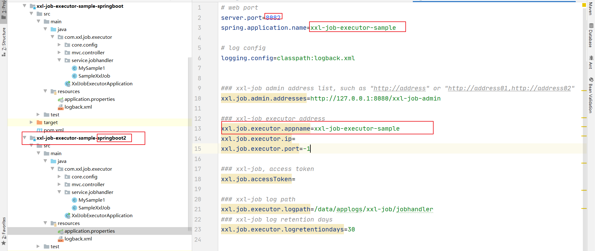


启动两个执行器项目。


测试如下：

管理界面中执行器管理如下：

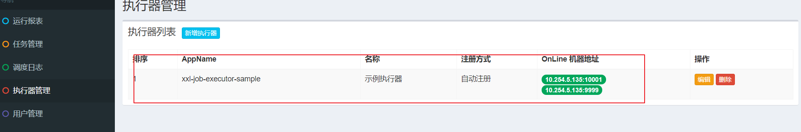

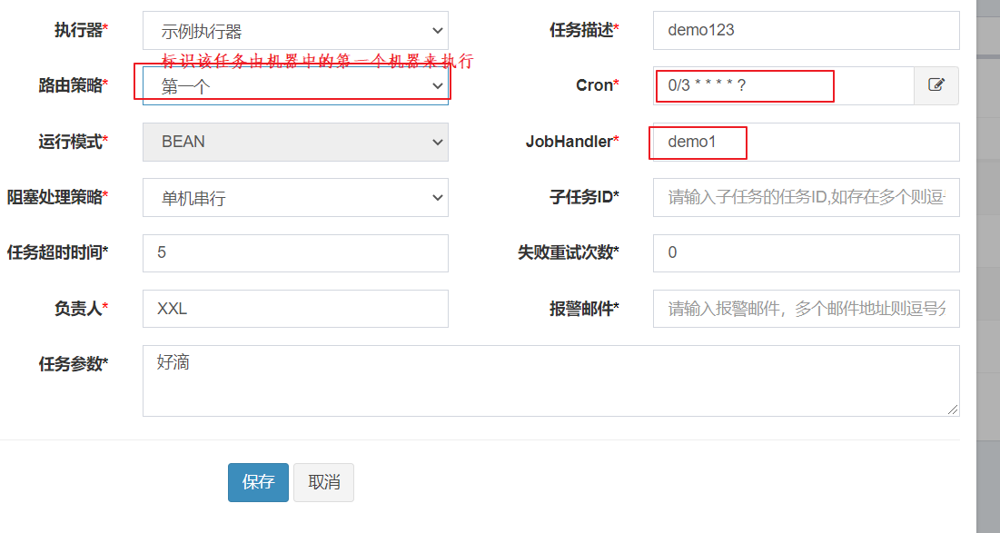

测试启动一次：


启动成功：


后台打印：都是第一台机器打印

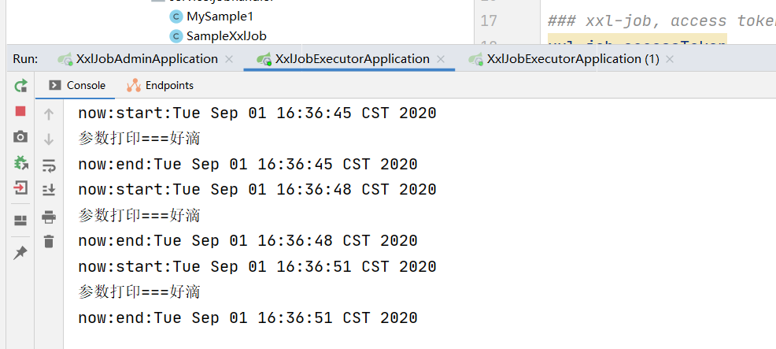

第二台机器没有打印：

 


## 6.黑马头头条集成XXL-JOB

### （1）打包xxl-job-admin

由于我们项目中不能直接将XXL-job的项目再idea跑起来，将来需要部署到linux 系统，而本身xxl-job-admin项目它就是一个微服务，我们可以通过idea打包之后部署到 linux中运行。

**注意：** 

```
这里有两种方式供大家选择
1.使用idea打包的方式 保存jar，自行保存 在使用时再执行命令
2.使用我提供的jar 包 直接执行

```


**注意：**

以上无论哪一种步骤  都需要在已有的虚拟机所在的数据库中进行执行如图所示的数据库脚本：

 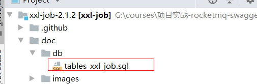


#### （1.1）idea打包方式

在之前的代码中修改配置：

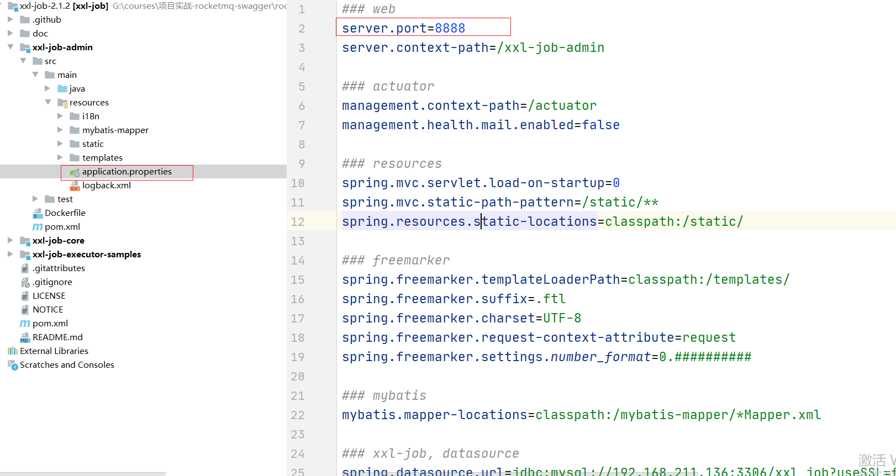

```properties
### web
server.port=8888
server.context-path=/xxl-job-admin

### actuator
management.context-path=/actuator
management.health.mail.enabled=false

### resources
spring.mvc.servlet.load-on-startup=0
spring.mvc.static-path-pattern=/static/**
spring.resources.static-locations=classpath:/static/

### freemarker
spring.freemarker.templateLoaderPath=classpath:/templates/
spring.freemarker.suffix=.ftl
spring.freemarker.charset=UTF-8
spring.freemarker.request-context-attribute=request
spring.freemarker.settings.number_format=0.##########

### mybatis
mybatis.mapper-locations=classpath:/mybatis-mapper/*Mapper.xml

### xxl-job, datasource
spring.datasource.url=jdbc:mysql://192.168.211.136:3306/xxl_job?useSSL=false&useUnicode=true&characterEncoding=UTF-8&serverTimezone=&serverTimezone=Asia/Shanghai
spring.datasource.username=root
spring.datasource.password=123456
spring.datasource.driver-class-name=com.mysql.jdbc.Driver

spring.datasource.type=org.apache.tomcat.jdbc.pool.DataSource
spring.datasource.tomcat.max-wait=10000
spring.datasource.tomcat.max-active=30
spring.datasource.tomcat.test-on-borrow=true
spring.datasource.tomcat.validation-query=SELECT 1
spring.datasource.tomcat.validation-interval=30000

### xxl-job email
spring.mail.host=smtp.qq.com
spring.mail.port=25
spring.mail.username=xxx@qq.com
spring.mail.password=xxx
spring.mail.properties.mail.smtp.auth=true
spring.mail.properties.mail.smtp.starttls.enable=true
spring.mail.properties.mail.smtp.starttls.required=true
spring.mail.properties.mail.smtp.socketFactory.class=javax.net.ssl.SSLSocketFactory

### xxl-job, access token
xxl.job.accessToken=

### xxl-job, i18n (default empty as chinese, "en" as english)
xxl.job.i18n=

## xxl-job, triggerpool max size
xxl.job.triggerpool.fast.max=200
xxl.job.triggerpool.slow.max=100

### xxl-job, log retention days
xxl.job.logretentiondays=30

```

(2)执行命令打包

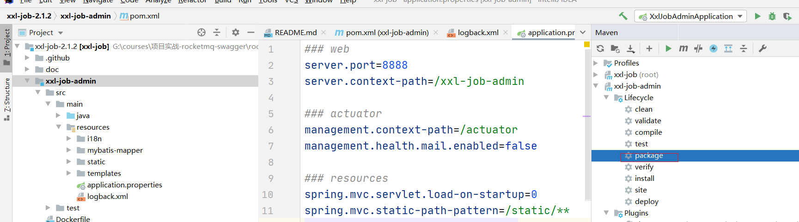

 


在该jar所在目录执行命令用来启动xxl-job-admin服务端：

```shell
java -jar xxl-job-admin-2.1.2.jar
```


#### （1.2）使用提供好的jar包方式

如下图：已经提供了jar包

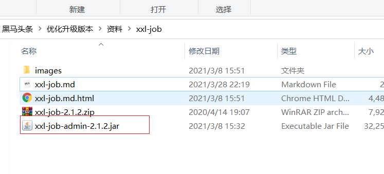

使用： 进入该jar所在目录 执行如下命令：

```shell
java -jar xxl-job-admin-2.1.2.jar
```


### （2）在黑马头条项目admin微服务中添加依赖

```xml
<dependency>
    <groupId>com.xuxueli</groupId>
    <artifactId>xxl-job-core</artifactId>
    <version>2.1.2</version>
</dependency>
```

### （3）添加配置类

```java
@Configuration
public class XxlJobConfig {
    private Logger logger = LoggerFactory.getLogger(XxlJobConfig.class);

    @Value("${xxl.job.admin.addresses}")
    private String adminAddresses;

    @Value("${xxl.job.executor.appname}")
    private String appName;

    @Value("${xxl.job.executor.ip}")
    private String ip;

    @Value("${xxl.job.executor.port}")
    private int port;

    @Value("${xxl.job.accessToken}")
    private String accessToken;

    @Value("${xxl.job.executor.logpath:abc}")
    private String logPath;

    @Value("${xxl.job.executor.logretentiondays}")
    private int logRetentionDays;


    @Bean
    public XxlJobSpringExecutor xxlJobExecutor() {
        logger.info(">>>>>>>>>>> xxl-job config init.");
        XxlJobSpringExecutor xxlJobSpringExecutor = new XxlJobSpringExecutor();
        xxlJobSpringExecutor.setAdminAddresses(adminAddresses);
        xxlJobSpringExecutor.setAppName(appName);
        xxlJobSpringExecutor.setIp(ip);
        xxlJobSpringExecutor.setPort(port);
        xxlJobSpringExecutor.setAccessToken(accessToken);
        xxlJobSpringExecutor.setLogPath(logPath);
        xxlJobSpringExecutor.setLogRetentionDays(logRetentionDays);

        return xxlJobSpringExecutor;
    }
}
```


### （4）yml配置如下

```yaml
xxl:
  job:
    accessToken: ''
    admin:
      addresses: http://127.0.0.1:8888/xxl-job-admin
    executor:
      appname: leadnews-admin
      ip: ''
      logretentiondays: 30
      port: -1
```

如图创建java类 执行任务

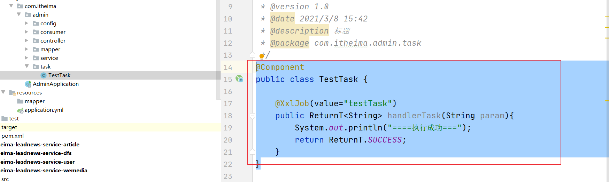


### （5）打开界面

```properties
http://localhost:8888/xxl-job-admin/
```

创建执行器：

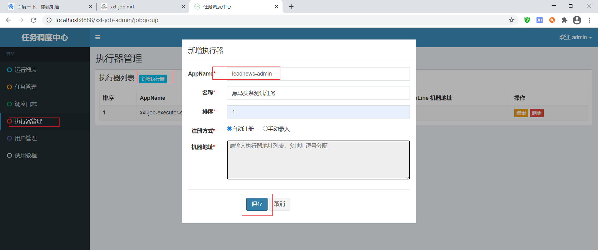

要注意 appName必须和admin端配置的appname一致


新增任务：

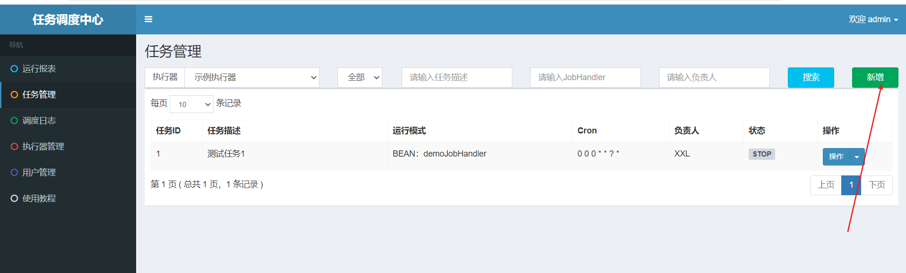


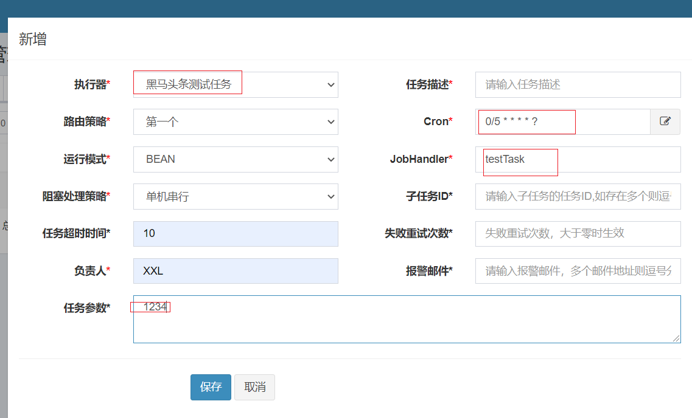


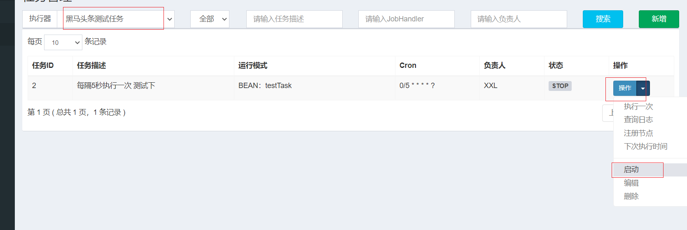

测试成功：

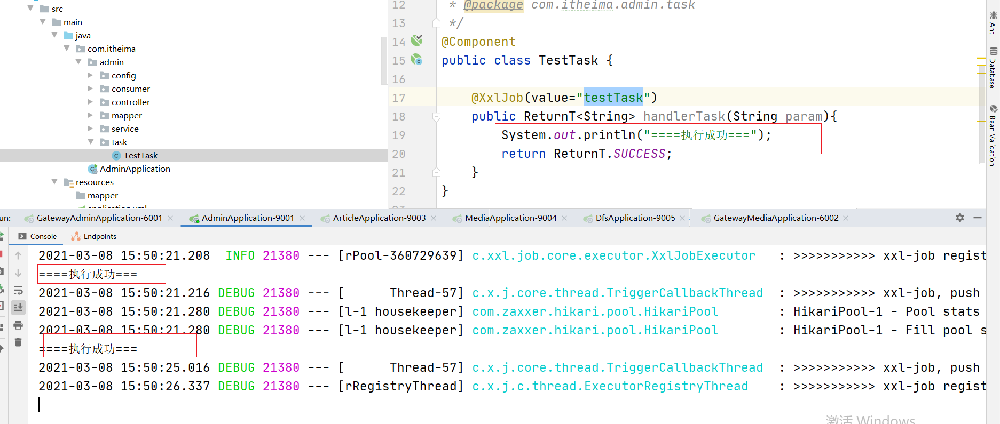