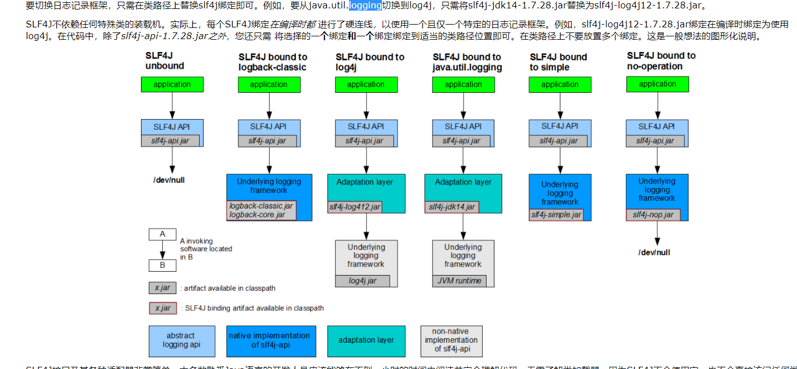
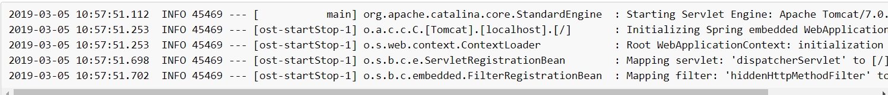
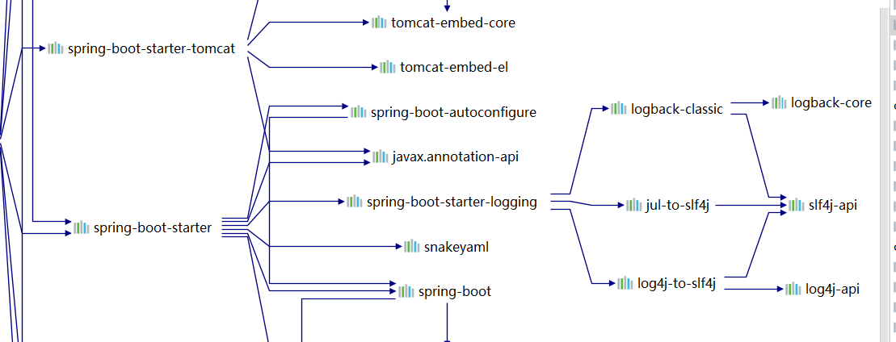
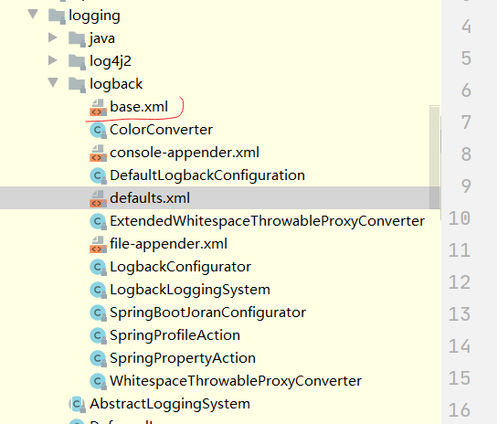
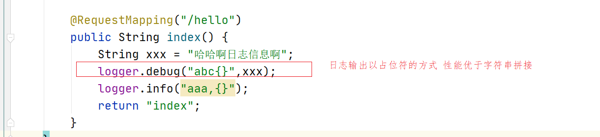

# 日志

## 目标

+ 掌握日志的作用
+ 掌握日志框架的介绍和相关区别
+ 掌握springboot集成日志框架
+ 掌握日志框架中的级别
+ 掌握日志框架的的基本配置
+ 掌握如何在springboot中使用日志logback

+ 微服日志架构说明
+ 微服务日志架构的解决方案

+ 微服日志搭建


## 1 日志是什么

## 2 日志框架的介绍

### 2.1 日志框架有哪些

日志用来记录程序中的行为，为我们开发和运维人员提供相关的数据回滚，问题回查的依据。日志一般存在数据库，文本，nosql及其他的平台例如：es中都是可以滴。

在JDK 1.3及以前，Java打日志依赖System.out.println(), System.err.println()或者e.printStackTrace()，Debug日志被写到STDOUT流，错误日志被写到STDERR流。这样打日志有一个非常大的缺陷，即无法定制化，且日志粒度不够细。于是， Gülcü 于2001年发布了Log4j，后来成为Apache 基金会的顶级项目。Log4j 在设计上非常优秀，对后续的 Java Log 框架有长久而深远的影响，它定义的Logger、Appender、Level等概念如今已经被广泛使用。Log4j 的短板在于性能，在Logback 和 Log4j2 出来之后，Log4j的使用也减少了。

Slf4j 也是现在主流的日志门面框架，使用 Slf4j 可以很灵活的使用占位符进行参数占位，简化代码，拥有更好的可读性。

Logback 是 `Slf4j` 的原生实现框架，同样也是出自 `Log4j` 一个人之手，但拥有比 `log4j` 更多的优点、特性和更做强的性能，现在基本都用来代替 `log4j` 成为主流

```
+ log4j
+ java   logging
+ common logging
+ logback
+ sl4j 门面框架 
```


### 2.2 日志框架的概念及比较

可以参考例子：

https://blog.csdn.net/qq_32625839/article/details/80893550

#### 2.2.1 sl4j:

sl4j:http://www.slf4j.org/manual.html




映射诊断上下文（MDC）支持：

“映射的诊断上下文”实质上是由日志记录框架维护的映射，其中应用程序代码提供了键值对，然后可以由日志记录框架将其插入日志消息中。MDC数据在筛选消息或触发某些操作方面也可能非常有帮助。

SLF4J支持MDC或映射的诊断上下文。如果基础日志框架提供MDC功能，则SLF4J将委派给基础框架的MDC。请注意，此时，只有log4j和logback提供MDC功能。如果基础框架不提供MDC（例如java.util.logging），则SLF4J仍将存储MDC数据，但是其中的信息将需要由自定义用户代码检索。

因此，作为SLF4J用户，您可以在存在log4j或logback的情况下利用MDC信息，但无需将这些日志框架强制依赖于用户。

**简单来说：SLF4J是日志框架的一种抽象（接口），便于切换不同的日志框架。**

#### 2.2.2 log4j/log4j 2

Apache Log4j 2是Log4j的升级版，对Log4j的前身Log4j 1.x进行了重大改进，并提供了Logback中可用的许多改进，同时解决了Logback体系结构中的一些固有问题。 性能有影响

**简单来说：log4j 2是日志框架的一种具体实现。**

#### 2.2.3  Commons Logging

和Java标准库提供的日志不同，Commons Logging是一个第三方日志库，它是由Apache创建的日志模块。

Commons Logging的特色是，它可以挂接不同的日志系统，并通过配置文件指定挂接的日志系统。默认情况下，Commons Loggin自动搜索并使用Log4j（Log4j是另一个流行的日志系统），如果没有找到Log4j，再使用JDK Logging。

**简单来说：Commons Logging是日志框架的一种具体实现。**


性能对比：

```
https://www.cnblogs.com/javastack/p/13557797.html
http://www.cainiaoxueyuan.com/bc/17731.html
```

logback 和log4j 2基本差不多，但是 如果使用的话，logback最好采用异步日志，log4j 2整体性能 要优于 logback.


#### 日志框架总结

一般在项目中使用sl4j作为门面，并结合logback或者log4j2 作为具体的日志实现。


#### 2.2.4 日志的级别

| 日志级别 | 描述                                                         |
| -------- | ------------------------------------------------------------ |
| OFF      | 关闭：最高级别，不输出日志。                                 |
| FATAL    | 致命：输出非常严重的可能会导致应用程序终止的错误。（Logback没有`FATAL`级别。它映射到`ERROR`。） |
| ERROR    | 错误：输出错误，但应用还能继续运行。                         |
| WARN     | 警告：输出可能潜在的危险状况。                               |
| INFO     | 信息：输出应用运行过程的详细信息。                           |
| DEBUG    | 调试：输出更细致的对调试应用有用的信息。                     |
| TRACE    | 跟踪：输出更细致的程序运行轨迹。                             |
| ALL      | 所有：输出所有级别信息。                                     |



日志级别从低到高分为：

TRACE < DEBUG < INFO < WARN < ERROR < FATAL 。

如果设置为 WARN ，则低于 WARN 的信息都不会输出。


## 4 springboot集成日志框架

Spring Boot使用[Commons Logging](https://commons.apache.org/logging)进行所有内部日志记录，但是使底层日志实现保持打开状态。提供了[Java Util Logging](https://docs.oracle.com/javase/8/docs/api//java/util/logging/package-summary.html)，[Log4J2](https://logging.apache.org/log4j/2.x/)和[Logback的](https://logback.qos.ch/)默认配置。在每种情况下，记录器都已预先配置为使用控制台输出，同时还提供可选文件输出。

默认情况下，如果使用“起步依赖”，则使用Logback进行日志记录。还包括适当的Logback路由，以确保使用Java Util Logging，Commons Logging，Log4J或SLF4J的从属库都可以正常工作。

如图所示

 


## 5 springboot集成日志框架使用

默认的情况下spring boot 使用 logback使用，并默认配置了默认的配置项，直接可以使用了，

如图配置了配置文件所在位置：

 


#### 5.1 入门

添加依赖：

```xml
<?xml version="1.0" encoding="UTF-8"?>
<project xmlns="http://maven.apache.org/POM/4.0.0"
         xmlns:xsi="http://www.w3.org/2001/XMLSchema-instance"
         xsi:schemaLocation="http://maven.apache.org/POM/4.0.0 http://maven.apache.org/xsd/maven-4.0.0.xsd">
    
    <modelVersion>4.0.0</modelVersion>

    <groupId>org.ljh</groupId>
    <artifactId>log-demo01</artifactId>
    <version>1.0-SNAPSHOT</version>

    <parent>
        <groupId>org.springframework.boot</groupId>
        <artifactId>spring-boot-starter-parent</artifactId>
        <version>2.1.4.RELEASE</version>
    </parent>
    <properties>
        <project.build.sourceEncoding>UTF-8</project.build.sourceEncoding>
        <maven.compiler.source>1.8</maven.compiler.source>
        <maven.compiler.target>1.8</maven.compiler.target>
        <!--设置打包的时候跳过测试-->
        <skipTests>true</skipTests>
    </properties>

    <dependencies>
        <dependency>
            <groupId>org.springframework.boot</groupId>
            <artifactId>spring-boot-starter-web</artifactId>
        </dependency>
    </dependencies>
</project>
```

启动类

```java
package org.ljh;

import org.slf4j.Logger;
import org.slf4j.LoggerFactory;
import org.springframework.boot.SpringApplication;
import org.springframework.boot.autoconfigure.SpringBootApplication;
import org.springframework.stereotype.Controller;
import org.springframework.web.bind.annotation.RequestMapping;
import org.springframework.web.bind.annotation.RestController;

/**
 * @author ljh
 * @version 1.0
 * @date 2020/12/2 15:23
 * @description 标题
 * @package org.ljh
 */
@SpringBootApplication
public class LoggerLearningApplication {


    public static void main(String[] args) {
        Logger logger = LoggerFactory.getLogger(LoggerLearningApplication.class);
        SpringApplication.run(LoggerLearningApplication.class, args);

        //注意 spring 默认日志输出级别为 info 所以默认情况下 这句不会打印到控制台
        logger.debug("This is a debug message");

        logger.info("This is an info message");
        logger.warn("This is a warn message");
        logger.error("This is an error message");
    }

    @RestController
    public class IndexController {
        private final Logger logger = LoggerFactory.getLogger(IndexController.class);

        @RequestMapping("/hello")
        public String index() {
            logger.debug("This is a debug message");
            logger.info("This is an info message");
            logger.warn("This is a warn message");
            logger.error("This is an error message");
            return "index";
        }
    }
}

```

yaml配置：默认情况下输出info级别，默认不输出日志到文件。如果想输出到日志文件，可以按照如下的配置

application.yml

```yaml
logging:
  level.org.ljh: debug
  level.com: info
  file: E://logs/aaa.log
```




#### 5.2 自定义日志配置

​	以上 日志在简单的场景下是没有问题的，但是如果在复杂系统中，大量的每天日志很多的情况下，需要根据每天日志进行压缩分块进行输出，并且在微服务领域中日志反而变得越来越多和越来越重要。只能自定义日志文件。

根据不同的日志系统，你可以按如下规则组织配置文件名，就能被正确加载：

```
Logback： logback-spring.xml, logback-spring.groovy, logback.xml, logback.groovy
Log4j： log4j-spring.properties, log4j-spring.xml, log4j.properties, log4j.xml
Log4j2： log4j2-spring.xml, log4j2.xml
JDK (Java Util Logging)： logging.properties
```

Spring Boot 官方推荐优先使用带有 -spring 的文件名作为你的日志配置（如使用 logback-spring.xml ，而不是 logback.xml ），命名为 logback-spring.xml 的日志配置文件即为默认的命名规则，并且放src/main/resources 下面即可。

如果想自己定义日志配置的名称，可以在配置中指定logging.config=classpath:logging-config.xml该功能用于在不同的环境切换时有不同用。

一般不需要这个属性，而是直接在 logback-spring.xml 中使用 springProfile 配置，不需要 logging.config 指定不同环境使用不同配置文件。

例如：

```
环境DEV  TEST PRO 对应的日志文件的配置是不一样的，所以在进行配置选择时，需要切换不同的日志配置，此时可以通过sprongboot profile来进行切换。

但是有了logback-spring.xml中的springProfile属性之后，不需要配置了。只需要在logback-spring.xml中进行配置之后，再在application.yml中进行切换即可
```


springboot配置logback之后，加载生效的优先级

```properties
logback.xml -> application.properties -> logback-spring.xml
```


配置参考：

```
http://www.51gjie.com/javaweb/1115.html

http://logback.qos.ch/manual/index.html -->configuration
```

配置文件参考：logback-spring.xml

```xml
<?xml version="1.0" encoding="UTF-8"?>
<!-- 日志级别从低到高分为TRACE < DEBUG < INFO < WARN < ERROR < FATAL，如果设置为WARN，则低于WARN的信息都不会输出 -->
<!-- scan:当此属性设置为true时，配置文档如果发生改变，将会被重新加载，默认值为true -->
<!-- scanPeriod:设置监测配置文档是否有修改的时间间隔，如果没有给出时间单位，默认单位是毫秒。
                 当scan为true时，此属性生效。默认的时间间隔为1分钟。 -->
<!-- debug:当此属性设置为true时，将打印出logback内部日志信息，实时查看logback运行状态。默认值为false。 -->
<configuration scan="true" scanPeriod="60 seconds">
    <contextName>logback</contextName>
    <!-- name的值是变量的名称，value的值时变量定义的值。通过定义的值会被插入到logger上下文中。定义后，可以使“${}”来使用变量。 -->
    <property name="log.path" value="E:/logs"/>
    <!--0. 日志格式和颜色渲染 -->
    <!-- 彩色日志依赖的渲染类 -->
    <conversionRule conversionWord="clr" converterClass="org.springframework.boot.logging.logback.ColorConverter"/>
    <conversionRule conversionWord="wex"
                    converterClass="org.springframework.boot.logging.logback.WhitespaceThrowableProxyConverter"/>
    <conversionRule conversionWord="wEx"
                    converterClass="org.springframework.boot.logging.logback.ExtendedWhitespaceThrowableProxyConverter"/>
    <!-- 彩色日志格式 -->
    <property name="CONSOLE_LOG_PATTERN"
              value="${CONSOLE_LOG_PATTERN:-%clr(%d{yyyy-MM-dd HH:mm:ss.SSS}){faint} %clr(${LOG_LEVEL_PATTERN:-%5p}) %clr(${PID:- }){magenta} %clr(---){faint} %clr([%15.15t]){faint} %clr(%-40.40logger{39}){cyan} %clr(:){faint} %m%n${LOG_EXCEPTION_CONVERSION_WORD:-%wEx}}"/>

    <!--1. 输出到控制台-->
    <appender name="CONSOLE" class="ch.qos.logback.core.ConsoleAppender">
        <!--控制台在这里没有什么用-->
        <!--此日志appender是为开发使用，只配置最底级别，控制台输出的日志级别是大于或等于此级别的日志信息-->
        <!--<filter class="ch.qos.logback.classic.filter.ThresholdFilter">
            <level>debug</level>
        </filter>-->
        <encoder>
            <Pattern>${CONSOLE_LOG_PATTERN}</Pattern>
            <!-- 设置字符集 -->
            <charset>UTF-8</charset>
        </encoder>
    </appender>

    <!--2. 输出到文档-->
    <!-- 2.1 level为 DEBUG 日志，时间滚动输出  -->
    <appender name="DEBUG_FILE" class="ch.qos.logback.core.rolling.RollingFileAppender">
        <!-- 正在记录的日志文档的路径及文档名 -->
        <file>${log.path}/web_debug.log</file>
        <!--日志文档输出格式    [${PID:- }] 标识进程ID -->
        <encoder>
            <pattern>%d{yyyy-MM-dd HH:mm:ss.SSS} [${PID:- }] [%thread] %-5level %logger{50} - %msg%n</pattern>
            <charset>UTF-8</charset> <!-- 设置字符集 -->
        </encoder>
        <!-- 日志记录器的滚动策略，按日期，按大小记录 -->
        <rollingPolicy class="ch.qos.logback.core.rolling.TimeBasedRollingPolicy">
            <!-- 日志归档 -->
            <fileNamePattern>${log.path}/web-debug-%d{yyyy-MM-dd}.%i.log</fileNamePattern>
            <timeBasedFileNamingAndTriggeringPolicy class="ch.qos.logback.core.rolling.SizeAndTimeBasedFNATP">
                <maxFileSize>10MB</maxFileSize>
            </timeBasedFileNamingAndTriggeringPolicy>
            <!--日志文档保留天数-->
            <maxHistory>15</maxHistory>
        </rollingPolicy>
        <!-- 此日志文档只记录debug级别的 -->
        <filter class="ch.qos.logback.classic.filter.LevelFilter">
            <level>debug</level>
            <onMatch>ACCEPT</onMatch>
            <onMismatch>DENY</onMismatch>
        </filter>
    </appender>

    <!-- 2.2 level为 INFO 日志，时间滚动输出  -->
    <appender name="INFO_FILE" class="ch.qos.logback.core.rolling.RollingFileAppender">
        <!-- 正在记录的日志文档的路径及文档名 -->
        <file>${log.path}/web_info.log</file>
        <!--日志文档输出格式-->
        <encoder>
            <pattern>%d{yyyy-MM-dd HH:mm:ss.SSS} [${PID:- }] [%thread] %-5level %logger{50} - %msg%n</pattern>
            <charset>UTF-8</charset>
        </encoder>
        <!-- 日志记录器的滚动策略，按日期，按大小记录 -->
        <rollingPolicy class="ch.qos.logback.core.rolling.TimeBasedRollingPolicy">
            <!-- 每天日志归档路径以及格式 -->
            <fileNamePattern>${log.path}/web-info-%d{yyyy-MM-dd}.%i.log</fileNamePattern>
            <timeBasedFileNamingAndTriggeringPolicy class="ch.qos.logback.core.rolling.SizeAndTimeBasedFNATP">
                <maxFileSize>10MB</maxFileSize>
            </timeBasedFileNamingAndTriggeringPolicy>
            <!--日志文档保留天数-->
            <maxHistory>15</maxHistory>
        </rollingPolicy>
        <!-- 此日志文档只记录info级别的 -->
        <filter class="ch.qos.logback.classic.filter.LevelFilter">
            <level>info</level>
            <onMatch>ACCEPT</onMatch>
            <onMismatch>DENY</onMismatch>
        </filter>
    </appender>

    <!-- 2.3 level为 WARN 日志，时间滚动输出  -->
    <appender name="WARN_FILE" class="ch.qos.logback.core.rolling.RollingFileAppender">
        <!-- 正在记录的日志文档的路径及文档名 -->
        <file>${log.path}/web_warn.log</file>
        <!--日志文档输出格式-->
        <encoder>
            <pattern>%d{yyyy-MM-dd HH:mm:ss.SSS} [${PID:- }] [%thread] %-5level %logger{50} - %msg%n</pattern>
            <charset>UTF-8</charset> <!-- 此处设置字符集 -->
        </encoder>
        <!-- 日志记录器的滚动策略，按日期，按大小记录 -->
        <rollingPolicy class="ch.qos.logback.core.rolling.TimeBasedRollingPolicy">
            <fileNamePattern>${log.path}/web-warn-%d{yyyy-MM-dd}.%i.log</fileNamePattern>
            <timeBasedFileNamingAndTriggeringPolicy class="ch.qos.logback.core.rolling.SizeAndTimeBasedFNATP">
                <maxFileSize>10MB</maxFileSize>
            </timeBasedFileNamingAndTriggeringPolicy>
            <!--日志文档保留天数-->
            <maxHistory>15</maxHistory>
        </rollingPolicy>
        <!-- 此日志文档只记录warn级别的 -->
        <filter class="ch.qos.logback.classic.filter.LevelFilter">
            <level>warn</level>
            <onMatch>ACCEPT</onMatch>
            <onMismatch>DENY</onMismatch>
        </filter>
    </appender>

    <!-- 2.4 level为 ERROR 日志，时间滚动输出  -->
    <appender name="ERROR_FILE" class="ch.qos.logback.core.rolling.RollingFileAppender">
        <!-- 正在记录的日志文档的路径及文档名 -->
        <file>${log.path}/web_error.log</file>
        <!--日志文档输出格式-->
        <encoder>
            <pattern>%d{yyyy-MM-dd HH:mm:ss.SSS} [${PID:- }] [%thread] %-5level %logger{50} - %msg%n</pattern>
            <charset>UTF-8</charset> <!-- 此处设置字符集 -->
        </encoder>
        <!-- 日志记录器的滚动策略，按日期，按大小记录 -->
        <rollingPolicy class="ch.qos.logback.core.rolling.TimeBasedRollingPolicy">
            <fileNamePattern>${log.path}/web-error-%d{yyyy-MM-dd}.%i.log</fileNamePattern>
            <timeBasedFileNamingAndTriggeringPolicy class="ch.qos.logback.core.rolling.SizeAndTimeBasedFNATP">
                <maxFileSize>10MB</maxFileSize>
            </timeBasedFileNamingAndTriggeringPolicy>
            <!--日志文档保留天数-->
            <maxHistory>15</maxHistory>
        </rollingPolicy>
        <!-- 此日志文档只记录ERROR级别的 -->
        <filter class="ch.qos.logback.classic.filter.LevelFilter">
            <level>ERROR</level>
            <onMatch>ACCEPT</onMatch>
            <onMismatch>DENY</onMismatch>
        </filter>
    </appender>

    <!--
        <logger>用来设置某一个包或者具体的某一个类的日志打印级别、
        以及指定<appender>。<logger>仅有一个name属性，
        一个可选的level和一个可选的addtivity属性。
        name:用来指定受此logger约束的某一个包或者具体的某一个类。
        level:用来设置打印级别，大小写无关：TRACE, DEBUG, INFO, WARN, ERROR, ALL 和 OFF，
              还有一个特俗值INHERITED或者同义词NULL，代表强制执行上级的级别。
              如果未设置此属性，那么当前logger将会继承上级的级别。
        addtivity:是否向上级logger传递打印信息。默认是true。
        <logger name="org.springframework.web" level="info"/>
        <logger name="org.springframework.scheduling.annotation.ScheduledAnnotationBeanPostProcessor" level="INFO"/>
    -->

    <!--
        使用mybatis的时候，sql语句是debug下才会打印，而这里我们只配置了info，所以想要查看sql语句的话，有以下两种操作：
        第一种把<root level="info">改成<root level="DEBUG">这样就会打印sql，不过这样日志那边会出现很多其他消息
        第二种就是单独给dao下目录配置debug模式，代码如下，这样配置sql语句会打印，其他还是正常info级别：
        【logging.level.org.mybatis=debug logging.level.dao=debug】
     -->

    <!--
        root节点是必选节点，用来指定最基础的日志输出级别，只有一个level属性
        level:用来设置打印级别，大小写无关：TRACE, DEBUG, INFO, WARN, ERROR, ALL 和 OFF，
        不能设置为INHERITED或者同义词NULL。默认是DEBUG
        可以包含零个或多个元素，标识这个appender将会添加到这个logger。
    -->

    <!-- 4. 最终的策略 -->
    <!-- 4.1 开发环境:打印控制台-->
    <springProfile name="dev">
        <logger name="org.ljh" level="debug"/>
    </springProfile>

    <!--<logger name="org.springframework.web.servlet" level="debug"></logger>-->
    <root level="debug">
        <appender-ref ref="CONSOLE"/>
        <appender-ref ref="DEBUG_FILE"/>
        <appender-ref ref="INFO_FILE"/>
        <appender-ref ref="WARN_FILE"/>
        <appender-ref ref="ERROR_FILE"/>
    </root>
    <!-- 4.2 生产环境:输出到文档-->
    <springProfile name="pro">
        <root level="debug">
            <appender-ref ref="CONSOLE"/>
            <appender-ref ref="DEBUG_FILE"/>
            <appender-ref ref="INFO_FILE"/>
            <appender-ref ref="ERROR_FILE"/>
            <appender-ref ref="WARN_FILE"/>
        </root>
    </springProfile>

</configuration>
```


